# Vitalia by KinetiaLabs
# Informe del trabajo Final

 

**Universidad Peruana de Ciencias Aplicadas (UPC)**

**Facultad:** Ingeniería

**Carrera:** Ingeniería de Software

**Periodo:** 2026-10

**Curso:** Aplicaciones Web (1ASI0730)

**NRC:** 10203

**Profesor:** Sánchez Ponce, Alex Humberto

**Startup:** KinetiaLabs

**Product:** Vitalia

**Relación de integrantes:**

| Apellidos, Nombres | Código |
| --- | --- |
| Ruiz Mideyros, Adrian | U20241E177 |
| Rojas Tello, Nestor Alonso | U202317099 |
| Astocondor Bazan, Alejandra Isabel | U202410678 |
| Diaz Martinez, Alexther Kamil | U202412316 |
| Dulanto Espino, Leo César | U202410254 |

**Abril, 2026**

# Registro de versiones del informe

| Versión | Fecha | Autor | Descripción de modificación |
| --- | --- | --- | --- |
| 0.1.0 | 15/4/26 | @AleeAsto | docs: añadir la descripción del startup y antecedentes y problematica |
| 0.1.1 | 15/4/26 | @AdrixRyz | docs: añadir los puntos previos al capitulo 1 |
| 0.1.2 | 16/4/26 | @Leotens | docs: añadir todos los puntos de Lean UX Process |
| 0.1.3 | 16/4/26 | @Leotens | docs: añadir diseño y registro de entrevistas |
| 0.1.4 | 17/4/26 | @nes-ro | docs: añadir todos los puntos de competidores |
| 0.1.5 | 17/4/26 | @kamil-tron | docs: añadir todos los puntos de needfinding |
| 0.1.6 | 18/4/26 | @nes-ro | docs: añadir segmentos objetivo |
| 0.1.7 | 19/4/26 | @AleeAsto | docs: añadir análisis de entrevistas |
| 0.1.8 | 20/4/26 | @AdrixRyz | docs: añadir ubiquitous language  |
| 0.1.9 | 21/4/26 | @nes-ro | docs: añadir bigpicture eventstorming |
| 0.1.10 | 22/4/26 | @AleeAsto | docs: añadir todos los puntos de software configuration management |
| 0.1.11 | 23/4/26 | @AdrixRyz | docs: añadir todos los puntos de style guidelines |
| 0.1.12 | 23/4/26 | @Leotens | docs: añadir todos los puntos del capitulo 3 |
| 0.1.13 | 24/4/26 | @AleeAsto | docs: añadir landing page ui design |
| 0.1.14 | 25/4/26 | @nes-ro | docs: añadir todos los puntos de domain-driven software architecture |
| 0.1.15 | 25/4/26 | @nes-ro | docs: añadir database design diagram |
| 0.1.16 | 24/4/26 | @kamil-tron | docs: añadir el diagrama de clases |
| 0.1.17 | 25/4/26 | @kamil-tron | docs: añadir todos los puntos de Information Architecture |
| 0.1.18 | 25/4/26 | @AleeAsto | docs: añadir sprint 1 |

# Project Report Collaboration Insights

Repositorio de la documentación del proyecto: https://github.com/kinetia-upc/vitalia-docs

A continuación, se detallan las actividades realizadas en cada entrega, la participación de los miembros del equipo, y las evidencias correspondientes.

**AV1**

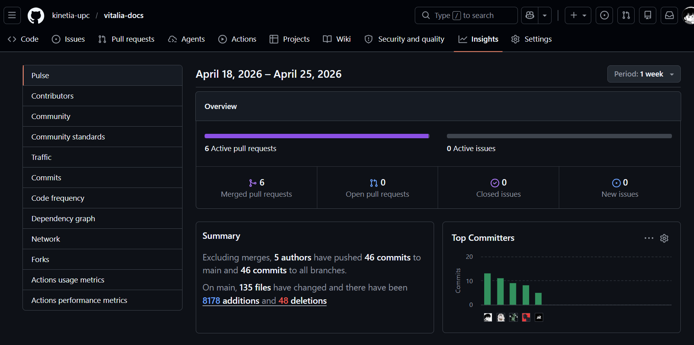

# Tabla de contenidos

**Registro de versiones del informe**

**Project Report Collaboration Insights**

**Tabla de contenidos**

**Student Outcome**

[**Capítulo I: Introducción**](10-chap-1.md)  
1.1. Startup Profile  
1.1.1. Descripción del startup  
1.1.2. Perfiles de integrantes del equipo  
1.2. Solution Profile  
1.2.1. Antecedentes y problemática  
1.2.2. Lean UX Process  
1.2.2.1. Lean UX Problem Statements  
1.2.2.2. Lean UX Assumptions  
1.2.2.3. Lean UX Hypothesis Statements  
1.2.2.4. Lean UX Canvas  
1.3. Segmentos objetivo  

[**Capítulo II: Requirements Elicitation & Analysis**](20-chap-2.md)  
2.1. Competidores  
2.1.1. Análisis competitivo  
2.1.2. Estrategias y tácticas frente a competidores  
2.2. Entrevistas  
2.2.1. Diseño de entrevistas  
2.2.2. Registro de entrevistas  
2.2.3. Análisis de entrevistas  
2.3. Needfinding  
2.3.1. User Personas  
2.3.2. User Task Matrix  
2.3.3. User Journey Mapping  
2.3.4. Empathy Mapping  
2.4. Big Picture EventStorming  
2.5. Ubiquitous Language  

[**Capítulo III: Requirements Specification**](30-chap-3.md)  
3.1. User Stories  
3.2. Impact Mapping  
3.3. Product Backlog  

[**Capítulo IV: Product Design**](40-chap-4.md)  
4.1. Style Guidelines  
4.1.1. General Style Guidelines  
4.1.2. Web Style Guidelines  
4.2. Information Architecture  
4.2.1. Organization Systems  
4.2.2. Labeling Systems  
4.2.3. SEO Tags and Meta Tags  
4.2.4. Searching Systems  
4.2.5. Navigation Systems  
4.3. Landing Page UI Design  
4.3.1. Landing Page Wireframe  
4.3.2. Landing Page Mock-up  
4.4. Web Applications UX/UI Design  
4.4.1. Web Applications Wireframes  
4.4.2. Web Applications Wireflow Diagrams  
4.4.3. Web Applications Mock-ups  
4.4.4. Web Applications User Flow Diagrams  
4.5. Web Applications Prototyping  
4.6. Domain-Driven Software Architecture  
4.6.1. Design-Level EventStorming  
4.6.2. Software Architecture Context Diagram  
4.6.3. Software Architecture Container Diagrams  
4.6.4. Software Architecture Components Diagrams  
4.7. Software Object-Oriented Design  
4.7.1. Class Diagrams  
4.8. Database Design  
4.8.1. Database Diagrams  

[**Capítulo V: Product Implementation, Validation & Deployment**](50-chap-5.md)  
5.1. Software Configuration Management  
5.1.1. Software Development Environment Configuration  
5.1.2. Source Code Management  
5.1.3. Source Code Style Guide & Conventions  
5.1.4. Software Deployment Configuration  
5.2. Landing Page, Services & Applications Implementation  
[**5.2.1. Sprint 1**](51-sprint-1.md)  
5.2.1.1. Sprint Planning 1  
5.2.1.2. Aspect Leaders and Collaborators  
5.2.1.3. Sprint Backlog 1  
5.2.1.4. Development Evidence for Sprint Review  
5.2.1.5. Execution Evidence for Sprint Review  
5.2.1.6. Services Documentation Evidence for Sprint Review  
5.2.1.7. Software Deployment Evidence for Sprint Review  
5.2.1.8. Team Collaboration Insights during Sprint  

[**Conclusiones**](80-conclusions.md)  
[**Recomendaciones**](81-recommendations.md)  
[**Bibliografía**](90-bibliography.md)  
[**Anexos**](99-annexes.md)  

# Student Outcome

En esta sección se describe cómo cada integrante aportó al cumplimiento del Student Outcome durante la primera entrega del proyecto. Las acciones se redactan tomando como referencia el registro de versiones del informe, donde se evidencia la distribución de responsabilidades, el liderazgo compartido y el avance colaborativo en los capítulos y entregables desarrollados para AV1.

| Criterio especifico | Acciones realizadas | Conclusiones |
| --- | --- | --- |
| Trabaja en equipo para proporcionar liderazgo en forma conjunta. | Ruiz Mideyros, Adrian (U20241E177) **AV1:** Lideró aportes de base para el Capítulo I, desarrolló el Ubiquitous Language y completó los Style Guidelines, conectando la definición del producto con el lenguaje del dominio y la identidad visual del proyecto.  Rojas Tello, Nestor Alonso (U202317099) **AV1:** Lideró el análisis de competidores, la definición de segmentos objetivo, el Big Picture EventStorming, la arquitectura Domain-Driven y el diseño de base de datos, aportando estructura estratégica y técnica al informe.  Astocondor Bazan, Alejandra Isabel (U202410678) **AV1:** Lideró la descripción del startup, antecedentes y problemática, el análisis de entrevistas, la gestión de configuración de software, el diseño UI de la landing page y la documentación del Sprint 1.  Diaz Martinez, Alexther Kamil (U202412316) **AV1:** Lideró el desarrollo de Needfinding, el diagrama de clases y la arquitectura de información, fortaleciendo la comprensión de usuarios, entidades del sistema y organización de contenidos.  Dulanto Espino, Leo César (U202410254) **AV1:** Lideró el Lean UX Process, el diseño y registro de entrevistas, y el Capítulo III, articulando hipótesis, requisitos, historias de usuario, impact mapping y backlog del producto. | **AV1:** El equipo distribuyó el liderazgo según las fortalezas de cada integrante. La evidencia del registro de versiones muestra una participación equilibrada en investigación, diseño, arquitectura, requisitos y gestión del proyecto. |
| Crea un entorno colaborativo e inclusivo, establece metas, planifica tareas y cumple objetivos. | Ruiz Mideyros, Adrian (U20241E177) **AV1:** Cumplió tareas asignadas en diferentes momentos del avance del informe, aportando contenido inicial, vocabulario común y lineamientos visuales que facilitaron la coherencia entre capítulos.  Rojas Tello, Nestor Alonso (U202317099) **AV1:** Contribuyó de forma sostenida en entregables de análisis, estrategia y arquitectura, ayudando a ordenar decisiones del equipo y a mantener continuidad entre la visión de negocio y la solución técnica.  Astocondor Bazan, Alejandra Isabel (U202410678) **AV1:** Participó en etapas clave de contexto, validación, configuración, diseño y sprint, integrando aportes de investigación y desarrollo para cerrar entregables completos dentro del cronograma.  Diaz Martinez, Alexther Kamil (U202412316) **AV1:** Aportó entregables relacionados con investigación de usuarios, modelado orientado a objetos y organización de la información, apoyando la toma de decisiones colaborativa sobre la experiencia y estructura del producto.  Dulanto Espino, Leo César (U202410254) **AV1:** Desarrolló actividades de descubrimiento, entrevistas y especificación de requisitos, permitiendo que el equipo convierta necesidades de usuarios en historias, objetivos y backlog priorizado. | **AV1:** El registro de versiones evidencia una planificación colaborativa con responsabilidades distribuidas. Cada miembro completó entregables específicos y complementarios, lo que permitió avanzar de manera ordenada hacia los objetivos de la primera entrega. |

# Capítulo I: Introducción

## 1.1. Startup Profile

### 1.1.1. Descripción del startup

**Nombre de la startup**

KinetiaLabs

**Descripción**

KinetiaLabs es un estudio de innovación tecnológica y desarrollo de software avanzado dedicado a transformar industrias tradicionales a través de la automatización inteligente, la optimización de procesos y el diseño de sistemas dinámicos. Nos especializamos en convertir la complejidad operativa en flujos de trabajo eficientes y escalables, actuando como un catalizador técnico para empresas en fase de crecimiento o transformación digital. No solo construimos software, creamos motores de movimiento empresarial.

**Visión**

Convertirnos en el referente global de ingeniería de software que define la intersección entre la eficiencia operativa y la innovación disruptiva, impulsando un futuro donde la tecnología y el movimiento empresarial converjan en perfecta armonía.

**Misión**

Impulsar la evolución de nuestros clientes diseñando e implementando soluciones tecnológicas robustas, ágiles y personalizadas que eliminen la fricción operativa y aceleren su velocidad de mercado, guiados siempre por la excelencia técnica y un enfoque centrado en los resultados.

**Propuesta de Valor**

"Ingeniería que Impulsa tu Crecimiento"

KinetiaLabs ofrece más que desarrollo de software, proporcionamos una asociación estratégica para el movimiento. Combinamos la precisión técnica de un laboratorio de ingeniería con el dinamismo de una mentalidad agile para entregar sistemas que no solo resuelven los problemas de hoy, sino que construyen la infraestructura para el crecimiento operativo de mañana. Nuestra propuesta se basa en la fiabilidad, la escalabilidad y la aceleración del valor empresarial a través de la tecnología.

**Características principales**

- *Arquitectura de Software Dinámica y Escalable:* Diseñamos sistemas modulares y basados en microservicios que crecen y se adaptan al ritmo de la empresa, evitando la deuda técnica y garantizando la longevidad de la inversión tecnológica.

- *Enfoque en Optimización de Flujos y Movimiento:* Especialización en automatización de procesos empresariales (BPA) e integración de sistemas, diseñando interfaces y backends que minimizan los clics y maximizan la velocidad de ejecución.

- *Desarrollo Técnico de Alta Precisión:* Implementación de rigurosos estándares de calidad, pruebas automatizadas y prácticas de DevOps de vanguardia para asegurar entregas robustas, seguras y libres de errores desde el primer día.

- *Innovación Centrada en el Cliente:* Metodología de co-creación donde la investigación de usuario y el análisis de negocio guían cada línea de código, asegurando que la solución técnica final impulse métricas empresariales reales.

- *Tecnologías Emergentes con Propósito:* Especialización en la integración pragmática de IA/ML, IoT y Big Data para generar ventajas competitivas tangibles, lejos de las modas tecnológicas y enfocados en la utilidad operativa.

### 1.1.2. Perfiles de integrantes del equipo

| Foto | Nombre | Descripción |
| --- | --- | --- |
|  | Ruiz Mideyros, Adrian (U20241E177) | Estudiante de Ingeniería de Software, apasionado por la tecnología desde pequeño. Desarrollador de aplicaciones y videojuegos, con conocimientos en C++, Python, Web Stock y otras tecnologías. Me considero una persona proactiva, con gran disposición para aprender constantemente y apoyar en lo que se necesite. |
|  | Rojas Tello, Nestor Alonso (U202317099) | Estudiante de Ingeniería de Software. Tengo conocimientos en C++, Python, JavaScript y CSS. Me considero una persona colaborativa, responsable y con disposición para resolver dudas y proponer soluciones ante cualquier desafío. |
|  | Astocondor Bazan, Alejandra Isabel (U202410678) | Estudiante de Ingeniería de Software, enfocada en el desarrollo de soluciones tecnológicas. Poseo habilidades en programación y diseño digital.  Me caracterizo por mi creatividad, responsabilidad y capacidad de adaptación.  |
|  | Diaz Martinez, Alexther Kamil  (U202412316) | Estudiante de ingeniería de software, me gusta programar, tengo conocimiento en C++ y Python, me gustan los desafíos. Mi meta es aplicar mi optimismo y capacidad técnica para desarrollar software que genere un impacto real. |
|  | Dulanto Espino, Leo César (U202410254) | Estudiante de Ingeniería de Software, con conocimientos en C++, Python, y básico de web y Java. Me gusta crear soluciones creativas a los problemas, además de participar y apoyar al equipo en cualquier progreso o dificultad. |

## 1.2. Solution Profile

### 1.2.1. Antecedentes y problemática

La gestión sanitaria en el Perú enfrenta brechas estructurales en su arquitectura digital. La dependencia histórica de procesos manuales y sistemas aislados sitúa a los centros de salud en un estado de vulnerabilidad operativa frente a la demanda creciente de servicios.

La fragmentación de la información y la nula interoperabilidad entre plataformas. La ausencia de una infraestructura tecnológica centralizada obliga a la coexistencia de sistemas obsoletos. Esta carencia tecnológica mantiene los flujos de trabajo vinculados a procesos manuales que carecen de procesos estandarizados.

Esta deficiencia impacta directamente la operatividad en áreas críticas como admisión, consultorios y farmacia. El personal médico y administrativo enfrenta duplicidad de registros, inconsistencia en las historias clínicas, pérdida y deterioro de información, lo que eleva el riesgo de errores asistenciales. La falta de datos en tiempo real genera cuellos de botella que transforman la atención en una tarea propensa a retrasos administrativos.

Finalmente, la discontinuidad informativa se traduce en demoras y una menor calidad de atención para el paciente. A nivel gerencial, la precariedad de los datos limita la toma de decisiones estratégicas, especialmente en momentos de alta demanda. En consecuencia, el sistema no solo pierde eficiencia operativa, sino que compromete la seguridad de la salud pública.

***Técnica 5W2H***

*1. ¿Quiénes están involucrados o afectados? (Who?)*

Los principales actores involucrados son los establecimientos de salud del primer nivel (como organizaciones), así como sus usuarios internos: médicos, personal administrativo y de apoyo. Estos últimos se ven afectados por la falta de acceso oportuno a información integrada, lo que dificulta la atención y la gestión operativa. Asimismo, los pacientes se ven indirectamente afectados a través de demoras, duplicidad de registros y menor calidad en la atención.

*2. ¿Qué ocurre o qué problema se presenta? (What?)*

En el Perú, el problema en la gestión de los establecimientos de salud del primer nivel se manifiesta en la fragmentación y baja calidad de la información sanitaria, originada por el uso de sistemas de información no interoperables y la persistencia de procesos manuales, lo que afecta la eficiencia de la atención y limita la toma de decisiones oportunas. Asimismo, esta situación se refleja en el limitado desarrollo de los sistemas de gestión de información en salud, evidenciando debilidades estructurales del sistema sanitario (Banco Mundial, 2023, p. 6).

*3. ¿Cuándo se presenta el problema? (When?)*
El problema se presenta de manera continua a lo largo de todo el proceso de atención del paciente, desde el agendamiento de citas hasta la consulta médica, la prescripción de tratamientos, la dispensación de medicamentos y el proceso de facturación. Es especialmente crítico en momentos de alta demanda, donde la falta de integración y automatización incrementa los tiempos de espera y la probabilidad de errores.

*4. ¿Dónde sucede? (Where?)*
Esta problemática se manifiesta en diversas áreas del centro de salud, incluyendo admisión (registro y programación de citas), consultorios médicos (registro y diagnóstico), farmacia (dispensación de medicamentos) y caja (procesos de pago y facturación). La falta de integración entre estas áreas genera discontinuidad en el flujo de información.

*5. ¿Por qué ocurre? (Why?)*
El Ministerio de Salud del Perú (MINSA) evidencia importantes deficiencias en la gestión de la información en los establecimientos de salud, señalando la carencia de sistemas de información estandarizados y tableros de control que permitan evaluar la implementación de políticas como la atención integral de salud a nivel regional (Ministerio de Salud del Perú, 2011).

*6. ¿Cómo se manifiesta el problema? (How?)*
El problema se manifiesta en la práctica mediante la duplicidad de registros de pacientes, pérdida o inconsistencias en la información clínica, retrasos en la atención debido a procesos manuales, dificultades para acceder al historial médico completo y limitaciones en la coordinación entre áreas del establecimiento de salud.

*7. ¿Cuánto cuesta o cuál es la magnitud? (How much?)*

*Figura 1 (Macroproceso: sistema de información)*  

> **Nota.** Adaptado del Ministerio de Salud de Perú (2011).

El MINSA identifico brechas significativas en capacidades tecnológicas y de gestión, dado que el 71% de los establecimientos de salud no ha identificado sus necesidades en recursos informáticos ni en personal especializado, y el 72% no cuenta con métodos formales y permanentes para la evaluación, recolección, procesamiento y análisis de información (Ministerio de Salud del Perú, 2011).

### 1.2.2. Lean UX Process

#### *1.2.2.1. Lean UX Problem Statements*

KinetiaLabs presenta una plataforma web diseñada para optimizar la interacción entre médicos y pacientes, facilitando el acceso a información y servicios de salud. Mediante una interfaz intuitiva, atractiva y funcional, la solución garantiza una experiencia de usuario eficiente; nuestro objetivo central es agilizar los procesos clínicos y mitigar las ineficiencias de los modelos de atención tradicionales.

A la hora de acudir a un establecimiento médico, la agilidad en la gestión de los procesos es un factor importante para la resolución efectiva de las necesidades del paciente. No obstante, se han identificado deficiencias operativas significativas, tales como la dependencia de procesos manuales y el uso ineficiente de sistemas digitales, factores que derivan en retrasos y errores administrativos. Si bien existen intentos en mejorar sus sistemas, estos resultan insuficientes para cubrir la demanda del flujo operativo actual. Lo cual representa una oportunidad para implementar una solución que optimice y automatice de mejor manera la gestión médica.

¿Cómo podríamos asegurar la automatización y agilización de los procesos administrativos dentro de los establecimientos médicos?

#### *1.2.2.2. Lean UX Assumptions*

**Assumptions Worksheet**

1. ¿Quién es el usuario?

Tenemos 3 usuarios principales:
Pacientes: Personas de todas las edades que necesiten atención médica por algún inconveniente.
Médicos: Personal que atiende de forma directa a los pacientes, los cuales les brindan su diagnóstico según la situación.
Personal administrativo: Encargados de los procesos médicos, además de generar resúmenes y métricas de la actividad clínica.

2. ¿Dónde encaja nuestro producto en su trabajo o vida?

La aplicación encaja a la hora de realizar algún proceso médico, ya sea para cualquiera de los usuarios. Permite a los pacientes gestionar su historial clínico de forma sencilla, a los médicos organizar sus horarios de citas con mayor claridad y al personal administrativo contar con procesos automatizados que reducen la carga de trabajo manual.

3. ¿Qué problemas tiene nuestro producto que resolver?

El problema principal a resolver es la agilización de los procesos médicos, para lo cual se tiene que digitalizar y automatizar algunos procesos manuales o poco óptimos. Esto de la siguiente manera:
Pacientes: Brindarles acceso directo a historia médica, reservas de cita simple y posibilidad de compra de farmacia en linea.
Médicos: Permitirles una mejor gestión de su disponibilidad de citas, como también de sus recetas o diagnósticos brindados a sus pacientes.
Personal administrativo: Automatizar los procesos necesarios para sus trámites o generación de resúmenes y métricas.

4. ¿Cuándo y cómo es usado nuestro producto?

Es usado en general a la hora de querer realizar cualquier proceso médico, pero varía dependiendo del usuario.
Pacientes: A la hora que quieran agendar una cita o revisar algún diagnóstico o receta en su historial.
Médicos: En el manejo de sus horarios, envío de diagnósticos o recetas tras una cita, permitir un acceso rápido al historial de sus pacientes.
Personal administrativo: Al agilizar sus procesos para la elaboración de sus resúmenes o métricas.

5. ¿Qué características son importantes?

Manejo correcto de citas tanto para pacientes (reserva), como médicos (administrar disponibilidad).
Integración de farmacia en línea para agilizar obtención de recetas brindadas
Interfaz segmentada y accesible, para uso de cualquier tipo de paciente
Acceso inmediato al historial clínico de los pacientes tanto para ellos, como para los médicos.
Sincronización en tiempo real de la información entre el personal administrativo, médicos y pacientes.

6. ¿Cómo debería verse nuestro producto y cómo comportarse?
    
Debe presentar una interfaz organizada, minimalista y jerarquizada, eliminando cualquier distracción visual para que la lectura de datos críticos y el acceso a las funciones principales sean inmediatos para los tres tipos de usuario.
En términos de funcionamiento, se espera que la plataforma sea robusta, ágil y altamente eficiente, con una navegación fluida que priorice la rapidez en la gestión de citas y diagnósticos. Debe comportarse de forma que automatice tareas repetitivas y ofrezca respuestas en tiempo real, transmitiendo total seguridad y confianza a través de una buena gestión de datos entre los procesos administrativos y la atención al paciente.

**Assumptions**

- Creo que mis clientes necesitan una plataforma de gestión médica que agilice la atención, como otros procesos médicos, y facilite el acceso a información, como el historial clínico de los pacientes.
- Estas necesidades se pueden resolver con procesos automatizados, accesos directos a información, recetas en línea y un panel de métricas.
- Mis clientes iniciales son pacientes que buscan atención médica, medios que requieren una mejor gestión y personal administrativo para aliviar su carga laboral.
- El valor #1 que un cliente quiere de mi servicio es la agilización real de los procesos médicos, eliminando esperas o errores innecesarios.
- El cliente también puede obtener estos beneficios adicionales: mejor organización de la disponibilidad médica, compra simplificada y directa en la farmacia digital, resúmenes y reportes de la actividad clínica.
- Voy a adquirir la mayoría de mis clientes a través de alianzas con centros médicos, policlínicos, clínicas privadas o consultorios independientes.
- Haré dinero a través de la venta del software a los centros médicos, policlínicos o clínicas.
- Mi competencia principal en el mercado será plataformas de gestión de citas existentes o sistemas internos de las clínicas.
- Los venceremos debido a nuestra propuesta que automatiza el flujo completo, una interfaz optimizada y una mejor gestión de métricas administrativas.
- Mi mayor riesgo de producto es la resistencia al cambio por parte del personal médico o administrativo
- Resolveremos esto a través de una interfaz intuitiva, capacitaciones y la demostración tangible de la reducción de tiempo en sus tareas.

#### *1.2.2.3. Lean UX Hypothesis Statements*

**Hypothesis Statement 1**

Creemos que brindar acceso digital a los resultados y diagnósticos reducirá las consultas presenciales o telefónicas solo para recojo de información. Sabremos que lo hemos logrado cuando el número de solicitudes presenciales de copias de historias clínicas disminuya en un 40% durante los primeros tres meses tras su implementación.

**Hypothesis Statement 2**

Creemos que simplificar el proceso de reserva de citas en pocos pasos, agilizará la gestión y satisfacción de los pacientes. Sabremos que lo hemos logrado cuando se registre un 50% más de reservas en digitales en comparación a las tradicionales.

**Hypothesis Statement 3**

Creemos que la automatización de métricas y resúmenes de actividad clínica eliminará la necesidad de reportes manuales al final de la jornada. Sabremos que lo hemos logrado cuando el personal administrativo reduzca en un 30% las horas semanales dedicadas exclusivamente a la elaboración de informes de gestión y auditoría.

#### *1.2.2.4. Lean UX Canvas*

Public Canva Link: https://canva.link/ux7vanu08xalhmj

*Figura 2 (Lean Product Canvas)*  

## 1.3. Segmentos objetivo

Esta sección presenta la descripción de los segmentos objetivo relacionados con el dominio del sistema Vitalia, incluyendo sus características principales, necesidades y comportamiento dentro del entorno de atención médica digital. Asimismo, se consideran aspectos relevantes que justifican su inclusión como parte del mercado objetivo de la solución.

**Primer Segmento Objetivo (Administradores de establecimientos de PNAS)**

Este segmento corresponde a los directores, gerentes o dueños de establecimientos del Primer Nivel de Atención de Salud (PNAS), quienes tienen la responsabilidad de la sostenibilidad financiera y operativa del centro. Son los principales tomadores de decisión para la adquisición de Vitalia.

*Características demográficas*

| Pregunta | Respuesta |
| --- | --- |
| ¿Cúal es el rango de edad? | 20 a 65 años. |
| ¿A qué red pertenece? | Pueden formar parte de la red pública del Estado (como MINSA o EsSalud en Perú). O ejercer de manera privada. |
| ¿Qué tipo de función tiene? | Gestionan centros de atención médica que sirven como la puerta de entrada al sistema de salud, priorizando la medicina preventiva, diagnósticos y tratamientos. |
| ¿Cuál es su presupuesto? | El presupuesto donde gestionan varía según su naturaleza: - En el sector público, depende de asignaciones estatales y suele estar limitado por recursos y demanda. - En el sector privado, depende del volumen de pacientes y servicios ofrecidos, aunque generalmente es menor en comparación con clínicas de mayor complejidad. |
| ¿Cómo es la infraestructura de los establecimientos? | La infraestructura es variable: - Policlínicos: infraestructura intermedia con varios consultorios. - Clínicas: infraestructura más completa y equipada. - Consultorios independientes: infraestructura básica y limitada.  Tomando en cuenta que en establecimientos públicos, puede ser limitada o con restricciones operativas y en privados, puede ser más moderna y de alto flujo. |
| ¿Cuánta es la cantidad de personal? | De acuerdo al establecimiento: - Policlínicos: varios médicos y personal administrativo.  Clínicas: mayor cantidad de personal y especialización.  Consultorios independientes: personal mínimo, a veces solo el médico. |
| ¿Cuánto es el stock de medicamentos? | El manejo de stock de medicamentos e insumos puede ser variable: - En el sector público, condicionado por abastecimiento estatal. - En el privado, dependiente de gestión interna, muchas veces sin sistemas automatizados. |

*Hábitos y Motivación*

- Manejan un alto flujo diario de pacientes, lo que los obliga a priorizar la rapidez en la atención sobre la organización administrativa.
- Su proceso de citas suele ser reactivo (llamadas, atención presencial). Buscan optimizar la gestión de citas, pacientes y recursos para mejorar la eficiencia operativa.
- Buscan maximizar la rotación de pacientes por consultorio, ya que su sostenibilidad depende del volumen de atenciones realizadas.
- Existe interés en soluciones digitales que se adapten a su nivel de complejidad y capacidad económica; dependiendo de que la solución sea fácil de implementar, no interrumpa la atención y genere beneficios operativos claros.

*Información del Sustento*

El nivel de digitalización en los policlínicos públicos se encuentra regulado por la Ley N° 30024, que promueve el uso de Historias Clínicas Electrónicas (HCE). Sin embargo, en la práctica, muchos establecimientos operan con sistemas antiguos y no interoperables, lo que limita el intercambio eficiente de información entre áreas y profesionales de salud. En el sector privado, el nivel de digitalización es variable, dependiendo del tamaño, capacidad económica y grado de modernización de cada establecimiento. Mientras algunas clínicas han avanzado en la implementación de sistemas digitales, otros centros aún dependen de herramientas básicas o procesos manuales.

Adicionalmente, la Ley de Protección de Datos Personales exige que el manejo de información sensible, como los datos de salud, cumpla con estrictos protocolos de seguridad, incluyendo mecanismos de cifrado y control de acceso, lo que representa un desafío adicional para muchos establecimientos que no cuentan con infraestructura tecnológica adecuada.

En términos de eficiencia y adopción tecnológica, el Estado reportó que durante el año 2025 se superaron los 1.6 millones de atenciones digitales, evidenciando una creciente familiaridad de los pacientes con servicios digitales. Asimismo, según un informe de la consultora Total Market Solutions (TMS), las clínicas y centros médicos privados registraron un crecimiento del 9% hacia 2025, impulsado principalmente por la incorporación de tecnologías que permiten reducir los tiempos de espera y mejorar la satisfacción del paciente hasta en un 40%.

En este contexto, se evidencia una clara brecha entre la necesidad de digitalización y la capacidad real de implementación en los establecimientos de salud. Vitalia surge como una solución que responde a esta problemática.

**Segundo Segmento Objetivo (Doctores de establecimientos de PNAS)**

Este segmento corresponde a los médicos que laboran en establecimientos del Primer Nivel de Atención de Salud (PNAS), incluyendo policlínicos, clínicas y consultorios independientes. Son los principales usuarios del sistema en la operación diaria, encargados de la atención directa al paciente, el registro de información clínica y el seguimiento de tratamientos.

*Características demográficas*

| Pregunta | Respuesta |
| --- | --- |
| ¿Qué rango de edad tienen? | Se identifican dos subgrupos principales: - Nativos Digitales (25 a 40 años): Médicos jóvenes y residentes que exigen herramientas tecnológicas modernas y rechazan el uso de papel. - Inmigrantes Digitales (41 a 65 años): Médicos con amplia experiencia que, aunque habituados al sistema tradicional, buscan soluciones simples que no compliquen su flujo de trabajo actual. |
| ¿Cuál es su carga laboral? | Atienden un alto volumen de pacientes por jornada, lo que genera una presión constante por reducir el tiempo administrativo. |
| ¿Qué responsabilidad legal enfrentan? | Obligación de registro preciso bajo estándares de SUSALUD y la emisión de recetas claras para evitar errores de medicación. |

*Hábitos y Motivación*

- Priorizan la rapidez en la atención debido a la alta demanda de pacientes.
- Buscan acceder de forma inmediata al historial clínico del paciente para mejorar la precisión del diagnóstico.
- Tienden a evitar sistemas complejos que interfieran con el flujo de la consulta médica.
- Valoran herramientas que reduzcan el tiempo de registro de información clínica.
- Buscan mejorar la continuidad de atención del paciente mediante un mejor seguimiento médico.
- Muestran mayor disposición a usar tecnología cuando esta simplifica su trabajo y no aumenta su carga operativa.

*Información del Sustento*

El principal obstáculo del médico moderno es la denominada carga administrativa, la cual impacta directamente en la calidad y eficiencia de la atención médica. Diversos estudios, 
globales como regionales, evidencian que los médicos pueden llegar a dedicar una cantidad de tiempo similar a tareas administrativas (como el llenado de formularios y registros) en comparación con la atención directa a pacientes.

En este sentido, la Organización Panamericana de la Salud señala que la implementación de Historias Clínicas Electrónicas (HCE) adecuadamente diseñadas puede reducir hasta en un 20% el tiempo destinado a estas tareas, permitiendo una atención más eficiente, precisa y centrada en el paciente.

Desde el punto de vista legal, en el Perú, el médico es el responsable directo de la información registrada en la historia clínica. El uso de sistemas no integrados o procesos manuales incrementa el riesgo de errores, inconsistencias y problemas durante auditorías. En este marco, la Norma Técnica de Salud N° 022-MINSA/DGSP establece los estándares para la adecuada gestión de la historia clínica, reforzando la importancia de contar con sistemas confiables y estructurados.

En este contexto, la adopción de herramientas digitales que optimicen el registro clínico, reduzcan la carga administrativa y faciliten el acceso a la información se vuelve fundamental para mejorar la eficiencia del trabajo médico, en el cual Vitalia responde a esta problemática al ofrecer una plataforma intuitiva, rápida e integrada, diseñada para adaptarse al flujo de trabajo del médico.

**Tercer Segmento Objetivo (Pacientes de todas las edades)**

Este segmento representa al beneficiario final de los servicios de salud brindados en los establecimientos de PNAS. Su experiencia con el sistema Vitalia es indirecta pero crítica, ya que la modernización del centro impacta directamente en la calidad, rapidez y seguridad de su atención médica.

*Características demográficas*

| Pregunta | Respuesta |
| --- | --- |
| ¿Qué rango de edad tienen? | El mercado es universal, pero se segmenta por su relación con la tecnología: - Nativos Digitales (18 a 44 años): Usuarios que buscan inmediatez, comunicación digital y prefieren establecimientos que les permitan gestionar su salud desde el celular. - Adultos y Cuidadores (45 a 64 años): Usuarios que valoran el orden y la claridad, actuando muchas veces como responsables de la salud de sus hijos o padres ancianos. - Adultos Mayores (65+ años): Beneficiarios que requieren procesos simplificados, recetas legibles y un historial centralizado para el manejo de enfermedades crónicas. |
| ¿Qué nivel de acceso tecnológico poseen? | Uso masivo de dispositivos móviles inteligentes y familiaridad con aplicaciones de servicios básicos (banca, mensajería y trámites gubernamentales). |
| ¿Cuál es su frecuencia de atención? | Varía desde pacientes con dolencias agudas (atenciones esporádicas) hasta pacientes crónicos que requieren un control mensual de recetas y citas de seguimiento. |

*Hábitos y Motivación*

- Buscan rapidez en la atención médica y reducción de tiempos de espera.
- Prefieren procesos simples para agendar citas y acceder a servicios.
- Muestran una creciente adaptación al uso de herramientas digitales en salud.
- Buscan mayor transparencia y control sobre su información médica.

*Información del Sustento*

Uno de los principales problemas que enfrentan los pacientes al recibir una prescripción médica es la dificultad para comprenderla o conservarla adecuadamente. La ilegibilidad de las recetas físicas y la pérdida de documentos pueden generar errores en la medicación y afectar la continuidad del tratamiento. En este sentido, un estudio publicado en Taylor & Francis, señala que la implementación de sistemas de prescripción electrónica puede reducir los errores de medicación hasta en un 49.8%, mitigando riesgos asociados a la mala interpretación y comunicación de las indicaciones médicas.

Asimismo, en el Perú, la Ley N° 29414 (Art. 15) establece que todo paciente tiene derecho a recibir información “precisa y oportuna” sobre su estado de salud. Complementariamente, el Reglamento aprobado mediante el D.S. N° 027-2015-SA obliga a las IPRESS a garantizar que la historia clínica sea veraz, completa y accesible. En este contexto, la digitalización de la información médica permite cumplir con estos lineamientos, asegurando que los datos sean legibles, organizados y disponibles para el paciente.

Desde una perspectiva económica, el uso de Historias Clínicas Electrónicas (HCE) contribuye a reducir gastos innecesarios, ya que evita la repetición de exámenes médicos al permitir que el profesional de salud acceda de manera inmediata a los resultados previos del paciente. Esto no solo mejora la seguridad clínica, sino también optimiza el gasto del paciente en su atención médica.

# Capítulo II: Requirements Elicitation & Analysis

## 2.1. Competidores

### 2.1.1. Análisis competitivo

**Competitive Analysis Landscape**

*¿Por qué llevar a cabo este análisis?*

Realizar un análisis competitivo es fundamental para comprender el entorno en el que se desarrollará Vitalia, identificando las soluciones existentes, sus limitaciones y las oportunidades del mercado. Este análisis permite reconocer las fortalezas y debilidades de los competidores, detectar brechas; especialmente en el Primer Nivel de Atención de Salud (PNAS), y definir una propuesta de valor diferenciada, alineada a las necesidades reales de los segmentos objetivo. Asimismo, resulta clave para posicionar a Vitalia como una solución más accesible, simple y adaptada al sistema de salud peruano, frente a alternativas complejas, costosas o poco eficientes.

*Logos*

| Vitalia | Doctoralia | Medilink | AgendaPro |
| --- | --- | --- | --- |
|  |  |  |  |

*Perfil*

|     | Vitalia | Doctoralia | Medilink | AgendaPro |
| --- | --- | --- | --- | --- |
| Overview | SaaS integral para establecimientos del Primer Nivel de Atención de Salud (PNAS) que centraliza la historia clínica electrónica y permite gestionar citas, recetas, exámenes, diagnósticos y más. Integra módulos de farmacia y facturación electrónica, optimizando la atención médica y la gestión operativa del centro de salud. | Es un marketplace médico masivo. Su función principal es servir como un buscador donde los pacientes pueden encontrar especialistas, ver opiniones de otros usuarios y reservar una cita. | Herramienta de gestión administrativa y operativa para clínicas. Es un sistema integral que abarca desde la recepción del paciente hasta el control de pagos y el inventario de insumos. | Aplicación especializada en la gestión de citas, expedientes clínicos, agenda en línea, videoconsulta y facturación. Está diseñada para centros que requieren una agenda muy dinámica y contacto constante con el cliente. |
| Ventaja competitiva ¿Qué valor ofrece a los clientes? | Ecosistema Clínico Unificado: Su valor radica en la integración nativa de la parte médica con la operativa (farmacia y facturación). A diferencia de otros, no es un parche administrativo, sino una herramienta diseñada para que el flujo desde la reserva hasta la salida del paciente sea una sola línea de datos sin fricciones. | Atracción de pacientes nuevos: Ofrece una infraestructura de marketing que garantiza que el médico sea visible globalmente. Su ventaja es la conversión. Convierte búsquedas en citas médicas confirmadas gracias a su sistema de reseñas y su posicionamiento web. | Inteligencia Operativa y Financiera: Solución robusta de gestión clínica y administrativa que permite un alto control operativo del establecimiento, especialmente en procesos internos como inventario, facturación y flujo de caja. | Especialización en agendamiento y gestión de clientes: Garantiza alta usabilidad y rapidez de implementación, ideal para negocios que requieren optimizar la programación de citas y la comunicación con usuarios. |

*Perfil de marketing*

|     | Vitalia | Doctoralia | Medilink | AgendaPro |
| --- | --- | --- | --- | --- |
| Mercado Objetivo | El mercado objetivo de Vitalia está dirigido a administradores, médicos y pacientes del Primer Nivel de Atención de Salud (PNAS), tanto del sector público como privado. | Médicos independientes y clínicas que buscan atraer más pacientes, así como usuarios digitales que desean encontrar y agendar citas médicas en línea. | Establecimientos de salud medianos y grandes que requieren un alto nivel de control administrativo, financiero y operativo en sus procesos internos. | Negocios de servicios (incluyendo salud) que necesitan optimizar la gestión de citas y la relación con clientes, especialmente aquellos con alta rotación de agenda. |
| Estrategias de Marketing | Redes Sociales y Alianzas Institucionales: Autoridad Normativa y Difusión: Se alían con el MINSA y entidades privadas para ser el estándar de formalización médica. Utilizan campañas y redes sociales para demostrar que su ruta digital unificada garantiza una atención más ágil y profesional. | SEO (Search Engine Optimization) y Reputación: Se aseguran de aparecer primeros en Google. Usan el sistema de opiniones (estrellas) para que los médicos compitan entre sí por ser los mejor valorados. | Venta Corporativa (B2B): Se enfocan en eventos de salud, demostraciones personalizadas para gerentes y marketing basado en la "eficiencia administrativa" y el retorno de inversión. | Automatización y Redes Sociales: Apuesta por la publicidad masiva en redes sociales y la automatización, vendiendo la idea de "cero inasistencias" y una agenda siempre llena con el mínimo esfuerzo de gestión. |

*Perfil de producto*

|     | Vitalia | Doctoralia | Medilink | AgendaPro |
| --- | --- | --- | --- | --- |
| Productos y Servicios | Historia clínica electrónica (HCE), gestión de citas, recetas digitales, exámenes y diagnósticos, módulo de farmacia, facturación electrónica, dashboards por rol, portal del paciente. | Marketplace médico, búsqueda de especialistas, reservas de citas online, sistema de reseñas y calificaciones, perfiles profesionales, visibilidad digital. | Gestión administrativa clínica, reservas de citas, facturación, control de pagos, inventario de insumos, gestión operativa del establecimiento. | Gestión de citas y agenda, expedientes básicos, reservas online, recordatorios automáticos, videoconsultas, facturación, gestión de clientes. |
| Precios y costos | Modelo de precios accesible y escalable según el tipo de establecimiento. Para consultorios independientes, cuenta con un Plan Independiente que oscila entre S/ 150 y S/ 250 mensuales, incluyendo un número razonable de usuarios (aproximadamente 5 a 10 médicos activos). En el caso de clínicas privadas y públicas, dispone de un Plan de Asociación Estratégica desde S/ 300 hasta S/ 600 mensuales como base, el cual puede variar en función de la cantidad de sedes y usuarios requeridos. | Opera bajo un modelo de suscripción enfocado en visibilidad, con planes anuales como Plan Plus (S/ 2,390), Plan Anual (S/ 2,990) y Plan VIP (S/ 3,590), este último ofreciendo mayor prioridad en el buscador. | Utiliza un esquema SaaS por usuario, con el Plan Pro desde $35 mensuales por el primer profesional más $9 por cada médico adicional, o $350 anuales, y el Plan Advanced desde $40 mensuales o $400 anuales. | Ofrece planes escalables según número de profesionales, desde $9 mensuales (Plan Individual), $29 (Básico), $59 (Premium hasta 5 usuarios) hasta $199 mensuales (Plan Pro ilimitado). |
| Canales de distribución (Web y/o móvil) | Plataforma web, acceso desde navegador, implementación digital, marketing B2B y canales online. | Plataforma web, aplicación móvil, posicionamiento en buscadores (SEO), marketing digital, marketplace online. | Plataforma web, implementación personalizada, ventas B2B directas, demostraciones comerciales, canales corporativos. | Plataforma web, aplicación móvil, marketing digital, onboarding online, canales digitales y redes sociales. |

*Análisis SWOT*

|     | Vitalia | Doctoralia | Medilink | AgendaPro |
| --- | --- | --- | --- | --- |
| Fortalezas | Plataforma web, aplicación móvil, marketing digital, onboarding online, canales digitales y redes sociales. | Alta visibilidad y captación de pacientes, fuerte posicionamiento en buscadores, sistema de reputación (reseñas). | Control administrativo y financiero robusto, gestión interna completa del establecimiento, enfoque en operaciones. | Alta usabilidad, rápida implementación, fuerte en gestión de citas y automatización. |
| Debilidades | Menor posicionamiento en el mercado, dependencia de adopción tecnológica en centros de salud. | No gestiona procesos clínicos internos ni historia médica, dependencia de visibilidad para generar valor. | Complejidad de uso, enfoque más administrativo que clínico, implementación más pesada. | No especializado en salud, funcionalidades clínicas limitadas, enfoque genérico. |
| Oportunidades | Baja digitalización en el Primer Nivel de Atención de Salud (PNAS), necesidad de integrar procesos clínicos y administrativos, impulso de normativas como la historia clínica electrónica, y creciente demanda de soluciones accesibles, simples y adaptadas al contexto peruano. | Expansión en servicios digitales de salud, mayor adopción de reservas online. | Aumento de la necesidad de digitalización en clínicas, exigencias de control financiero y normativas que impulsan el uso de sistemas más estructurados. | Creciente adopción de herramientas digitales simples para gestión de citas y demanda de automatización en la atención al cliente. |
| Amenazas | Competidores ya posicionados, resistencia al cambio en el sector salud, limitaciones tecnológicas en algunos centros. | Nuevos SaaS más simples, resistencia a sistemas complejos. | Nuevos SaaS más simples, resistencia a sistemas complejos. | Competidores especializados en salud, baja diferenciación en el sector médico. |

### 2.1.2. Estrategias y tácticas frente a competidores

**Plan accesible y escalable**  
Ofreceremos planes adaptados al Primer Nivel de Atención de Salud (PNAS), con costos significativamente más accesibles que soluciones complejas como Medilink, permitiendo a consultorios y clínicas adoptar el sistema sin una alta inversión inicial.

**Implementación simple y rápida**  
Vitalia prioriza un onboarding digital sin necesidad de infraestructura adicional, diferenciándose de sistemas que requieren procesos de implementación largos o soporte técnico intensivo.

**Integración total del sistema**  
Unificamos historia clínica, citas, recetas, farmacia y facturación en una sola plataforma, superando la fragmentación de herramientas como Doctoralia (captación), AgendaPro (agenda) y otros sistemas parciales.

**Adaptación al contexto peruano**  
Vitalia se diseña considerando normativas locales y necesidades reales del PNAS, a diferencia de soluciones internacionales o genéricas que no se ajustan al entorno regulatorio ni operativo del país.

## 2.2. Entrevistas

### 2.2.1. Diseño de entrevistas

**Primer Segmento Objetivo (Administradores de establecimientos de PNAS)**

1. ¿Cuál es su rol dentro del establecimiento de salud y qué responsabilidades tiene en la gestión?
2. ¿Qué sistemas o herramientas utilizan actualmente para gestionar citas, historias clínicas y facturación?
3. ¿Qué dificultades enfrentan en la gestión de información y coordinación entre áreas?
4. ¿Qué tan integrados están los sistemas que utilizan actualmente?
5. ¿Qué aspectos considera más importantes al implementar un nuevo sistema? (costo, uso, integración, etc)
6. ¿Ha considerado implementar un sistema integral de gestión clínica? ¿Por qué?
7. ¿Qué características consideraría indispensables para tal sistema?
8. ¿Cómo evalúa actualmente el desempeño del centro de salud y qué tipo de información le gustaría tener para mejorar la toma de decisiones?

**Segundo Segmento Objetivo (Doctores de establecimientos de PNAS)**

1. ¿Cómo es su flujo de trabajo durante una consulta médica típica?
2. ¿Qué herramientas utiliza actualmente para registrar información del paciente?
3. ¿Qué dificultades encuentra al acceder o registrar información clínica?
4. ¿Ha tenido problemas con información incompleta, errónea o duplicada de pacientes?
5. ¿Qué tan fácil le resulta gestionar citas, recetas y exámenes con los sistemas actuales?
6. ¿Qué funciones le ahorrarían más tiempo en su trabajo diario?
7. ¿Qué tan cómodo se siente utilizando herramientas digitales para el registro de información?
8. ¿Qué características le gustaría tener en un sistema ideal de historia clínica electrónica?

**Tercer Segmento Objetivo (Pacientes de todas las edades)**

1. ¿Cómo suele agendar sus citas médicas actualmente?
2. ¿Qué dificultades ha tenido al atenderse en centros de salud?
3. ¿Ha tenido problemas con la pérdida de información médica o repetición de exámenes?
4. ¿Qué tan fácil es para usted acceder a sus resultados o historial médico?
5. ¿Qué tan importante sería para usted recibir recordatorios de citas?
6. ¿Cuánto tiempo suele esperar para conseguir una cita o ser atendido, y cómo se siente al respecto a ese tiempo?
7. ¿Qué tan cómodo se siente realizando pagos o trámites de salud de manera digital?
8. ¿Usaría una plataforma que le permita ver su historial, recetas y citas en un solo lugar?

### 2.2.2. Registro de entrevistas

Link: https://upcedupe-my.sharepoint.com/:v:/g/personal/u202410678_upc_edu_pe/IQDgJy2PUoP0TYZDkGzJovVSAdekNtVsyw0nG7B4hpjrJgY?e=cRDMrY&nav=eyJyZWZlcnJhbEluZm8iOnsicmVmZXJyYWxBcHAiOiJTdHJlYW1XZWJBcHAiLCJyZWZlcnJhbFZpZXciOiJTaGFyZURpYWxvZy1MaW5rIiwicmVmZXJyYWxBcHBQbGF0Zm9ybSI6IldlYiIsInJlZmVycmFsTW9kZSI6InZpZXcifX0%3D

**Primer Segmento Objetivo (Administradores de establecimientos de PNAS)**

**Entrevista 1**

| Entrevistado: | Entrevistadora: Alejandra Astocondor |
| ------------- | -------------- |
|  |  |
| Inicia: | 13:23 |
| Duración:| 4:04 |
| Nombre completo: | Christian David Bazan Calderon |
| Edad: | 46 |
| Distrito: | Surco |
| Resumen: | Christian señala que actualmente utilizan múltiples herramientas no integradas (teléfono, Excel, WhatsApp y facturación electrónica). Identifica como principal problema la falta de integración, lo que genera ineficiencias. Considera que el uso y la adaptación del personal son factores clave para implementar un nuevo sistema. Propone un sistema integral que conecte citas, historias clínicas, facturación y servicios como laboratorio e imágenes. Destaca que la digitalización permite ahorrar tiempo, recursos y mejorar la toma de decisiones. |

**Entrevista 2**

| Entrevistado: | Entrevistadora: Alejandra Astocondor |
| ------------- | -------------- |
|  |  |
| Inicia: | 17:27 |
| Duración: | 7:38 |
| Nombre completo: | Diego Leonardo Bazan Calderon |
| Edad: | 36 |
| Distrito: | San Juan de Miraflores |
| Resumen: | Diego describe el uso de múltiples plataformas (WhatsApp, Google Calendar, sistema en Access y software de facturación), lo que genera duplicación de datos. Considera que la integración es el principal valor de un nuevo sistema, seguido del costo. También destaca la importancia de cumplir con la normativa peruana y permitir integraciones mediante APIs. Subraya el valor del análisis de datos para la toma de decisiones estratégicas, como identificar servicios más rentables o perfiles de pacientes. |

**Entrevista 3**

| Entrevistada: | Entrevistadora: Alejandra Astocondor |
| ------------- | -------------- |
|  |  |
| Inicia: | 25:40 |
| Duración: | 4:20 |
| Nombre completo: | Iris Carpio Bazan |
| Edad: | 64 |
| Distrito: | La victoria |
| Resumen: | Iris explica que utilizan el sistema SIHCE, pero aún no existe integración completa entre áreas como admisión, laboratorio y atención médica. Considera que el principal reto es la interconexión de servicios. Destaca que el sistema debe ser fácil de usar, especialmente para personal mayor, y que los recursos económicos son una limitante importante. Su objetivo es mejorar la eficiencia del servicio y reducir tiempos de espera. |

**Segundo Segmento Objetivo (Doctores de establecimientos de PNAS)**

**Entrevista 1**

| Entrevistada: | Entrevistadora: Alejandra Astocondor |
| -------------- | -------------- |
|  |  |
| Inicia: | 0:00 |
| Duración: | 4:57 |
| Nombre completo: | Carmen Patricia Gabriela Perez |
| Edad: | 62 años |
| Distrito: | Lima |
| Resumen: | La doctora describe una consulta breve y estructurada de aproximadamente 12 minutos, donde realiza preguntas rápidas para obtener una visión general del paciente antes de profundizar en el motivo principal. Utiliza el sistema ESI para registrar información clínica, pero enfrenta limitaciones como el poco tiempo disponible y fallas del internet que incluso ocasionan pérdida de datos. Aunque no ha tenido errores de duplicidad, reconoce que pueden ocurrir. Se siente cómoda con el uso de herramientas digitales y valora su eficiencia frente al registro manual. Propone como mejora un sistema inteligente que genere resúmenes automáticos del historial y que permita registrar información mediante reconocimiento de voz. |

**Entrevista 2**

| Entrevistado: | Entrevistadora: Alejandra Astocondor |
| ------------- | -------------- |
|  |  |
| Inicia | 4:57 |
| Duración: | 4:50 |
| Nombre completo: | Jorge Mendoza Toribio |
| Edad: | 35 años |
| Distrito: | Lima |
| Resumen: | El médico explica un flujo clínico ordenado basado en anamnesis, examen físico y plan de tratamiento. Utiliza historia clínica electrónica y considera que el sistema es funcional, aunque presenta problemas de conectividad entre establecimientos y lentitud por sobrecarga. No ha experimentado errores en los datos. Indica que la gestión de recetas y exámenes es sencilla con experiencia. Propone implementar un triaje previo para optimizar el tiempo de consulta y resalta la importancia de integrar sistemas entre distintas instituciones de salud. |

**Entrevista 3**

| Entrevistado: | Entrevistadora: Alejandra Astocondor |
| ------------- | -------------- |
|  |  |
| Inicia | 9:47 |
| Duración: | 3:36 |
| Nombre completo: | Jose Miguel Mejia Azañero |
| Edad: | 40  |
| Distrito: | Lima |
| Resumen: | El entrevistado describe consultas de duración de 12 minutos en promedio y el uso del sistema ESI sin mayores dificultades. El principal problema es la lentitud del sistema o del internet. Considera que la gestión de citas, recetas y exámenes es sencilla, pero puede optimizarse. Sugiere incorporar triaje previo y automatizar funciones como la repetición de recetas con un solo clic. Se siente cómodo con herramientas digitales y enfatiza la necesidad de mayor rapidez y eficiencia. |

**Tercer Segmento Objetivo (Pacientes de todas las edades)**

**Entrevista 1**

| Entrevistada: | Entrevistador: Nestor Rojas |
| ------------- | -------------- |
|  |  |
| Inicia | 30:00 |
| Duración: | 5:08 |
| Nombre completo: | Gianella Levice |
| Edad: | 30 |
| Distrito: | Los Olivos |
| Resumen: | La paciente describe una experiencia positiva en clínicas privadas, donde puede agendar citas fácilmente mediante aplicaciones o páginas web. Destaca la rapidez, la disponibilidad de opciones y el acceso digital a resultados médicos. Valora los recordatorios de citas por múltiples canales. Señala que este nivel de digitalización aún no se replica en el sistema público. Considera muy útil una plataforma que integre toda la información médica. |

**Entrevista 2**

| Entrevistado: | Entrevistador: Kamil Diaz |
| ------------- | -------------- |
|  |  |
| Inicia | 35:09 |
| Duración: | 4:46 |
| Nombre completo: | Jean Pool Miller Barco |
| Edad: | 20 |
| Distrito: | San Isidro |
| Resumen: | El paciente menciona dificultades como falta de especialistas, largas esperas y desorganización. Ha sufrido pérdida de información médica, lo que lo obligó a repetir exámenes. Indica que los resultados suelen manejarse en papel, lo que complica el acceso. Considera fundamental contar con recordatorios y una plataforma digital integrada. Se siente cómodo con pagos digitales, pero exige que sean intuitivos. |

**Entrevista 3**

| Entrevistado: | Entrevistador: Adrian Ruiz |
| ------------- | -------------- |
|  |  |
| Inicia | 39:55 |
| Duración: | 5:10 |
| Nombre completo: | Luis Vasquez Molina |
| Edad: |  71 |
| Distrito: | Lince |
| Resumen: | El paciente señala que tiene dificultades para agendar citas por teléfono y que no siempre obtiene respuesta inmediata. También experimenta problemas para acceder a resultados y carece de un sistema digital donde visualizar su historial. Considera útiles los recordatorios, pero muestra limitaciones en el uso de herramientas digitales, especialmente en pagos. Valora la idea de una plataforma integrada, aunque necesita que sea sencilla e intuitiva. |

**Entrevista 4**

| Entrevistado: | Entrevistador: Leo Dulanto |
| ------------- | -------------- |
|  |  |
| Inicia | 45:05 |
| Duración: | 5:32 |
| Nombre completo: | Victoria Margarita Espino Huatay |
| Edad: | 48 años |
| Distrito: | Lima |
| Resumen: | La paciente describe una experiencia compleja en hospitales públicos, con dificultades para agendar citas, largos tiempos de espera y problemas en la atención. Señala falta de cumplimiento de horarios, escasez de insumos y necesidad de repetir trámites. El acceso a resultados es limitado y depende del personal de salud. Considera muy importante recibir recordatorios y valora los sistemas digitales, aunque con cierta desconfianza en pagos en línea. Destaca que una plataforma integrada mejoraría significativamente su experiencia. |

### 2.2.3. Análisis de entrevistas

**Primer Segmento Objetivo (Administradores de establecimientos de PNAS)**

***1. Características objetivas***

El 100% de los administradores (3/3) utiliza múltiples sistemas no integrados, incluyendo herramientas como Excel, WhatsApp, sistemas propios o software externo.

* El 100% (3/3) reporta falta de integración entre sistemas
* El 66% (2/3) menciona duplicación de datos o procesos
* El 100% (3/3) utiliza herramientas digitales, pero de forma fragmentada

En términos de implementación:

* El 66% (2/3) considera que la integración es el factor más importante
* El 33% (1/3) resalta la limitación de recursos externos (dependencia institucional)

***2. Características subjetivas***
 
* El 100% (3/3) considera que un sistema integral mejoraría la gestión
* El 66% (2/3) valora la toma de decisiones basada en datos
* El 33% (1/3) enfatiza la facilidad de uso debido a brecha generacional
* El 33% (1/3) identifica la seguridad como preocupación relevante

Además, el 100% (3/3) coincide en la necesidad de integrar:

* Historia clínica electrónica
* Citas
* Facturación
* Servicios auxiliares

**Segundo Segmento Objetivo (Doctores de establecimientos de PNAS)**

***1. Características objetivas***
 
El 100% de los médicos (3/3) utiliza sistemas digitales de historia clínica (ESI), lo que evidencia que la digitalización ya está incorporada en su práctica diaria. Asimismo, el 100% reporta tiempos de consulta cortos (~12 minutos), lo que condiciona su interacción con el sistema. En cuanto a dificultades:

* El 100% (3/3) menciona problemas de lentitud del sistema o internet
* El 33% (1/3) reporta pérdida de información
* El 0% (0/3) ha experimentado directamente errores de duplicidad, aunque reconocen su existencia

Por otro lado, el 66% (2/3) indica que la gestión de recetas y exámenes es sencilla, pero requiere adaptación inicial.

***2. Características subjetivas***
  
El 100% (3/3) se siente cómodo utilizando herramientas digitales, lo que indica una alta aceptación tecnológica. Sin embargo:

* El 100% (3/3) percibe que el sistema consume tiempo valioso de consulta
* El 66% (2/3) expresa necesidad de optimizar el registro de información
* El 66% (2/3) sugiere soluciones relacionadas con automatización (triaje, recetas)
* El 33% (1/3) propone directamente inteligencia artificial (resúmenes automáticos)

**Tercer Segmento Objetivo (Pacientes de todas las edades)**

***1. Características objetivas***

Acceso a citas:

* El 50% (2/4) accede fácilmente a citas mediante medios digitales
* El 50% (2/4) presenta dificultades (teléfono, presencial, demoras)

Tiempos de espera:

* El 75% (3/4) reporta esperas prolongadas (semanas o meses)

Acceso a información:

* El 75% (3/4) tiene dificultades para acceder a su historial o resultados
* El 50% (2/4) ha experimentado problemas como:
  * pérdida de información
  * repetición de exámenes

Uso de digital:

* El 75% (3/4) utiliza herramientas digitales
* El 25% (1/4) presenta dificultades tecnológicas

***2. Características subjetivas***

* El 100% (4/4) considera importante contar con:
  * recordatorios de citas
  * acceso digital a información
* El 75% (3/4) muestra disposición positiva hacia plataformas digitales integradas
* El 25% (1/4) muestra inseguridad o dificultad en el uso tecnológico
* El 100% (4/4) percibe que una plataforma unificada mejoraría su experiencia

Como hallazgos transversales tenemos:

* El 100% de los segmentos identifica problemas relacionados con la fragmentación de sistemas
* El 100% de los médicos y administradores utiliza sistemas digitales, pero con limitaciones
* El 80% de los entrevistados (8/10) experimenta problemas de acceso, tiempo o información

## 2.3. Needfinding

### 2.3.1. User Personas

**Primer Segmento Objetivo (Administradores de establecimientos de PNAS)**

*Figura 3 (User Persona 1)*

**Segundo Segmento Objetivo (Doctores de establecimientos de PNAS)**

*Figura 4 (User Persona 2)*  

**Tercer Segmento Objetivo (Pacientes de todas las edades)**

*Figura 5 (User Persona 3)*  

### 2.3.2. User Task Matrix
**Primer Segmento Objetivo (Administradores de establecimientos de PNAS)**

*Figura 6 (User Task Matrix 1)*

**Segundo Segmento Objetivo (Doctores de establecimientos de PNAS)**

*Figura 7 (User Task Matrix 2)*

**Tercer Segmento Objetivo (Pacientes de todas las edades)**

*Figura 8 (User Task Matrix 3)*  

### 2.3.3. User Journey Mapping

**Primer Segmento Objetivo (Administradores de establecimientos de PNAS)**

*Figura 9 (User Journey Map 1)*

**Segundo Segmento Objetivo (Doctores de establecimientos de PNAS)**

*Figura 10 (User Journey Map 2)*
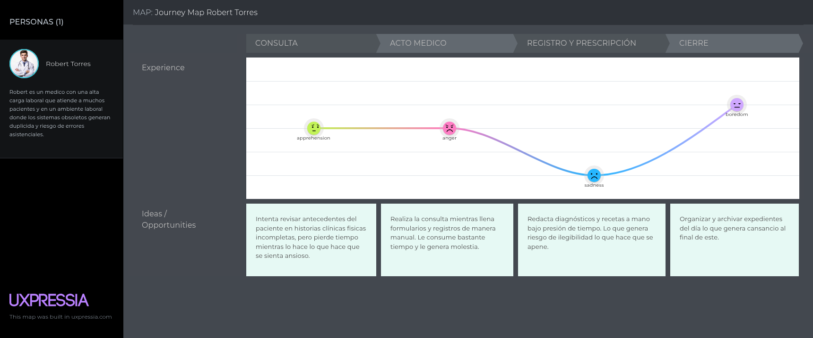

**Tercer Segmento Objetivo (Pacientes de todas las edades)**

*Figura 11 (User Journey Map 3)*
 

### 2.3.4. Empathy Mapping

**Primer Segmento Objetivo (Administradores de establecimientos de PNAS)**

*Figura 12 (Empathy Map 1)*
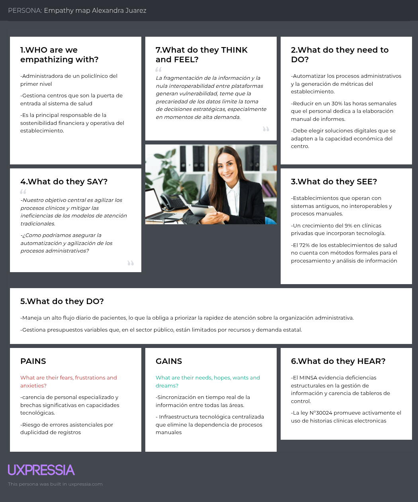   

**Segundo Segmento Objetivo (Doctores de establecimientos de PNAS)**

*Figura 13 (Empathy Map 2)*
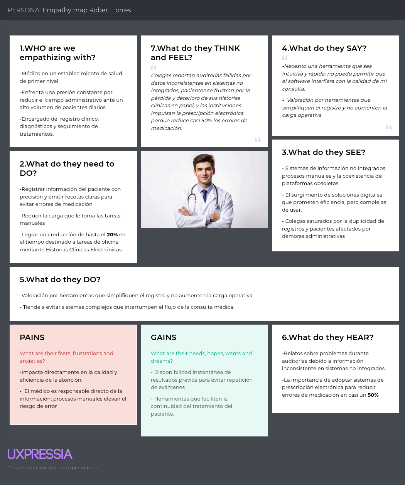

**Tercer Segmento Objetivo (Pacientes de todas las edades)**

*Figura 14 (Empathy Map 3)*
  

## 2.4. Big Picture EventStorming

Se utilizó la guía Step-by-Step Guide de Philippe Bourgau, proporcionada en la rúbrica del Final Problem Statement, para llevar a cabo el proceso de Big Picture Event Storming, siguiendo sus etapas:

- Open
- Explore
- Close

Miro Board Link: https://miro.com/app/board/uXjVGhdfT5g=/?share_link_id=948975680057

*Figura 15 (Big Picture EventStorming)*

## 2.5. Ubiquitous Language

**Organización y Estructura (Gestión de la Clínica)**

* **Tenant (Policlínico):** Establecimiento de salud de atención primaria que opera de manera independiente y centraliza sus procesos clínicos, administrativos y de farmacia en la plataforma..
* **Staff Member (Miembro del Personal):** Cualquier individuo que labora en el policlínico, incluyendo médicos, recepcionistas, farmacéuticos y administradores, cada uno con responsabilidades y accesos delimitados.
* **Role (Rol):** Nivel de autorización que define las acciones y la información clínica o financiera a la que un miembro del personal tiene acceso.

**Agendamiento y Logística (Scheduling)**

* **Appointment (Cita Médica):** Reserva de un bloque de tiempo específico que vincula a un paciente con un médico en un consultorio físico determinado, evitando cruces de horarios.
* **Schedule (Agenda / Horario):** Plantilla de bloques de tiempo que define la disponibilidad de un médico para atender pacientes en días y horas específicas.
* **Consulting Room (Consultorio):** Espacio físico dentro del policlínico destinado a la atención de pacientes, el cual no puede ser ocupado por dos médicos en el mismo bloque de tiempo.
* **No-show (Inasistencia):** Situación en la cual un paciente no se presenta a su cita médica programada y no notifica al policlínico con anticipación.

**Atención Clínica (Core Médico)**

* **Patient (Paciente):** Persona que solicita y recibe atención médica, de la cual se registran datos demográficos y antecedentes de salud.
* **Triage (Triaje):** Proceso previo a la consulta médica donde el personal de enfermería o técnico registra los signos vitales (presión, peso, temperatura) del paciente.
* **Medical Record (Historia Clínica):** Documento legal y central que recopila de manera cronológica los antecedentes, funciones vitales, evolución y diagnósticos de un paciente.
* **Consultation (Consulta Médica):** El encuentro directo entre el médico y el paciente, donde se evalúan síntomas y se registran observaciones específicas según la especialidad médica.
* **Diagnosis (Diagnóstico):** Identificación de la enfermedad o condición del paciente, determinada por el médico y basada preferentemente en catálogos internacionales de salud (como el CIE-10).
* **Prescription (Receta Médica):** Documento digital emitido por el médico que detalla los medicamentos, dosis y frecuencia del tratamiento indicado para el paciente.
* **Lab Order (Orden de Laboratorio):** Solicitud formal generada por el médico para que el paciente se realice exámenes complementarios (análisis de sangre, imágenes, etc.).

**Farmacia e Inventario**

* **Product (Producto / Medicamento):** Bien físico, ya sea un medicamento o insumo médico, que se ofrece en la botica del policlínico.
* **Inventory (Inventario):** El recuento exacto y en tiempo real del stock de productos disponibles en la farmacia del policlínico.
* **Dispensation (Dispensación):** El acto de despachar y entregar los medicamentos recetados al paciente, acción que reduce inmediatamente el stock del inventario.

**Facturación y Liquidaciones (Billing)**

* **Charge (Cobro):** La cuenta total exigida al paciente en el área de recepción por los servicios de consulta brindados o los medicamentos adquiridos. Todo cobro se realiza por el monto íntegro, sin admitir copagos.
* **Invoice (Comprobante de Pago):** Documento oficial y con validez fiscal (boleta o factura) que se emite a favor del paciente una vez recibido el pago.
* **Commission (Comisión):** Porcentaje del costo de la consulta o monto fijo previamente acordado que le corresponde al médico por la atención brindada.
* **Liquidation (Liquidación):** Cálculo consolidado (diario o mensual) que determina el monto total de dinero que el administrador del policlínico debe transferir a un médico, basado en las atenciones realizadas y sus respectivas comisiones.

# Capítulo III: Requirements Specification

## 3.1. User Stories

**Epics**

| Epic ID | Título | Descripción |
| --- | --- | --- |
| E1 | Portal del Paciente Accesible | **Como** paciente, **quiero** interactuar con una interfaz segmentada y accesible, **para** facilitar el uso de la plataforma sin importar mi edad o nivel tecnológico. |
| E2 | Atención Clínica Eficiente | **Como** médico, **quiero** utilizar un sistema ágil y robusto, **para** no retrasar mis atenciones clínicas debido a la lentitud o sobrecarga de la plataforma. |
| E3 | Gestión Administrativa Integrada | **Como** personal administrativo, **quiero** automatizar tareas repetitivas, **para** reducir mi carga de trabajo manual. |
| E4 | Experiencia Digital Confiable | **Como** usuario, **quiero** que la aplicación funcione de manera rápida, adaptativa, sencilla y accesible en cualquier dispositivo, **para** contar con una experiencia agradable. | 
| E5 | Landing Page Comercial | **Como** usuario, **quiero** acceder a una landing page informativa del software, **para** conocer más acerca de su propuesta y características. |

**User Stories**

| Story ID | Título | Descripción | Criterios de aceptación | Relacionado con Epic ID |
| --- | --- | --- | --- | --- |
| US001 | Registro de paciente | **Como** paciente nuevo, **quiero** crear mi cuenta con mis datos personales básicos, **para** acceder a mis servicios médicos desde un solo lugar. | **Scenario 1: Registro exitoso** **Given** que el paciente se encuentra en la pantalla de registro, **When** completa sus datos obligatorios correctamente y confirma la creación de cuenta, **Then** el sistema crea su perfil y muestra acceso a su panel principal.  **Scenario 2: Validación de campos incompletos** **Given** que el paciente está llenando el formulario de registro, **When** omite campos obligatorios o ingresa datos inválidos, **Then** el sistema muestra mensajes de validación y no permite finalizar el registro. | E1 |
| US002 | Inicio de sesión de paciente | **Como** paciente, **quiero** iniciar sesión de manera sencilla y segura, **para** consultar rápidamente mi información médica. | **Scenario 1: Acceso correcto** **Given** que el paciente ya tiene una cuenta activa, **When** ingresa sus credenciales válidas, **Then** el sistema le permite entrar a su panel personal.  **Scenario 2: Credenciales incorrectas** **Given** que el paciente intenta ingresar a la plataforma, **When** registra una contraseña o correo incorrecto, **Then** el sistema deniega el acceso y muestra una alerta de autenticación. | E1 |
| US003 | Reserva digital de citas | **Como** paciente, **quiero** reservar una cita en pocos pasos, **para** evitar llamadas o trámites presenciales innecesarios. | **Scenario 1: Reserva confirmada** **Given** que el paciente visualiza horarios disponibles, **When** selecciona especialidad, médico, fecha y confirma la cita, **Then** el sistema registra la reserva y muestra la confirmación correspondiente.  **Scenario 2: Horario no disponible** **Given** que el paciente intenta reservar un horario ocupado, **When** confirma la selección, **Then** el sistema informa la indisponibilidad y solicita elegir otro horario. | E1 |
| US004 | Reprogramación de citas | **Como** paciente, **quiero** reprogramar una cita desde mi panel, **para** adaptar mi atención a cambios en mi disponibilidad. | **Scenario 1: Reprogramación exitosa** **Given** que el paciente tiene una cita vigente, **When** selecciona un nuevo horario disponible y confirma el cambio, **Then** el sistema actualiza la cita y notifica la nueva programación.  **Scenario 2: Reprogramación fuera de plazo** **Given** que la cita ya no permite cambios por política del establecimiento, **When** el paciente intenta reprogramarla, **Then** el sistema bloquea la acción e informa la restricción aplicable. | E1 |
| US005 | Cancelación de citas | **Como** paciente, **quiero** cancelar una cita programada, **para** liberar el horario cuando ya no podré asistir. | **Scenario 1: Cancelación correcta** **Given** que el paciente tiene una cita futura activa, **When** selecciona la opción de cancelación y confirma la acción, **Then** el sistema anula la cita y libera el cupo en agenda.  **Scenario 2: Cancelación no permitida** **Given** que la cita se encuentra dentro del tiempo límite no cancelable, **When** el paciente intenta cancelarla, **Then** el sistema rechaza la operación e informa la política vigente. | E1 |
| US006 | Consulta de historial clínico | **Como** paciente, **quiero** visualizar mi historial clínico digital, **para** revisar diagnósticos, atenciones y continuidad de tratamiento sin depender de copias físicas. | **Scenario 1: Historial disponible** **Given** que el paciente ya cuenta con atenciones registradas, **When** accede al módulo de historial clínico, **Then** el sistema muestra sus consultas, diagnósticos y documentos asociados en orden cronológico.  **Scenario 2: Historial sin registros** **Given** que el paciente aún no tiene atenciones previas cargadas, **When** entra a su historial clínico, **Then** el sistema informa que todavía no existen registros disponibles. | E1 |
| US007 | Consulta de resultados y recetas | **Como** paciente, **quiero** ver mis resultados y recetas emitidas en línea, **para** evitar ir al establecimiento solo para recoger información. | **Scenario 1: Visualización de documentos** **Given** que existen resultados o recetas emitidas para el paciente, **When** ingresa al módulo de documentos clínicos, **Then** el sistema muestra los archivos y detalles asociados a cada atención.  **Scenario 2: Documento pendiente** **Given** que el resultado o receta aún no ha sido publicado por el médico, **When** el paciente lo consulta, **Then** el sistema indica que el documento sigue pendiente de disponibilidad. | E1 |
| US008 | Recordatorios de citas | **Como** paciente, **quiero** recibir recordatorios automáticos de mis citas, **para** reducir olvidos e inasistencias. | **Scenario 1: Recordatorio programado** **Given** que el paciente tiene una cita próxima confirmada, **When** se cumple el tiempo definido para el recordatorio, **Then** el sistema envía una notificación con fecha, hora y médico asignado.  **Scenario 2: Cita cancelada antes del recordatorio** **Given** que la cita fue cancelada o reprogramada previamente, **When** llega el momento del recordatorio original, **Then** el sistema no envía una notificación desactualizada. | E1 |
| US009 | Accesibilidad de interfaz | **Como** paciente adulto mayor o con baja familiaridad digital, **quiero** una interfaz clara y legible, **para** usar la plataforma sin confusión ni dependencia de terceros. | **Scenario 1: Navegación accesible** **Given** que el paciente accede desde un dispositivo personal, **When** navega por las funciones principales del portal, **Then** el sistema presenta botones visibles, textos legibles y rutas simples de uso.  **Scenario 2: Prevención de errores de navegación** **Given** que el paciente intenta salir o cambiar un proceso en curso, **When** ejecuta una acción crítica por error, **Then** el sistema solicita confirmación antes de perder información relevante. | E1 |
| US010 | Agenda médica diaria | **Como** médico, **quiero** visualizar mi agenda diaria organizada, **para** preparar mis consultas y administrar mejor mi jornada. | **Scenario 1: Agenda visible por día** **Given** que el médico tiene citas programadas, **When** accede a su agenda del día, **Then** el sistema muestra pacientes, horarios y estado de cada cita.  **Scenario 2: Día sin citas** **Given** que el médico no tiene atenciones programadas para una fecha, **When** consulta su agenda, **Then** el sistema informa que no existen citas registradas para ese día. | E2 |
| US011 | Consulta rápida del historial del paciente | **Como** médico, **quiero** acceder rápidamente al historial clínico del paciente antes y durante la consulta, **para** tomar decisiones con información completa. | **Scenario 1: Historial disponible durante la consulta** **Given** que el médico abre la ficha de un paciente con antecedentes registrados, **When** consulta su historial desde la atención activa, **Then** el sistema muestra antecedentes, diagnósticos previos y tratamientos relevantes.  **Scenario 2: Paciente sin antecedentes previos** **Given** que el paciente no tiene registros clínicos anteriores, **When** el médico revisa su historial, **Then** el sistema indica que se trata de un primer registro clínico. | E2 |
| US012 | Registro de anamnesis y examen físico | **Como** médico, **quiero** registrar anamnesis y examen físico en una sola atención, **para** documentar la consulta de forma ordenada y completa. | **Scenario 1: Registro clínico completo** **Given** que el médico se encuentra atendiendo a un paciente, **When** completa los campos clínicos requeridos y guarda la evolución, **Then** el sistema almacena la información en la historia clínica del paciente.  **Scenario 2: Información obligatoria faltante** **Given** que el médico intenta cerrar la atención sin datos mínimos requeridos, **When** confirma el guardado, **Then** el sistema señala los campos pendientes antes de finalizar. | E2 |
| US013 | Emisión de diagnóstico | **Como** médico, **quiero** registrar el diagnóstico de la consulta, **para** dejar constancia clínica y orientar el tratamiento del paciente. | **Scenario 1: Diagnóstico guardado** **Given** que el médico culminó la evaluación clínica, **When** selecciona o escribe el diagnóstico y guarda la atención, **Then** el sistema vincula el diagnóstico al episodio clínico correspondiente.  **Scenario 2: Intento de cierre sin diagnóstico** **Given** que la consulta requiere diagnóstico obligatorio, **When** el médico intenta cerrar la atención sin registrarlo, **Then** el sistema solicita completar esa información antes de finalizar. | E2 |
| US014 | Emisión de recetas digitales | **Como** médico, **quiero** emitir recetas digitales legibles, **para** reducir errores y facilitar la dispensación de medicamentos. | **Scenario 1: Receta emitida** **Given** que el médico ya definió el tratamiento del paciente, **When** registra medicamentos, dosis e indicaciones y confirma la receta, **Then** el sistema genera una receta digital asociada a la atención.  **Scenario 2: Medicación incompleta** **Given** que la receta tiene campos esenciales vacíos, **When** el médico intenta emitirla, **Then** el sistema marca la inconsistencia y evita la publicación hasta completar los datos. | E2 |
| US015 | Solicitud de exámenes | **Como** médico, **quiero** generar órdenes de exámenes desde la misma consulta, **para** agilizar el plan diagnóstico del paciente. | **Scenario 1: Orden generada** **Given** que el médico requiere estudios complementarios, **When** selecciona los exámenes y confirma la orden, **Then** el sistema registra la solicitud y la deja disponible para seguimiento.  **Scenario 2: Orden sin justificación clínica mínima** **Given** que el establecimiento exige observación asociada a la orden, **When** el médico intenta emitirla sin ese dato, **Then** el sistema solicita completar la información requerida. | E2 |
| US016 | Repetición rápida de recetas frecuentes | **Como** médico, **quiero** reutilizar recetas frecuentes o previas con un clic, **para** reducir tiempo administrativo en controles repetitivos. | **Scenario 1: Reutilización de receta previa** **Given** que el paciente tiene una receta anterior apta para repetición, **When** el médico selecciona la opción de reutilizarla y la confirma, **Then** el sistema carga los medicamentos para su revisión y emisión final.  **Scenario 2: Receta previa no apta** **Given** que la receta anterior contiene medicamentos restringidos o desactualizados, **When** el médico intenta reutilizarla, **Then** el sistema impide la emisión automática y solicita revisión manual. | E2 |
| US017 | Resumen automático del historial | **Como** médico, **quiero** ver un resumen automático del historial del paciente, **para** comprender rápidamente sus antecedentes dentro del tiempo limitado de consulta. | **Scenario 1: Resumen generado** **Given** que el paciente tiene múltiples atenciones previas, **When** el médico abre la ficha resumida del historial, **Then** el sistema presenta un consolidado breve con diagnósticos, tratamientos y alertas relevantes.  **Scenario 2: Historial insuficiente para resumen** **Given** que el paciente tiene muy pocos datos previos registrados, **When** el médico solicita el resumen, **Then** el sistema muestra solo la información disponible sin inventar contenido faltante. | E2 |
| US018 | Registro asistido por voz | **Como** médico, **quiero** dictar parte del registro clínico por voz, **para** disminuir el tiempo de digitación durante la consulta. | **Scenario 1: Dictado exitoso** **Given** que el médico habilita el modo de voz en la consulta, **When** dicta información clínica válida, **Then** el sistema transcribe el contenido en el campo correspondiente para su revisión.  **Scenario 2: Dictado no reconocido** **Given** que existe ruido o baja calidad de audio durante el dictado, **When** la transcripción no puede interpretarse adecuadamente, **Then** el sistema notifica el error y permite reintentar o editar manualmente. | E2 |
| US019 | Registro de triaje previo | **Como** médico, **quiero** revisar datos de triaje antes de la consulta, **para** priorizar mejor la atención y ahorrar tiempo clínico. | **Scenario 1: Triaje disponible** **Given** que el paciente pasó por un proceso de triaje previo, **When** el médico abre la atención correspondiente, **Then** el sistema muestra signos vitales y observaciones iniciales asociadas.  **Scenario 2: Atención sin triaje previo** **Given** que no existe registro de triaje para esa cita, **When** el médico revisa la ficha del paciente, **Then** el sistema indica claramente que no hay datos previos cargados. | E2 |
| US020 | Cierre de atención sin pérdida de datos | **Como** médico, **quiero** guardar y cerrar una consulta de manera confiable, **para** evitar pérdida de información por lentitud o fallas de conectividad. | **Scenario 1: Guardado exitoso** **Given** que el médico completó la atención clínica, **When** guarda y cierra la consulta, **Then** el sistema confirma que la información fue registrada correctamente.  **Scenario 2: Fallo temporal de conexión** **Given** que ocurre una interrupción momentánea al guardar la consulta, **When** el sistema detecta el problema, **Then** preserva la información capturada e informa al médico el estado del guardado. | E2 |
| US021 | Registro único de pacientes | **Como** personal administrativo, **quiero** registrar pacientes en una base unificada, **para** evitar duplicidad de datos entre admisión y atención médica. | **Scenario 1: Nuevo paciente registrado** **Given** que el paciente no existe en la base de datos institucional, **When** el administrativo registra su información obligatoria, **Then** el sistema crea una ficha única para futuras atenciones.  **Scenario 2: Detección de posible duplicado** **Given** que los datos ingresados coinciden con un paciente existente, **When** el administrativo intenta crear un nuevo registro, **Then** el sistema alerta la posible duplicidad antes de guardar. | E3 |
| US022 | Programación de citas desde admisión | **Como** personal administrativo, **quiero** programar citas desde admisión, **para** atender solicitudes presenciales o telefónicas con mayor rapidez. | **Scenario 1: Cita registrada por admisión** **Given** que el administrativo recibe una solicitud de reserva, **When** selecciona paciente, especialidad y horario disponible, **Then** el sistema agenda la cita y la deja visible para el médico y el paciente.  **Scenario 2: Cruce de horarios** **Given** que el horario elegido ya fue ocupado, **When** el administrativo intenta confirmar la reserva, **Then** el sistema rechaza la programación y muestra alternativas disponibles. | E3 |
| US023 | Confirmación de asistencia | **Como** personal administrativo, **quiero** confirmar la asistencia del paciente al llegar, **para** actualizar el flujo de atención en tiempo real. | **Scenario 1: Paciente marcado como presente** **Given** que el paciente llega para una cita programada, **When** admisión registra su check-in, **Then** el sistema actualiza el estado de la cita a presente o en espera.  **Scenario 2: Paciente sin cita vigente** **Given** que el paciente no tiene una cita programada para ese momento, **When** el administrativo intenta confirmar su llegada, **Then** el sistema informa que no existe una atención agendada activa. | E3 |
| US024 | Integración entre áreas | **Como** personal administrativo, **quiero** que admisión, consultorio, laboratorio y farmacia compartan la misma información, **para** eliminar reprocesos y cortes en el flujo asistencial. | **Scenario 1: Información compartida correctamente** **Given** que una atención genera órdenes y documentos asociados, **When** otra área consulta la ficha del paciente, **Then** el sistema muestra la información actualizada desde una fuente común.  **Scenario 2: Área sin datos asociados** **Given** que todavía no existe información generada por otra unidad, **When** el usuario administrativo revisa el caso, **Then** el sistema indica que no hay datos disponibles en esa etapa del proceso. | E3 |
| US025 | Emisión de facturación electrónica | **Como** personal administrativo, **quiero** generar comprobantes y facturación electrónica desde la atención registrada, **para** reducir errores y pasos manuales en caja. | **Scenario 1: Comprobante emitido** **Given** que la atención del paciente ya fue registrada y valorizada, **When** el administrativo procesa el pago y emite el comprobante, **Then** el sistema genera la facturación electrónica correspondiente.  **Scenario 2: Datos tributarios incompletos** **Given** que el tipo de comprobante requiere información adicional del paciente o empresa, **When** el administrativo intenta emitirlo sin esos datos, **Then** el sistema solicita completar la información antes de facturar. | E3 |
| US026 | Control de pagos pendientes | **Como** personal administrativo, **quiero** visualizar atenciones con pagos pendientes, **para** dar seguimiento oportuno y mantener el orden financiero del establecimiento. | **Scenario 1: Listado de pendientes** **Given** que existen atenciones no canceladas total o parcialmente, **When** el administrativo consulta el módulo de pagos pendientes, **Then** el sistema muestra el detalle actualizado de montos, fechas y estados.  **Scenario 2: Sin deudas registradas** **Given** que todas las atenciones del periodo están pagadas, **When** el administrativo revisa el módulo, **Then** el sistema informa que no existen pendientes por cobrar. | E3 |
| US027 | Dashboard operativo | **Como** personal administrativo, **quiero** ver métricas de citas, atenciones e ingresos en un dashboard, **para** tomar decisiones con información consolidada. | **Scenario 1: Indicadores disponibles** **Given** que existen datos cargados en el periodo consultado, **When** el administrativo ingresa al dashboard y aplica filtros, **Then** el sistema muestra indicadores resumidos y actualizados según el criterio seleccionado.  **Scenario 2: Periodo sin datos** **Given** que el rango consultado no tiene actividad registrada, **When** el administrativo visualiza el dashboard, **Then** el sistema muestra el estado vacío sin errores ni cifras inconsistentes. | E3 |
| US028 | Reportes automáticos de gestión | **Como** personal administrativo, **quiero** generar reportes automáticos de actividad clínica y operativa, **para** reducir horas dedicadas a informes manuales. | **Scenario 1: Reporte generado** **Given** que el sistema cuenta con datos operativos del periodo, **When** el administrativo solicita un reporte con filtros definidos, **Then** el sistema genera el documento con el resumen correspondiente.  **Scenario 2: Parámetros inválidos** **Given** que el usuario selecciona un rango o filtro inconsistente, **When** intenta generar el reporte, **Then** el sistema solicita corregir los parámetros antes de procesarlo. | E3 |
| US029 | Gestión de farmacia | **Como** personal administrativo o de farmacia, **quiero** consultar las recetas emitidas y su estado de dispensación, **para** coordinar la entrega de medicamentos de forma ordenada. | **Scenario 1: Receta lista para dispensación** **Given** que existe una receta digital válida para el paciente, **When** farmacia consulta la orden correspondiente, **Then** el sistema muestra el detalle del tratamiento y permite registrar su entrega.  **Scenario 2: Receta ya dispensada o inválida** **Given** que la receta ya fue atendida o no se encuentra vigente, **When** farmacia intenta procesarla nuevamente, **Then** el sistema bloquea la acción e informa el estado real del documento. | E3 |
| US030 | Integraciones externas mediante API | **Como** personal administrativo o directivo, **quiero** que el sistema pueda integrarse con otras plataformas mediante API, **para** no aislar la operación del establecimiento. | **Scenario 1: Integración habilitada** **Given** que existe una integración autorizada con un sistema externo, **When** se ejecuta el intercambio de información configurado, **Then** el sistema sincroniza los datos permitidos según la integración definida.  **Scenario 2: Integración con error o credenciales inválidas** **Given** que la conexión externa presenta fallas de autenticación o configuración, **When** se intenta sincronizar información, **Then** el sistema registra el error y evita transferencias incompletas. | E3 |
| US031 | Diseño responsive | **Como** usuario, **quiero** utilizar la plataforma desde celular, tablet o computadora, **para** acceder al sistema según el contexto de uso. | **Scenario 1: Visualización adaptable** **Given** que el usuario accede desde distintos tamaños de pantalla, **When** navega por los módulos principales, **Then** el sistema adapta su interfaz sin perder funcionalidad ni legibilidad.  **Scenario 2: Cambio de orientación o tamaño** **Given** que el usuario cambia la orientación del dispositivo o el tamaño de la ventana, **When** continúa usando la plataforma, **Then** el sistema reajusta la distribución sin romper la navegación. | E4 |
| US032 | Tiempo de respuesta ágil | **Como** usuario, **quiero** que las acciones principales respondan con rapidez, **para** no perder tiempo durante procesos críticos de atención. | **Scenario 1: Consulta fluida** **Given** que el usuario ejecuta una acción habitual como abrir agenda o historial, **When** el sistema procesa la solicitud, **Then** la información se muestra de forma ágil y comprensible para el usuario.  **Scenario 2: Alta carga del sistema** **Given** que existe una mayor demanda de usuarios simultáneos, **When** se consulta una función crítica, **Then** el sistema mantiene operatividad y comunica cualquier demora de forma clara. | E4 |
| US033 | Recuperación de contraseña | **Como** usuario, **quiero** recuperar mi contraseña de forma segura, **para** restablecer el acceso a mi cuenta sin soporte manual innecesario. | **Scenario 1: Recuperación exitosa** **Given** que el usuario olvidó su contraseña pero recuerda su cuenta registrada, **When** solicita el restablecimiento y valida el proceso, **Then** el sistema le permite definir una nueva contraseña segura.  **Scenario 2: Cuenta no reconocida** **Given** que el correo o identificador ingresado no existe en la plataforma, **When** se intenta iniciar la recuperación, **Then** el sistema informa que no pudo validar la solicitud. | E4 |
| US034 | Gestión de roles y permisos | **Como** usuario autorizado, **quiero** que cada rol vea solo las funciones que le corresponden, **para** proteger información sensible y evitar errores operativos. | **Scenario 1: Acceso según rol** **Given** que un usuario inicia sesión con un rol válido, **When** entra a la plataforma, **Then** el sistema habilita únicamente los módulos permitidos para ese perfil.  **Scenario 2: Intento de acceso no autorizado** **Given** que un usuario intenta abrir una sección restringida, **When** no cuenta con permisos suficientes, **Then** el sistema bloquea el acceso y registra el intento. | E4 |
| US035 | Protección de datos clínicos | **Como** usuario, **quiero** que la información médica se maneje de forma segura, **para** confiar en que mis datos sensibles están protegidos. | **Scenario 1: Acceso legítimo a datos** **Given** que un usuario autorizado consulta información clínica permitida, **When** accede a la ficha del paciente dentro de su rol, **Then** el sistema muestra los datos sin comprometer controles de seguridad.  **Scenario 2: Acceso indebido o sesión no válida** **Given** que existe una sesión vencida o intento de acceso no autorizado, **When** se intenta consultar datos sensibles, **Then** el sistema deniega la visualización y protege la información clínica. | E4 |
| US036 | Persistencia ante fallos de conexión | **Como** usuario, **quiero** que la plataforma preserve la información ingresada ante fallos temporales, **para** no repetir trabajo ni perder datos importantes. | **Scenario 1: Reconexión exitosa** **Given** que el usuario estaba completando un proceso y ocurre una interrupción breve, **When** la conexión se restablece, **Then** el sistema conserva o recupera la información necesaria para continuar.  **Scenario 2: Interrupción prolongada** **Given** que la conexión no puede reanudarse en el momento, **When** el sistema detecta la falla sostenida, **Then** informa el problema de forma clara y evita pérdida silenciosa de datos. | E4 |
| US037 | Navegación simple | **Como** usuario, **quiero** encontrar las funciones principales con pocos pasos, **para** reducir la curva de aprendizaje y el tiempo de uso. | **Scenario 1: Ruta corta a funciones clave** **Given** que el usuario necesita acceder a una función principal del sistema, **When** navega desde el menú principal, **Then** puede llegar a dicha función mediante una ruta clara y directa.  **Scenario 2: Usuario nuevo en la plataforma** **Given** que el usuario usa el sistema por primera vez, **When** explora las opciones visibles, **Then** el sistema presenta etiquetas comprensibles y organización coherente. | E4 |
| US038 | Auditoría de acciones | **Como** establecimiento de salud, **quiero** registrar acciones críticas realizadas en la plataforma, **para** contar con trazabilidad ante revisiones o auditorías. | **Scenario 1: Acción crítica registrada** **Given** que un usuario crea, modifica o elimina información sensible permitida, **When** confirma la operación, **Then** el sistema registra la acción con usuario, fecha y contexto correspondiente.  **Scenario 2: Consulta de trazabilidad** **Given** que un supervisor autorizado necesita revisar un evento del sistema, **When** accede al historial de auditoría, **Then** puede visualizar el registro de acciones disponibles según su permiso. | E4 |
| US039 | Visualización de propuesta de valor | **Como** visitante, **quiero** entender rápidamente qué problema resuelve Vitalia, **para** evaluar si el software se ajusta a mi establecimiento de salud. | **Scenario 1: Información principal visible** **Given** que un visitante entra a la landing page por primera vez, **When** revisa la sección inicial del sitio, **Then** encuentra una propuesta de valor clara enfocada en la gestión clínica integral.  **Scenario 2: Navegación rápida del contenido** **Given** que el visitante desea identificar la solución sin leer todo el sitio, **When** recorre los bloques principales, **Then** puede reconocer de forma resumida beneficios y público objetivo. | E5 |
| US040 | Solicitud de contacto comercial | **Como** visitante interesado, **quiero** dejar mis datos en un formulario de contacto, **para** solicitar una demostración o mayor información del producto. | **Scenario 1: Formulario enviado** **Given** que el visitante completa sus datos de contacto y mensaje, **When** envía el formulario correctamente, **Then** el sistema registra la solicitud y muestra una confirmación de recepción.  **Scenario 2: Formulario incompleto** **Given** que el visitante omite datos obligatorios del formulario, **When** intenta enviarlo, **Then** el sistema muestra validaciones y no procesa la solicitud. | E5 |
| US041 | Sección de funcionalidades clave | **Como** visitante, **quiero** ver las funcionalidades principales del sistema en la landing page, **para** comprender el alcance de la solución antes de solicitar una demo. | **Scenario 1: Funcionalidades visibles** **Given** que el visitante explora la página informativa, **When** llega a la sección de funcionalidades, **Then** el sistema presenta módulos como citas, historia clínica, farmacia y facturación de forma clara.  **Scenario 2: Contenido resumido y comprensible** **Given** que el visitante no conoce el producto, **When** revisa esa sección, **Then** comprende el valor de cada funcionalidad sin necesidad de soporte adicional. | E5 |
| US042 | Presentación por segmentos objetivo | **Como** visitante, **quiero** identificar cómo Vitalia ayuda a pacientes, médicos y administrativos, **para** reconocer el beneficio para cada actor del establecimiento. | **Scenario 1: Beneficios por rol** **Given** que el visitante revisa la landing page, **When** accede a la sección de segmentos o beneficios por usuario, **Then** encuentra propuestas diferenciadas para pacientes, médicos y personal administrativo.  **Scenario 2: Comparación rápida por necesidad** **Given** que el visitante solo está interesado en un tipo de usuario, **When** revisa la sección correspondiente, **Then** identifica rápidamente las ventajas relevantes para ese perfil. | E5 |
| US043 | Evidencia de diferenciación competitiva | **Como** visitante institucional, **quiero** entender qué diferencia a Vitalia de otras alternativas, **para** sustentar una posible decisión de compra. | **Scenario 1: Diferenciadores visibles** **Given** que el visitante compara soluciones del mercado, **When** revisa la landing page de Vitalia, **Then** encuentra mensajes claros sobre integración clínica, accesibilidad y adaptación al contexto peruano.  **Scenario 2: Información insuficiente para decidir** **Given** que el visitante busca argumentos concretos de valor, **When** entra a la sección comparativa o de beneficios, **Then** el sistema le ofrece información suficiente para continuar hacia contacto comercial. | E5 |
| US044 | Llamados a la acción visibles | **Como** visitante, **quiero** encontrar botones de acción claros en la landing page, **para** solicitar información sin perder tiempo buscando cómo continuar. | **Scenario 1: CTA disponible en puntos clave** **Given** que el visitante recorre la landing page, **When** llega a secciones principales del sitio, **Then** visualiza llamados a la acción para contacto o demostración.  **Scenario 2: Navegación sin fricción hacia conversión** **Given** que el visitante decide solicitar más información, **When** selecciona un botón de acción visible, **Then** el sistema lo dirige directamente al formulario o canal de contacto correspondiente. | E5 |
| US045 | Cambio de idioma en landing page | **Como** visitante, **quiero** cambiar el idioma de la landing page, **para** comprender la propuesta de Vitalia en el idioma que me resulte más cómodo. | **Scenario 1: Cambio de idioma exitoso** **Given** que el visitante se encuentra en la landing page, **When** selecciona un idioma disponible desde el selector de idioma, **Then** el sistema actualiza los textos principales de la página al idioma elegido.  **Scenario 2: Preferencia de idioma conservada** **Given** que el visitante ya seleccionó un idioma previamente, **When** vuelve a ingresar a la landing page desde el mismo navegador, **Then** el sistema muestra la página en el idioma seleccionado anteriormente. | E5 |

## 3.2. Impact Mapping

**Primer Segmento Objetivo (Administradores de establecimientos de PNAS)**

*Figura 16 (Impact Map 1)*  
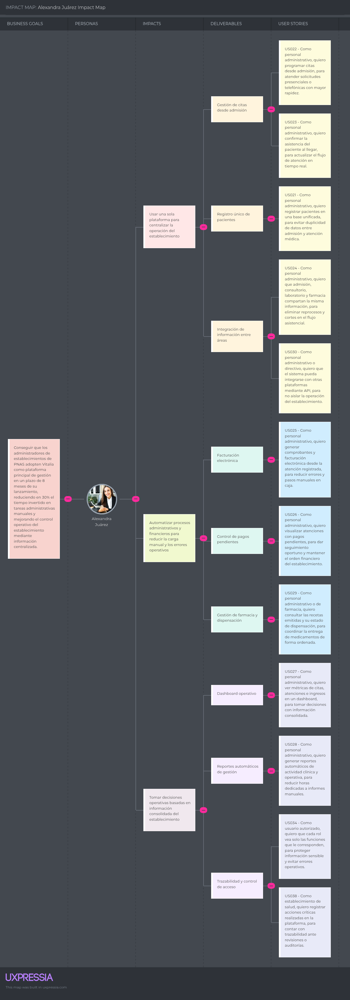

**Segundo Segmento Objetivo (Doctores de establecimientos de PNAS)**

*Figura 17 (Impact Map 2)*
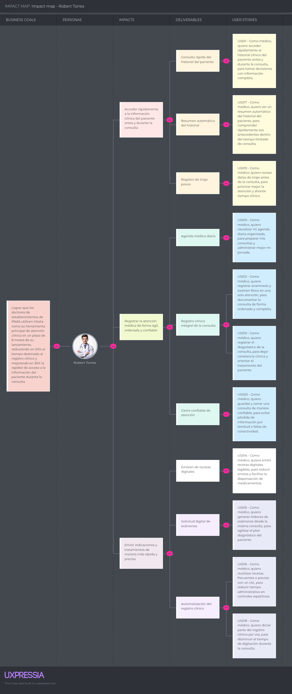

**Tercer Segmento Objetivo (Pacientes de todas las edades)**

*Figura 18 (Impact Map 3)*
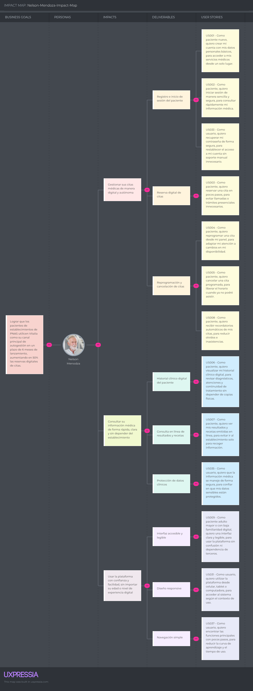

## 3.3. Product Backlog

Trello Link: https://trello.com/b/dHKPrPGE/vitalia-board

| \# Orden | User Story ID | Título | Descripción | Story Points |
| --- | --- | --- | --- | --- |
| 1 | US039 | Visualización de propuesta de valor | **Como** visitante, **quiero** entender rápidamente qué problema resuelve Vitalia, **para** evaluar si el software se ajusta a mi establecimiento de salud. | 2 |
| 2 | US041 | Sección de funcionalidades clave | **Como** visitante, **quiero** ver las funcionalidades principales del sistema en la landing page, **para** comprender el alcance de la solución antes de solicitar una demo. | 2 |
| 3 | US042 | Presentación por segmentos objetivo | **Como** visitante, **quiero** identificar cómo Vitalia ayuda a pacientes, médicos y administrativos, **para** reconocer el beneficio para cada actor del establecimiento. | 3 |
| 4 | US043 | Evidencia de diferenciación competitiva | **Como** visitante institucional, **quiero** entender qué diferencia a Vitalia de otras alternativas, **para** sustentar una posible decisión de compra. | 2 |
| 5 | US044 | Llamados a la acción visibles | **Como** visitante, **quiero** encontrar botones de acción claros en la landing page, **para** solicitar información sin perder tiempo buscando cómo continuar. | 2 |
| 6 | US040 | Solicitud de contacto comercial | **Como** visitante interesado, **quiero** dejar mis datos en un formulario de contacto, **para** solicitar una demostración o mayor información del producto. | 3 |
| 7 | US045 | Cambio de idioma en landing page | **Como** visitante, **quiero** cambiar el idioma de la landing page, **para** comprender la propuesta de Vitalia en el idioma que me resulte más cómodo. | 2 |
| 8 | US031 | Diseño responsive | **Como** usuario, **quiero** utilizar la plataforma desde celular, tablet o computadora, **para** acceder al sistema según el contexto de uso. | 5 |
| 9 | US037 | Navegación simple | **Como** usuario, **quiero** encontrar las funciones principales con pocos pasos, **para** reducir la curva de aprendizaje y el tiempo de uso. | 3 |
| 10 | US032 | Tiempo de respuesta ágil | **Como** usuario, **quiero** que las acciones principales respondan con rapidez, **para** no perder tiempo durante procesos críticos de atención. | 5 |
| 11 | US035 | Protección de datos clínicos | **Como** usuario, **quiero** que la información médica se maneje de forma segura, **para** confiar en que mis datos sensibles están protegidos. | 8 |
| 12 | US034 | Gestión de roles y permisos | **Como** usuario autorizado, **quiero** que cada rol vea solo las funciones que le corresponden, **para** proteger información sensible y evitar errores operativos. | 8 |
| 13 | US001 | Registro de paciente | **Como** paciente nuevo, **quiero** crear mi cuenta con mis datos personales básicos, **para** acceder a mis servicios médicos desde un solo lugar. | 5 |
| 14 | US002 | Inicio de sesión de paciente | **Como** paciente, **quiero** iniciar sesión de manera sencilla y segura, **para** consultar rápidamente mi información médica. | 3 |
| 15 | US033 | Recuperación de contraseña | **Como** usuario, **quiero** recuperar mi contraseña de forma segura, **para** restablecer el acceso a mi cuenta sin soporte manual innecesario. | 3 |
| 16 | US009 | Accesibilidad de interfaz | **Como** paciente adulto mayor o con baja familiaridad digital, **quiero** una interfaz clara y legible, **para** usar la plataforma sin confusión ni dependencia de terceros. | 5 |
| 17 | US003 | Reserva digital de citas | **Como** paciente, **quiero** reservar una cita en pocos pasos, **para** evitar llamadas o trámites presenciales innecesarios. | 5 |
| 18 | US022 | Programación de citas desde admisión | **Como** personal administrativo, **quiero** programar citas desde admisión, **para** atender solicitudes presenciales o telefónicas con mayor rapidez. | 5 |
| 19 | US010 | Agenda médica diaria | **Como** médico, **quiero** visualizar mi agenda diaria organizada, **para** preparar mis consultas y administrar mejor mi jornada. | 3 |
| 20 | US023 | Confirmación de asistencia | **Como** personal administrativo, **quiero** confirmar la asistencia del paciente al llegar, **para** actualizar el flujo de atención en tiempo real. | 3 |
| 21 | US021 | Registro único de pacientes | **Como** personal administrativo, **quiero** registrar pacientes en una base unificada, **para** evitar duplicidad de datos entre admisión y atención médica. | 5 |
| 22 | US024 | Integración entre áreas | **Como** personal administrativo, **quiero** que admisión, consultorio, laboratorio y farmacia compartan la misma información, **para** eliminar reprocesos y cortes en el flujo asistencial. | 8 |
| 23 | US011 | Consulta rápida del historial del paciente | **Como** médico, **quiero** acceder rápidamente al historial clínico del paciente antes y durante la consulta, **para** tomar decisiones con información completa. | 5 |
| 24 | US019 | Registro de triaje previo | **Como** médico, **quiero** revisar datos de triaje antes de la consulta, **para** priorizar mejor la atención y ahorrar tiempo clínico. | 3 |
| 25 | US012 | Registro de anamnesis y examen físico | **Como** médico, **quiero** registrar anamnesis y examen físico en una sola atención, **para** documentar la consulta de forma ordenada y completa. | 5 |
| 26 | US013 | Emisión de diagnóstico | **Como** médico, **quiero** registrar el diagnóstico de la consulta, **para** dejar constancia clínica y orientar el tratamiento del paciente. | 3 |
| 27 | US014 | Emisión de recetas digitales | **Como** médico, **quiero** emitir recetas digitales legibles, **para** reducir errores y facilitar la dispensación de medicamentos. | 5 |
| 28 | US015 | Solicitud de exámenes | **Como** médico, **quiero** generar órdenes de exámenes desde la misma consulta, **para** agilizar el plan diagnóstico del paciente. | 5 |
| 29 | US020 | Cierre de atención sin pérdida de datos | **Como** médico, **quiero** guardar y cerrar una consulta de manera confiable, **para** evitar pérdida de información por lentitud o fallas de conectividad. | 5 |
| 30 | US006 | Consulta de historial clínico | **Como** paciente, **quiero** visualizar mi historial clínico digital, **para** revisar diagnósticos, atenciones y continuidad de tratamiento sin depender de copias físicas. | 5 |
| 31 | US007 | Consulta de resultados y recetas | **Como** paciente, **quiero** ver mis resultados y recetas emitidas en línea, **para** evitar ir al establecimiento solo para recoger información. | 5 |
| 32 | US029 | Gestión de farmacia | **Como** personal administrativo o de farmacia, **quiero** consultar las recetas emitidas y su estado de dispensación, **para** coordinar la entrega de medicamentos de forma ordenada. | 5 |
| 33 | US025 | Emisión de facturación electrónica | **Como** personal administrativo, **quiero** generar comprobantes y facturación electrónica desde la atención registrada, **para** reducir errores y pasos manuales en caja. | 8 |
| 34 | US005 | Cancelación de citas | **Como** paciente, **quiero** cancelar una cita programada, **para** liberar el horario cuando ya no podré asistir. | 3 |
| 35 | US004 | Reprogramación de citas | **Como** paciente, **quiero** reprogramar una cita desde mi panel, **para** adaptar mi atención a cambios en mi disponibilidad. | 5 |
| 36 | US008 | Recordatorios de citas | **Como** paciente, **quiero** recibir recordatorios automáticos de mis citas, **para** reducir olvidos e inasistencias. | 5 |
| 37 | US026 | Control de pagos pendientes | **Como** personal administrativo, **quiero** visualizar atenciones con pagos pendientes, **para** dar seguimiento oportuno y mantener el orden financiero del establecimiento. | 3 |
| 38 | US027 | Dashboard operativo | **Como** personal administrativo, **quiero** ver métricas de citas, atenciones e ingresos en un dashboard, **para** tomar decisiones con información consolidada. | 5 |
| 39 | US028 | Reportes automáticos de gestión | **Como** personal administrativo, **quiero** generar reportes automáticos de actividad clínica y operativa, **para** reducir horas dedicadas a informes manuales. | 5 |
| 40 | US016 | Repetición rápida de recetas frecuentes | **Como** médico, **quiero** reutilizar recetas frecuentes o previas con un clic, **para** reducir tiempo administrativo en controles repetitivos. | 5 |
| 41 | US017 | Resumen automático del historial | **Como** médico, **quiero** ver un resumen automático del historial del paciente, **para** comprender rápidamente sus antecedentes dentro del tiempo limitado de consulta. | 8 |
| 42 | US018 | Registro asistido por voz | **Como** médico, **quiero** dictar parte del registro clínico por voz, **para** disminuir el tiempo de digitación durante la consulta. | 8 |
| 43 | US036 | Persistencia ante fallos de conexión | **Como** usuario, **quiero** que la plataforma preserve la información ingresada ante fallos temporales, **para** no repetir trabajo ni perder datos importantes. | 8 |
| 44 | US038 | Auditoría de acciones | **Como** establecimiento de salud, **quiero** registrar acciones críticas realizadas en la plataforma, **para** contar con trazabilidad ante revisiones o auditorías. | 5 |
| 45 | US030 | Integraciones externas mediante API | **Como** personal administrativo o directivo, **quiero** que el sistema pueda integrarse con otras plataformas mediante API, **para** no aislar la operación del establecimiento. | 8 |

# Capítulo IV: Product Design

## 4.1. Style Guidelines

### 4.1.1. General Style Guidelines

**Principios de diseño**

Vitalia es un SaaS integral diseñado para establecimientos de primer nivel de atención de salud. Su objetivo es centralizar la historia médica electrónica, citas y facturación, optimizando la gestión clínica. Por ello, nuestra estrella polar creativa es el "Santuario Clínico" (The Clinical Sanctuary).

Nos alejamos de las cuadrículas rígidas y estériles del software médico tradicional para adoptar una experiencia editorial de alta gama. El entorno debe sentirse autoritario pero calmado, sofisticado pero accesible.

- Profundidad Atmosférica: Utilizamos bases oscuras ("Pure Dark") superpuestas con superficies translúcidas. La interfaz debe sentirse como un instrumento físico premium.
- Claridad sobre el ruido: Rechazamos el aspecto de "plantilla" utilizando asimetría intencional, espacios en blanco generosos y una escala tipográfica de alto contraste que prioriza la legibilidad de los datos clínicos sin sacrificar la elegancia.

**Referencia Base y Adaptaciones**

El ecosistema visual toma como punto de partida **Material Design 3 (MD3)**, aprovechando sus paletas tonales para estructurar las elevaciones. Sin embargo, se han establecido reglas estrictas que modifican el sistema para adaptarlo a la identidad de Vitalia:

- Regla "No-Line": Queda estrictamente prohibido el uso de bordes sólidos de 1px para delimitar secciones o contenedores. Las fronteras estructurales se definen únicamente mediante cambios en el color de fondo (tonos de superficie).
- Sombras Ambientales (Ambient Shadows): Se evitan las sombras estándar. Las sombras se reservan para elementos flotantes y deben ser extremadamente difusas (ej. 0px 24px 48px rgba(0, 0, 0, 0.4) con un tinte sutil), imitando la luz ambiental natural.
- Efectos de Cristal (Glassmorphism): Los elementos flotantes o elevados utilizan fondos semitransparentes con desenfoque de fondo (backdrop-blur) para elevar la experiencia técnica.

**Paleta de Colores**

La paleta se rige por una filosofía "Pure Dark", reduciendo la fatiga visual del personal médico y permitiendo que la información crítica resalte a través de acentos luminosos.

- Primary (#20999E): Un cian médico luminoso y vibrante. Se reserva para acciones de alta prioridad, indicadores de estado activo (como en el menú lateral) y visualización de datos críticos.
- Secondary (#1A1F1F): Un azul oscuro como color de apoyo para elementos de la interfaz de usuario menos prominentes, chips y acciones secundarias.
- Tertiary (#C77646): Un tono albaricoque cálido, empleado para alertas de prioridad, notificaciones pendientes y acciones secundarias (ej. botón Logout), equilibrando los tonos fríos.
- Neutral Base (#121212): El lienzo principal del ecosistema. Refleja la profundidad de la plataforma y sostiene los demás elementos.

**Tipografía**

Se utiliza una estrategia de fuentes combinadas para equilibrar la precisión clínica con la estética. Nunca se usa blanco puro (#FFFFFF) para el texto principal; se emplea on_surface (ej. #e5e2e1) para cuidar la vista.

- Display & Headline (Manrope): Tipografía sans-serif geométrica con proporciones modernas. Su alta altura de la "x" transmite autoridad. Se usa para saludos iniciales, nombres de pacientes y métricas numéricas grandes.
- Body (Arimo): El caballo de batalla. Proporciona máxima legibilidad para registros médicos densos y tablas de datos.
- Label (Inter): Utilizada para metadatos (ej. fechas de última visita, IDs de pacientes) y etiquetas secundarias en color on_surface_variant para que pasen a un segundo plano, permitiendo que el dato principal resalte.

*Figura 17 (Color Palette & Tipography)*  

**Componentes y Espaciado**

La profundidad en este sistema es un efecto atmosférico. Se imita la forma en que el papel fino reposa sobre un escritorio, sin sombras duras.

- Márgenes y Respiración: Se exige el uso de márgenes amplios (mínimo 32px) para permitir que los datos médicos respiren.
- Botones Principales: Forma de píldora (pill-shaped) máxima. Utilizan un relleno de gradiente sutil (de primary a primary_container) para los Calls to Action principales.
- Tarjetas Interactivas: Al pasar el cursor (hover), el fondo debe transicionar a una superficie más brillante (surface_bright) con una ligera elevación en el eje Y (0.25rem).
- Borde Fantasma (Ghost Border): Si un borde es estrictamente necesario por accesibilidad, se usará el token outline_variant a un máximo de 15% de opacidad.
- Componente "Vital Trace": Gráfico miniatura integrado en las tarjetas de pacientes. A diferencia de los gráficos tradicionales, este omite ejes o líneas de cuadrícula para priorizar la visualización rápida de tendencias. Utiliza un estilo de barras con relleno sólido en color primary para los datos recientes y opacidades reducidas para el histórico.

**Tono y Voz (Comunicación)**

El lenguaje utilizado en la plataforma debe reflejar la responsabilidad del entorno médico, transmitiendo confianza y reduciendo la carga de estrés del usuario.

| Dimensión | Espectro | Aplicación en el Diseño |
| --- | --- | --- |
| Divertido vs. Serio | Serio | La gestión de historias clínicas y facturación requiere rigor técnico. El tono serio transmite seguridad operativa y profesionalismo. |
| Formal vs. Casual | Formal | Mantenemos un estándar de comunicación propio de un entorno hospitalario de primer nivel, respetando títulos (ej. Dr. Vance). |
| Respetuoso vs. Irreverente | Respetuoso | La empatía es innegociable. Los mensajes de error, alertas de inventario o datos críticos de pacientes se comunican con tacto y claridad. |
| Entusiasta vs. Sereno | Sereno | El software actúa como un faro de calma. En momentos de alta carga laboral o emergencias médicas, la interfaz no abruma al usuario, sino que le ofrece control. |

### 4.1.2. Web Style Guidelines

Esta sección define cómo los principios visuales de Vitalia se adaptan fluidamente a través de diferentes dispositivos y tamaños de pantalla, garantizando que la experiencia de "Santuario Clínico" se mantenga intacta, accesible y ergonómica tanto en un monitor de escritorio como en una tablet clínica o un smartphone.

**Responsive Grid & Breakpoints**

El ecosistema utiliza un sistema de grilla fluida basada en columnas que se ajusta según el dispositivo, manteniendo siempre márgenes amplios para evitar la saturación visual de los datos médicos.

- Desktop (≥ 1024px): Grilla de 12 columnas. Márgenes exteriores amplios (mínimo 32px a 48px). Es el entorno principal donde se despliega toda la complejidad de la plataforma, permitiendo visualización lado a lado (ej. lista de pacientes y detalles simultáneos).
- Tablet / Clinical Screens (768px - 1023px): Grilla de 8 columnas. Márgenes exteriores de 24px. La interfaz se optimiza para el uso táctil en movimiento. Los módulos secundarios (como el panel de órdenes pendientes) pasan de estar en una columna lateral a apilarse debajo del contenido principal.
- Mobile (≤ 767px): Grilla de 4 columnas. Márgenes exteriores de 16px. Prioridad absoluta a la información crítica. El contenido se apila verticalmente al 100% del ancho.

**Adaptación de Layout y Navegación**

Para mantener la limpieza visual y el principio de "Profundidad Atmosférica", la navegación responde dinámicamente al espacio disponible:

- Desktop Navigation: El menú lateral (Sidebar) se mantiene fijo utilizando el token surface_container_lowest (#0e0e0e) para anclar el layout.
- Tablet & Mobile Navigation: El menú lateral se oculta y se transforma en un Drawer interactivo (menú hamburguesa) o en una Bottom Navigation Bar para acciones rápidas. Cuando el Drawer se abre, utiliza un fondo surface_container_low con una sombra ambiental difusa sobre el contenido principal oscurecido (Scrim al 40%).
- Manejo de Tablas de Datos: En pantallas pequeñas, las tablas clínicas complejas nunca deben colapsar rompiendo el texto. Se prioriza el uso de un contenedor con scroll horizontal (con un indicador visual sutil de sombra en el borde) o la transformación de cada fila en una "Tarjeta de Resumen" apilable.

**Estándares de Interacción (Interaction Patterns)**

Las interacciones deben sentirse precisas y responsivas, diferenciando claramente el comportamiento con mouse (escritorio) del comportamiento táctil (móvil/tablet).

**Estados Interactivos (Mouse vs. Touch)*+

- Hover (Solo Desktop): Al pasar el cursor sobre tarjetas interactivas (ej. Tarjetas de Pacientes), el fondo debe transicionar suavemente a surface_bright y aplicar una traslación en el eje Y (transform: translateY(-0.25rem)).
- Active / Pressed (Universal): Al hacer clic o tocar, el elemento reduce ligeramente su escala (transform: scale(0.98)) por 150ms para dar retroalimentación física. No se usan efectos de "hundimiento" con sombras.
- Focus (Teclado/Accesibilidad): Respetando la regla "No-Line", se elimina el anillo de enfoque azul nativo del navegador. En su lugar, los campos de entrada e inputs utilizan un resplandor de 2px en color primary (usando surface_tint al 30% de opacidad).
- Disabled (Inactivo): Los elementos deshabilitados reducen su opacidad al 38% y no responden a eventos de puntero o toque. Nunca cambian a escala de grises puros, mantienen la temperatura de la paleta oscura.

**Ergonomía y Touch Targets (Pantallas Táctiles)**

Dado que Vitalia puede usarse en entornos médicos de ritmo rápido (ej. tablets en consultorios):

- Área de Toque Mínima: Cualquier elemento interactivo (botones, íconos de menú, chips de estado) debe tener un área táctil invisible de al menos 48x48px, incluso si el elemento visual es más pequeño.
- Separación: Debe existir un mínimo de 8px entre áreas táctiles para prevenir toques accidentales en registros médicos o recetas.

**Responsive Typography & Hierarchy**

La tipografía se escala dinámicamente para asegurar que los datos no abrumen el espacio en pantallas pequeñas, pero sigan siendo legibles a un brazo de distancia.

- Fluid Scaling: Los tamaños de fuente, especialmente en títulos (display-lg, headline-md), se reducen en mobile. Por ejemplo, un dato crítico de 3.5rem en desktop bajará a 2.5rem en mobile.
- Body Text Intacto: El tamaño de la fuente de cuerpo (Public Sans para tablas e historias clínicas) nunca debe ser menor a 14px (0.875rem) en ningún dispositivo para garantizar la legibilidad sin necesidad de hacer zoom.
- Truncamiento Inteligente: En pantallas estrechas, los textos largos (como nombres completos o descripciones de diagnósticos) deben usar truncamiento con puntos suspensivos (text-overflow: ellipsis), asegurando que siempre haya un tooltip o acción táctil para ver la información completa.

**Adaptación de Componentes Clave**

- Modales y Diálogos: En Desktop, aparecen como ventanas flotantes centradas con Glassmorphism. En Mobile, se comportan como Bottom Sheets (hojas que suben desde la parte inferior de la pantalla) ocupando el 100% del ancho, facilitando el alcance del pulgar.
- Componente "Vital Trace": En resoluciones pequeñas, el gráfico miniatura de barras reducirá el número de barras visibles (mostrando solo las más recientes) antes de permitir que el componente se comprima demasiado y pierda su utilidad visual.

## 4.2. Information Architecture
La arquitectura de la información de Vitalia tiene como propósito principal estructurar, organizar y etiquetar el contenido de manera lógica y predecible. Las decisiones planteadas en esta sección están orientadas a garantizar que tanto los visitantes (en el Landing Page) como los usuarios de la clínica (en la Web Application) puedan adaptarse con fluidez a la plataforma, encontrando lo que necesitan sin esfuerzo cognitivo.

### 4.2.1. Organization Systems

Para estructurar los volúmenes de información de manera eficiente, Vitalia aplica una combinación de esquemas de organización visual y de categorización, adaptados al contexto del usuario.

**Esquemas de Organización Visual:**
* **Organización Jerárquica (Visual Hierarchy):** Utilizada en la Web Application. Existe un Dashboard principal que actúa como tronco, del cual se desprenden las ramas o módulos (Citas, Pacientes, Farmacia), terminando en las "hojas" o vistas de detalle (ej. el detalle de una consulta específica).
* **Organización Secuencial (Step-by-step):** Aplicada en procesos cerrados, como el *Booking Wizard* (donde el paciente elige especialidad $\rightarrow$ fecha $\rightarrow$ confirmación) y en el Landing Page para contar la historia del producto de forma progresiva.

**Esquemas de Categorización**

* **Según Audiencia (Grupos de Usuarios):** Utilizado en el Landing Page para segmentar el contenido mediante bloques específicos dirigidos a Médicos, Administradores y Pacientes, permitiendo que cada perfil identifique su propuesta de valor rápidamente.
* **Por Tópicos:** La navegación de la Web App agrupa las funciones según el dominio del negocio (ej. "Órdenes" agrupa laboratorio e imágenes; "Facturación" agrupa cobros, reportes de caja y liquidaciones).
* **Cronológico:** Aplicado de manera estricta dentro del módulo de Historia Clínica Electrónica (HCE) y la Agenda, organizando las atenciones, diagnósticos y reservas desde lo más reciente a lo más antiguo.

### 4.2.2. Labeling Systems

El sistema de etiquetado en Vitalia prioriza la simplicidad, buscando evitar la confusión técnica o médica en los pacientes, mientras mantiene el rigor profesional para el personal del policlínico. Se utilizan etiquetas cortas y representativas que asocian claramente el término con la funcionalidad esperada.

**Etiquetas para el Personal Médico y Administrativo (Profesional)**

| Etiqueta | Nivel de Organización | Significado / Asociación |
| --- | --- | --- |
| **Dashboard** | Módulo Principal | Panel de control con métricas rápidas del día y estado de la clínica. |
| **Agenda** | Módulo Principal | Calendario maestro de citas, bloqueos de horarios y consultorios. |
| **Patients** | Módulo Principal | Padrón demográfico e ingreso a la Historia Clínica Electrónica (HCE). |
| **Orders** | Módulo Secundario | Gestión de solicitudes y resultados de exámenes auxiliares (laboratorio). |
| **Billing** | Módulo Secundario | Gestión de comprobantes electrónicos, caja y liquidación de comisiones. |

**Etiquetas para los Pacientes (Simplificado y Personalizado)**

| Etiqueta | Nivel de Organización | Significado / Asociación |
| --- | --- | --- |
| **My Appointments** | Módulo Principal | Acceso directo para ver sus próximas visitas médicas o agendar una nueva. |
| **My History** | Módulo Principal | Su historial clínico resumido, diagnósticos pasados y antecedentes. |
| **Prescriptions** | Módulo Principal | Repositorio de recetas médicas digitales listas para su descarga. |
| **Settings** | Perfil de Usuario | Configuración de cuenta, preferencias de notificaciones y seguridad. |

### 4.2.3. SEO Tags and Meta Tags

Para asegurar la correcta indexación en motores de búsqueda y la presentación adecuada al compartir los enlaces, se han definido las siguientes etiquetas para las páginas de acceso público de la plataforma.

| Atributo | Landing Page (Comercial) | Web App (Login / Portal) |
| --- | --- | --- |
| **Title** | Vitalia by KinetiaLabs \| El SaaS Integral para Policlínicos | Vitalia App \| Iniciar Sesión |
| **Meta Description** | Centraliza tu policlínico: citas, historia clínica, farmacia y facturación en un solo sistema. Optimiza la gestión clínica de forma fácil y segura. | Accede a tu portal seguro en Vitalia. Gestiona tus citas médicas, revisa tus resultados y conéctate con tu clínica. |
| **Meta Keywords** | software para clinicas, historia clinica electronica peru, saas medico, gestion de policlinicos, facturacion medica, KinetiaLabs | vitalia login, portal del paciente, acceso medicos vitalia, historial clinico online |
| **Meta Author** | KinetiaLabs | KinetiaLabs |

### 4.2.4. Searching Systems

Vitalia procesa grandes volúmenes de datos diarios. Para evitar que los usuarios se sientan perdidos o abrumados, se ha implementado un sistema de búsqueda ubicuo y con filtros eficientes.

**Búsqueda Global (Médicos y Administradores)**

* **Opciones de búsqueda:** Barra persistente en la cabecera superior capaz de buscar por Nombre de Paciente, DNI o ID de cita.
* **Filtros:** Al interactuar con vistas de tablas (ej. Facturación), se activan filtros por rango de fechas, especialidad o estado (Completado/Pendiente).
* **Presentación de resultados:** La búsqueda principal utiliza un *auto-complete dropdown* que muestra resultados rápidos conforme el usuario escribe. Si se presiona "Enter", redirige a una lista estructurada y paginada con coincidencias exactas.

**Búsqueda para Pacientes**

* **Opciones de búsqueda:** Durante el flujo de reserva de citas, los pacientes cuentan con un buscador enfocado en Especialidades (ej. Cardiología) o Nombre del Médico.
* **Presentación de resultados:** Tarjetas visuales (Cards) del staff médico con su foto, disponibilidad más próxima y un botón directo de "Book Appointment".

### 4.2.5. Navigation Systems

El sistema de navegación define las acciones y técnicas que guían a los usuarios a través de la plataforma, asegurando que puedan cumplir sus metas de forma intuitiva. Se han diseñado dos sistemas paralelos según el producto:

**Navegación en Landing Page**

* **Sticky Header:** Barra de navegación superior fija que permite saltar mediante *anchor links* a las secciones de la página (Features, Segments, Pricing, Contact).
* **Call-to-Action (CTA):** Botones prominentes en color primario con el texto "Request a Demo" ubicados estratégicamente al inicio y al final del recorrido para guiar la conversión.

**Navegación en Web Application**

* **Left Sidebar Navigation:** Menú lateral fijo que aloja los módulos principales (Dashboard, Agenda, Patients, etc.). En dispositivos móviles (Mobile Web), este panel colapsa en un menú hamburguesa (Drawer) u ocupa una *Bottom Navigation Bar* para acciones frecuentes.
* **Breadcrumbs (Migas de Pan):** Utilizado en la parte superior del área de contenido para ubicar al usuario en niveles profundos. *Ejemplo: Patients > Javier Morales > Consultation 14/04*.
* **Profile Block:** Ubicado estáticamente en la parte inferior izquierda del Sidebar, consolidando el acceso a configuraciones de cuenta y desconexión segura sin ensuciar la navegación operativa.
## 4.3. Landing Page UI Design

### 4.3.1. Landing Page Wireframe

*Figura 20 (Landing Page Wireframe)*  
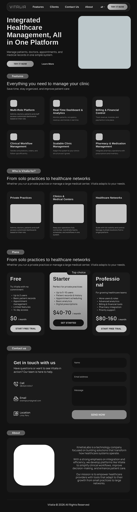

### 4.3.2. Landing Page Mock-up

*Figura 21 (Landing Page Mock-up)* 

## 4.4. Web Applications UX/UI Design

### 4.4.1. Web Applications Wireframes
*Figura 22 (Landing Page Mock-up)* 

### 4.4.2. Web Applications Wireflow Diagrams

1. **Primer Segmento Objetivo (Administradores de establecimientos de PNAS)**

    - **Como** administrador de un establecimiento de PNAS, **quiero** registrar y mantener una ficha única de pacientes, **para** evitar duplicidades y asegurar que la información quede disponible para admisión, consultorio, laboratorio, farmacia y caja. (US021, US024)
    - **Como** administrador de un establecimiento de PNAS, **quiero** programar citas solicitadas por canales presenciales o telefónicos y confirmar la asistencia del paciente, **para** actualizar el flujo de atención en tiempo real. (US022, US023)
    - **Como** administrador de un establecimiento de PNAS, **quiero** gestionar el circuito operativo posterior a la atención, incluyendo recetas para farmacia, facturación electrónica y pagos pendientes, **para** mantener ordenado el proceso asistencial y financiero. (US025, US026, US029)
    - **Como** administrador de un establecimiento de PNAS, **quiero** consultar indicadores de citas, atenciones e ingresos en un dashboard, **para** tomar decisiones operativas con información consolidada y actualizada. (US027)
    - **Como** administrador de un establecimiento de PNAS, **quiero** generar reportes automáticos e integrar Vitalia con otros sistemas mediante API, **para** reducir trabajo manual y evitar el aislamiento de la operación del establecimiento. (US028, US030)

    *Figura 23 (Wireflow 1 Administradores)* 
    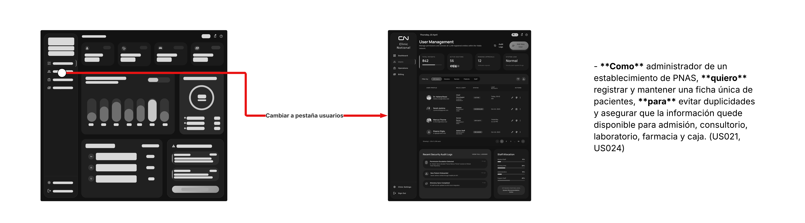

    *Figura 24 (Wireflow 2 Administradores)* 
    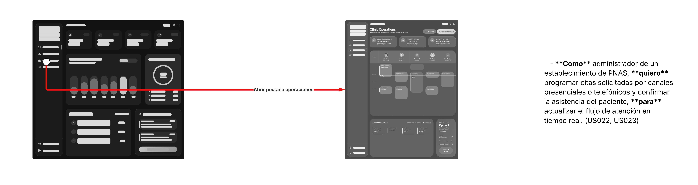

    *Figura 25 (Wireflow 3 Administradores)* 
    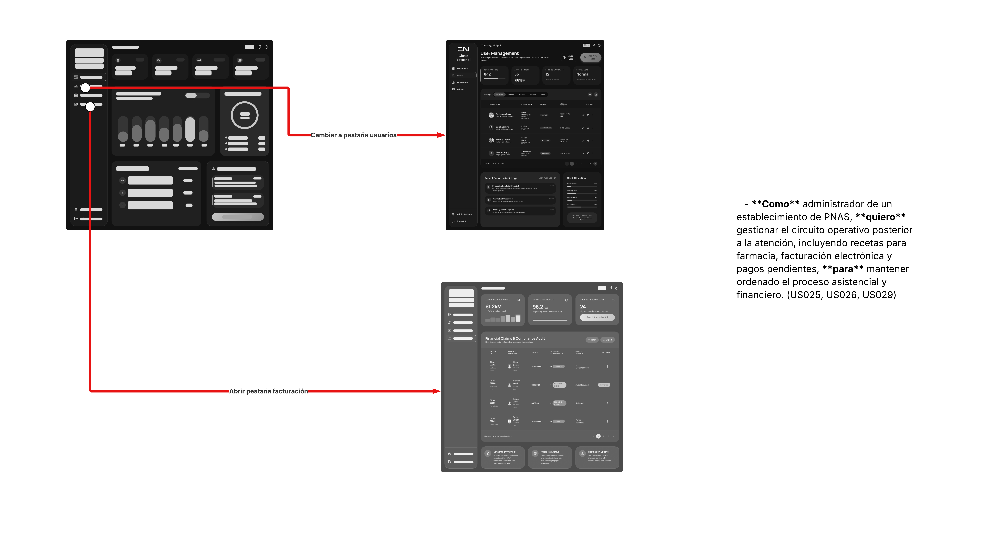

    *Figura 26 (Wireflow 4 Administradores)* 
    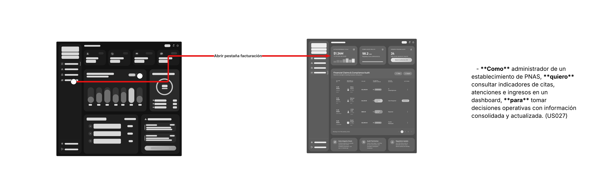

    *Figura 27 (Wireflow 5 Administradores)* 
    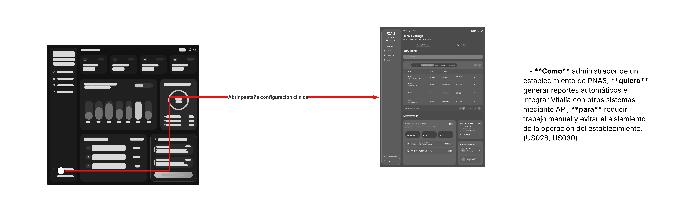

2.  **Segundo Segmento Objetivo (Doctores de establecimientos de PNAS)**

    - **Como** doctor de un establecimiento de PNAS, **quiero** revisar mi agenda diaria, el estado de mis citas y los datos de triaje antes de la consulta, **para** preparar mejor cada atención. (US010, US019)
    - **Como** doctor de un establecimiento de PNAS, **quiero** acceder rápidamente al historial clínico y a un resumen automático del paciente, **para** tomar decisiones con antecedentes relevantes dentro del tiempo disponible. (US011, US017)
    - **Como** doctor de un establecimiento de PNAS, **quiero** registrar la anamnesis, el examen físico y el diagnóstico en una sola atención, **para** mantener la información clínica ordenada y completa. (US012, US013)
    - **Como** doctor de un establecimiento de PNAS, **quiero** emitir recetas digitales y órdenes de exámenes desde la misma consulta, **para** facilitar el tratamiento, la dispensación y el seguimiento diagnóstico del paciente. (US014, US015)

    *Figura 28 (Wireflow 1 Doctores)* 
    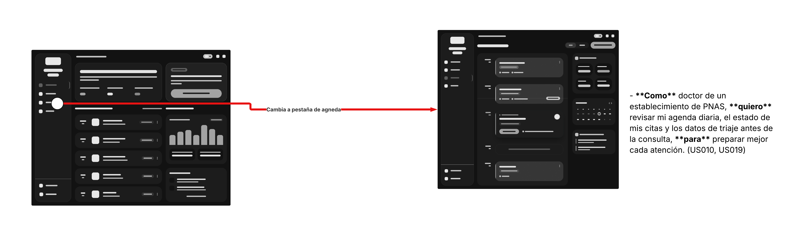

    *Figura 29 (Wireflow 2 Doctores)* 
    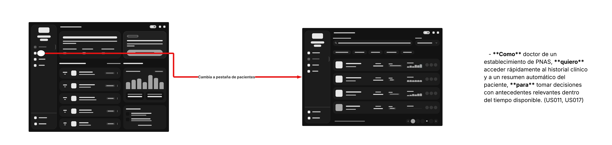

    *Figura 30 (Wireflow 3 Doctores)* 
    

    *Figura 31 (Wireflow 4 Doctores)* 
    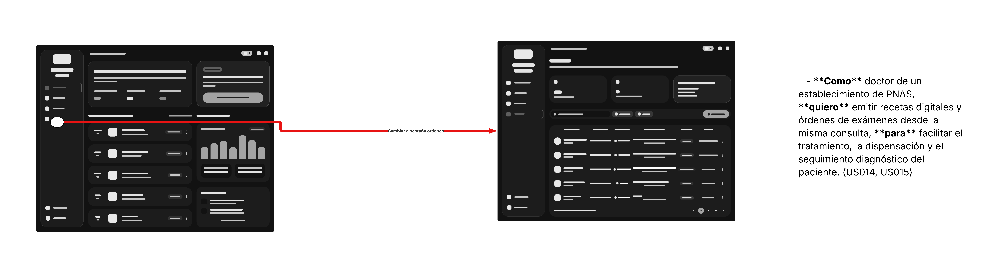

3. **Tercer Segmento Objetivo (Pacientes de todas las edades)**

    - **Como** paciente, **quiero** crear una cuenta e iniciar sesión de manera sencilla y segura, **para** acceder a mis servicios médicos desde un solo lugar. (US001, US002)
    - **Como** paciente, **quiero** reservar, reprogramar o cancelar citas digitales en pocos pasos, **para** adaptar mi atención a mi disponibilidad sin depender de llamadas o trámites presenciales. (US003, US004, US005)
    - **Como** paciente, **quiero** recibir recordatorios automáticos de mis citas, **para** reducir olvidos, inasistencias y confusiones sobre la fecha u hora de atención. (US008)
    - **Como** paciente, **quiero** consultar mi historial clínico, resultados y recetas emitidas en línea, **para** dar seguimiento a mis diagnósticos y tratamientos sin solicitar copias físicas. (US006, US007)

        *Figura 32 (Wireflow 1 Pacientes)* 
    
    
        *Figura 33 (Wireflow 2 Pacientes)* 
    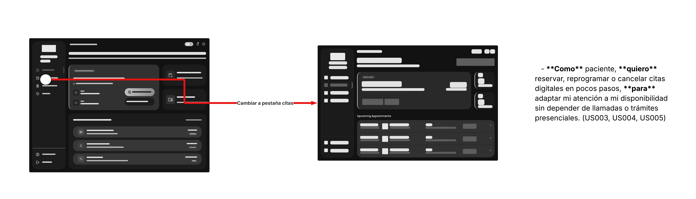
    
        *Figura 34 (Wireflow 3 Pacientes)* 
    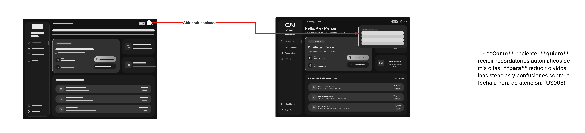

        *Figura 35 (Wireflow 4 Pacientes)* 
    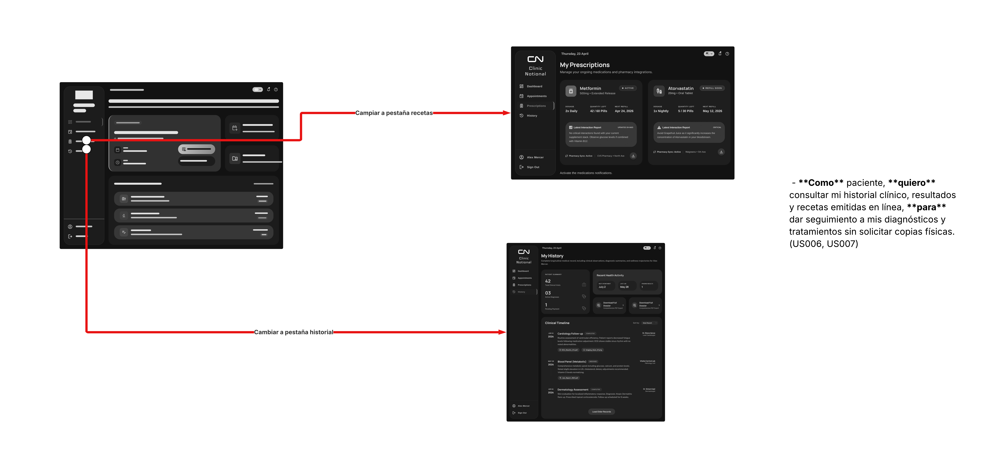

### 4.4.3. Web Applications Mock-ups

*Figura 36 (Admin Clinic Settings)*  

*Figura 37 (Admin Billing)*  

*Figura 38 (Admin Operations)*  

*Figura 39 (Admin Users)*  

*Figura 40 (Admin Dashboard)*  

*Figura 41 (Patient Profile)*  

*Figura 42 (Patient History)*  

*Figura 43 (Patient Prescriptions)*  

*Figura 44 (Patient Appointments)*  

*Figura 45 (Patient Dashboard)*  

*Figura 46 (Doctor Profile)*  

*Figura 47 (Doctor Orders)*  

*Figura 48 (Doctor Agenda)*  

*Figura 49 (Doctor Patients)*  

*Figura 50 (Doctor Dashboard)*  

### 4.4.4. Web Applications User Flow Diagrams

1. **Primer Segmento Objetivo (Administradores de establecimientos de PNAS)**

    - **Como** administrador de un establecimiento de PNAS, **quiero** registrar y mantener una ficha única de pacientes, **para** evitar duplicidades y asegurar que la información quede disponible para admisión, consultorio, laboratorio, farmacia y caja. (US021, US024)
    - **Como** administrador de un establecimiento de PNAS, **quiero** programar citas solicitadas por canales presenciales o telefónicos y confirmar la asistencia del paciente, **para** actualizar el flujo de atención en tiempo real. (US022, US023)
    - **Como** administrador de un establecimiento de PNAS, **quiero** gestionar el circuito operativo posterior a la atención, incluyendo recetas para farmacia, facturación electrónica y pagos pendientes, **para** mantener ordenado el proceso asistencial y financiero. (US025, US026, US029)
    - **Como** administrador de un establecimiento de PNAS, **quiero** consultar indicadores de citas, atenciones e ingresos en un dashboard, **para** tomar decisiones operativas con información consolidada y actualizada. (US027)
    - **Como** administrador de un establecimiento de PNAS, **quiero** generar reportes automáticos e integrar Vitalia con otros sistemas mediante API, **para** reducir trabajo manual y evitar el aislamiento de la operación del establecimiento. (US028, US030)

    *Figura 51 (Userflow 1 Administradores)* 
    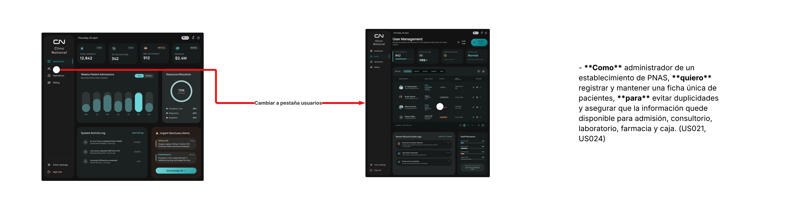

    *Figura 52 (Userflow 2 Administradores)* 
    

    *Figura 53 (Userflow 3 Administradores)* 
    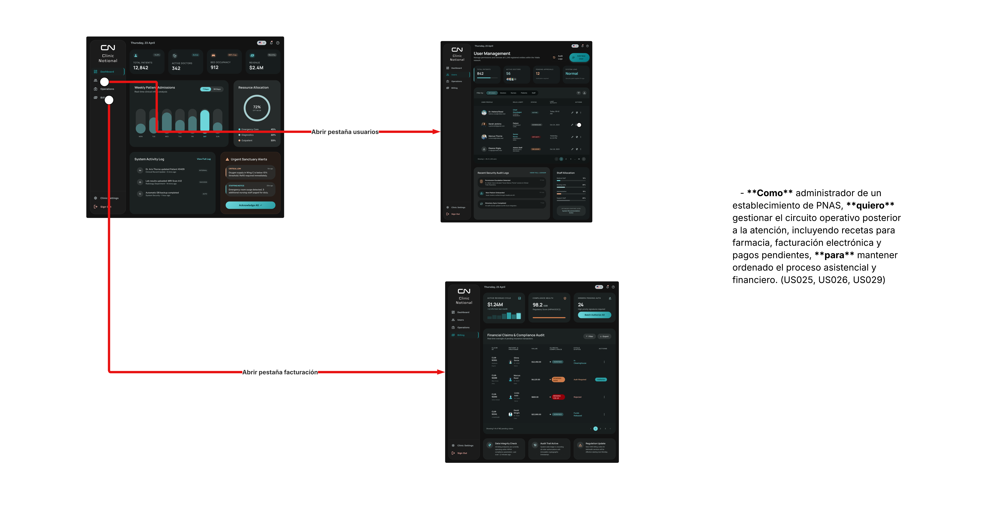

    *Figura 54 (Userflow 4 Administradores)* 
    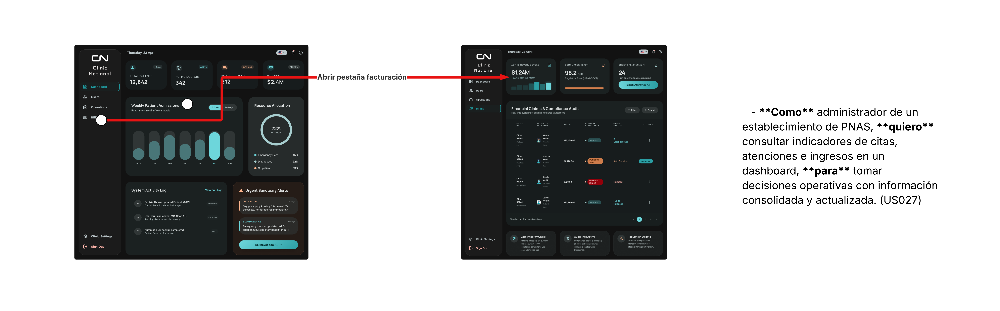

    *Figura 55 (Userflow 5 Administradores)* 
    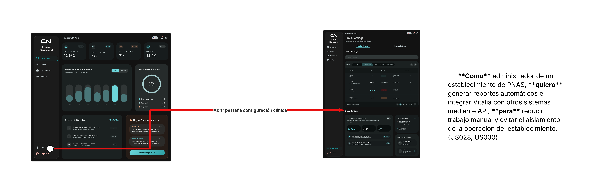

2.  **Segundo Segmento Objetivo (Doctores de establecimientos de PNAS)**

    - **Como** doctor de un establecimiento de PNAS, **quiero** revisar mi agenda diaria, el estado de mis citas y los datos de triaje antes de la consulta, **para** preparar mejor cada atención. (US010, US019)
    - **Como** doctor de un establecimiento de PNAS, **quiero** acceder rápidamente al historial clínico y a un resumen automático del paciente, **para** tomar decisiones con antecedentes relevantes dentro del tiempo disponible. (US011, US017)
    - **Como** doctor de un establecimiento de PNAS, **quiero** registrar la anamnesis, el examen físico y el diagnóstico en una sola atención, **para** mantener la información clínica ordenada y completa. (US012, US013)
    - **Como** doctor de un establecimiento de PNAS, **quiero** emitir recetas digitales y órdenes de exámenes desde la misma consulta, **para** facilitar el tratamiento, la dispensación y el seguimiento diagnóstico del paciente. (US014, US015)

    *Figura 56 (Userflow 1 Doctores)* 
    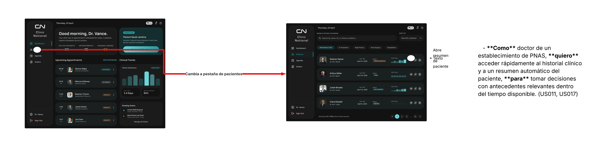

    *Figura 57 (Userflow 2 Doctores)* 
    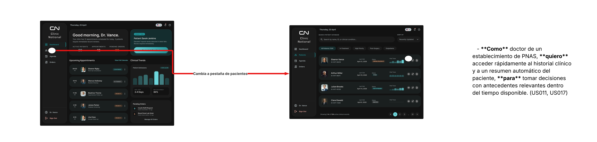

    *Figura 58 (Userflow 3 Doctores)* 
    

    *Figura 59 (Userflow 4 Doctores)* 
    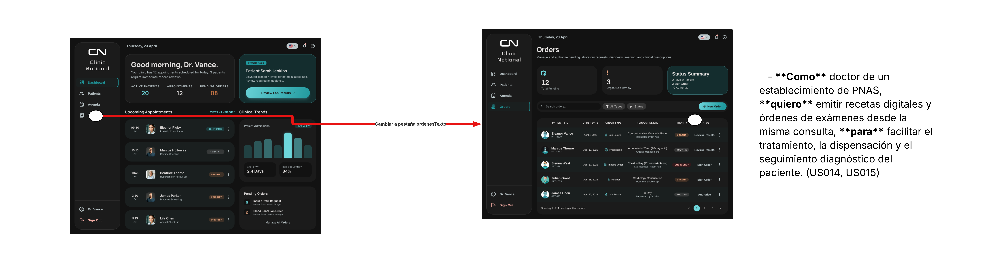

3. **Tercer Segmento Objetivo (Pacientes de todas las edades)**

    - **Como** paciente, **quiero** crear una cuenta e iniciar sesión de manera sencilla y segura, **para** acceder a mis servicios médicos desde un solo lugar. (US001, US002)
    - **Como** paciente, **quiero** reservar, reprogramar o cancelar citas digitales en pocos pasos, **para** adaptar mi atención a mi disponibilidad sin depender de llamadas o trámites presenciales. (US003, US004, US005)
    - **Como** paciente, **quiero** recibir recordatorios automáticos de mis citas, **para** reducir olvidos, inasistencias y confusiones sobre la fecha u hora de atención. (US008)
    - **Como** paciente, **quiero** consultar mi historial clínico, resultados y recetas emitidas en línea, **para** dar seguimiento a mis diagnósticos y tratamientos sin solicitar copias físicas. (US006, US007)

    *Figura 60 (Userflow 1 Pacientes)* 
    
    
    *Figura 61 (Userflow 2 Pacientes)* 
    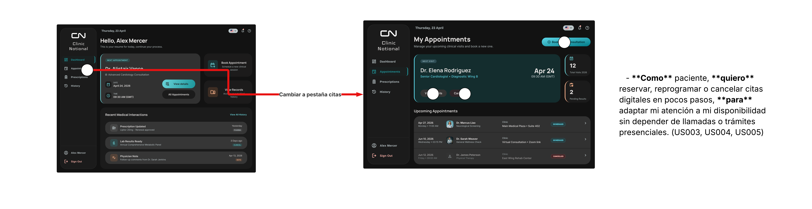
    
    *Figura 62 (Userflow 3 Pacientes)* 
    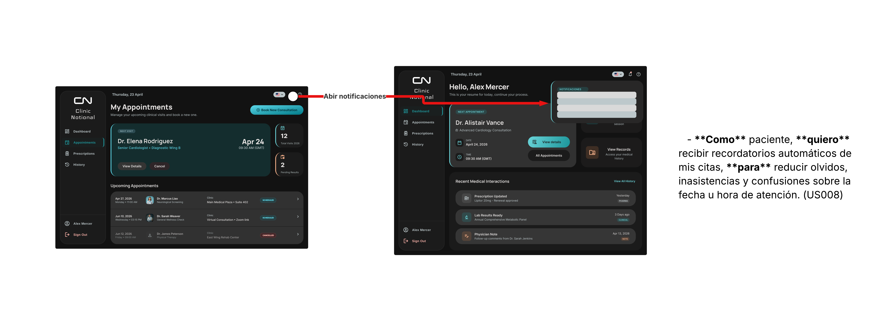

    *Figura 63 (Userflow 4 Pacientes)* 
    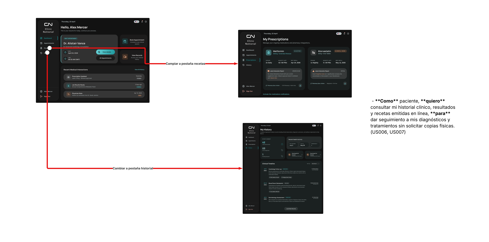

## 4.5. Web Applications Prototyping

En esta sección se presentan los prototipos de interfaz de usuario (UI) para Desktop y Mobile Web Browser, los cuales simulan la interacción y navegación de los principales flujos definidos en los User Flow Diagrams, alineados con las historias de usuario previamente descritas. En el caso del segmento de administradores, se representan flujos como el registro y gestión de pacientes (US021, US024), la programación y confirmación de citas (US022, US023), y la gestión del circuito posterior a la atención, incluyendo recetas, facturación y pagos (US025, US026, US029), así como la consulta de indicadores y generación de reportes (US027, US028, US030). Para el segmento de doctores, los prototipos cubren la revisión de agenda y datos de triaje (US010, US019), el acceso al historial clínico y resúmenes automáticos (US011, US017), el registro integral de la atención médica (US012, US013), y la emisión de recetas digitales y órdenes de exámenes (US014, US015). Finalmente, para el segmento de pacientes, se incluyen flujos de creación de cuenta e inicio de sesión (US001, US002), gestión de citas digitales (US003, US004, US005), recepción de recordatorios (US008) y consulta de historial clínico y resultados en línea (US006, US007). El diseño de estos prototipos responde a criterios de usabilidad, consistencia y claridad en la arquitectura de información, estructurando la navegación en módulos funcionales según el rol del usuario. La validación de estos flujos se presenta mediante un video demostrativo que evidencia la interacción y navegación en los prototipos, reemplazando las capturas estáticas al mostrar de forma más completa el comportamiento dinámico del sistema.

Link: https://upcedupe-my.sharepoint.com/personal/u202410678_upc_edu_pe/_layouts/15/stream.aspx?id=%2Fpersonal%2Fu202410678_upc_edu_pe%2FDocuments%2FUniversidad%2FCiclo5%2Fprototype%2Emkv&referrer=StreamWebApp%2EWeb&referrerScenario=AddressBarCopied%2Eview%2E7f436198-8fbe-46a0-be83-45666c03bdca 

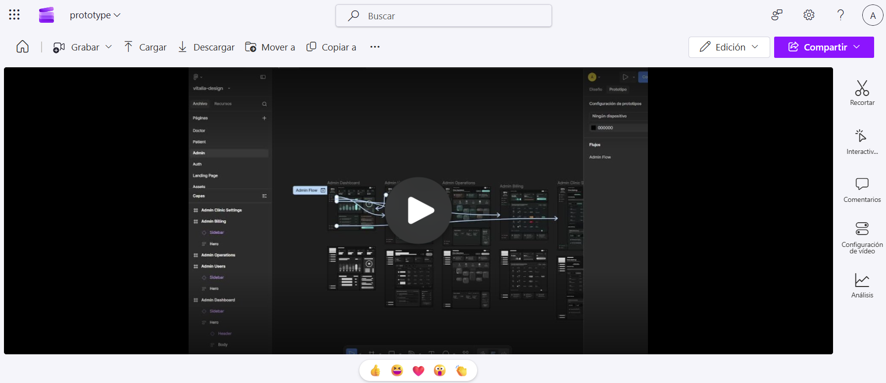

## 4.6. Domain-Driven Software Architecture

### 4.6.1. Design-Level EventStorming

Se utilizó la guía de Philippe Bourgau, proporcionada en la rúbrica del Final Problem Statement, para llevar a cabo el proceso de Design-Level EventStorming, con el objetivo de identificar los Bounded Contexts, siguiendo sus etapas:

- Unstructured Exploration
- Timelines
- Pain Points
- Pivotal Points
- Commands
- Policies
- Read Models
- External Systems
- Aggregates
- Bounded Contexts

Miro Board Link: https://miro.com/app/board/uXjVGhdfT5g=/?share_link_id=948975680057

*Figura XX (Design Level EventStorming)*  

### 4.6.2. Software Architecture Context Diagram

El diagrama de contexto presenta una visión de alto nivel del sistema Vitalia, mostrando su interacción con los actores externos y sistemas externos relevantes. Este diagrama permite comprender el alcance del sistema, identificando quiénes lo utilizan y con qué servicios externos se integra, sin entrar en detalles técnicos internos.

*Figura XX (Context Diagram)*  

### 4.6.3. Software Architecture Container Diagrams

El diagrama de contenedores descompone el sistema en sus principales unidades de ejecución, mostrando cómo se distribuyen las responsabilidades dentro de la arquitectura. En este nivel se identifican elementos como la aplicación web, API Gateway y los distintos servicios o bounded contexts, así como las tecnologías utilizadas y la forma en que estos se comunican entre sí.

*Figura XX (Container Diagram)*  

### 4.6.4. Software Architecture Components Diagrams

El diagrama de componentes profundiza en cada contenedor, detallando los módulos internos que lo conforman y sus interacciones. Este nivel permite visualizar la organización interna.

*Figura XX (Component Diagram - Identity & Tenant Context)*  

*Figura XX (Component Diagram - Clinical Context)*  

*Figura XX (Component Diagram - Schedule Context)*  

*Figura XX (Component Diagram - Pharmacy & Inventory Context)*  

*Figura XX (Component Diagram - Dashboard and Analytics Context)*  

*Figura XX (Component Diagram - Billing Context)*  

## 4.7. Software Object-Oriented Design

### 4.7.1. Class Diagrams

En la primera etapa, se elaboró el diagrama de clases general identificando las principales entidades del dominio de Vitalia, así como sus atributos, métodos, relaciones y multiplicidades. Este paso permitió establecer una visión global del sistema, asegurando que todos los elementos relevantes del negocio estuvieran correctamente modelados y conectados entre sí.

En la segunda etapa, estas clases fueron organizadas en distintos Bounded Context, agrupándolas según su responsabilidad, propósito y cohesión dentro del sistema. Esta separación permitió delimitar claramente los contextos del dominio, facilitando la comprensión del sistema y reduciendo la complejidad al dividirlo en módulos más manejables, alineados con la lógica de negocio.

Finalmente, en la tercera etapa, se realizó un análisis más profundo de cada clase dentro de su contexto, clasificándolas como Entity, Value Object o Aggregate. Esta identificación permitió definir con precisión las reglas de negocio, los límites de consistencia y las responsabilidades de cada componente dentro del dominio. Como resultado, los diagramas finales reflejan una arquitectura sólida, coherente y alineada con los principios de DDD, mostrando no solo la estructura del sistema, sino también la lógica y comportamiento del dominio.

*Figura XX (Class Diagram - Identity and Clinic Context)*  
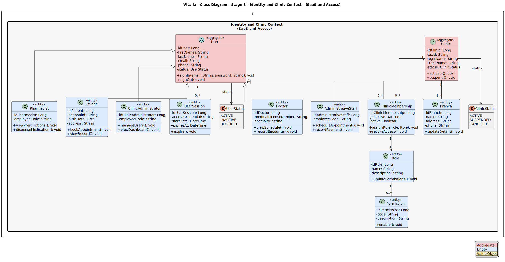

*Figura XX (Class Diagram - Clinical Context)*  
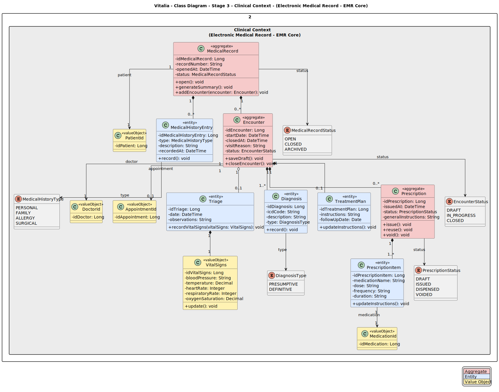

*Figura XX (Class Diagram - Scheduling Context)*  
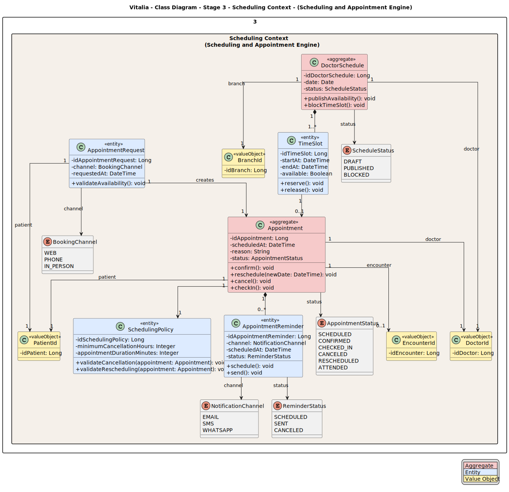

*Figura XX (Class Diagram - Pharmacy & Inventory Context)*  
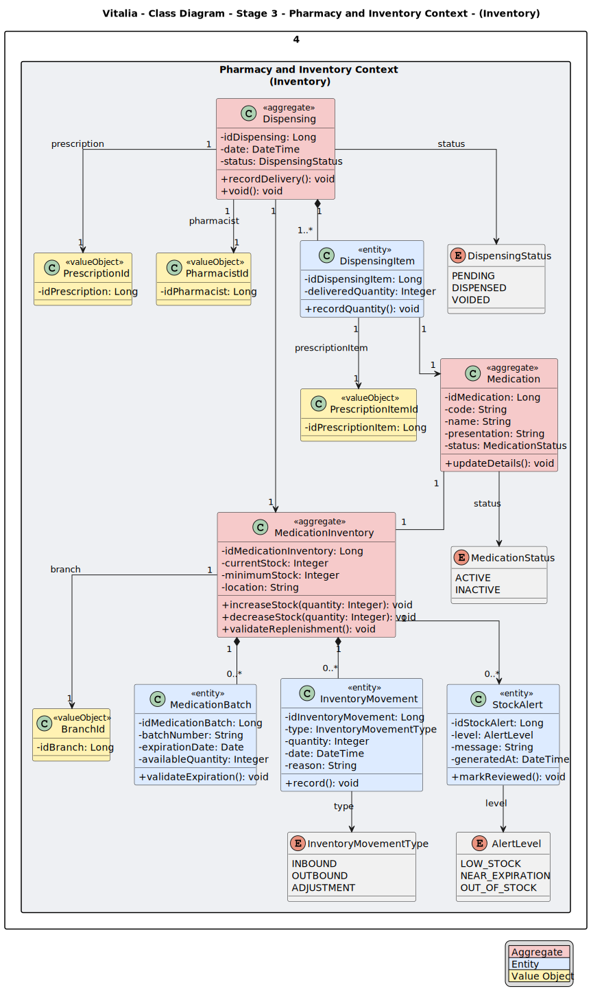

*Figura XX (Class Diagram - Dashboard and Analytics Context)*  
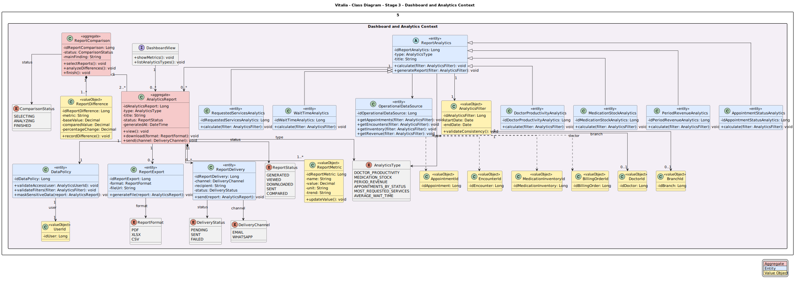

*Figura XX (Class Diagram - Billing Context)*  
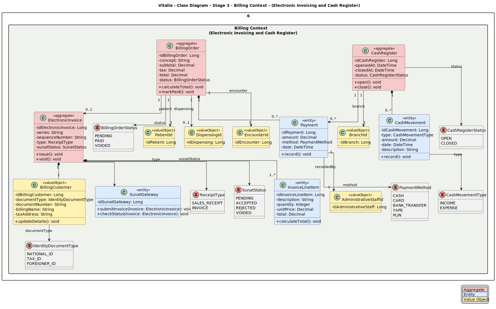

### 4.8.1. Database Diagrams

*Figura XX (Database Diagram)*  

# Capítulo V: Product Implementation, Validation & Deployment

## 5.1. Software Configuration Management

### 5.1.1. Software Development Environment Configuration

**Project Management**

WhatsApp (SaaS/Application): Aplicación de mensajería instantánea utilizada por el equipo para coordinar actividades, resolver dudas y mantener comunicación continua durante el desarrollo del proyecto. Ruta: https://www.whatsapp.com/ 

Trello (SaaS/Application): Herramienta de gestión de proyectos basada en la metodología Kanban, utilizada por el equipo para planificar, organizar y dar seguimiento al avance de las tareas del proyecto. A través de tableros, listas y tarjetas, se controlaron los sprints y se documentaron los entregables de cada fase. 
Ruta: https://trello.com/

**Product UX/UI design**

Figma (SaaS/Application): Plataforma colaborativa en línea empleada para diseñar la interfaz visual del producto, diseñar Wireframes, crear prototipos interactivos y definir la estructura gráfica del sistema. Ruta: https://www.figma.com/ 

LucidChart (SaaS): Herramienta utilizada para crear user flows, representando visualmente las rutas y acciones que siguen los usuarios dentro del producto digital. Ruta: https://www.lucidchart.com/ 
 
**Software Development**

Visual Studio Code (Application): Editor de código fuente multiplataforma que permite escribir, depurar y ejecutar el código del sistema. Incluye integración con GitHub para control de versiones. Ruta: https://code.visualstudio.com/ 

Live Preview (Extensión de Visual Studio Code): Extensión oficial de Microsoft que permite visualizar en tiempo real los cambios realizados en el código HTML, CSS y JavaScript dentro del navegador, facilitando el desarrollo web. Ruta: https://code.visualstudio.com/ 

GitHub (SaaS): Plataforma basada en Git utilizada para alojar repositorios de código, realizar control de versiones, seguimiento de cambios y trabajo colaborativo entre desarrolladores. Ruta: https://marketplace.visualstudio.com/items?itemName=ms-vscode.live-server

Software Testing: Google Chrome (Application): Navegador web utilizado para realizar pruebas funcionales y de interfaz del producto digital, verificando el comportamiento y la visualización. Ruta: https://www.google.com/chrome 

**Software Documentation**

Markdown (Lenguaje de marcado ligero): Utilizado para elaborar y mantener la documentación del proyecto de forma simple, legible y compatible con múltiples plataformas. Ruta: https://www.markdownguide.org/

### 5.1.2. Source Code Management

El proyecto se gestionará mediante Git como sistema de control de versiones, utilizando el modelo de ramas GitFlow, propuesto por Vincent Driessen (2010), como workflow principal. Este modelo permite mantener una estructura ordenada y colaborativa para el desarrollo, pruebas y liberación del producto digital.

URL de repositorio de GitHub: https://github.com/kinetia-upc/vitalia-landing

**Estructura de Ramas (branches):**

*Ramas principales:*  
* Main: Versión estable y lista para producción
* Develop: Rama de integración, se unirán todas las funcionalidades desarrolladas antes de preparar una versión oficial

*Ramas de soporte:*  
* Feature: Cada nueva funcionalidad o mejora se desarrollará en una rama independiente a partir de develop. Convención de nombre: feature/nombre-descriptivo.
* Release: Ramas temporales creadas desde develop para preparar una nueva versión antes de su lanzamiento. Solo se aplican correcciones menores o ajustes.
Convención de nombres: release/vX.Y.Z
* Hotfix: Ramas utilizadas para solucionar errores críticos detectados en la versión de producción. Una vez corregido, se fusiona tanto en main como en develop.
Convención de nombres: hotfix/vX.Y.Z

*Semantic Versioning:*  
Se usará Semantic Versioning 2.0.0, utilizando el formato: MAJOR.MINOR.PATCH
MAJOR: Cambio incompatible
MINOR: Nueva funcionalidad compatible
PATCH: Corrección y ajuste menor

*Conventional Commits:*  
Para los mensajes de commit se utilizará el estándar Conventional Commits, asegurando claridad y trazabilidad en el historial del proyecto. 

\<tipo>(\<opcional>): \<mensaje en presente>

Tipos:  
* feat: nueva funcionalidad.
* fix: corrección de error.
* docs: cambios en documentación.
* style: formato o estilo (sin lógica).
* refactor: reestructuración del código.
* chore: tareas menores o de mantenimiento

### 5.1.3. Source Code Style Guide & Conventions

Para todos los lenguajes se aplicará la nomenclatura en inglés.

**Lenguaje HTML**

Se seguirá la guía HTML Style Guide and Coding Conventions y las recomendaciones de Google HTML/CSS Style Guide:
* Los nombres de archivos serán en minúsculas, sin espacios, separados por guiones.
* Las etiquetas estarán correctamente anidadas, en minúsculas y con sangría de dos espacios.
* Los atributos HTML se escribirán en minúsculas y siempre entre comillas.
* Los comentarios se usarán para describir secciones principales de código
* Evitar largas líneas de código

**Lenguaje CSS**

De acuerdo con Google HTML/CSS Style Guide:
* Los nombres de clases y selectores se escribirán en minúsculas y con guiones (kebab-case).
* Se mantendrá un orden lógico: primero estructura general, luego estilos específicos.
* Se evitará el uso de estilos en línea dentro del HTML.
* Los valores numéricos de cero no incluirán unidad.

**Lenguaje JavaScript**

Se seguirán las convenciones estándar de JavaScript Style Guide (Google y MDN):
* Uso de camelCase para variables y funciones.
* Uso de PascalCase para nombres de clases o constructores.
* Uso de const y let en lugar de var.
* Sangría de dos espacios y punto y coma al final de cada instrucción.
* Los comentarios se harán con // para líneas simples o /* ... */ para bloques.

### 5.1.4. Software Deployment Configuration

**Landing Page**

El despliegue se realizará mediante GitHub Pages, una plataforma gratuita de GitHub que permite publicar sitios web estáticos directamente desde el repositorio de código fuente, sin necesidad de configurar servidores adicionales.

*Procedimiento planificado:*  
1.	Verificar que la versión final del proyecto esté almacenada y actualizada en la rama main del repositorio.
2.	Acceder al repositorio en GitHub y dirigirse a Settings -> Pages.
3.	En la sección Source, seleccionar la rama main y la carpeta raíz.
4.	Guardar la configuración para que GitHub Pages genere automáticamente la página pública.
5.	Una vez desplegado, el sitio estará disponible.

Cuando el proyecto esté en fase de mantenimiento, las actualizaciones se gestionarán mediante commits y merges hacia la rama main. Cada cambio publicado en esta rama generará automáticamente una nueva versión desplegada del sitio.

# Conclusiones
* **Sobre el Problem Statement y Needfinding:** Se concluye que la problemática inicial respecto a la fragmentación de la información sanitaria en el Primer Nivel de Atención de Salud (PNAS) es una necesidad real y latente. Durante la fase de entrevistas y Needfinding, se comprobó que tanto el personal médico como el administrativo sufren ineficiencias operativas por el uso de sistemas aislados, validando nuestra premisa fundamental de que un ecosistema integrado (Historia Clínica, Citas, Farmacia y Facturación) es indispensable para el mercado peruano.

* **Sobre los Assumptions e Hypothesis Statements (Resultados preliminares):** Nuestra hipótesis sobre la disposición de los médicos y administradores a adoptar nuevas tecnologías se ha validado de forma preliminar durante las entrevistas. Se asume con mayor certeza que una curva de aprendizaje baja y una interfaz libre de distracciones visuales (con filosofía Pure Dark y Glassmorphism) reducirán significativamente la resistencia al cambio, mitigando uno de los riesgos más altos del producto. Los resultados cuantitativos finales se medirán tras las pruebas con usuarios de las Web Applications.

* **Sobre la Arquitectura y Diseño del Producto:** La aplicación del Domain-Driven Design (DDD) mediante el EventStorming ha demostrado ser un éxito metodológico para el equipo. Logramos diseccionar un sistema médico complejo en Bounded Contexts bien definidos (Identity, Clinical, Pharmacy, Scheduling, Billing, Notifications), lo cual nos ha permitido establecer una arquitectura de microservicios o módulos desacoplados altamente escalable.

* **Sobre la Implementación (Sprint 1):** Se concluye que el desarrollo y despliegue ágil de la Landing Page comercial permite a KinetiaLabs contar tempranamente con un activo digital para la validación de la propuesta de valor frente a clientes potenciales (B2B), demostrando que la separación entre la plataforma de marketing y la aplicación core optimiza los tiempos de entrega.

# Recomendaciones

* **Sobre el Roadmap y Siguientes Sprints:** Se recomienda mantener un enfoque estricto en el desarrollo del módulo Core (Historia Clínica Electrónica y Citas) para el Sprint 2. Es vital que la base de datos y la lógica del Identity & Tenant Context queden sólidamente integradas antes de avanzar a los módulos de facturación o inventario, garantizando así la correcta segregación de datos por policlínico (Multi-tenant).

* **Validación Temprana (Testing):** Se recomienda que, tan pronto se despliegue la primera versión funcional de la Web Application para doctores y recepcionistas, se organicen las Validation Interviews con los usuarios clave abordados en el Capítulo II. Recolectar feedback sobre la fluidez del agendamiento y el llenado de anamnesis será crucial antes del Release final.

* **Integraciones de Terceros (APIs):** De cara a la madurez del producto, se recomienda ir analizando la documentación técnica de sistemas de terceros para los módulos secundarios, específicamente la API de RENIEC (para el registro rápido de pacientes y validación de identidad) y las pasarelas de facturación electrónica validadas por SUNAT.

* **Gestión Documental:** Se sugiere al equipo mantener el rigor en el flujo de Docs-as-Code y los Conventional Commits en el repositorio de GitHub, ya que la trazabilidad del código y la documentación integrada facilitarán enormemente la auditoría del proyecto en las entregas finales.

# Bibliografía
Banco Mundial. (2023). *Sistemas de gestión de información de salud en el Perú.* https://documents1.worldbank.org/curated/en/099062123174135607/pdf/P1778220d5911f0bd081d205543f78f357d.pdf

Congreso de la República. (2009, 2 octubre). *Normas Legales.* https://www.leyes.congreso.gob.pe/documentos/leyes/29414.pdf

Culqi. (2025, 7 abril). *Clínicas crecieron más del 9 % hacia 2025: factores y tendencias.* https://blog.culqi.com/crecimiento-clinicas-2025-factores-tendencias/#:~:text=%E2%80%8B%E2%80%8BFactores%20que%20impulsan%20el%20crecimiento%20de%20las,tratamientos%20avanzados.%20%2D%20Avances%20tecnol%C3%B3gicos%20en%20salud

Davix. (2026, 28 febrero). *Normativa de historia clínica electrónica en Perú 2026: lo que tu clínica debe cumplir.* Davix. https://davix.ai/es/blog/normativa-historia-clinica-electronica-peru-2026/#:~:text=Ley%2029733%20%E2%80%94%20Protecci%C3%B3n%20de%20Datos%20Personales,Nacional%20de%20Protecci%C3%B3n%20de%20Datos%20Personales%20(APDP)

Gobierno Nacional del Perú. (2026, 13 enero). *EsSalud logra récord histórico con más de 1.6 millones de atenciones en telemedicina durante el 2025.* (s. f.). Noticias - Seguro Social de Salud - Plataforma del Estado Peruano. https://www.gob.pe/institucion/essalud/noticias/1332178-essalud-logra-record-historico-con-mas-de-1-6-millones-de-atenciones-en-telemedicina-durante-el-2025#:~:text=EsSalud.%20Noticias.%20EsSalud%20logra%20r%C3%A9cord%20hist%C3%B3rico%20con,de%20atenciones%20en%20telemedicina%20durante%20el%202025

Ministerio de Salud del Perú. (2007, 1 de enero). *Norma técnica de salud para la gestión de la historia clínica: NT No 022-MINSA/DGSP-V.02.* (s. f.). https://www.gob.pe/institucion/minsa/informes-publicaciones/353463-norma-tecnica-de-salud-para-la-gestion-de-la-historia-clinica-nt-n-022-minsa-dgsp-v-02

Ministerio de Salud del Perú. (2011). *Plan Nacional de Fortalecimiento del Primer Nivel de Atención 2011-2021.* https://cdn.www.gob.pe/uploads/document/file/392447/1620.pdf 

Organización Panamericana de Salud. (2021, 7 septiembre). *Hoja informativa - Historias clínicas electrónicas y la importancia de cómo documentar.* https://www.paho.org/es/documentos/hoja-informativa-historias-clinicas-electronicas-importancia-como-documentar

Wafa K. Alanazi. (2024). Effect of electronic prescription system modifications on reducing prescribing errors in a military hospital. *Journal Of Pharmaceutical Policy And Practice.* https://doi.org/10.1080/20523211.2024.2431177

# Anexos
**Anexo A. Diagramas en svg**

| Diagrama | Enlace al diagrama.svg |
| --- | --- |
| **BicPicture EventStorming** | [BigPicture EventStorming](assets/diagrams/big-picture-event-storming.svg) |
| **DesignLevel EventStorming** | [DesignLevel EventStorming](assets/diagrams/design-level-event-storming.svg) |
| **Class Diagram** | [Class Diagram](assets/diagrams/class-diagram.svg) |
| **Database Diagram** | [Database Diagram](assets/diagrams/database-diagram.svg) |

**Anexo B. Videos de expocisiones**

| Hito | Enlace al Video |
| --- | --- |
| **AV1** | [upc-pre-202610-1asi0730-10203-kinetialabs-expo-av1](https://av1) |

**Anexo C. Enlaces Importantes**

| Título | Enlace |
| --- | --- |
| Repositorio del informe | https://github.com/kinetia-upc/vitalia-docs |
| Repositorio de la Landing Page | https://github.com/kinetia-upc/vitalia-landing |
| Landing Page Desplegada | https://kinetia-upc.github.io/vitalia-landing/ |