

  

Universidad Peruana de Ciencias Aplicadas

Carrera de Ingeniería de Software

**1ASI0730**

**Aplicaciones Web**

NRC

**10203**

**Informe del Trabajo Final**

Docente

**Sánchez Ponce, Alex Humberto**

Equipo

**KinetiaLabs**

Proyecto

**Vitalia**

**Integrantes**

<table style="width: auto; border-collapse: collapse; text-align: center;">
  <thead>
    <tr>
      <th style="padding: 8px; border: 1px solid #666; text-align: center;">Código</th>
      <th style="padding: 8px; border: 1px solid #666; text-align: center;">Apellidos y Nombres</th>
    </tr>
  </thead>
  <tbody>
    <tr>
      <td style="padding: 8px; border: 1px solid #666; text-align: center;">U20241E177</td>
      <td style="padding: 8px; border: 1px solid #666; text-align: center;">Ruiz Mideyros, Adrian</td>
    </tr>
    <tr>
      <td style="padding: 8px; border: 1px solid #666; text-align: center;">U202317099</td>
      <td style="padding: 8px; border: 1px solid #666; text-align: center;">Rojas Tello, Nestor Alonso</td>
    </tr>
    <tr>
      <td style="padding: 8px; border: 1px solid #666; text-align: center;">U202410678</td>
      <td style="padding: 8px; border: 1px solid #666; text-align: center;">Astocondor Bazan, Alejandra Isabel</td>
    </tr>
    <tr>
      <td style="padding: 8px; border: 1px solid #666; text-align: center;">U202412316</td>
      <td style="padding: 8px; border: 1px solid #666; text-align: center;">Diaz Martinez, Alexther Kamil</td>
    </tr>
    <tr>
      <td style="padding: 8px; border: 1px solid #666; text-align: center;">U202410254</td>
      <td style="padding: 8px; border: 1px solid #666; text-align: center;">Dulanto Espino, Leo César</td>
    </tr>
  </tbody>
</table>

**Período 202610**

**Julio 2026**

---

# Registro de versiones del informe

| Versión | Fecha | Autor | Descripción de modificación |
| --- | --- | --- | --- |
| 0.1.0 | 15/4/26 | @AleeAsto | docs: añadir la descripción del startup y antecedentes y problemática |
| 0.1.1 | 15/4/26 | @AdrixRyz | docs: añadir los puntos previos al capítulo 1 |
| 0.1.2 | 16/4/26 | @Leotens | docs: añadir todos los puntos de Lean UX Process |
| 0.1.3 | 16/4/26 | @Leotens | docs: añadir diseño y registro de entrevistas |
| 0.1.4 | 17/4/26 | @nes-ro | docs: añadir todos los puntos de competidores |
| 0.1.5 | 17/4/26 | @kamil-tron | docs: añadir todos los puntos de needfinding |
| 0.1.6 | 18/4/26 | @nes-ro | docs: añadir segmentos objetivo |
| 0.1.7 | 19/4/26 | @AleeAsto | docs: añadir análisis de entrevistas |
| 0.1.8 | 20/4/26 | @AdrixRyz | docs: añadir ubiquitous language  |
| 0.1.9 | 21/4/26 | @nes-ro | docs: añadir bigpicture eventstorming |
| 0.1.10 | 22/4/26 | @AleeAsto | docs: añadir todos los puntos de software configuration management |
| 0.1.11 | 23/4/26 | @AdrixRyz | docs: añadir todos los puntos de style guidelines |
| 0.1.12 | 23/4/26 | @Leotens | docs: añadir todos los puntos del capítulo 3 |
| 0.1.13 | 24/4/26 | @AleeAsto | docs: añadir landing page ui design |
| 0.1.14 | 25/4/26 | @nes-ro | docs: añadir todos los puntos de domain-driven software architecture |
| 0.1.15 | 25/4/26 | @nes-ro | docs: añadir database design diagram |
| 0.1.16 | 25/4/26 | @kamil-tron | docs: añadir el diagrama de clases |
| 0.1.17 | 25/4/26 | @kamil-tron | docs: añadir todos los puntos de Information Architecture |
| 0.1.18 | 25/4/26 | @AleeAsto | docs: añadir sprint 1 |
| 0.2.0 | 13/5/26 | @AdrixRyz | docs: realizar correcciones del av1 |
| 0.2.1 | 13/5/26 | @AdrixRyz | docs: añadir sprint 2 |
| 0.3.0 | 17/6/26 | @kamil-tron | docs: realizar correcciones del tb1 |
| 0.3.1 | 17/6/26 | @Leotens | docs: añadir sprint 3 |
| 0.4.0 | 2/7/26 | @kamil-tron | docs: realizar correcciones del av2 |
| 0.4.1 | 5/7/26 | @Leotens | docs: añadir sprint 4 |
| 1.0.0 | 8/7/26 | @AdrixRyz | docs: realizar correcciones finales |

# Project Report Collaboration Insights

**Repositorio de la documentación del proyecto:** [https://github.com/kinetia-upc/vitalia-docs](https://github.com/kinetia-upc/vitalia-docs)

A continuación, se detallan las actividades realizadas en cada entrega, la participación de los miembros del equipo, y las evidencias correspondientes.

**AV1**

**TB1**

**AV2**

**TB2**

# Tabla de contenidos

**Registro de versiones del informe**

**Project Report Collaboration Insights**

**Tabla de contenidos**

**Student Outcome**

[**Capítulo I: Introducción**](docs/10-chap-1.md)  
1.1. Startup Profile  
1.1.1. Descripción del startup  
1.1.2. Perfiles de integrantes del equipo  
1.2. Solution Profile  
1.2.1. Antecedentes y problemática  
1.2.2. Lean UX Process  
1.2.2.1. Lean UX Problem Statements  
1.2.2.2. Lean UX Assumptions  
1.2.2.3. Lean UX Hypothesis Statements  
1.2.2.4. Lean UX Canvas  
1.3. Segmentos objetivo  

[**Capítulo II: Requirements Elicitation & Analysis**](docs/20-chap-2.md)  
2.1. Competidores  
2.1.1. Análisis competitivo  
2.1.2. Estrategias y tácticas frente a competidores  
2.2. Entrevistas  
2.2.1. Diseño de entrevistas  
2.2.2. Registro de entrevistas  
2.2.3. Análisis de entrevistas  
2.3. Needfinding  
2.3.1. User Personas  
2.3.2. User Task Matrix  
2.3.3. User Journey Mapping  
2.3.4. Empathy Mapping  
2.4. Big Picture EventStorming  
2.5. Ubiquitous Language  

[**Capítulo III: Requirements Specification**](docs/30-chap-3.md)  
3.1. User Stories  
3.2. Impact Mapping  
3.3. Product Backlog  

[**Capítulo IV: Product Design**](docs/40-chap-4.md)  
4.1. Style Guidelines  
4.1.1. General Style Guidelines  
4.1.2. Web Style Guidelines  
4.2. Information Architecture  
4.2.1. Organization Systems  
4.2.2. Labeling Systems  
4.2.3. SEO Tags and Meta Tags  
4.2.4. Searching Systems  
4.2.5. Navigation Systems  
4.3. Landing Page UI Design  
4.3.1. Landing Page Wireframe  
4.3.2. Landing Page Mock-up  
4.4. Web Applications UX/UI Design  
4.4.1. Web Applications Wireframes  
4.4.2. Web Applications Wireflow Diagrams  
4.4.3. Web Applications Mock-ups  
4.4.4. Web Applications User Flow Diagrams  
4.5. Web Applications Prototyping  
4.6. Domain-Driven Software Architecture  
4.6.1. Design-Level EventStorming  
4.6.2. Software Architecture Context Diagram  
4.6.3. Software Architecture Container Diagrams  
4.6.4. Software Architecture Components Diagrams  
4.7. Software Object-Oriented Design  
4.7.1. Class Diagrams  
4.8. Database Design  
4.8.1. Database Diagrams  

[**Capítulo V: Product Implementation, Validation & Deployment**](docs/50-chap-5.md)  
5.1. Software Configuration Management  
5.1.1. Software Development Environment Configuration  
5.1.2. Source Code Management  
5.1.3. Source Code Style Guide & Conventions  
5.1.4. Software Deployment Configuration  
5.2. Landing Page, Services & Applications Implementation  
[**5.2.1. Sprint 1**](docs/51-sprint-1.md)  
5.2.1.1. Sprint Planning 1  
5.2.1.2. Aspect Leaders and Collaborators  
5.2.1.3. Sprint Backlog 1  
5.2.1.4. Development Evidence for Sprint Review  
5.2.1.5. Execution Evidence for Sprint Review  
5.2.1.6. Services Documentation Evidence for Sprint Review  
5.2.1.7. Software Deployment Evidence for Sprint Review  
5.2.1.8. Team Collaboration Insights during Sprint  
[**5.2.2. Sprint 2**](docs/52-sprint-2.md)  
5.2.2.1. Sprint Planning 2  
5.2.2.2. Aspect Leaders and Collaborators  
5.2.2.3. Sprint Backlog 2  
5.2.2.4. Development Evidence for Sprint Review  
5.2.2.5. Execution Evidence for Sprint Review  
5.2.2.6. Services Documentation Evidence for Sprint Review  
5.2.2.7. Software Deployment Evidence for Sprint Review  
5.2.2.8. Team Collaboration Insights during Sprint  
[**5.2.3. Sprint 3**](docs/53-sprint-3.md)  
5.2.3.1. Sprint Planning 3  
5.2.3.2. Aspect Leaders and Collaborators  
5.2.3.3. Sprint Backlog 3  
5.2.3.4. Development Evidence for Sprint Review  
5.2.3.5. Execution Evidence for Sprint Review  
5.2.3.6. Services Documentation Evidence for Sprint Review  
5.2.3.7. Software Deployment Evidence for Sprint Review  
5.2.3.8. Team Collaboration Insights during Sprint  
[**5.2.4. Sprint 4**](docs/54-sprint-4.md)  
5.2.4.1. Sprint Planning 4  
5.2.4.2. Aspect Leaders and Collaborators  
5.2.4.3. Sprint Backlog 4  
5.2.4.4. Development Evidence for Sprint Review  
5.2.4.5. Execution Evidence for Sprint Review  
5.2.4.6. Services Documentation Evidence for Sprint Review  
5.2.4.7. Software Deployment Evidence for Sprint Review  
5.2.4.8. Team Collaboration Insights during Sprint  
[**5.3. Validation Interviews**](docs/60-validation-interviews.md)  
5.3.1. Diseño de Entrevistas  
5.3.2. Registro de Entrevistas  
5.3.3. Evaluaciones según heurísticas  
[**5.4. Video About-the-Product**](docs/70-product-video.md)  

[**Conclusiones**](docs/80-conclusions.md)  
[**Recomendaciones**](docs/81-recommendations.md)  
[**Video About-the-Team**](docs/82-team-video.md)  
[**Bibliografía**](docs/90-bibliography.md)  
[**Anexos**](docs/99-annexes.md)  

# Student Outcome

En esta sección se describe cómo cada integrante contribuyó al desarrollo del Student Outcome durante las entregas del proyecto. Las actividades se redactan como evidencias de trabajo colaborativo, coordinación, liderazgo compartido y comunicación efectiva, en lugar de listar únicamente tareas o entregables.

| Criterio específico | Acciones realizadas | Conclusiones |
| --- | --- | --- |
| Trabaja en equipo para proporcionar liderazgo en forma conjunta. | Ruiz Mideyros, Adrian (U20241E177) **AV1:** Participó en reuniones de coordinación para alinear criterios del informe, proponer acuerdos de redacción y apoyar la integración visual y conceptual de los capítulos trabajados por el equipo. **TB1:** Guió sesiones de Sprint Planning equilibrando la participación de sus compañeros, promoviendo decisiones consensuadas y reforzando una dirección compartida para el desarrollo inicial del producto. **AV2:** Guió al grupo durante el avance 2 organizando tareas, definiendo roles y promoviendo acuerdos para que todos participaran en las decisiones principales. **TB2:** Lideró la integración del consumo de APIs externas coordinando con el equipo la estructura de comunicación entre frontend y backend, promoviendo decisiones técnicas compartidas sobre pasarelas de pago y mecanismos de resiliencia ante desconexión.  Rojas Tello, Nestor Alonso (U202317099) **AV1:** Contribuyó a las decisiones grupales mediante discusiones técnicas y de negocio, ayudando a priorizar enfoques, comparar alternativas y sostener una dirección común durante la entrega. **TB1:** Orientó la estructura de trabajo resolviendo dudas conceptuales, escuchando aportes de sus compañeros y alineando expectativas técnicas con el diseño general del proyecto. **AV2:** Aportó liderazgo en la revisión de avances, apoyó la resolución de dudas del equipo y colaboró en la toma de decisiones durante las correcciones. **TB2:** Guió la definición del módulo de farmacia proponiendo flujos de dispensación y reutilización de recetas, facilitando acuerdos técnicos con el equipo sobre validaciones de inventario y restricciones clínicas.  Astocondor Bazan, Alejandra Isabel (U202410678) **AV1:** Favoreció la coordinación constante del equipo al comunicar avances, validar observaciones de sus compañeros y conectar actividades de investigación, diseño y documentación del producto. **TB1:** Facilitó acuerdos visuales integrando propuestas individuales en un estándar común, promoviendo retroalimentación constructiva y ayudando a consolidar una propuesta de diseño compartida. **AV2:** Participó activamente en la toma de decisiones, respondió consultas del grupo y facilitó la comunicación para mantener una dirección compartida del trabajo. **TB2:** Coordinó las entrevistas de validación con los tres segmentos objetivo, orientando al equipo en la preparación de guías y la recopilación de hallazgos para incorporar mejoras al producto de forma consensuada.  Diaz Martinez, Alexther Kamil (U202412316) **AV1:** Impulsó el trabajo conjunto compartiendo observaciones sobre usuarios, estructura del sistema y organización de contenidos, fortaleciendo la colaboración y el consenso en decisiones grupales. **TB1:** Condujo conversaciones para simplificar el flujo del producto, promoviendo debate abierto y acuerdos lógicos sobre la organización de información y navegación principal. **AV2:** Analizó los avances del documento, propuso correcciones y motivó reuniones de coordinación para acordar tareas, tiempos y responsabilidades del equipo. **TB2:** Impulsó el diseño del módulo de autenticación y recuperación de acceso, liderando sesiones de revisión técnica sobre seguridad, sincronización diferida y flujos de login multi-rol con participación activa de todos los integrantes.  Dulanto Espino, Leo César (U202410254) **AV1:** Promovió el diálogo entre integrantes mediante sesiones de revisión, recolección de retroalimentación y organización de aportes para convertirlos en criterios comunes de trabajo. **TB1:** Impulsó la corresponsabilidad en la definición del Backlog, moderando debates sobre complejidad y asegurando que todos compartieran compromiso y visión de éxito. **AV2:** Sostuvo una participación constante en la producción y revisión del avance, apoyando al equipo con iniciativa, resiliencia y disposición para resolver bloqueos. **TB2:** Dirigió el Sprint Planning 4 y la definición del IAM API, promoviendo una distribución equitativa de responsabilidades entre seguridad, integraciones y continuidad clínica, asegurando que cada decisión contara con el respaldo del equipo. | **AV1:** El equipo ejerció un liderazgo distribuido basado en coordinación, diálogo y construcción de acuerdos. Las actividades evidencian colaboración real, más que una división aislada de funciones.  **TB1:** Durante este ciclo se consolidó un liderazgo rotativo y empático. Los integrantes asumieron iniciativa en momentos clave, respetando los aportes del grupo y fortaleciendo la cohesión del equipo.  **AV2:** El equipo reforzó el liderazgo conjunto al organizar responsabilidades, revisar avances y tomar decisiones de manera compartida, manteniendo una comunicación constante durante el desarrollo del avance.  **TB2:** El liderazgo compartido alcanzó su mayor madurez durante el TB2. Cada integrante asumió la conducción de un aspecto crítico del producto (autenticación, farmacia, integraciones, validación, seguridad), generando decisiones técnicas respaldadas por todo el equipo y demostrando autonomía con responsabilidad colectiva. |
| Crea un entorno colaborativo e inclusivo, establece metas, planifica tareas y cumple objetivos. | Ruiz Mideyros, Adrian (U20241E177) **AV1:** Participó en la definición de acuerdos y avances parciales, ayudando a sostener una dinámica ordenada, respetuosa y orientada al cumplimiento de metas comunes. **TB1:** Fomentó un ambiente inclusivo al considerar la disponibilidad de sus compañeros, proponer metas individuales realistas y colaborar en bases comunes para evitar sobrecargas. **AV2:** Ayudó a ordenar las actividades del avance, propuso una distribución clara de tareas y dio seguimiento para que el equipo cumpliera los plazos acordados. **TB2:** Planificó y completó la integración con pasarelas de pago y el sistema de caché offline, compartiendo avances tempranos para que el equipo pudiera validar flujos dependientes y cumplir los objetivos del sprint sin retrasos.  Rojas Tello, Nestor Alonso (U202317099) **AV1:** Apoyó la planificación del grupo priorizando actividades, proponiendo una secuencia de trabajo clara y conectando las decisiones técnicas con los objetivos del proyecto. **TB1:** Promovió comunicación transparente en la gestión del avance, ayudó a despejar obstáculos del equipo y cuidó la puntualidad para no afectar metas comunes. **AV2:** Colaboró en la planificación de tareas, compartió avances oportunamente y apoyó la resolución de problemas para no retrasar el trabajo de sus compañeros. **TB2:** Estableció metas claras para el módulo de farmacia y recetas, comunicó avances de dispensación e inventario de manera oportuna y apoyó la validación del producto entrevistando a pacientes para recoger retroalimentación directa.  Astocondor Bazan, Alejandra Isabel (U202410678) **AV1:** Contribuyó a un ambiente colaborativo compartiendo avances, recibiendo observaciones y ajustando sus aportes según la retroalimentación entregada por el equipo. **TB1:** Generó retroalimentación positiva al compartir avances tempranos, dar visibilidad al estado del proyecto y responder a necesidades de soporte visual de sus compañeros. **AV2:** Mantuvo comunicación constante sobre sus avances, atendió observaciones del equipo y ajustó su trabajo para cumplir las metas acordadas del avance. **TB2:** Organizó las entrevistas de validación con administradores, doctores y pacientes, planificó la integración con RENIEC y órdenes de exámenes, y consolidó los hallazgos heurísticos para que el equipo priorizara correcciones de manera informada.  Diaz Martinez, Alexther Kamil (U202412316) **AV1:** Aportó a la organización colectiva revisando avances, integrando comentarios y verificando que la información compartida ayudara al cumplimiento de objetivos comunes. **TB1:** Fortaleció la confianza grupal al establecer canales claros para visualizar logros, validar entregables y motivar el cumplimiento oportuno de las metas. **AV2:** Promovió reuniones de coordinación, compartió criterios para corregir el documento y ayudó a mantener el ritmo de trabajo frente a los pendientes. **TB2:** Definió las tareas de autenticación, recuperación de contraseña y sincronización diferida, coordinó las correcciones del AV2 y mantuvo reuniones de seguimiento para asegurar que todos los flujos de login y seguridad estuvieran listos dentro del plazo.  Dulanto Espino, Leo César (U202410254) **AV1:** Impulsó la coordinación mediante revisiones periódicas, intercambio de ideas y ajuste de prioridades, fortaleciendo la capacidad grupal para cumplir lo planificado. **TB1:** Contribuyó al balance de carga apoyando la estimación del esfuerzo, mostrando flexibilidad y manteniendo constancia para alcanzar los objetivos pactados. **AV2:** Apoyó la organización de tareas, comunicó avances con regularidad y colaboró en la revisión de pendientes para cumplir los objetivos del equipo. **TB2:** Planificó el Sprint 4 definiendo velocidad y asignaciones, implementó la autenticación por rol y los mecanismos de cifrado y sesiones seguras, y comunicó el estado de cada tarea para que el equipo mantuviera visibilidad completa del progreso. | **AV1:** La evidencia muestra un entorno colaborativo, con metas compartidas, seguimiento de avances y retroalimentación constante. El cumplimiento de objetivos surgió de la coordinación entre integrantes.  **TB1:** El éxito de esta etapa se apoyó en corresponsabilidad e inclusión. La comunicación horizontal permitió ajustar ritmos de trabajo y sostener un entorno confiable de ayuda mutua.  **AV2:** El equipo logró sostener un entorno colaborativo mediante planificación, seguimiento y retroalimentación. La distribución de tareas y la comunicación constante permitieron cumplir los objetivos del avance.  **TB2:** El TB2 representó la entrega más completa del proyecto. El equipo planificó, ejecutó y validó funcionalidades críticas (IAM, farmacia, integraciones externas, seguridad y resiliencia offline) manteniendo un entorno inclusivo donde cada integrante cumplió sus objetivos individuales y contribuyó al logro colectivo mediante comunicación constante, entrevistas de validación y evaluaciones heurísticas. |

# Capítulo I: Introducción

## 1.1. Startup Profile

### 1.1.1. Descripción del startup

**Nombre de la startup**

KinetiaLabs

**Descripción**

KinetiaLabs es un estudio de innovación tecnológica y desarrollo de software avanzado dedicado a transformar industrias tradicionales a través de la automatización inteligente, la optimización de procesos y el diseño de sistemas dinámicos. Nos especializamos en convertir la complejidad operativa en flujos de trabajo eficientes y escalables, actuando como un catalizador técnico para empresas en fase de crecimiento o transformación digital. No solo construimos software, creamos motores de movimiento empresarial.

**Visión**

Convertirnos en el referente global de ingeniería de software que define la intersección entre la eficiencia operativa y la innovación disruptiva, impulsando un futuro donde la tecnología y el movimiento empresarial converjan en perfecta armonía.

**Misión**

Impulsar la evolución de nuestros clientes diseñando e implementando soluciones tecnológicas robustas, ágiles y personalizadas que eliminen la fricción operativa y aceleren su velocidad de mercado, guiados siempre por la excelencia técnica y un enfoque centrado en los resultados.

**Propuesta de Valor**

"Ingeniería que Impulsa tu Crecimiento"

KinetiaLabs ofrece más que desarrollo de software, proporcionamos una asociación estratégica para el movimiento. Combinamos la precisión técnica de un laboratorio de ingeniería con el dinamismo de una mentalidad agile para entregar sistemas que no solo resuelven los problemas de hoy, sino que construyen la infraestructura para el crecimiento operativo de mañana. Nuestra propuesta se basa en la fiabilidad, la escalabilidad y la aceleración del valor empresarial a través de la tecnología.

**Características principales**

- *Arquitectura de Software Dinámica y Escalable:* Diseñamos sistemas modulares y basados en microservicios que crecen y se adaptan al ritmo de la empresa, evitando la deuda técnica y garantizando la longevidad de la inversión tecnológica.

- *Enfoque en Optimización de Flujos y Movimiento:* Especialización en automatización de procesos empresariales (BPA) e integración de sistemas, diseñando interfaces y backends que minimizan los clics y maximizan la velocidad de ejecución.

- *Desarrollo Técnico de Alta Precisión:* Implementación de rigurosos estándares de calidad, pruebas automatizadas y prácticas de DevOps de vanguardia para asegurar entregas robustas, seguras y libres de errores desde el primer día.

- *Innovación Centrada en el Cliente:* Metodología de co-creación donde la investigación de usuario y el análisis de negocio guían cada línea de código, asegurando que la solución técnica final impulse métricas empresariales reales.

- *Tecnologías Emergentes con Propósito:* Especialización en la integración pragmática de IA/ML, IoT y Big Data para generar ventajas competitivas tangibles, lejos de las modas tecnológicas y enfocados en la utilidad operativa.

### 1.1.2. Perfiles de integrantes del equipo

| Foto | Nombre | Descripción |
| --- | --- | --- |
|  | Ruiz Mideyros, Adrian (U20241E177) | Estudiante de Ingeniería de Software, apasionado por la tecnología desde pequeño. Desarrollador de aplicaciones y videojuegos, con conocimientos en C++, Python, Web Stock y otras tecnologías. Me considero una persona proactiva, con gran disposición para aprender constantemente y apoyar en lo que se necesite. |
|  | Rojas Tello, Nestor Alonso (U202317099) | Estudiante de Ingeniería de Software. Tengo conocimientos en C++, Python, JavaScript y CSS. Me considero una persona colaborativa, responsable y con disposición para resolver dudas y proponer soluciones ante cualquier desafío. |
|  | Astocondor Bazan, Alejandra Isabel (U202410678) | Estudiante de Ingeniería de Software, enfocada en el desarrollo de soluciones tecnológicas. Poseo habilidades en programación y diseño digital.  Me caracterizo por mi creatividad, responsabilidad y capacidad de adaptación.  |
| 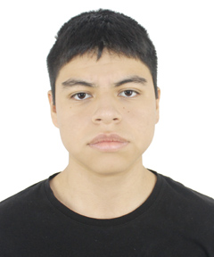 | Diaz Martinez, Alexther Kamil  (U202412316) | Estudiante de ingeniería de software, me gusta programar, tengo conocimiento en C++ y Python, me gustan los desafíos. Mi meta es aplicar mi optimismo y capacidad técnica para desarrollar software que genere un impacto real. |
|  | Dulanto Espino, Leo César (U202410254) | Estudiante de Ingeniería de Software, con conocimientos en C++, Python, y básico de web y Java. Me gusta crear soluciones creativas a los problemas, además de participar y apoyar al equipo en cualquier progreso o dificultad. |

## 1.2. Solution Profile

### 1.2.1. Antecedentes y problemática

La gestión sanitaria en el Perú enfrenta brechas estructurales en su arquitectura digital. La dependencia histórica de procesos manuales y sistemas aislados sitúa a los centros de salud en un estado de vulnerabilidad operativa frente a la demanda creciente de servicios.

La fragmentación de la información y la nula interoperabilidad entre plataformas. La ausencia de una infraestructura tecnológica centralizada obliga a la coexistencia de sistemas obsoletos. Esta carencia tecnológica mantiene los flujos de trabajo vinculados a procesos manuales que carecen de procesos estandarizados.

Esta deficiencia impacta directamente la operatividad en áreas críticas como admisión, consultorios y farmacia. El personal médico y administrativo enfrenta duplicidad de registros, inconsistencia en las historias clínicas, pérdida y deterioro de información, lo que eleva el riesgo de errores asistenciales. La falta de datos en tiempo real genera cuellos de botella que transforman la atención en una tarea propensa a retrasos administrativos.

Finalmente, la discontinuidad informativa se traduce en demoras y una menor calidad de atención para el paciente. A nivel gerencial, la precariedad de los datos limita la toma de decisiones estratégicas, especialmente en momentos de alta demanda. En consecuencia, el sistema no solo pierde eficiencia operativa, sino que compromete la seguridad de la salud pública.

***Técnica 5W2H***

*1. ¿Quiénes están involucrados o afectados? (Who?)*

Los principales actores involucrados son los establecimientos de salud del primer nivel (como organizaciones), así como sus usuarios internos: médicos, personal administrativo y de apoyo. Estos últimos se ven afectados por la falta de acceso oportuno a información integrada, lo que dificulta la atención y la gestión operativa. Asimismo, los pacientes se ven indirectamente afectados a través de demoras, duplicidad de registros y menor calidad en la atención.

*2. ¿Qué ocurre o qué problema se presenta? (What?)*

En el Perú, el problema en la gestión de los establecimientos de salud del primer nivel se manifiesta en la fragmentación y baja calidad de la información sanitaria, originada por el uso de sistemas de información no interoperables y la persistencia de procesos manuales, lo que afecta la eficiencia de la atención y limita la toma de decisiones oportunas. Asimismo, esta situación se refleja en el limitado desarrollo de los sistemas de gestión de información en salud, evidenciando debilidades estructurales del sistema sanitario (Banco Mundial, 2023, p. 6).

*3. ¿Cuándo se presenta el problema? (When?)*
El problema se presenta de manera continua a lo largo de todo el proceso de atención del paciente, desde el agendamiento de citas hasta la consulta médica, la prescripción de tratamientos, la dispensación de medicamentos y el proceso de facturación. Es especialmente crítico en momentos de alta demanda, donde la falta de integración y automatización incrementa los tiempos de espera y la probabilidad de errores.

*4. ¿Dónde sucede? (Where?)*
Esta problemática se manifiesta en diversas áreas del centro de salud, incluyendo admisión (registro y programación de citas), consultorios médicos (registro y diagnóstico), farmacia (dispensación de medicamentos) y caja (procesos de pago y facturación). La falta de integración entre estas áreas genera discontinuidad en el flujo de información.

*5. ¿Por qué ocurre? (Why?)*
El Ministerio de Salud del Perú (MINSA) evidencia importantes deficiencias en la gestión de la información en los establecimientos de salud, señalando la carencia de sistemas de información estandarizados y tableros de control que permitan evaluar la implementación de políticas como la atención integral de salud a nivel regional (Ministerio de Salud del Perú, 2011).

*6. ¿Cómo se manifiesta el problema? (How?)*
El problema se manifiesta en la práctica mediante la duplicidad de registros de pacientes, pérdida o inconsistencias en la información clínica, retrasos en la atención debido a procesos manuales, dificultades para acceder al historial médico completo y limitaciones en la coordinación entre áreas del establecimiento de salud.

*7. ¿Cuánto cuesta o cuál es la magnitud? (How much?)*

*Figura 1 (Macroproceso: sistema de información)*  
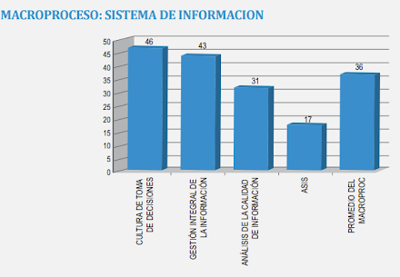
> **Nota.** Adaptado del Ministerio de Salud de Perú (2011).

El MINSA identificó brechas significativas en capacidades tecnológicas y de gestión, dado que el 71% de los establecimientos de salud no ha identificado sus necesidades en recursos informáticos ni en personal especializado, y el 72% no cuenta con métodos formales y permanentes para la evaluación, recolección, procesamiento y análisis de información (Ministerio de Salud del Perú, 2011).

### 1.2.2. Lean UX Process

#### *1.2.2.1. Lean UX Problem Statements*

KinetiaLabs presenta una plataforma web diseñada para optimizar la interacción entre médicos y pacientes, facilitando el acceso a información y servicios de salud. Mediante una interfaz intuitiva, atractiva y funcional, la solución garantiza una experiencia de usuario eficiente; nuestro objetivo central es agilizar los procesos clínicos y mitigar las ineficiencias de los modelos de atención tradicionales.

A la hora de acudir a un establecimiento médico, la agilidad en la gestión de los procesos es un factor importante para la resolución efectiva de las necesidades del paciente. No obstante, se han identificado deficiencias operativas significativas, tales como la dependencia de procesos manuales y el uso ineficiente de sistemas digitales, factores que derivan en retrasos y errores administrativos. Si bien existen intentos en mejorar sus sistemas, estos resultan insuficientes para cubrir la demanda del flujo operativo actual. Lo cual representa una oportunidad para implementar una solución que optimice y automatice de mejor manera la gestión médica.

¿Cómo podríamos asegurar la automatización y agilización de los procesos administrativos dentro de los establecimientos médicos?

#### *1.2.2.2. Lean UX Assumptions*

**Assumptions Worksheet**

1. ¿Quién es el usuario?

Tenemos 3 usuarios principales:
Pacientes: Personas de todas las edades que necesiten atención médica por algún inconveniente.
Médicos: Personal que atiende de forma directa a los pacientes, los cuales les brindan su diagnóstico según la situación.
Personal administrativo: Encargados de los procesos médicos, además de generar resúmenes y métricas de la actividad clínica.

2. ¿Dónde encaja nuestro producto en su trabajo o vida?

La aplicación encaja a la hora de realizar algún proceso médico, ya sea para cualquiera de los usuarios. Permite a los pacientes gestionar su historial clínico de forma sencilla, a los médicos organizar sus horarios de citas con mayor claridad y al personal administrativo contar con procesos automatizados que reducen la carga de trabajo manual.

3. ¿Qué problemas tiene nuestro producto que resolver?

El problema principal a resolver es la agilización de los procesos médicos, para lo cual se tiene que digitalizar y automatizar algunos procesos manuales o poco óptimos. Esto de la siguiente manera:
Pacientes: Brindarles acceso directo a historia médica, reservas de cita simple y posibilidad de compra de farmacia en linea.
Médicos: Permitirles una mejor gestión de su disponibilidad de citas, como también de sus recetas o diagnósticos brindados a sus pacientes.
Personal administrativo: Automatizar los procesos necesarios para sus trámites o generación de resúmenes y métricas.

4. ¿Cuándo y cómo es usado nuestro producto?

Es usado en general a la hora de querer realizar cualquier proceso médico, pero varía dependiendo del usuario.
Pacientes: A la hora que quieran agendar una cita o revisar algún diagnóstico o receta en su historial.
Médicos: En el manejo de sus horarios, envío de diagnósticos o recetas tras una cita, permitir un acceso rápido al historial de sus pacientes.
Personal administrativo: Al agilizar sus procesos para la elaboración de sus resúmenes o métricas.

5. ¿Qué características son importantes?

Manejo correcto de citas tanto para pacientes (reserva), como médicos (administrar disponibilidad).
Integración de farmacia en línea para agilizar obtención de recetas brindadas
Interfaz segmentada y accesible, para uso de cualquier tipo de paciente
Acceso inmediato al historial clínico de los pacientes tanto para ellos, como para los médicos.
Sincronización en tiempo real de la información entre el personal administrativo, médicos y pacientes.

6. ¿Cómo debería verse nuestro producto y cómo comportarse?
	
Debe presentar una interfaz organizada, minimalista y jerarquizada, eliminando cualquier distracción visual para que la lectura de datos críticos y el acceso a las funciones principales sean inmediatos para los tres tipos de usuario.
En términos de funcionamiento, se espera que la plataforma sea robusta, ágil y altamente eficiente, con una navegación fluida que priorice la rapidez en la gestión de citas y diagnósticos. Debe comportarse de forma que automatice tareas repetitivas y ofrezca respuestas en tiempo real, transmitiendo total seguridad y confianza a través de una buena gestión de datos entre los procesos administrativos y la atención al paciente.

**Assumptions**

- Creo que mis clientes necesitan una plataforma de gestión médica que agilice la atención y otros procesos médicos, facilitando el acceso a información clínica. El mercado objetivo comprende **300-450 establecimientos PNAS** con capacidad tecnológica y presupuestaria, **8,000-12,000 médicos** en establecimientos digitalizados, y **7.8 millones de pacientes** con seguimiento crónico.
- Estas necesidades se pueden resolver con procesos automatizados, accesos directos a información, recetas en línea y paneles de métricas integrados. Con **120 establecimientos migrando anualmente** a sistemas digitales, existe una ventana de oportunidad estratégica.
- Mis clientes iniciales son administradores de establecimientos (decisores de compra), seguidos por médicos que buscan reducir carga administrativa y pacientes crónicos que requieren seguimiento continuo.
- El valor #1 que un cliente quiere de mi servicio es la agilización real de procesos médicos, con **ROI documentado entre USD 40,000-125,000 LTV** por cliente en 5 años.
- El cliente también obtiene beneficios adicionales: mejor organización de disponibilidad (hasta 20% de reducción de tiempo), compra directa en farmacia digital (15% incremento en ventas) y reportes automatizados (30% menos horas administrativas).
- Voy a adquirir la mayoría de mis clientes a través de alianzas con centros médicos, policlínicos, clínicas privadas o consultorios independientes, priorizando el sector privado urbano donde la adopción es **78% en comparación a 42% en zonas rurales**.
- Haré dinero a través de modelos de suscripción SaaS dirigidos a establecimientos, con pricing diferenciado por tamaño. El mercado movió **USD 45 millones en 2024** con crecimiento anual proyectado de **12% hasta 2028**.
- Mi competencia principal serán plataformas de gestión de citas existentes y sistemas internos de las clínicas. Sin embargo, solo el **22% de médicos** utiliza actualmente sistemas integrados, indicando mercado insuficientemente penetrado.
- Los venceremos debido a nuestra propuesta que automatiza el **flujo completo** (admisión-consulta-farmacia), una interfaz optimizada para **3 tipos de usuario** y gestión de métricas que genera valor operativo tangible.
- Mi mayor riesgo de producto es la resistencia al cambio, especialmente en profesionales mayores de 45 años (**42% con disposición condicionada**), mitigado a través de interfaces intuitivas, capacitaciones y demostraciones de ROI.
- Proyecciones indican que para **2028, el 58% de médicos en PNAS** utilizará sistemas digitales integrados, representando **9,500 usuarios potenciales adicionales** en 3 años.

#### *1.2.2.3. Lean UX Hypothesis Statements*

**Hypothesis Statement 1: Acceso Digital reduce consultas presenciales**

Creemos que brindar acceso digital a resultados, diagnósticos y recetas electrónicas reducirá significativamente las consultas presenciales o telefónicas solo para obtención de información. Sabremos que lo hemos logrado cuando el número de solicitudes presenciales de copias de historias clínicas disminuya en **40% en los primeros 3 meses**, y las transacciones digitales representen **60% del total de interacciones paciente-establecimiento** en 6 meses.

**Hypothesis Statement 2: Agilización de reservas impulsa adopción digital**

Creemos que simplificar el proceso de reserva de citas a máximo 3 pasos agilizará la gestión y satisfacción de pacientes. Sabremos que lo hemos logrado cuando se registre **50% más reservas digitales comparado a métodos tradicionales** en los primeros 2 meses, y la tasa de no-presentismo disminuya en **25%** al enviar recordatorios automatizados.

**Hypothesis Statement 3: Automatización de reportes reduce carga administrativa**

Creemos que la automatización de métricas, resúmenes y auditoría eliminará la necesidad de reportes manuales al cierre de jornada. Sabremos que lo hemos logrado cuando el **personal administrativo reduzca 30% de horas semanales** en elaboración de informes, y la precisión de datos mejore en **95%** (error rate <5%).

**Hypothesis Statement 4: Viabilidad de mercado y escalabilidad**

Creemos que existe un mercado suficientemente grande y rentable para Vitalia en el segmento PNAS del Perú. Sabremos que lo hemos logrado cuando logremos **20-25 clientes en año 1** (8-10% de mercado objetivo inicial), **LTV de USD 40,000-50,000 por cliente** en modelo SaaS, y **tasa de retención de 85%** anuales.

#### *1.2.2.4. Lean UX Canvas*

**Lean UX Canvas Link:** [https://canva.link/ux7vanu08xalhmj](https://canva.link/ux7vanu08xalhmj)

*Figura 2 (Lean Product Canvas)*  
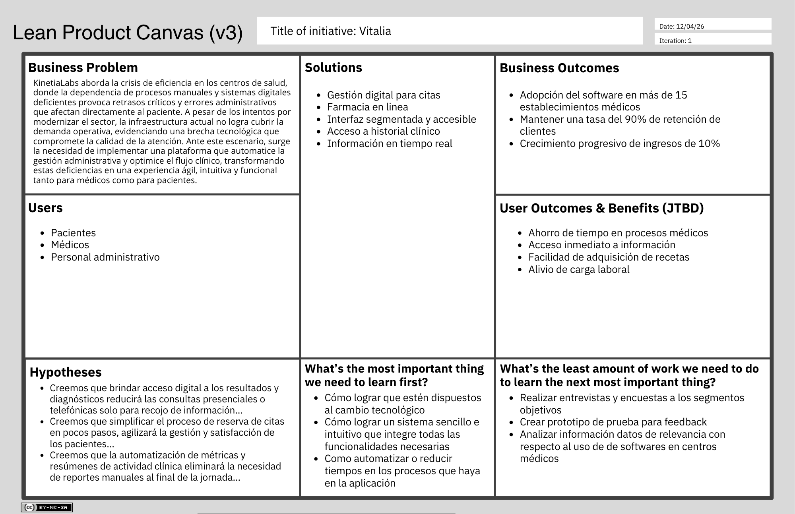

## 1.3. Segmentos objetivo

Esta sección presenta la descripción de los segmentos objetivo relacionados con el dominio del sistema Vitalia, incluyendo sus características principales, necesidades y comportamiento dentro del entorno de atención médica digital. Asimismo, se consideran aspectos relevantes que justifican su inclusión como parte del mercado objetivo de la solución.

**Primer Segmento Objetivo (Administradores de establecimientos de PNAS)**

Este segmento corresponde a los directores, gerentes o dueños de establecimientos del Primer Nivel de Atención de Salud (PNAS), quienes tienen la responsabilidad de la sostenibilidad financiera y operativa del centro. Son los principales tomadores de decisión para la adquisición de Vitalia.

*Características demográficas*

| Pregunta | Respuesta |
| --- | --- |
| ¿Cúal es el rango de edad? | 20 a 65 años. |
| ¿A qué red pertenece? | Pueden formar parte de la red pública del Estado (como MINSA o EsSalud en Perú). O ejercer de manera privada. |
| ¿Qué tipo de función tiene? | Gestionan centros de atención médica que sirven como la puerta de entrada al sistema de salud, priorizando la medicina preventiva, diagnósticos y tratamientos. |
| ¿Cuál es su presupuesto? | El presupuesto donde gestionan varía según su naturaleza: - En el sector público, depende de asignaciones estatales y suele estar limitado por recursos y demanda. - En el sector privado, depende del volumen de pacientes y servicios ofrecidos, aunque generalmente es menor en comparación con clínicas de mayor complejidad. |
| ¿Cómo es la infraestructura de los establecimientos? | La infraestructura es variable: - Policlínicos: infraestructura intermedia con varios consultorios. - Clínicas: infraestructura más completa y equipada. - Consultorios independientes: infraestructura básica y limitada.  Tomando en cuenta que en establecimientos públicos, puede ser limitada o con restricciones operativas y en privados, puede ser más moderna y de alto flujo. |
| ¿Cuánta es la cantidad de personal? | De acuerdo al establecimiento: - Policlínicos: varios médicos y personal administrativo.  Clínicas: mayor cantidad de personal y especialización.  Consultorios independientes: personal mínimo, a veces solo el médico. |
| ¿Cuánto es el stock de medicamentos? | El manejo de stock de medicamentos e insumos puede ser variable: - En el sector público, condicionado por abastecimiento estatal. - En el privado, dependiente de gestión interna, muchas veces sin sistemas automatizados. |

*Factores Demográficos de Mercado*

En el Perú existen aproximadamente **1,247 establecimientos del Primer Nivel de Atención de Salud (PNAS)**, distribuidos entre redes públicas (MINSA, EsSalud) y sector privado. La distribución geográfica se concentra principalmente en áreas urbanas: Lima concentra el 28% de establecimientos privados, seguida por Arequipa (8%), Cusco (7%) y otras ciudades principales. En el sector público, la cobertura es más dispersa, con énfasis en zonas rurales y periurbanas.

El mercado objetivo para Vitalia abarca entre **300 a 450 establecimientos** (24% a 36% del total) que cuentan con capacidad técnica y presupuestaria para implementar soluciones digitales. De estos, aproximadamente **120 establecimientos por año** (4% de crecimiento anual) migran hacia sistemas informatizados, representando una oportunidad de mercado en expansión. Las clínicas y policlínicos privadas presentan mayor disposición a adoptar tecnología (78% según estudios TMS), mientras que establecimientos públicos requieren ciclos de adopción más prolongados debido a procesos burocráticos.

En términos financieros, el mercado de soluciones de gestión médica en el Perú movió **USD 45 millones en 2024**, proyectando un crecimiento anual del 12% hasta 2028. La inversión promedio por establecimiento es de **USD 8,000 a USD 25,000** anuales, dependiendo del tamaño y complejidad operativa. Esto representa un **Valor de Vida Útil (LTV) potencial de USD 40,000 a USD 125,000 por cliente** en un contrato de 5 años.

*Hábitos y Motivación*

- Manejan un alto flujo diario de pacientes, lo que los obliga a priorizar la rapidez en la atención sobre la organización administrativa.
- Su proceso de citas suele ser reactivo (llamadas, atención presencial). Buscan optimizar la gestión de citas, pacientes y recursos para mejorar la eficiencia operativa.
- Buscan maximizar la rotación de pacientes por consultorio, ya que su sostenibilidad depende del volumen de atenciones realizadas.
- Existe interés en soluciones digitales que se adapten a su nivel de complejidad y capacidad económica; dependiendo de que la solución sea fácil de implementar, no interrumpa la atención y genere beneficios operativos claros.

*Información del Sustento*

El nivel de digitalización en los policlínicos públicos se encuentra regulado por la Ley N° 30024, que promueve el uso de Historias Clínicas Electrónicas (HCE). Sin embargo, en la práctica, muchos establecimientos operan con sistemas antiguos y no interoperables, lo que limita el intercambio eficiente de información entre áreas y profesionales de salud. En el sector privado, el nivel de digitalización es variable, dependiendo del tamaño, capacidad económica y grado de modernización de cada establecimiento. Mientras algunas clínicas han avanzado en la implementación de sistemas digitales, otros centros aún dependen de herramientas básicas o procesos manuales.

Adicionalmente, la Ley de Protección de Datos Personales exige que el manejo de información sensible, como los datos de salud, cumpla con estrictos protocolos de seguridad, incluyendo mecanismos de cifrado y control de acceso, lo que representa un desafío adicional para muchos establecimientos que no cuentan con infraestructura tecnológica adecuada.

En términos de eficiencia y adopción tecnológica, el Estado reportó que durante el año 2025 se superaron los 1.6 millones de atenciones digitales, evidenciando una creciente familiaridad de los pacientes con servicios digitales. Asimismo, según un informe de la consultora Total Market Solutions (TMS), las clínicas y centros médicos privados registraron un crecimiento del 9% hacia 2025, impulsado principalmente por la incorporación de tecnologías que permiten reducir los tiempos de espera y mejorar la satisfacción del paciente hasta en un 40%.

En este contexto, se evidencia una clara brecha entre la necesidad de digitalización y la capacidad real de implementación en los establecimientos de salud. Vitalia surge como una solución que responde a esta problemática.

**Segundo Segmento Objetivo (Doctores de establecimientos de PNAS)**

Este segmento corresponde a los médicos que laboran en establecimientos del Primer Nivel de Atención de Salud (PNAS), incluyendo policlínicos, clínicas y consultorios independientes. Son los principales usuarios del sistema en la operación diaria, encargados de la atención directa al paciente, el registro de información clínica y el seguimiento de tratamientos.

*Características demográficas*

| Pregunta | Respuesta |
| --- | --- |
| ¿Qué rango de edad tienen? | Se identifican dos subgrupos principales: - Nativos Digitales (25 a 40 años): Médicos jóvenes y residentes que exigen herramientas tecnológicas modernas y rechazan el uso de papel. - Inmigrantes Digitales (41 a 65 años): Médicos con amplia experiencia que, aunque habituados al sistema tradicional, buscan soluciones simples que no compliquen su flujo de trabajo actual. |
| ¿Cuál es su carga laboral? | Atienden un alto volumen de pacientes por jornada, lo que genera una presión constante por reducir el tiempo administrativo. |
| ¿Qué responsabilidad legal enfrentan? | Obligación de registro preciso bajo estándares de SUSALUD y la emisión de recetas claras para evitar errores de medicación. |

*Factores Demográficos de Mercado*

El Perú registra aproximadamente **68,000 médicos colegiados**, de los cuales **22,500 a 28,000** laboran en establecimientos del PNAS (33% a 41% del total). En establecimientos privados, la concentración es mayor en Lima con 45% del total de médicos especializados, mientras que en el sector público existe mayor dispersión territorial. La edad promedio de médicos activos es de 42 años, con un 35% correspondiente a nativos digitales (menores de 40 años) que representan el segmento con mayor disposición a adoptar herramientas digitales.

La población de médicos en PNAS crece a una tasa de **2.8% anual**, impulsada por nuevas promociones de universidades y reinserción de profesionales. El mercado objetivo directo para Vitalia abarca **8,000 a 12,000 médicos** en establecimientos que cuentan con infraestructura digital mínima. Estudios regionales indican que el **64% de médicos menores de 45 años** adoptaría herramientas que reduzcan carga administrativa, mientras que el **42% de médicos mayores de 45 años** muestra disposición condicionada a facilidad de uso.

Desde la perspectiva de adopción de tecnología, proyecciones de la Asociación Médica Peruana estiman que para **2028, el 58% de médicos en PNAS** utilizará sistemas de gestión digital integrados, frente al actual 22%. Esto representa un **incremento de 9,500 usuarios potenciales en los próximos 3 años**, con una tasa de penetración estimada del 15-20% para Vitalia.

*Hábitos y Motivación*

- Priorizan la rapidez en la atención debido a la alta demanda de pacientes.
- Buscan acceder de forma inmediata al historial clínico del paciente para mejorar la precisión del diagnóstico.
- Tienden a evitar sistemas complejos que interfieran con el flujo de la consulta médica.
- Valoran herramientas que reduzcan el tiempo de registro de información clínica.
- Buscan mejorar la continuidad de atención del paciente mediante un mejor seguimiento médico.
- Muestran mayor disposición a usar tecnología cuando esta simplifica su trabajo y no aumenta su carga operativa.

*Información del Sustento*

El principal obstáculo del médico moderno es la denominada carga administrativa, la cual impacta directamente en la calidad y eficiencia de la atención médica. Diversos estudios, 
globales como regionales, evidencian que los médicos pueden llegar a dedicar una cantidad de tiempo similar a tareas administrativas (como el llenado de formularios y registros) en comparación con la atención directa a pacientes.

En este sentido, la Organización Panamericana de la Salud señala que la implementación de Historias Clínicas Electrónicas (HCE) adecuadamente diseñadas puede reducir hasta en un 20% el tiempo destinado a estas tareas, permitiendo una atención más eficiente, precisa y centrada en el paciente.

Desde el punto de vista legal, en el Perú, el médico es el responsable directo de la información registrada en la historia clínica. El uso de sistemas no integrados o procesos manuales incrementa el riesgo de errores, inconsistencias y problemas durante auditorías. En este marco, la Norma Técnica de Salud N° 022-MINSA/DGSP establece los estándares para la adecuada gestión de la historia clínica, reforzando la importancia de contar con sistemas confiables y estructurados.

En este contexto, la adopción de herramientas digitales que optimicen el registro clínico, reduzcan la carga administrativa y faciliten el acceso a la información se vuelve fundamental para mejorar la eficiencia del trabajo médico, en el cual Vitalia responde a esta problemática al ofrecer una plataforma intuitiva, rápida e integrada, diseñada para adaptarse al flujo de trabajo del médico.

**Tercer Segmento Objetivo (Pacientes de todas las edades)**

Este segmento representa al beneficiario final de los servicios de salud brindados en los establecimientos de PNAS. Su experiencia con el sistema Vitalia es indirecta pero crítica, ya que la modernización del centro impacta directamente en la calidad, rapidez y seguridad de su atención médica.

*Características demográficas*

| Pregunta | Respuesta |
| --- | --- |
| ¿Qué rango de edad tienen? | El mercado es universal, pero se segmenta por su relación con la tecnología: - Nativos Digitales (18 a 44 años): Usuarios que buscan inmediatez, comunicación digital y prefieren establecimientos que les permitan gestionar su salud desde el celular. - Adultos y Cuidadores (45 a 64 años): Usuarios que valoran el orden y la claridad, actuando muchas veces como responsables de la salud de sus hijos o padres ancianos. - Adultos Mayores (65+ años): Beneficiarios que requieren procesos simplificados, recetas legibles y un historial centralizado para el manejo de enfermedades crónicas. |
| ¿Qué nivel de acceso tecnológico poseen? | Uso masivo de dispositivos móviles inteligentes y familiaridad con aplicaciones de servicios básicos (banca, mensajería y trámites gubernamentales). |
| ¿Cuál es su frecuencia de atención? | Varía desde pacientes con dolencias agudas (atenciones esporádicas) hasta pacientes crónicos que requieren un control mensual de recetas y citas de seguimiento. |

*Factores Demográficos de Mercado*

Peru registra una población total de **34.3 millones de habitantes**, de los cuales **28.4 millones** (82.7%) acceden a servicios de salud en el PNAS. La población distribuida por grupos etarios relevantes es: Nativos Digitales (18-44 años): **13.2 millones** (38.5%), Adultos (45-64 años): **7.1 millones** (20.7%), Adultos Mayores (65+ años): **2.8 millones** (8.2%). La penetración de dispositivos móviles inteligentes en áreas urbanas alcanza el **78%**, mientras que en zonas rurales es del **42%**, presentando una oportunidad de crecimiento en inclusión digital.

La demanda de atención médica en PNAS es consistente, con **156 millones de atenciones anuales** registradas en 2024 (crecimiento del 4.2% anual). Del total de atenciones: **65% corresponde a consultas agudas**, **28% a control crónico** y **7% a preventiva**. Los pacientes con seguimiento crónico representan el segmento de mayor valor para adopción digital, siendo **7.8 millones de usuarios potenciales** que requerirían acceso frecuente a servicios digitales (reserva de citas, consulta de historiales, recetas electrónicas).

En términos de adopción tecnológica, **durante 2025 se registraron 1.6 millones de atenciones digitales** (telemedicina y gestión digital), con crecimiento proyectado del 18% anual hasta 2028. El porcentaje de pacientes dispuestos a utilizar aplicaciones de salud alcanza el **72% en áreas urbanas**, siendo la edad promedio de adopción temprana de **29 años**. Vitalia dirigiéndose a establecimientos con **promedio de 250 a 1,500 pacientes activos mensuales**, representa un potencial de impacto de **2 a 9 millones de pacientes** al alcanzar una penetración del 20% en establecimientos objetivo.

*Hábitos y Motivación*

- Buscan rapidez en la atención médica y reducción de tiempos de espera.
- Prefieren procesos simples para agendar citas y acceder a servicios.
- Muestran una creciente adaptación al uso de herramientas digitales en salud.
- Buscan mayor transparencia y control sobre su información médica.

*Información del Sustento*

Uno de los principales problemas que enfrentan los pacientes al recibir una prescripción médica es la dificultad para comprenderla o conservarla adecuadamente. La ilegibilidad de las recetas físicas y la pérdida de documentos pueden generar errores en la medicación y afectar la continuidad del tratamiento. En este sentido, un estudio publicado en Taylor & Francis, señala que la implementación de sistemas de prescripción electrónica puede reducir los errores de medicación hasta en un 49.8%, mitigando riesgos asociados a la mala interpretación y comunicación de las indicaciones médicas.

Asimismo, en el Perú, la Ley N° 29414 (Art. 15) establece que todo paciente tiene derecho a recibir información “precisa y oportuna” sobre su estado de salud. Complementariamente, el Reglamento aprobado mediante el D.S. N° 027-2015-SA obliga a las IPRESS a garantizar que la historia clínica sea veraz, completa y accesible. En este contexto, la digitalización de la información médica permite cumplir con estos lineamientos, asegurando que los datos sean legibles, organizados y disponibles para el paciente.

Desde una perspectiva económica, el uso de Historias Clínicas Electrónicas (HCE) contribuye a reducir gastos innecesarios, ya que evita la repetición de exámenes médicos al permitir que el profesional de salud acceda de manera inmediata a los resultados previos del paciente. Esto no solo mejora la seguridad clínica, sino también optimiza el gasto del paciente en su atención médica.

# Capítulo II: Requirements Elicitation & Analysis

## 2.1. Competidores

### 2.1.1. Análisis competitivo

**Competitive Analysis Landscape**

*¿Por qué llevar a cabo este análisis?*

Realizar un análisis competitivo es fundamental para comprender el entorno en el que se desarrollará Vitalia, identificando las soluciones existentes, sus limitaciones y las oportunidades del mercado. Este análisis permite reconocer las fortalezas y debilidades de los competidores, detectar brechas; especialmente en el Primer Nivel de Atención de Salud (PNAS), y definir una propuesta de valor diferenciada, alineada a las necesidades reales de los segmentos objetivo. Asimismo, resulta clave para posicionar a Vitalia como una solución más accesible, simple y adaptada al sistema de salud peruano, frente a alternativas complejas, costosas o poco eficientes.

*Logos*

| Vitalia | Doctoralia | Medilink | AgendaPro |
| --- | --- | --- | --- |
|  |  |  |  |

*Perfil*

|     | Vitalia | Doctoralia | Medilink | AgendaPro |
| --- | --- | --- | --- | --- |
| Overview | SaaS integral para establecimientos del Primer Nivel de Atención de Salud (PNAS) que centraliza la historia clínica electrónica y permite gestionar citas, recetas, exámenes, diagnósticos y más. Integra módulos de farmacia y facturación electrónica, optimizando la atención médica y la gestión operativa del centro de salud. | Es un marketplace médico masivo. Su función principal es servir como un buscador donde los pacientes pueden encontrar especialistas, ver opiniones de otros usuarios y reservar una cita. | Herramienta de gestión administrativa y operativa para clínicas. Es un sistema integral que abarca desde la recepción del paciente hasta el control de pagos y el inventario de insumos. | Aplicación especializada en la gestión de citas, expedientes clínicos, agenda en línea, videoconsulta y facturación. Está diseñada para centros que requieren una agenda muy dinámica y contacto constante con el cliente. |
| Ventaja competitiva ¿Qué valor ofrece a los clientes? | Ecosistema Clínico Unificado: Su valor radica en la integración nativa de la parte médica con la operativa (farmacia y facturación). A diferencia de otros, no es un parche administrativo, sino una herramienta diseñada para que el flujo desde la reserva hasta la salida del paciente sea una sola línea de datos sin fricciones. | Atracción de pacientes nuevos: Ofrece una infraestructura de marketing que garantiza que el médico sea visible globalmente. Su ventaja es la conversión. Convierte búsquedas en citas médicas confirmadas gracias a su sistema de reseñas y su posicionamiento web. | Inteligencia Operativa y Financiera: Solución robusta de gestión clínica y administrativa que permite un alto control operativo del establecimiento, especialmente en procesos internos como inventario, facturación y flujo de caja. | Especialización en agendamiento y gestión de clientes: Garantiza alta usabilidad y rapidez de implementación, ideal para negocios que requieren optimizar la programación de citas y la comunicación con usuarios. |

*Perfil de marketing*

|     | Vitalia | Doctoralia | Medilink | AgendaPro |
| --- | --- | --- | --- | --- |
| Mercado Objetivo | El mercado objetivo de Vitalia está dirigido a administradores, médicos y pacientes del Primer Nivel de Atención de Salud (PNAS), tanto del sector público como privado. | Médicos independientes y clínicas que buscan atraer más pacientes, así como usuarios digitales que desean encontrar y agendar citas médicas en línea. | Establecimientos de salud medianos y grandes que requieren un alto nivel de control administrativo, financiero y operativo en sus procesos internos. | Negocios de servicios (incluyendo salud) que necesitan optimizar la gestión de citas y la relación con clientes, especialmente aquellos con alta rotación de agenda. |
| Estrategias de Marketing | Redes Sociales y Alianzas Institucionales: Autoridad Normativa y Difusión: Se alían con el MINSA y entidades privadas para ser el estándar de formalización médica. Utilizan campañas y redes sociales para demostrar que su ruta digital unificada garantiza una atención más ágil y profesional. | SEO (Search Engine Optimization) y Reputación: Se aseguran de aparecer primeros en Google. Usan el sistema de opiniones (estrellas) para que los médicos compitan entre sí por ser los mejor valorados. | Venta Corporativa (B2B): Se enfocan en eventos de salud, demostraciones personalizadas para gerentes y marketing basado en la "eficiencia administrativa" y el retorno de inversión. | Automatización y Redes Sociales: Apuesta por la publicidad masiva en redes sociales y la automatización, vendiendo la idea de "cero inasistencias" y una agenda siempre llena con el mínimo esfuerzo de gestión. |

*Perfil de producto*

|     | Vitalia | Doctoralia | Medilink | AgendaPro |
| --- | --- | --- | --- | --- |
| Productos y Servicios | Historia clínica electrónica (HCE), gestión de citas, recetas digitales, exámenes y diagnósticos, módulo de farmacia, facturación electrónica, dashboards por rol, portal del paciente. | Marketplace médico, búsqueda de especialistas, reservas de citas online, sistema de reseñas y calificaciones, perfiles profesionales, visibilidad digital. | Gestión administrativa clínica, reservas de citas, facturación, control de pagos, inventario de insumos, gestión operativa del establecimiento. | Gestión de citas y agenda, expedientes básicos, reservas online, recordatorios automáticos, videoconsultas, facturación, gestión de clientes. |
| Precios y costos | Modelo de precios accesible y escalable según el tipo de establecimiento. Para consultorios independientes, cuenta con un Plan Independiente que oscila entre S/ 150 y S/ 250 mensuales, incluyendo un número razonable de usuarios (aproximadamente 5 a 10 médicos activos). En el caso de clínicas privadas y públicas, dispone de un Plan de Asociación Estratégica desde S/ 300 hasta S/ 600 mensuales como base, el cual puede variar en función de la cantidad de sedes y usuarios requeridos. | Opera bajo un modelo de suscripción enfocado en visibilidad, con planes anuales como Plan Plus (S/ 2,390), Plan Anual (S/ 2,990) y Plan VIP (S/ 3,590), este último ofreciendo mayor prioridad en el buscador. | Utiliza un esquema SaaS por usuario, con el Plan Pro desde $35 mensuales por el primer profesional más $9 por cada médico adicional, o $350 anuales, y el Plan Advanced desde $40 mensuales o $400 anuales. | Ofrece planes escalables según número de profesionales, desde $9 mensuales (Plan Individual), $29 (Básico), $59 (Premium hasta 5 usuarios) hasta $199 mensuales (Plan Pro ilimitado). |
| Canales de distribución (Web y/o móvil) | Plataforma web, acceso desde navegador, implementación digital, marketing B2B y canales online. | Plataforma web, aplicación móvil, posicionamiento en buscadores (SEO), marketing digital, marketplace online. | Plataforma web, implementación personalizada, ventas B2B directas, demostraciones comerciales, canales corporativos. | Plataforma web, aplicación móvil, marketing digital, onboarding online, canales digitales y redes sociales. |

*Análisis SWOT*

|     | Vitalia | Doctoralia | Medilink | AgendaPro |
| --- | --- | --- | --- | --- |
| Fortalezas | Plataforma web, aplicación móvil, marketing digital, onboarding online, canales digitales y redes sociales. | Alta visibilidad y captación de pacientes, fuerte posicionamiento en buscadores, sistema de reputación (reseñas). | Control administrativo y financiero robusto, gestión interna completa del establecimiento, enfoque en operaciones. | Alta usabilidad, rápida implementación, fuerte en gestión de citas y automatización. |
| Debilidades | Menor posicionamiento en el mercado, dependencia de adopción tecnológica en centros de salud. | No gestiona procesos clínicos internos ni historia médica, dependencia de visibilidad para generar valor. | Complejidad de uso, enfoque más administrativo que clínico, implementación más pesada. | No especializado en salud, funcionalidades clínicas limitadas, enfoque genérico. |
| Oportunidades | Baja digitalización en el Primer Nivel de Atención de Salud (PNAS), necesidad de integrar procesos clínicos y administrativos, impulso de normativas como la historia clínica electrónica, y creciente demanda de soluciones accesibles, simples y adaptadas al contexto peruano. | Expansión en servicios digitales de salud, mayor adopción de reservas online. | Aumento de la necesidad de digitalización en clínicas, exigencias de control financiero y normativas que impulsan el uso de sistemas más estructurados. | Creciente adopción de herramientas digitales simples para gestión de citas y demanda de automatización en la atención al cliente. |
| Amenazas | Competidores ya posicionados, resistencia al cambio en el sector salud, limitaciones tecnológicas en algunos centros. | Nuevos SaaS más simples, resistencia a sistemas complejos. | Nuevos SaaS más simples, resistencia a sistemas complejos. | Competidores especializados en salud, baja diferenciación en el sector médico. |

### 2.1.2. Estrategias y tácticas frente a competidores

**Plan accesible y escalable**  
Ofreceremos planes adaptados al Primer Nivel de Atención de Salud (PNAS), con costos significativamente más accesibles que soluciones complejas como Medilink, permitiendo a consultorios y clínicas adoptar el sistema sin una alta inversión inicial.

**Implementación simple y rápida**  
Vitalia prioriza un onboarding digital sin necesidad de infraestructura adicional, diferenciándose de sistemas que requieren procesos de implementación largos o soporte técnico intensivo.

**Integración total del sistema**  
Unificamos historia clínica, citas, recetas, farmacia y facturación en una sola plataforma, superando la fragmentación de herramientas como Doctoralia (captación), AgendaPro (agenda) y otros sistemas parciales.

**Adaptación al contexto peruano**  
Vitalia se diseña considerando normativas locales y necesidades reales del PNAS, a diferencia de soluciones internacionales o genéricas que no se ajustan al entorno regulatorio ni operativo del país.

## 2.2. Entrevistas

### 2.2.1. Diseño de entrevistas

**Primer Segmento Objetivo (Administradores de establecimientos de PNAS)**

1. ¿Cuál es su rol dentro del establecimiento de salud y qué responsabilidades tiene en la gestión?
2. ¿Qué sistemas o herramientas utilizan actualmente para gestionar citas, historias clínicas y facturación?
3. ¿Qué dificultades enfrentan en la gestión de información y coordinación entre áreas?
4. ¿Qué tan integrados están los sistemas que utilizan actualmente?
5. ¿Qué aspectos considera más importantes al implementar un nuevo sistema? (costo, uso, integración, etc)
6. ¿Ha considerado implementar un sistema integral de gestión clínica? ¿Por qué?
7. ¿Qué características consideraría indispensables para tal sistema?
8. ¿Cómo evalúa actualmente el desempeño del centro de salud y qué tipo de información le gustaría tener para mejorar la toma de decisiones?

**Segundo Segmento Objetivo (Doctores de establecimientos de PNAS)**

1. ¿Cómo es su flujo de trabajo durante una consulta médica típica?
2. ¿Qué herramientas utiliza actualmente para registrar información del paciente?
3. ¿Qué dificultades encuentra al acceder o registrar información clínica?
4. ¿Ha tenido problemas con información incompleta, errónea o duplicada de pacientes?
5. ¿Qué tan fácil le resulta gestionar citas, recetas y exámenes con los sistemas actuales?
6. ¿Qué funciones le ahorrarían más tiempo en su trabajo diario?
7. ¿Qué tan cómodo se siente utilizando herramientas digitales para el registro de información?
8. ¿Qué características le gustaría tener en un sistema ideal de historia clínica electrónica?

**Tercer Segmento Objetivo (Pacientes de todas las edades)**

1. ¿Cómo suele agendar sus citas médicas actualmente?
2. ¿Qué dificultades ha tenido al atenderse en centros de salud?
3. ¿Ha tenido problemas con la pérdida de información médica o repetición de exámenes?
4. ¿Qué tan fácil es para usted acceder a sus resultados o historial médico?
5. ¿Qué tan importante sería para usted recibir recordatorios de citas?
6. ¿Cuánto tiempo suele esperar para conseguir una cita o ser atendido, y cómo se siente al respecto a ese tiempo?
7. ¿Qué tan cómodo se siente realizando pagos o trámites de salud de manera digital?
8. ¿Usaría una plataforma que le permita ver su historial, recetas y citas en un solo lugar?

### 2.2.2. Registro de entrevistas

**Needfinding Interviews Link:** [https://upcedupe-my.sharepoint.com/:v:/g/personal/u202410678_upc_edu_pe/IQDgJy2PUoP0TYZDkGzJovVSAdekNtVsyw0nG7B4hpjrJgY?e=cRDMrY&nav=eyJyZWZlcnJhbEluZm8iOnsicmVmZXJyYWxBcHAiOiJTdHJlYW1XZWJBcHAiLCJyZWZlcnJhbFZpZXciOiJTaGFyZURpYWxvZy1MaW5rIiwicmVmZXJyYWxBcHBQbGF0Zm9ybSI6IldlYiIsInJlZmVycmFsTW9kZSI6InZpZXcifX0%3D](https://upcedupe-my.sharepoint.com/:v:/g/personal/u202410678_upc_edu_pe/IQDgJy2PUoP0TYZDkGzJovVSAdekNtVsyw0nG7B4hpjrJgY?e=cRDMrY&nav=eyJyZWZlcnJhbEluZm8iOnsicmVmZXJyYWxBcHAiOiJTdHJlYW1XZWJBcHAiLCJyZWZlcnJhbFZpZXciOiJTaGFyZURpYWxvZy1MaW5rIiwicmVmZXJyYWxBcHBQbGF0Zm9ybSI6IldlYiIsInJlZmVycmFsTW9kZSI6InZpZXcifX0%3D)

**Primer Segmento Objetivo (Administradores de establecimientos de PNAS)**

**Entrevista 1**

| Entrevistado: | Entrevistadora: Alejandra Astocondor |
| ------------- | -------------- |
|  |  |
| Inicia: | 13:23 |
| Duración:| 4:04 |
| Nombre completo: | Christian David Bazan Calderon |
| Edad: | 46 |
| Distrito: | Surco |
| Resumen: | Christian señala que actualmente utilizan múltiples herramientas no integradas (teléfono, Excel, WhatsApp y facturación electrónica). Identifica como principal problema la falta de integración, lo que genera ineficiencias. Considera que el uso y la adaptación del personal son factores clave para implementar un nuevo sistema. Propone un sistema integral que conecte citas, historias clínicas, facturación y servicios como laboratorio e imágenes. Destaca que la digitalización permite ahorrar tiempo, recursos y mejorar la toma de decisiones. |

**Entrevista 2**

| Entrevistado: | Entrevistadora: Alejandra Astocondor |
| ------------- | -------------- |
|  |  |
| Inicia: | 17:27 |
| Duración: | 7:38 |
| Nombre completo: | Diego Leonardo Bazan Calderon |
| Edad: | 36 |
| Distrito: | San Juan de Miraflores |
| Resumen: | Diego describe el uso de múltiples plataformas (WhatsApp, Google Calendar, sistema en Access y software de facturación), lo que genera duplicación de datos. Considera que la integración es el principal valor de un nuevo sistema, seguido del costo. También destaca la importancia de cumplir con la normativa peruana y permitir integraciones mediante APIs. Subraya el valor del análisis de datos para la toma de decisiones estratégicas, como identificar servicios más rentables o perfiles de pacientes. |

**Entrevista 3**

| Entrevistada: | Entrevistadora: Alejandra Astocondor |
| ------------- | -------------- |
|  |  |
| Inicia: | 25:40 |
| Duración: | 4:20 |
| Nombre completo: | Iris Carpio Bazan |
| Edad: | 64 |
| Distrito: | La Victoria |
| Resumen: | Iris explica que utilizan el sistema SIHCE, pero aún no existe integración completa entre áreas como admisión, laboratorio y atención médica. Considera que el principal reto es la interconexión de servicios. Destaca que el sistema debe ser fácil de usar, especialmente para personal mayor, y que los recursos económicos son una limitante importante. Su objetivo es mejorar la eficiencia del servicio y reducir tiempos de espera. |

**Segundo Segmento Objetivo (Doctores de establecimientos de PNAS)**

**Entrevista 1**

| Entrevistada: | Entrevistadora: Alejandra Astocondor |
| -------------- | -------------- |
|  |  |
| Inicia: | 0:00 |
| Duración: | 4:57 |
| Nombre completo: | Carmen Patricia Gabriela Perez |
| Edad: | 62 años |
| Distrito: | Lima |
| Resumen: | La doctora describe una consulta breve y estructurada de aproximadamente 12 minutos, donde realiza preguntas rápidas para obtener una visión general del paciente antes de profundizar en el motivo principal. Utiliza el sistema ESI para registrar información clínica, pero enfrenta limitaciones como el poco tiempo disponible y fallas del internet que incluso ocasionan pérdida de datos. Aunque no ha tenido errores de duplicidad, reconoce que pueden ocurrir. Se siente cómoda con el uso de herramientas digitales y valora su eficiencia frente al registro manual. Propone como mejora un sistema inteligente que genere resúmenes automáticos del historial y que permita registrar información mediante reconocimiento de voz. |

**Entrevista 2**

| Entrevistado: | Entrevistadora: Alejandra Astocondor |
| ------------- | -------------- |
|  |  |
| Inicia | 4:57 |
| Duración: | 4:50 |
| Nombre completo: | Jorge Mendoza Toribio |
| Edad: | 35 años |
| Distrito: | Lima |
| Resumen: | El médico explica un flujo clínico ordenado basado en anamnesis, examen físico y plan de tratamiento. Utiliza historia clínica electrónica y considera que el sistema es funcional, aunque presenta problemas de conectividad entre establecimientos y lentitud por sobrecarga. No ha experimentado errores en los datos. Indica que la gestión de recetas y exámenes es sencilla con experiencia. Propone implementar un triaje previo para optimizar el tiempo de consulta y resalta la importancia de integrar sistemas entre distintas instituciones de salud. |

**Entrevista 3**

| Entrevistado: | Entrevistadora: Alejandra Astocondor |
| ------------- | -------------- |
|  |  |
| Inicia | 9:47 |
| Duración: | 3:36 |
| Nombre completo: | Jose Miguel Mejia Azañero |
| Edad: | 40  |
| Distrito: | Lima |
| Resumen: | El entrevistado describe consultas de duración de 12 minutos en promedio y el uso del sistema ESI sin mayores dificultades. El principal problema es la lentitud del sistema o del internet. Considera que la gestión de citas, recetas y exámenes es sencilla, pero puede optimizarse. Sugiere incorporar triaje previo y automatizar funciones como la repetición de recetas con un solo clic. Se siente cómodo con herramientas digitales y enfatiza la necesidad de mayor rapidez y eficiencia. |

**Tercer Segmento Objetivo (Pacientes de todas las edades)**

**Entrevista 1**

| Entrevistada: | Entrevistador: Nestor Rojas |
| ------------- | -------------- |
|  |  |
| Inicia | 30:00 |
| Duración: | 5:08 |
| Nombre completo: | Gianella Levice |
| Edad: | 30 |
| Distrito: | Los Olivos |
| Resumen: | La paciente describe una experiencia positiva en clínicas privadas, donde puede agendar citas fácilmente mediante aplicaciones o páginas web. Destaca la rapidez, la disponibilidad de opciones y el acceso digital a resultados médicos. Valora los recordatorios de citas por múltiples canales. Señala que este nivel de digitalización aún no se replica en el sistema público. Considera muy útil una plataforma que integre toda la información médica. |

**Entrevista 2**

| Entrevistado: | Entrevistador: Kamil Diaz |
| ------------- | -------------- |
|  |  |
| Inicia | 35:09 |
| Duración: | 4:46 |
| Nombre completo: | Jean Pool Miller Barco |
| Edad: | 20 |
| Distrito: | San Isidro |
| Resumen: | El paciente menciona dificultades como falta de especialistas, largas esperas y desorganización. Ha sufrido pérdida de información médica, lo que lo obligó a repetir exámenes. Indica que los resultados suelen manejarse en papel, lo que complica el acceso. Considera fundamental contar con recordatorios y una plataforma digital integrada. Se siente cómodo con pagos digitales, pero exige que sean intuitivos. |

**Entrevista 3**

| Entrevistado: | Entrevistador: Adrian Ruiz |
| ------------- | -------------- |
|  |  |
| Inicia | 39:55 |
| Duración: | 5:10 |
| Nombre completo: | Luis Vasquez Molina |
| Edad: |  71 |
| Distrito: | Lince |
| Resumen: | El paciente señala que tiene dificultades para agendar citas por teléfono y que no siempre obtiene respuesta inmediata. También experimenta problemas para acceder a resultados y carece de un sistema digital donde visualizar su historial. Considera útiles los recordatorios, pero muestra limitaciones en el uso de herramientas digitales, especialmente en pagos. Valora la idea de una plataforma integrada, aunque necesita que sea sencilla e intuitiva. |

**Entrevista 4**

| Entrevistado: | Entrevistador: Leo Dulanto |
| ------------- | -------------- |
|  |  |
| Inicia | 45:05 |
| Duración: | 5:32 |
| Nombre completo: | Victoria Margarita Espino Huatay |
| Edad: | 48 años |
| Distrito: | Lima |
| Resumen: | La paciente describe una experiencia compleja en hospitales públicos, con dificultades para agendar citas, largos tiempos de espera y problemas en la atención. Señala falta de cumplimiento de horarios, escasez de insumos y necesidad de repetir trámites. El acceso a resultados es limitado y depende del personal de salud. Considera muy importante recibir recordatorios y valora los sistemas digitales, aunque con cierta desconfianza en pagos en línea. Destaca que una plataforma integrada mejoraría significativamente su experiencia. |

### 2.2.3. Análisis de entrevistas

**Primer Segmento Objetivo (Administradores de establecimientos de PNAS)**

***1. Características objetivas***

El 100% de los administradores (3/3) utiliza múltiples sistemas no integrados, incluyendo herramientas como Excel, WhatsApp, sistemas propios o software externo.

* El 100% (3/3) reporta falta de integración entre sistemas
* El 66% (2/3) menciona duplicación de datos o procesos
* El 100% (3/3) utiliza herramientas digitales, pero de forma fragmentada

En términos de implementación:

* El 66% (2/3) considera que la integración es el factor más importante
* El 33% (1/3) resalta la limitación de recursos externos (dependencia institucional)

***2. Características subjetivas***
 
* El 100% (3/3) considera que un sistema integral mejoraría la gestión
* El 66% (2/3) valora la toma de decisiones basada en datos
* El 33% (1/3) enfatiza la facilidad de uso debido a brecha generacional
* El 33% (1/3) identifica la seguridad como preocupación relevante

Además, el 100% (3/3) coincide en la necesidad de integrar:

* Historia clínica electrónica
* Citas
* Facturación
* Servicios auxiliares

**Segundo Segmento Objetivo (Doctores de establecimientos de PNAS)**

***1. Características objetivas***
 
El 100% de los médicos (3/3) utiliza sistemas digitales de historia clínica (ESI), lo que evidencia que la digitalización ya está incorporada en su práctica diaria. Asimismo, el 100% reporta tiempos de consulta cortos (~12 minutos), lo que condiciona su interacción con el sistema. En cuanto a dificultades:

* El 100% (3/3) menciona problemas de lentitud del sistema o internet
* El 33% (1/3) reporta pérdida de información
* El 0% (0/3) ha experimentado directamente errores de duplicidad, aunque reconocen su existencia

Por otro lado, el 66% (2/3) indica que la gestión de recetas y exámenes es sencilla, pero requiere adaptación inicial.

***2. Características subjetivas***
  
El 100% (3/3) se siente cómodo utilizando herramientas digitales, lo que indica una alta aceptación tecnológica. Sin embargo:

* El 100% (3/3) percibe que el sistema consume tiempo valioso de consulta
* El 66% (2/3) expresa necesidad de optimizar el registro de información
* El 66% (2/3) sugiere soluciones relacionadas con automatización (triaje, recetas)
* El 33% (1/3) propone directamente inteligencia artificial (resúmenes automáticos)

**Tercer Segmento Objetivo (Pacientes de todas las edades)**

***1. Características objetivas***

Acceso a citas:

* El 50% (2/4) accede fácilmente a citas mediante medios digitales
* El 50% (2/4) presenta dificultades (teléfono, presencial, demoras)

Tiempos de espera:

* El 75% (3/4) reporta esperas prolongadas (semanas o meses)

Acceso a información:

* El 75% (3/4) tiene dificultades para acceder a su historial o resultados
* El 50% (2/4) ha experimentado problemas como:
  * pérdida de información
  * repetición de exámenes

Uso de digital:

* El 75% (3/4) utiliza herramientas digitales
* El 25% (1/4) presenta dificultades tecnológicas

***2. Características subjetivas***

* El 100% (4/4) considera importante contar con:
  * recordatorios de citas
  * acceso digital a información
* El 75% (3/4) muestra disposición positiva hacia plataformas digitales integradas
* El 25% (1/4) muestra inseguridad o dificultad en el uso tecnológico
* El 100% (4/4) percibe que una plataforma unificada mejoraría su experiencia

Como hallazgos transversales tenemos:

* El 100% de los segmentos identifica problemas relacionados con la fragmentación de sistemas
* El 100% de los médicos y administradores utiliza sistemas digitales, pero con limitaciones
* El 80% de los entrevistados (8/10) experimenta problemas de acceso, tiempo o información

## 2.3. Needfinding

### 2.3.1. User Personas

**Primer Segmento Objetivo (Administradores de establecimientos de PNAS)**

*Figura 3 (User Persona 1)*
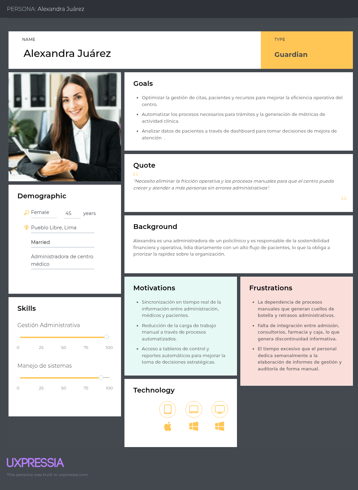

**Segundo Segmento Objetivo (Doctores de establecimientos de PNAS)**

*Figura 4 (User Persona 2)*  
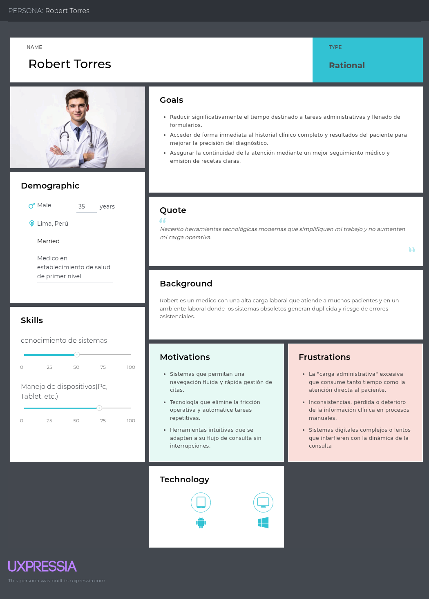

**Tercer Segmento Objetivo (Pacientes de todas las edades)**

*Figura 5 (User Persona 3)*  
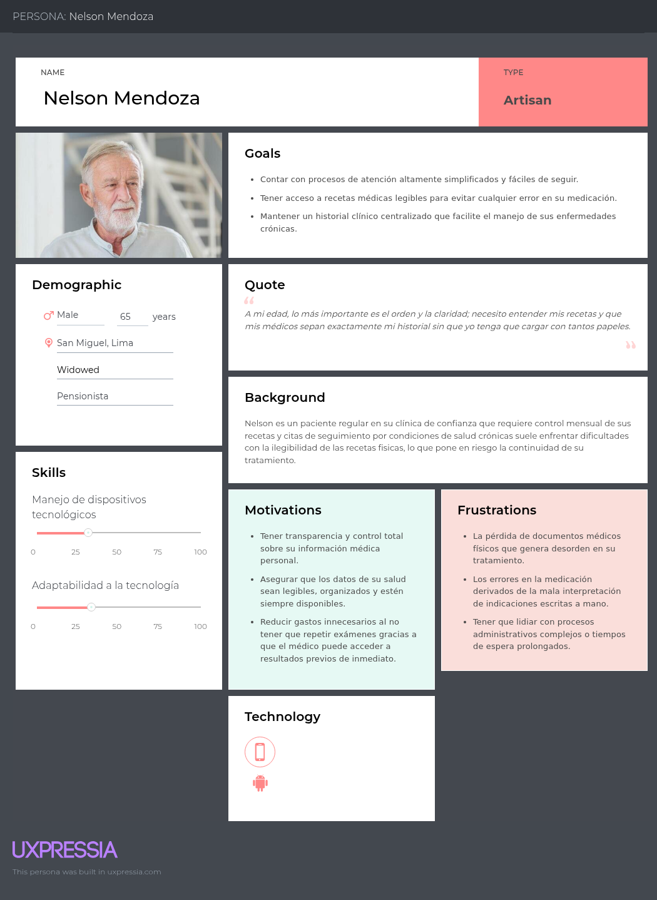

### 2.3.2. User Task Matrix
**Primer Segmento Objetivo (Administradores de establecimientos de PNAS)**

*Figura 6 (User Task Matrix 1)*
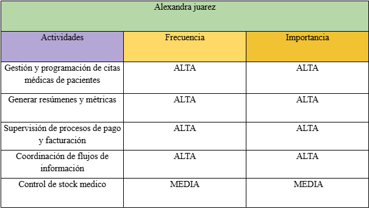

**Segundo Segmento Objetivo (Doctores de establecimientos de PNAS)**

*Figura 7 (User Task Matrix 2)*
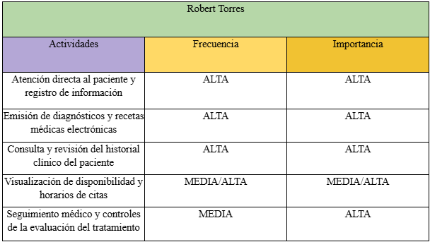

**Tercer Segmento Objetivo (Pacientes de todas las edades)**

*Figura 8 (User Task Matrix 3)*  
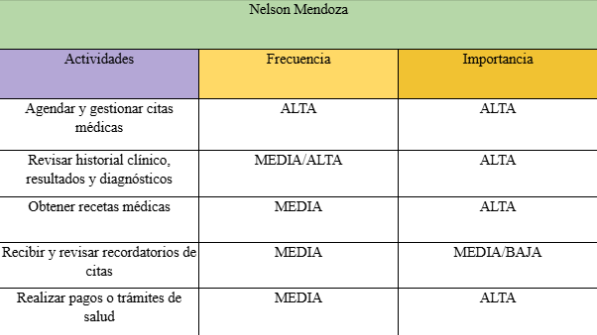

### 2.3.3. User Journey Mapping

**Primer Segmento Objetivo (Administradores de establecimientos de PNAS)**

*Figura 9 (User Journey Map 1)*
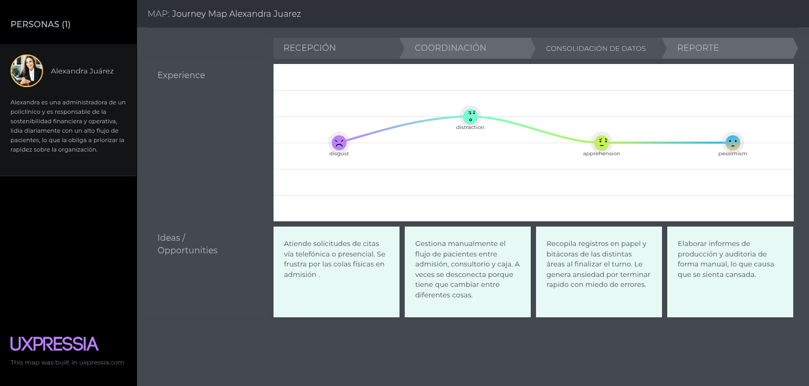

**Segundo Segmento Objetivo (Doctores de establecimientos de PNAS)**

*Figura 10 (User Journey Map 2)*
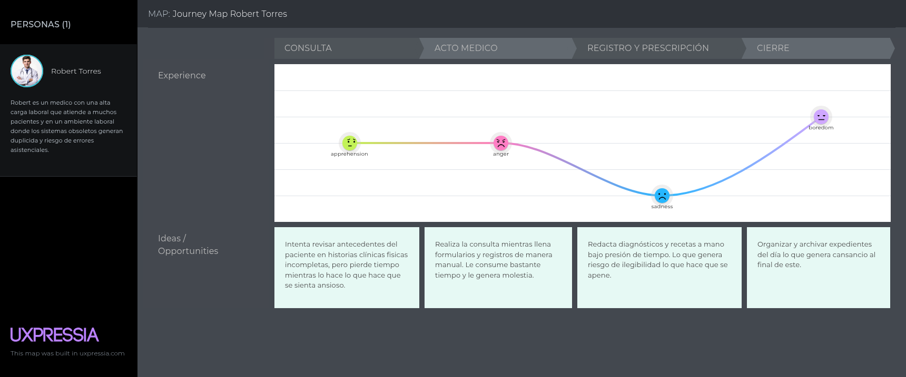

**Tercer Segmento Objetivo (Pacientes de todas las edades)**

*Figura 11 (User Journey Map 3)*
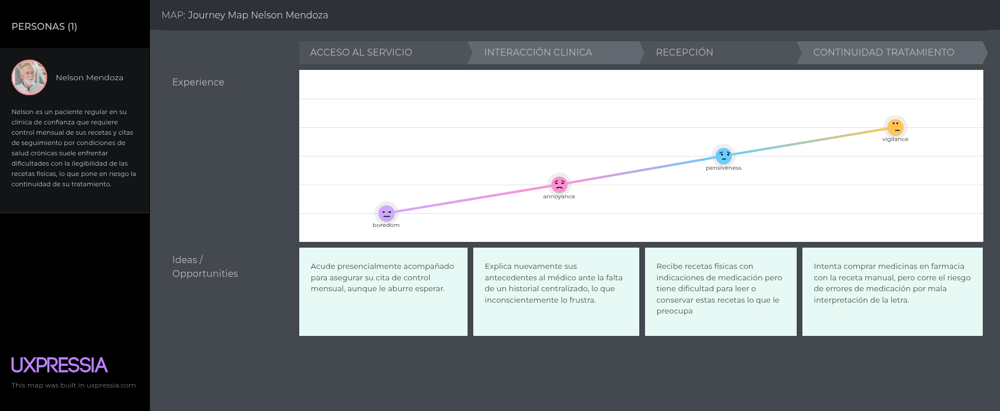 

### 2.3.4. Empathy Mapping

**Primer Segmento Objetivo (Administradores de establecimientos de PNAS)**

*Figura 12 (Empathy Map 1)*
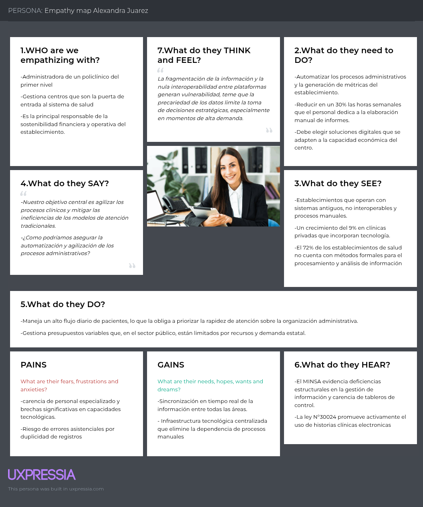   

**Segundo Segmento Objetivo (Doctores de establecimientos de PNAS)**

*Figura 13 (Empathy Map 2)*
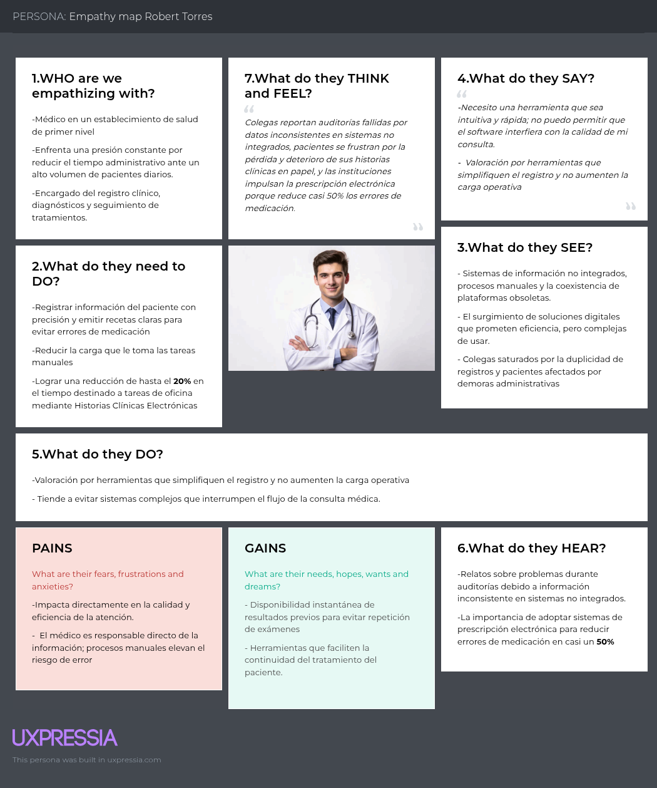

**Tercer Segmento Objetivo (Pacientes de todas las edades)**

*Figura 14 (Empathy Map 3)*
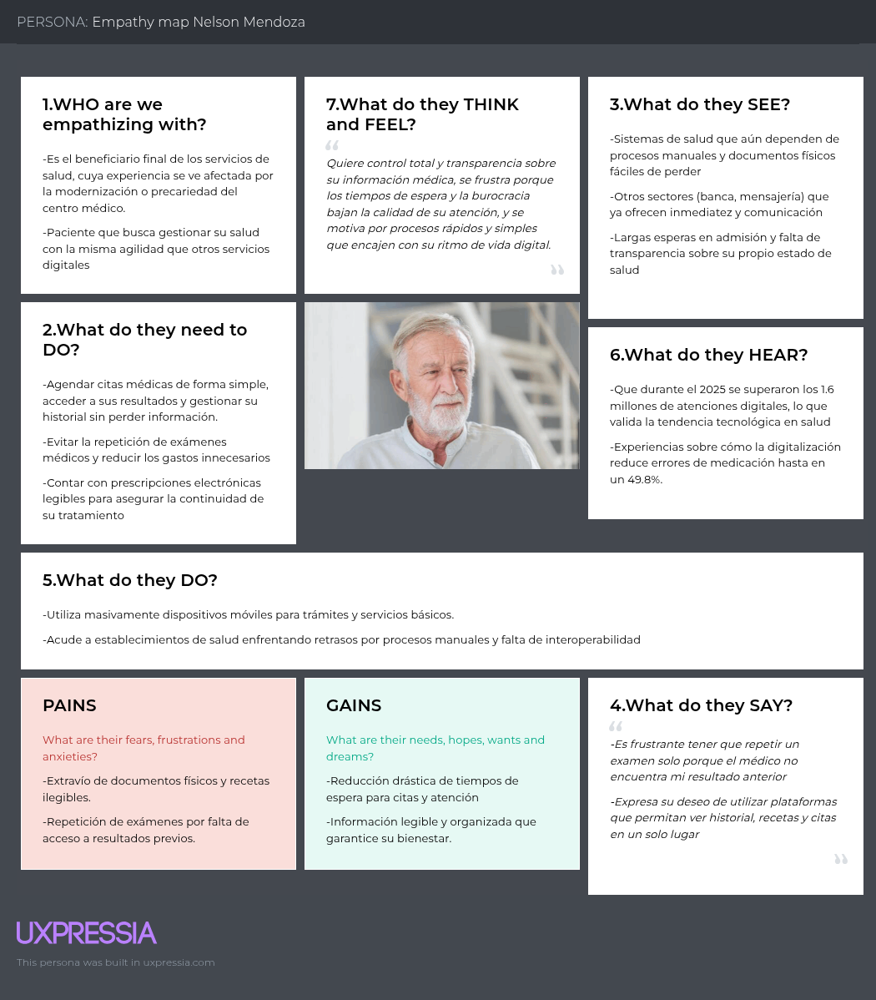  

## 2.4. Big Picture EventStorming

Se utilizó la guía Step-by-Step Guide de Philippe Bourgau, proporcionada en la rúbrica del Final Problem Statement, para llevar a cabo el proceso de Big Picture Event Storming, siguiendo sus etapas:

- Open
- Explore
- Close

**Miro Board Link:** [https://miro.com/app/board/uXjVGhdfT5g=/?share_link_id=948975680057](https://miro.com/app/board/uXjVGhdfT5g=/?share_link_id=948975680057)

*Figura 15 (Big Picture EventStorming)*

## 2.5. Ubiquitous Language

**Organización y Estructura (Gestión de la Clínica)**

* **Tenant (Policlínico):** Establecimiento de salud de atención primaria que opera de manera independiente y centraliza sus procesos clínicos, administrativos y de farmacia en la plataforma..
* **Staff Member (Miembro del Personal):** Cualquier individuo que labora en el policlínico, incluyendo médicos, recepcionistas, farmacéuticos y administradores, cada uno con responsabilidades y accesos delimitados.
* **Role (Rol):** Nivel de autorización que define las acciones y la información clínica o financiera a la que un miembro del personal tiene acceso.

**Agendamiento y Logística (Scheduling)**

* **Appointment (Cita Médica):** Reserva de un bloque de tiempo específico que vincula a un paciente con un médico en un consultorio físico determinado, evitando cruces de horarios.
* **Schedule (Agenda / Horario):** Plantilla de bloques de tiempo que define la disponibilidad de un médico para atender pacientes en días y horas específicas.
* **Consulting Room (Consultorio):** Espacio físico dentro del policlínico destinado a la atención de pacientes, el cual no puede ser ocupado por dos médicos en el mismo bloque de tiempo.
* **No-show (Inasistencia):** Situación en la cual un paciente no se presenta a su cita médica programada y no notifica al policlínico con anticipación.

**Atención Clínica (Core Médico)**

* **Patient (Paciente):** Persona que solicita y recibe atención médica, de la cual se registran datos demográficos y antecedentes de salud.
* **Triage (Triaje):** Proceso previo a la consulta médica donde el personal de enfermería o técnico registra los signos vitales (presión, peso, temperatura) del paciente.
* **Medical Record (Historia Clínica):** Documento legal y central que recopila de manera cronológica los antecedentes, funciones vitales, evolución y diagnósticos de un paciente.
* **Consultation (Consulta Médica):** El encuentro directo entre el médico y el paciente, donde se evalúan síntomas y se registran observaciones específicas según la especialidad médica.
* **Diagnosis (Diagnóstico):** Identificación de la enfermedad o condición del paciente, determinada por el médico y basada preferentemente en catálogos internacionales de salud (como el CIE-10).
* **Prescription (Receta Médica):** Documento digital emitido por el médico que detalla los medicamentos, dosis y frecuencia del tratamiento indicado para el paciente.
* **Lab Order (Orden de Laboratorio):** Solicitud formal generada por el médico para que el paciente se realice exámenes complementarios (análisis de sangre, imágenes, etc.).

**Farmacia e Inventario**

* **Product (Producto / Medicamento):** Bien físico, ya sea un medicamento o insumo médico, que se ofrece en la botica del policlínico.
* **Inventory (Inventario):** El recuento exacto y en tiempo real del stock de productos disponibles en la farmacia del policlínico.
* **Dispensation (Dispensación):** El acto de despachar y entregar los medicamentos recetados al paciente, acción que reduce inmediatamente el stock del inventario.

**Facturación y Liquidaciones (Billing)**

* **Charge (Cobro):** La cuenta total exigida al paciente en el área de recepción por los servicios de consulta brindados o los medicamentos adquiridos. Todo cobro se realiza por el monto íntegro, sin admitir copagos.
* **Invoice (Comprobante de Pago):** Documento oficial y con validez fiscal (boleta o factura) que se emite a favor del paciente una vez recibido el pago.
* **Commission (Comisión):** Porcentaje del costo de la consulta o monto fijo previamente acordado que le corresponde al médico por la atención brindada.
* **Liquidation (Liquidación):** Cálculo consolidado (diario o mensual) que determina el monto total de dinero que el administrador del policlínico debe transferir a un médico, basado en las atenciones realizadas y sus respectivas comisiones.

# Capítulo III: Requirements Specification

## 3.1. User Stories

**Epics**

| Epic ID | Título | Descripción |
| --- | --- | --- |
| E1 | Portal del Paciente Accesible | **Como** paciente, **quiero** interactuar con una interfaz segmentada y accesible, **para** facilitar el uso de la plataforma sin importar mi edad o nivel tecnológico. |
| E2 | Atención Clínica Eficiente | **Como** médico, **quiero** utilizar un sistema ágil y robusto, **para** no retrasar mis atenciones clínicas debido a la lentitud o sobrecarga de la plataforma. |
| E3 | Gestión Administrativa Integrada | **Como** personal administrativo, **quiero** automatizar tareas repetitivas, **para** reducir mi carga de trabajo manual. |
| E4 | Experiencia Digital Confiable | **Como** usuario, **quiero** que la aplicación funcione de manera rápida, adaptativa, sencilla y accesible en cualquier dispositivo, **para** contar con una experiencia agradable. | 
| E5 | Landing Page Comercial | **Como** usuario, **quiero** acceder a una landing page informativa del software, **para** conocer más acerca de su propuesta y características. |

**User Stories**

| Story ID | Título | Descripción | Criterios de aceptación | Relacionado con Epic ID |
| --- | --- | --- | --- | --- |
| US001 | Registro de paciente | **Como** paciente nuevo, **quiero** crear mi cuenta con mis datos personales básicos, **para** acceder a mis servicios médicos desde un solo lugar. | **Scenario 1: Registro exitoso** **Given** que el paciente se encuentra en la pantalla de registro, **When** completa sus datos obligatorios correctamente y confirma la creación de cuenta, **Then** el sistema crea su perfil y muestra acceso a su panel principal.  **Scenario 2: Validación de campos incompletos** **Given** que el paciente está llenando el formulario de registro, **When** omite campos obligatorios o ingresa datos inválidos, **Then** el sistema muestra mensajes de validación y no permite finalizar el registro. | E1 |
| US002 | Inicio de sesión de usuario | **Como** usuario, **quiero** iniciar sesión de manera sencilla y segura, **para** consultar rápidamente la información correspondiente a mi rol. | **Scenario 1: Acceso correcto** **Given** que el usuario ya tiene una cuenta activa, **When** ingresa sus credenciales válidas, **Then** el sistema le permite entrar al panel correspondiente a su rol.  **Scenario 2: Credenciales incorrectas** **Given** que el usuario intenta ingresar a la plataforma, **When** registra una contraseña o correo incorrecto, **Then** el sistema deniega el acceso y muestra una alerta de autenticación. | E1 |
| US003 | Reserva digital de citas | **Como** paciente, **quiero** reservar una cita en pocos pasos, **para** evitar llamadas o trámites presenciales innecesarios. | **Scenario 1: Reserva confirmada** **Given** que el paciente visualiza horarios disponibles, **When** selecciona especialidad, médico, fecha y confirma la cita, **Then** el sistema registra la reserva y muestra la confirmación correspondiente.  **Scenario 2: Horario no disponible** **Given** que el paciente intenta reservar un horario ocupado, **When** confirma la selección, **Then** el sistema informa la indisponibilidad y solicita elegir otro horario. | E1 |
| US004 | Reprogramación de citas | **Como** paciente, **quiero** reprogramar una cita desde mi panel, **para** adaptar mi atención a cambios en mi disponibilidad. | **Scenario 1: Reprogramación exitosa** **Given** que el paciente tiene una cita vigente, **When** selecciona un nuevo horario disponible y confirma el cambio, **Then** el sistema actualiza la cita y notifica la nueva programación.  **Scenario 2: Reprogramación fuera de plazo** **Given** que la cita ya no permite cambios por política del establecimiento, **When** el paciente intenta reprogramarla, **Then** el sistema bloquea la acción e informa la restricción aplicable. | E1 |
| US005 | Cancelación de citas | **Como** paciente, **quiero** cancelar una cita programada, **para** liberar el horario cuando ya no podré asistir. | **Scenario 1: Cancelación correcta** **Given** que el paciente tiene una cita futura activa, **When** selecciona la opción de cancelación y confirma la acción, **Then** el sistema anula la cita y libera el cupo en agenda.  **Scenario 2: Cancelación no permitida** **Given** que la cita se encuentra dentro del tiempo límite no cancelable, **When** el paciente intenta cancelarla, **Then** el sistema rechaza la operación e informa la política vigente. | E1 |
| US006 | Consulta de historial clínico | **Como** paciente, **quiero** visualizar mi historial clínico digital, **para** revisar diagnósticos, atenciones y continuidad de tratamiento sin depender de copias físicas. | **Scenario 1: Historial disponible** **Given** que el paciente ya cuenta con atenciones registradas, **When** accede al módulo de historial clínico, **Then** el sistema muestra sus consultas, diagnósticos y documentos asociados en orden cronológico.  **Scenario 2: Historial sin registros** **Given** que el paciente aún no tiene atenciones previas cargadas, **When** entra a su historial clínico, **Then** el sistema informa que todavía no existen registros disponibles. | E1 |
| US007 | Consulta de resultados y recetas | **Como** paciente, **quiero** ver mis resultados y recetas emitidas en línea, **para** evitar ir al establecimiento solo para recoger información. | **Scenario 1: Visualización de documentos** **Given** que existen resultados o recetas emitidas para el paciente, **When** ingresa al módulo de documentos clínicos, **Then** el sistema muestra los archivos y detalles asociados a cada atención.  **Scenario 2: Documento pendiente** **Given** que el resultado o receta aún no ha sido publicado por el médico, **When** el paciente lo consulta, **Then** el sistema indica que el documento sigue pendiente de disponibilidad. | E1 |
| US008 | Accesibilidad de interfaz | **Como** paciente adulto mayor o con baja familiaridad digital, **quiero** una interfaz clara y legible, **para** usar la plataforma sin confusión ni dependencia de terceros. | **Scenario 1: Navegación accesible** **Given** que el paciente accede desde un dispositivo personal, **When** navega por las funciones principales del portal, **Then** el sistema presenta botones visibles, textos legibles y rutas simples de uso.  **Scenario 2: Prevención de errores de navegación** **Given** que el paciente intenta salir o cambiar un proceso en curso, **When** ejecuta una acción crítica por error, **Then** el sistema solicita confirmación antes de perder información relevante. | E1 |
| US009 | Agenda médica diaria | **Como** médico, **quiero** visualizar mi agenda diaria organizada, **para** preparar mis consultas y administrar mejor mi jornada. | **Scenario 1: Agenda visible por día** **Given** que el médico tiene citas programadas, **When** accede a su agenda del día, **Then** el sistema muestra pacientes, horarios y estado de cada cita.  **Scenario 2: Día sin citas** **Given** que el médico no tiene atenciones programadas para una fecha, **When** consulta su agenda, **Then** el sistema informa que no existen citas registradas para ese día. | E2 |
| US010 | Consulta rápida del historial del paciente | **Como** médico, **quiero** acceder rápidamente al historial clínico del paciente antes y durante la consulta, **para** tomar decisiones con información completa. | **Scenario 1: Historial disponible durante la consulta** **Given** que el médico abre la ficha de un paciente con antecedentes registrados, **When** consulta su historial desde la atención activa, **Then** el sistema muestra antecedentes, diagnósticos previos y tratamientos relevantes.  **Scenario 2: Paciente sin antecedentes previos** **Given** que el paciente no tiene registros clínicos anteriores, **When** el médico revisa su historial, **Then** el sistema indica que se trata de un primer registro clínico. | E2 |
| US011 | Registro de anamnesis y examen físico | **Como** médico, **quiero** registrar anamnesis y examen físico en una sola atención, **para** documentar la consulta de forma ordenada y completa. | **Scenario 1: Registro clínico completo** **Given** que el médico se encuentra atendiendo a un paciente, **When** completa los campos clínicos requeridos y guarda la evolución, **Then** el sistema almacena la información en la historia clínica del paciente.  **Scenario 2: Información obligatoria faltante** **Given** que el médico intenta cerrar la atención sin datos mínimos requeridos, **When** confirma el guardado, **Then** el sistema señala los campos pendientes antes de finalizar. | E2 |
| US012 | Emisión de diagnóstico | **Como** médico, **quiero** registrar el diagnóstico de la consulta, **para** dejar constancia clínica y orientar el tratamiento del paciente. | **Scenario 1: Diagnóstico guardado** **Given** que el médico culminó la evaluación clínica, **When** selecciona o escribe el diagnóstico y guarda la atención, **Then** el sistema vincula el diagnóstico al episodio clínico correspondiente.  **Scenario 2: Intento de cierre sin diagnóstico** **Given** que la consulta requiere diagnóstico obligatorio, **When** el médico intenta cerrar la atención sin registrarlo, **Then** el sistema solicita completar esa información antes de finalizar. | E2 |
| US013 | Emisión de recetas digitales | **Como** médico, **quiero** emitir recetas digitales legibles, **para** reducir errores y facilitar la dispensación de medicamentos. | **Scenario 1: Receta emitida** **Given** que el médico ya definió el tratamiento del paciente, **When** registra medicamentos, dosis e indicaciones y confirma la receta, **Then** el sistema genera una receta digital asociada a la atención.  **Scenario 2: Medicación incompleta** **Given** que la receta tiene campos esenciales vacíos, **When** el médico intenta emitirla, **Then** el sistema marca la inconsistencia y evita la publicación hasta completar los datos. | E2 |
| US014 | Solicitud de exámenes | **Como** médico, **quiero** generar órdenes de exámenes desde la misma consulta, **para** agilizar el plan diagnóstico del paciente. | **Scenario 1: Orden generada** **Given** que el médico requiere estudios complementarios, **When** selecciona los exámenes y confirma la orden, **Then** el sistema registra la solicitud y la deja disponible para seguimiento.  **Scenario 2: Orden sin justificación clínica mínima** **Given** que el establecimiento exige observación asociada a la orden, **When** el médico intenta emitirla sin ese dato, **Then** el sistema solicita completar la información requerida. | E2 |
| US015 | Repetición rápida de recetas frecuentes | **Como** médico, **quiero** reutilizar recetas frecuentes o previas con un clic, **para** reducir tiempo administrativo en controles repetitivos. | **Scenario 1: Reutilización de receta previa** **Given** que el paciente tiene una receta anterior apta para repetición, **When** el médico selecciona la opción de reutilizarla y la confirma, **Then** el sistema carga los medicamentos para su revisión y emisión final.  **Scenario 2: Receta previa no apta** **Given** que la receta anterior contiene medicamentos restringidos o desactualizados, **When** el médico intenta reutilizarla, **Then** el sistema impide la emisión automática y solicita revisión manual. | E2 |
| US016 | Gráficos evolutivos de visitas | **Como** médico, **quiero** visualizar la tendencia visitas de los pacientes, **para** detectar frecuencia de uso. | **Scenario 1: Gráfico generado** **Given** que existen registros históricos de triaje, **When** el médico abre pacientes, **Then** el sistema muestra las gráficas de visitas del paciente. | E2 |
| US017 | Ingreso de medicinas al inventario | **Como** administrador, **quiero** registrar las medicinas, **para** mantener un registro de inventario de mi farmacia. | **Scenario 1: Registro de medicina** **Given** que el administrador ingresa a `clinic settings/pharmacy`, **When** oprime el botón de agregar y rellena los campos, **Then** la aplicación registra el medicamento en el sistema. | E2 |
| US018 | Emisión de recetas | **Como** médico, **quiero** registrar nuevas recetas, **para** facilitar mi flujo de trabajo. | **Scenario 1: Emisión de receta exitosa** **Given** que el doctor está en pacientes, **And** selecciona la opción para asignar una receta, **When** rellena todos los datos requeridos, **Then** el sistema registra la receta del paciente. | E2 |
| US019 | Cierre de atención sin pérdida de datos | **Como** médico, **quiero** guardar y cerrar una consulta de manera confiable, **para** evitar pérdida de información por lentitud o fallas de conectividad. | **Scenario 1: Guardado exitoso** **Given** que el médico completó la atención clínica, **When** guarda y cierra la consulta, **Then** el sistema confirma que la información fue registrada correctamente.  **Scenario 2: Fallo temporal de conexión** **Given** que ocurre una interrupción momentánea al guardar la consulta, **When** el sistema detecta el problema, **Then** preserva la información capturada e informa al médico el estado del guardado. | E2 |
| US020 | Registro único de pacientes | **Como** personal administrativo, **quiero** registrar pacientes en una base unificada, **para** evitar duplicidad de datos entre admisión y atención médica. | **Scenario 1: Nuevo paciente registrado** **Given** que el paciente no existe en la base de datos institucional, **When** el administrativo registra su información obligatoria, **Then** el sistema crea una ficha única para futuras atenciones.  **Scenario 2: Detección de posible duplicado** **Given** que los datos ingresados coinciden con un paciente existente, **When** el administrativo intenta crear un nuevo registro, **Then** el sistema alerta la posible duplicidad antes de guardar. | E3 |
| US021 | Visualización de mini calendario | **Como** médico, **quiero** visualizar un minicalendario mensual, **para** ver mis citas durante el mes. | **Scenario 1: Visualización exitosa** **Given** que el médico está en agenda, **When** hace clic en un día del calendario, **Then** el sistema muestra el horario del día seleccionado. | E3 |
| US022 | Visualización de detalles de cita | **Como** paciente, **quiero** visualizar los detalles de mi cita programada, **para** no tener dudas de su contenido. | **Scenario 1: Visualización de detalles** **Given** que el paciente tiene una cita activa, **When** le da clic a visualizar detalles, **Then** el sistema muestra los detalles de la cita. | E3 |
| US023 | Pagar la cita | **Como** paciente, **quiero** pagar las citas médicas desde la aplicación, **para** facilitar mi experiencia. | **Scenario 1: Pago exitoso** **Given** que el paciente tiene una cita, **When** oprime el botón pagar y sigue los pasos, **Then** se registra la venta en el sistema. | E3 |
| US024 | Generación automatizada de comprobantes | **Como** personal administrativo, **quiero** emitir boletas y facturas de forma automatizada tras cerrar la atención, **para** reducir errores en caja. | **Scenario 1: Comprobante emitido** **Given** la consulta finalizada y valorizada, **When** se procesa el cobro en el módulo de caja, **Then** el sistema genera la versión digital del comprobante. | E3 |
| US025 | Control de pagos pendientes | **Como** personal administrativo, **quiero** visualizar atenciones con pagos pendientes, **para** dar seguimiento oportuno y mantener el orden financiero del establecimiento. | **Scenario 1: Listado de pendientes** **Given** que existen atenciones no canceladas total o parcialmente, **When** el administrativo consulta el módulo de pagos pendientes, **Then** el sistema muestra el detalle actualizado de montos, fechas y estados.  **Scenario 2: Sin deudas registradas** **Given** que todas las atenciones del periodo están pagadas, **When** el administrativo revisa el módulo, **Then** el sistema informa que no existen pendientes por cobrar. | E3 |
| US026 | Dashboard operativo | **Como** personal administrativo, **quiero** ver métricas de citas, atenciones e ingresos en un dashboard, **para** tomar decisiones con información consolidada. | **Scenario 1: Indicadores disponibles** **Given** que existen datos cargados en el periodo consultado, **When** el administrativo ingresa al dashboard y aplica filtros, **Then** el sistema muestra indicadores resumidos y actualizados según el criterio seleccionado.  **Scenario 2: Periodo sin datos** **Given** que el rango consultado no tiene actividad registrada, **When** el administrativo visualiza el dashboard, **Then** el sistema muestra el estado vacío sin errores ni cifras inconsistentes. | E3 |
| US027 | Descarga de historial clínico como PDF | **Como** paciente, **quiero** descargar mi historial clínico en PDF, **para** tener mis documentos físicamente. | **Scenario 1: Reporte generado** **Given** que el sistema cuenta con datos operativos del periodo, **When** el paciente solicita descargar su historial clínico, **Then** el sistema genera el documento listo para imprimir. | E3 |
| US028 | Registro de citas como administrador | **Como** personal administrativo, **quiero** registrar citas manualmente, **para** agendar pacientes que no manejen la tecnología o se presenten de forma presencial. | **Scenario 1: Creación de cita desde administración** **Given** que el administrador se encuentra en `schedule`, **When** hace clic en agendar recurso y rellena todos los campos, **Then** el sistema agenda una cita. | E3 |
| US029 | Integración con servicios de identidad (RENIEC) | **Como** administrativo, **quiero** autocompletar datos del paciente ingresando su DNI mediante un servicio externo, **para** registrar pacientes de forma rápida y sin errores. | **Scenario 1: Autocompletar exitoso** **Given** la ventana de nuevo registro, **When** el administrativo digita un DNI válido y presiona consultar, **Then** el sistema trae nombres y apellidos de forma automatizada. | E3 |
| US030 | Sincronización con pasarelas de pago | **Como** administrador, **quiero** integrar pasarelas de pago digital vía API, **para** conciliar automáticamente las transacciones en línea. | **Scenario 1: Conciliación exitosa** **Given** una transacción por pasarela externa, **When** se valida el callback de la pasarela, **Then** el sistema marca el cobro de la cita como pagado. | E3 |
| US031 | Diseño responsive | **Como** usuario, **quiero** utilizar la plataforma desde celular, tablet o computadora, **para** acceder al sistema según el contexto de uso. | **Scenario 1: Visualización adaptable** **Given** que el usuario accede desde distintos tamaños de pantalla, **When** navega por los módulos principales, **Then** el sistema adapta su interfaz sin perder funcionalidad ni legibilidad.  **Scenario 2: Cambio de orientación o tamaño** **Given** que el usuario cambia la orientación del dispositivo o el tamaño de la ventana, **When** continúa usando la plataforma, **Then** el sistema reajusta la distribución sin romper la navegación. | E4 |
| US032 | Tiempo de respuesta ágil | **Como** usuario, **quiero** que las acciones principales respondan con rapidez, **para** no perder tiempo durante procesos críticos de atención. | **Scenario 1: Consulta fluida** **Given** que el usuario ejecuta una acción habitual como abrir agenda o historial, **When** el sistema procesa la solicitud, **Then** la información se muestra de forma ágil y comprensible para el usuario.  **Scenario 2: Alta carga del sistema** **Given** que existe una mayor demanda de usuarios simultáneos, **When** se consulta una función crítica, **Then** el sistema mantiene operatividad y comunica cualquier demora de forma clara. | E4 |
| US033 | Recuperación de contraseña | **Como** usuario, **quiero** recuperar mi contraseña de forma segura, **para** restablecer el acceso a mi cuenta sin soporte manual innecesario. | **Scenario 1: Recuperación exitosa** **Given** que el usuario olvidó su contraseña pero recuerda su cuenta registrada, **When** solicita el restablecimiento y valida el proceso, **Then** el sistema le permite definir una nueva contraseña segura.  **Scenario 2: Cuenta no reconocida** **Given** que el correo o identificador ingresado no existe en la plataforma, **When** se intenta iniciar la recuperación, **Then** el sistema informa que no pudo validar la solicitud. | E4 |
| US034 | Definición de accesos basados en roles (RBAC) | **Como** administrador, **quiero** asignar roles preestablecidos con vistas específicas del sistema, **para** restringir el acceso a módulos fuera de la competencia del personal. | **Scenario 1: Acceso restringido** **Given** un usuario con rol de farmacia, **When** intenta ingresar al módulo de caja o historia clínica, **Then** la navegación le oculta estos enlaces y bloquea las rutas. | E4 |
| US035 | Cifrado de información médica sensible | **Como** paciente, **quiero** que mi historial clínico viaje y se almacene de forma cifrada, **para** garantizar la absoluta confidencialidad de mi salud. | **Scenario 1: Almacenamiento seguro** **Given** una nota clínica ingresada, **When** se guarda en la base de datos, **Then** la información sensible (diagnósticos, anamnesis) se registra en formato encriptado. | E4 |
| US036 | Bloqueos automáticos y sesiones seguras | **Como** usuario, **quiero** que la sesión se cierre por inactividad o intento fallido reiterado, **para** evitar que terceros accedan a datos clínicos en una pantalla desatendida. | **Scenario 1: Cierre de sesión** **Given** una sesión inactiva por más de 15 minutos, **When** expira el temporizador del sistema, **Then** redirige automáticamente a la pantalla de login. | E4 |
| US037 | Caché y guardado local temporal | **Como** usuario, **quiero** que mis datos ingresados se guarden localmente ante un corte de internet, **para** evitar perder información redactada durante minutos. | **Scenario 1: Almacenamiento offline** **Given** un corte temporal de conexión a internet, **When** el médico escribe en el editor clínico, **Then** los datos se resguardan en el LocalStorage / IndexDB. | E4 |
| US038 | Sincronización diferida tras restablecimiento | **Como** usuario, **quiero** que el sistema sincronice automáticamente los datos guardados localmente al recuperar la conexión, **para** mantener el registro unificado sin intervención manual. | **Scenario 1: Sincronización post-corte** **Given** datos resguardados offline, **When** el sistema detecta reconexión de internet, **Then** lanza un proceso de fondo que sincroniza las notas pendientes con el servidor. | E4 |
| US039 | Navegación simple | **Como** usuario, **quiero** encontrar las funciones principales con pocos pasos, **para** reducir la curva de aprendizaje y el tiempo de uso. | **Scenario 1: Ruta corta a funciones clave** **Given** que el usuario necesita acceder a una función principal del sistema, **When** navega desde el menú principal, **Then** puede llegar a dicha función mediante una ruta clara y directa.  **Scenario 2: Usuario nuevo en la plataforma** **Given** que el usuario usa el sistema por primera vez, **When** explora las opciones visibles, **Then** el sistema presenta etiquetas comprensibles y organización coherente. | E4 |
| US040 | Cancelar citas y eventos desde administración | **Como** administrador, **quiero** eliminar registros de citas o eventos en la plataforma, **para** manejar errores manuales. | **Scenario 1: Acción de eliminar citas** **Given** que el administrador está en agenda, **When** selecciona la cita y presiona cancelar, **Then** el sistema cancela la cita correspondiente. | E4 |
| US041 | Visualización de propuesta de valor | **Como** visitante, **quiero** entender rápidamente qué problema resuelve Vitalia, **para** evaluar si el software se ajusta a mi establecimiento de salud. | **Scenario 1: Información principal visible** **Given** que un visitante entra a la landing page por primera vez, **When** revisa la sección inicial del sitio, **Then** encuentra una propuesta de valor clara enfocada en la gestión clínica integral.  **Scenario 2: Navegación rápida del contenido** **Given** que el visitante desea identificar la solución sin leer todo el sitio, **When** recorre los bloques principales, **Then** puede reconocer de forma resumida beneficios y público objetivo. | E5 |
| US042 | Solicitud de contacto comercial | **Como** visitante interesado, **quiero** dejar mis datos en un formulario de contacto, **para** solicitar una demostración o mayor información del producto. | **Scenario 1: Formulario enviado** **Given** que el visitante completa sus datos de contacto y mensaje, **When** envía el formulario correctamente, **Then** el sistema registra la solicitud y muestra una confirmación de recepción.  **Scenario 2: Formulario incompleto** **Given** que el visitante omite datos obligatorios del formulario, **When** intenta enviarlo, **Then** el sistema muestra validaciones y no procesa la solicitud. | E5 |
| US043 | Sección de funcionalidades clave | **Como** visitante, **quiero** ver las funcionalidades principales del sistema en la landing page, **para** comprender el alcance de la solución antes de solicitar una demo. | **Scenario 1: Funcionalidades visibles** **Given** que el visitante explora la página informativa, **When** llega a la sección de funcionalidades, **Then** el sistema presenta módulos como citas, historia clínica, farmacia y facturación de forma clara.  **Scenario 2: Contenido resumido y comprensible** **Given** que el visitante no conoce el producto, **When** revisa esa sección, **Then** comprende el valor de cada funcionalidad sin necesidad de soporte adicional. | E5 |
| US044 | Presentación por segmentos objetivo | **Como** visitante, **quiero** identificar cómo Vitalia ayuda a pacientes, médicos y administrativos, **para** reconocer el beneficio para cada actor del establecimiento. | **Scenario 1: Beneficios por rol** **Given** que el visitante revisa la landing page, **When** accede a la sección de segmentos o beneficios por usuario, **Then** encuentra propuestas diferenciadas para pacientes, médicos y personal administrativo.  **Scenario 2: Comparación rápida por necesidad** **Given** que el visitante solo está interesado en un tipo de usuario, **When** revisa la sección correspondiente, **Then** identifica rápidamente las ventajas relevantes para ese perfil. | E5 |
| US045 | Evidencia de diferenciación competitiva | **Como** visitante institucional, **quiero** entender qué diferencia a Vitalia de otras alternativas, **para** sustentar una posible decisión de compra. | **Scenario 1: Diferenciadores visibles** **Given** que el visitante compara soluciones del mercado, **When** revisa la landing page de Vitalia, **Then** encuentra mensajes claros sobre integración clínica, accesibilidad y adaptación al contexto peruano.  **Scenario 2: Información insuficiente para decidir** **Given** que el visitante busca argumentos concretos de valor, **When** entra a la sección comparativa o de beneficios, **Then** el sistema le ofrece información suficiente para continuar hacia contacto comercial. | E5 |
| US046 | Llamados a la acción visibles | **Como** visitante, **quiero** encontrar botones de acción claros en la landing page, **para** solicitar información sin perder tiempo buscando cómo continuar. | **Scenario 1: CTA disponible en puntos clave** **Given** que el visitante recorre la landing page, **When** llega a secciones principales del sitio, **Then** visualiza llamados a la acción para contacto o demostración.  **Scenario 2: Navegación sin fricción hacia conversión** **Given** que el visitante decide solicitar más información, **When** selecciona un botón de acción visible, **Then** el sistema lo dirige directamente al formulario o canal de contacto correspondiente. | E5 |
| US047 | Cambio de idioma en landing page | **Como** visitante, **quiero** cambiar el idioma de la landing page, **para** comprender la propuesta de Vitalia en el idioma que me resulte más cómodo. | **Scenario 1: Cambio de idioma exitoso** **Given** que el visitante se encuentra en la landing page, **When** selecciona un idioma disponible desde el selector de idioma, **Then** el sistema actualiza los textos principales de la página al idioma elegido.  **Scenario 2: Preferencia de idioma conservada** **Given** que el visitante ya seleccionó un idioma previamente, **When** vuelve a ingresar a la landing page desde el mismo navegador, **Then** el sistema muestra la página en el idioma seleccionado anteriormente. | E5 |

**Technical Stories**

| Story ID | Título | Descripción | Criterios de aceptación | Relacionado con Epic ID |
| --- | --- | --- | --- | --- |
| TS001 | Configuración de arquitectura base y GitFlow | **Como** desarrollador, **quiero** establecer la estructura inicial del repositorio y GitFlow, **para** trabajar en equipo de forma colaborativa y ordenada. | **Scenario 1: Estructura creada** **Given** el repositorio de GitHub, **When** se configuran las ramas develop y main junto con la estructura base HTML/CSS, **Then** el equipo cuenta con el boilerplate inicial para empezar el desarrollo. | E4 |
| TS002 | Configuración de entorno CI/CD | **Como** desarrollador, **quiero** automatizar el despliegue de la landing page vía GitHub Pages, **para** tener un flujo de entrega continua y visibilidad rápida de avances. | **Scenario 1: Despliegue continuo** **Given** commits nuevos en la rama principal, **When** se acciona la integración continua de GitHub Pages, **Then** el sitio desplegado refleja los últimos cambios exitosamente. | E4 |
| TS003 | Documentación OpenAPI/Swagger de endpoints | **Como** desarrollador, **quiero** documentar los endpoints REST del backend mediante OpenAPI/Swagger, **para** facilitar la validación, prueba y consumo de las APIs desde el frontend. | **Scenario 1: Endpoints documentados** **Given** que existen endpoints implementados en el backend, **When** el desarrollador accede a Swagger UI, **Then** puede visualizar las rutas, métodos HTTP, parámetros, cuerpos de solicitud y respuestas esperadas de los servicios disponibles. | E4 |
| TS004 | Persistencia y repositorios por contexto | **Como** desarrollador, **quiero** implementar entidades, repositorios y servicios de aplicación para cada bounded context, **para** almacenar y consultar datos reales de scheduling, pharmacy, clinical y billing. | **Scenario 1: Persistencia funcional** **Given** que el backend recibe una solicitud válida para un contexto funcional, **When** se procesa la operación mediante su servicio y repositorio correspondiente, **Then** la información se registra, actualiza o consulta correctamente desde la base de datos. | E4 |
| TS005 | Integración del frontend con APIs reales | **Como** desarrollador, **quiero** reemplazar el consumo de mock services por endpoints reales del backend, **para** que las vistas de la aplicación trabajen con datos persistentes y actualizados. | **Scenario 1: Consumo de API real** **Given** que el backend se encuentra desplegado y disponible, **When** el usuario interactúa con módulos como agenda, historia clínica, farmacia o facturación desde el frontend, **Then** la aplicación consume los endpoints reales y muestra información proveniente del servidor. | E4 |
| TS006 | Manejo de errores y validaciones API | **Como** desarrollador, **quiero** estandarizar las validaciones, códigos HTTP y respuestas de error del backend, **para** que el frontend pueda mostrar mensajes claros y mantener un comportamiento confiable ante fallos. | **Scenario 1: Error controlado** **Given** que el frontend envía una solicitud inválida o incompleta al backend, **When** el backend valida la petición, **Then** responde con un código HTTP adecuado y un mensaje estructurado que permite identificar el problema sin interrumpir el flujo general de la aplicación. | E4 |

## 3.2. Impact Mapping

**Primer Segmento Objetivo (Administradores de establecimientos de PNAS)**

*Figura 16 (Impact Map 1)*  
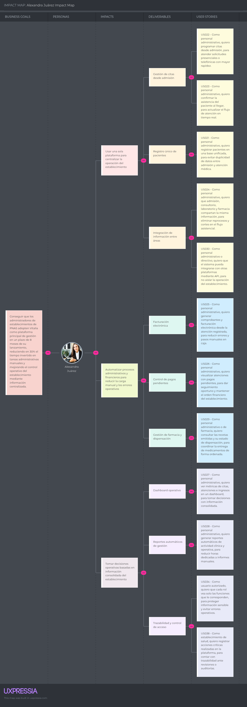

**Segundo Segmento Objetivo (Doctores de establecimientos de PNAS)**

*Figura 17 (Impact Map 2)*
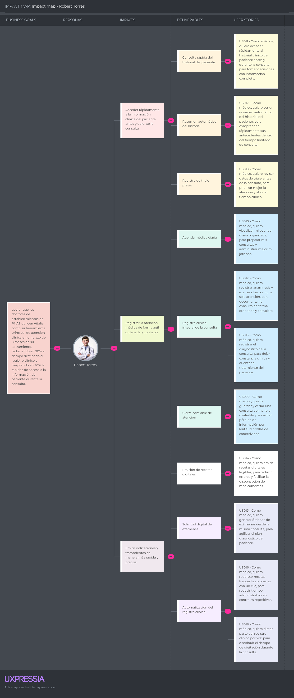

**Tercer Segmento Objetivo (Pacientes de todas las edades)**

*Figura 18 (Impact Map 3)*
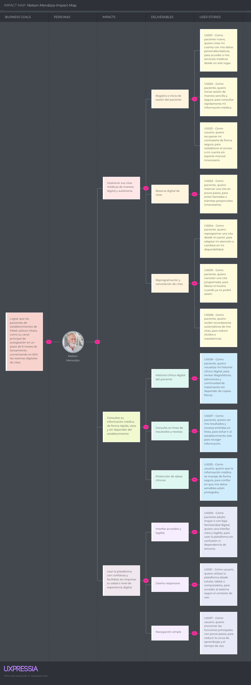

## 3.3. Product Backlog

**Trello Link:** [https://trello.com/b/dHKPrPGE/vitalia-board](https://trello.com/b/dHKPrPGE/vitalia-board)

| \# Orden | User Story ID | Título | Descripción | Story Points |
| --- | --- | --- | --- | --- |
| 1 | US046 | Llamados a la acción visibles | **Como** visitante, **quiero** encontrar botones de acción claros en la landing page, **para** solicitar información sin perder tiempo buscando cómo continuar. | 2 |
| 2 | US041 | Visualización de propuesta de valor | **Como** visitante, **quiero** entender rápidamente qué problema resuelve Vitalia, **para** evaluar si el software se ajusta a mi establecimiento de salud. | 2 |
| 3 | US043 | Sección de funcionalidades clave | **Como** visitante, **quiero** ver las funcionalidades principales del sistema en la landing page, **para** comprender el alcance de la solución antes de solicitar una demo. | 2 |
| 4 | US044 | Presentación por segmentos objetivo | **Como** visitante, **quiero** identificar cómo Vitalia ayuda a pacientes, médicos y administrativos, **para** reconocer el beneficio para cada actor del establecimiento. | 3 |
| 5 | US045 | Evidencia de diferenciación competitiva | **Como** visitante institucional, **quiero** entender qué diferencia a Vitalia de otras alternativas, **para** sustentar una posible decisión de compra. | 2 |
| 6 | US042 | Solicitud de contacto comercial | **Como** visitante interesado, **quiero** dejar mis datos en un formulario de contacto, **para** solicitar una demostración o mayor información del producto. | 3 |
| 7 | US047 | Cambio de idioma en landing page | **Como** visitante, **quiero** cambiar el idioma de la landing page, **para** comprender la propuesta de Vitalia en el idioma que me resulte más cómodo. | 2 |
| 8 | TS001 | Configuración de arquitectura base y GitFlow | **Como** desarrollador, **quiero** establecer la estructura inicial del repositorio y GitFlow, **para** trabajar en equipo de forma colaborativa y ordenada. | 2 |
| 9 | TS002 | Configuración de entorno CI/CD | **Como** desarrollador, **quiero** automatizar el despliegue de la landing page vía GitHub Pages, **para** tener un flujo de entrega continua. | 2 |
| 10 | US031 | Diseño responsive | **Como** usuario, **quiero** utilizar la plataforma desde celular, tablet o computadora, **para** acceder al sistema según el contexto de uso. | 5 |
| 11 | US039 | Navegación simple | **Como** usuario, **quiero** encontrar las funciones principales con pocos pasos, **para** reducir la curva de aprendizaje y el tiempo de uso. | 3 |
| 12 | US032 | Tiempo de respuesta ágil | **Como** usuario, **quiero** que las acciones principales respondan con rapidez, **para** no perder tiempo durante procesos críticos de atención. | 5 |
| 13 | US008 | Accesibilidad de interfaz | **Como** paciente adulto mayor o con baja familiaridad digital, **quiero** una interfaz clara y legible, **para** usar la plataforma sin confusión ni dependencia de terceros. | 5 |
| 14 | US034 | Definición de accesos basados en roles (RBAC) | **Como** administrador, **quiero** asignar roles preestablecidos con vistas específicas del sistema, **para** restringir el acceso inapropiado. | 5 |
| 15 | US001 | Registro de paciente | **Como** paciente nuevo, **quiero** crear mi cuenta con mis datos personales básicos, **para** acceder a mis servicios médicos desde un solo lugar. | 5 |
| 16 | US006 | Consulta de historial clínico | **Como** paciente, **quiero** visualizar mi historial clínico digital, **para** revisar diagnósticos, atenciones y continuidad de tratamiento sin depender de copias físicas. | 5 |
| 17 | US007 | Consulta de resultados y recetas | **Como** paciente, **quiero** ver mis resultados y recetas emitidas en línea, **para** evitar ir al establecimiento solo para recoger información. | 5 |
| 18 | US027 | Descarga de historial clínico como PDF | **Como** paciente, **quiero** descargar mi historial clínico en PDF, **para** tener mis documentos físicamente. | 5 |
| 19 | US022 | Visualización de detalles de cita | **Como** paciente, **quiero** visualizar los detalles de mi cita programada **para** no tener dudas de su contenido. | 3 |
| 20 | US009 | Agenda médica diaria | **Como** médico, **quiero** visualizar mi agenda diaria organizada, **para** preparar mis consultas y administrar mejor mi jornada. | 3 |
| 21 | US021 | Visualización de mini calendario | **Como** médico, **quiero** visualizar un minicalendario mensual, **para** ver mis citas durante el mes. | 5 |
| 22 | US010 | Consulta rápida del historial del paciente | **Como** médico, **quiero** acceder rápidamente al historial clínico del paciente antes y durante la consulta, **para** tomar decisiones con información completa. | 5 |
| 23 | US048 | Vista de HCE del paciente | **Como** médico, **quiero** revisar datos de historial clínico antes de la consulta, **para** priorizar mejor la atención y ahorrar tiempo. | 3 |
| 24 | US016 | Gráficos evolutivos de visitas | **Como** médico, **quiero** visualizar la tendencia visitas de los pacientes, **para** detectar frecuencia de uso. | 5 |
| 25 | US019 | Cierre de atención sin pérdida de datos | **Como** médico, **quiero** guardar y cerrar una consulta de manera confiable, **para** evitar pérdida de información por lentitud o fallas de conectividad. | 5 |
| 26 | US020 | Registro único de pacientes | **Como** personal administrativo, **quiero** registrar pacientes en una base unificada, **para** evitar duplicidad de datos entre admisión y atención médica. | 5 |
| 27 | US040 | Cancelar citas y eventos desde administración | **Como** administrador, **quiero** eliminar registros de citas o eventos en la plataforma, **para** manejar errores manuales. | 5 |
| 28 | US017 | Ingreso de medicinas al inventario | **Como** administrador, **quiero** registrar las medicinas, **para** mantener un registro de inventario de mi farmacia. | 3 |
| 29 | US024 | Generación automatizada de comprobantes | **Como** personal administrativo, **quiero** emitir boletas y facturas de forma automatizada tras cerrar la atención, **para** reducir errores en caja. | 5 |
| 30 | US026 | Dashboard operativo | **Como** personal administrativo, **quiero** ver métricas de citas, atenciones e ingresos en un dashboard, **para** tomar decisiones con información consolidada. | 5 |
| 31 | TS003 | Documentación OpenAPI/Swagger de endpoints | **Como** desarrollador, **quiero** documentar los endpoints REST del backend mediante OpenAPI/Swagger, **para** facilitar la validación, prueba y consumo de las APIs desde el frontend. | 3 |
| 32 | TS004 | Persistencia y repositorios por contexto | **Como** desarrollador, **quiero** implementar entidades, repositorios y servicios de aplicación para cada bounded context, **para** almacenar y consultar datos reales de scheduling, pharmacy, clinical y billing. | 5 |
| 33 | US003 | Reserva digital de citas | **Como** paciente, **quiero** reservar una cita en pocos pasos, **para** evitar llamadas o trámites presenciales innecesarios. | 5 |
| 34 | US004 | Reprogramación de citas | **Como** paciente, **quiero** reprogramar una cita desde mi panel, **para** adaptar mi atención a cambios en mi disponibilidad. | 5 |
| 35 | US005 | Cancelación de citas | **Como** paciente, **quiero** cancelar una cita programada, **para** liberar el horario cuando ya no podré asistir. | 3 |
| 36 | US011 | Registro de anamnesis y examen físico | **Como** médico, **quiero** registrar anamnesis y examen físico en una sola atención, **para** documentar la consulta de forma ordenada y completa. | 5 |
| 37 | US012 | Emisión de diagnóstico | **Como** médico, **quiero** registrar el diagnóstico de la consulta, **para** dejar constancia clínica y orientar el tratamiento del paciente. | 3 |
| 38 | US013 | Emisión de recetas digitales | **Como** médico, **quiero** emitir recetas digitales legibles, **para** reducir errores y facilitar la dispensación de medicamentos. | 5 |
| 39 | US023 | Pagar la cita | **Como** paciente, **quiero** pagar las citas médicas desde la aplicación, **para** facilitar mi experiencia. | 5 |
| 40 | US025 | Control de pagos pendientes | **Como** personal administrativo, **quiero** visualizar atenciones con pagos pendientes, **para** dar seguimiento oportuno y mantener el orden financiero del establecimiento. | 3 |
| 41 | TS005 | Integración del frontend con APIs reales | **Como** desarrollador, **quiero** reemplazar el consumo de mock services por endpoints reales del backend, **para** que las vistas de la aplicación trabajen con datos persistentes y actualizados. | 5 |
| 42 | TS006 | Manejo de errores y validaciones API | **Como** desarrollador, **quiero** estandarizar las validaciones, códigos HTTP y respuestas de error del backend, **para** que el frontend pueda mostrar mensajes claros y mantener un comportamiento confiable ante fallos. | 3 |
| 43 | US002 | Inicio de sesión de usuario | **Como** usuario, **quiero** iniciar sesión de manera sencilla y segura, **para** consultar rápidamente la información correspondiente a mi rol. | 3 |
| 44 | US035 | Cifrado de información médica sensible | **Como** paciente, **quiero** que mi historial clínico viaje y se almacene de forma cifrada, **para** garantizar la absoluta confidencialidad de mi salud. | 5 |
| 45 | US036 | Bloqueos automáticos y sesiones seguras | **Como** usuario, **quiero** que la sesión se cierre por inactividad o intento fallido reiterado, **para** evitar el acceso indebido. | 3 |
| 46 | US033 | Recuperación de contraseña | **Como** usuario, **quiero** recuperar mi contraseña de forma segura, **para** restablecer el acceso a mi cuenta sin soporte manual innecesario. | 3 |
| 47 | US029 | Integración con servicios de identidad (RENIEC) | **Como** administrativo, **quiero** autocompletar datos del paciente ingresando su DNI mediante un servicio externo, **para** registrar pacientes de forma rápida. | 5 |
| 48 | US030 | Sincronización con pasarelas de pago | **Como** administrador, **quiero** integrar pasarelas de pago digital vía API, **para** conciliar automáticamente las transacciones en línea. | 3 |
| 49 | US014 | Solicitud de exámenes | **Como** médico, **quiero** generar órdenes de exámenes desde la misma consulta, **para** agilizar el plan diagnóstico del paciente. | 5 |
| 50 | US049 | Gestión de farmacia | **Como** personal administrativo o de farmacia, **quiero** consultar las recetas emitidas y su estado de dispensación, **para** coordinar la entrega de medicamentos de forma ordenada. | 5 |
| 51 | US015 | Repetición rápida de recetas frecuentes | **Como** médico, **quiero** reutilizar recetas frecuentes o previas con un clic, **para** reducir tiempo administrativo en controles repetitivos. | 5 |
| 52 | US037 | Caché y guardado local temporal | **Como** usuario, **quiero** que mis datos ingresados se guarden localmente ante un corte de internet, **para** evitar perder información redactada. | 5 |
| 53 | US038 | Sincronización diferida tras restablecimiento | **Como** usuario, **quiero** que el sistema sincronice automáticamente los datos guardados localmente al recuperar la conexión, **para** mantener la integridad. | 3 |

# Capítulo IV: Product Design

## 4.1. Style Guidelines

### 4.1.1. General Style Guidelines

**Principios de diseño**

Vitalia es un SaaS integral diseñado para establecimientos de primer nivel de atención de salud. Su objetivo es centralizar la historia médica electrónica, citas y facturación, optimizando la gestión clínica. Por ello, nuestra estrella polar creativa es el "Santuario Clínico" (The Clinical Sanctuary).

Nos alejamos de las cuadrículas rígidas y estériles del software médico tradicional para adoptar una experiencia editorial de alta gama. El entorno debe sentirse autoritario pero calmado, sofisticado pero accesible.

- Profundidad Atmosférica: Utilizamos bases oscuras ("Pure Dark") superpuestas con superficies translúcidas. La interfaz debe sentirse como un instrumento físico premium.
- Claridad sobre el ruido: Rechazamos el aspecto de "plantilla" utilizando asimetría intencional, espacios en blanco generosos y una escala tipográfica de alto contraste que prioriza la legibilidad de los datos clínicos sin sacrificar la elegancia.

**Referencia Base y Adaptaciones**

El ecosistema visual toma como punto de partida **Material Design 3 (MD3)**, aprovechando sus paletas tonales para estructurar las elevaciones. Sin embargo, se han establecido reglas estrictas que modifican el sistema para adaptarlo a la identidad de Vitalia:

- Regla "No-Line": Queda estrictamente prohibido el uso de bordes sólidos de 1px para delimitar secciones o contenedores. Las fronteras estructurales se definen únicamente mediante cambios en el color de fondo (tonos de superficie).
- Sombras Ambientales (Ambient Shadows): Se evitan las sombras estándar. Las sombras se reservan para elementos flotantes y deben ser extremadamente difusas (ej. 0px 24px 48px rgba(0, 0, 0, 0.4) con un tinte sutil), imitando la luz ambiental natural.
- Efectos de Cristal (Glassmorphism): Los elementos flotantes o elevados utilizan fondos semitransparentes con desenfoque de fondo (backdrop-blur) para elevar la experiencia técnica.

**Paleta de Colores**

La paleta se rige por una filosofía "Pure Dark", reduciendo la fatiga visual del personal médico y permitiendo que la información crítica resalte a través de acentos luminosos.

- Primary (#20999E): Un cian médico luminoso y vibrante. Se reserva para acciones de alta prioridad, indicadores de estado activo (como en el menú lateral) y visualización de datos críticos.
- Secondary (#1A1F1F): Un azul oscuro como color de apoyo para elementos de la interfaz de usuario menos prominentes, chips y acciones secundarias.
- Tertiary (#C77646): Un tono albaricoque cálido, empleado para alertas de prioridad, notificaciones pendientes y acciones secundarias (ej. botón Logout), equilibrando los tonos fríos.
- Neutral Base (#121212): El lienzo principal del ecosistema. Refleja la profundidad de la plataforma y sostiene los demás elementos.

**Tipografía**

Se utiliza una estrategia de fuentes combinadas para equilibrar la precisión clínica con la estética. Nunca se usa blanco puro (#FFFFFF) para el texto principal; se emplea on_surface (ej. #e5e2e1) para cuidar la vista.

- Display & Headline (Manrope): Tipografía sans-serif geométrica con proporciones modernas. Su alta altura de la "x" transmite autoridad. Se usa para saludos iniciales, nombres de pacientes y métricas numéricas grandes.
- Body (Arimo): El caballo de batalla. Proporciona máxima legibilidad para registros médicos densos y tablas de datos.
- Label (Inter): Utilizada para metadatos (ej. fechas de última visita, IDs de pacientes) y etiquetas secundarias en color on_surface_variant para que pasen a un segundo plano, permitiendo que el dato principal resalte.

*Figura 19 (Color Palette & Tipography)*  

**Componentes y Espaciado**

La profundidad en este sistema es un efecto atmosférico. Se imita la forma en que el papel fino reposa sobre un escritorio, sin sombras duras.

- Márgenes y Respiración: Se exige el uso de márgenes amplios (mínimo 32px) para permitir que los datos médicos respiren.
- Botones Principales: Forma de píldora (pill-shaped) máxima. Utilizan un relleno de gradiente sutil (de primary a primary_container) para los Calls to Action principales.
- Tarjetas Interactivas: Al pasar el cursor (hover), el fondo debe transicionar a una superficie más brillante (surface_bright) con una ligera elevación en el eje Y (0.25rem).
- Borde Fantasma (Ghost Border): Si un borde es estrictamente necesario por accesibilidad, se usará el token outline_variant a un máximo de 15% de opacidad.
- Componente "Vital Trace": Gráfico miniatura integrado en las tarjetas de pacientes. A diferencia de los gráficos tradicionales, este omite ejes o líneas de cuadrícula para priorizar la visualización rápida de tendencias. Utiliza un estilo de barras con relleno sólido en color primary para los datos recientes y opacidades reducidas para el histórico.

**Tono y Voz (Comunicación)**

El lenguaje utilizado en la plataforma debe reflejar la responsabilidad del entorno médico, transmitiendo confianza y reduciendo la carga de estrés del usuario.

| Dimensión | Espectro | Aplicación en el Diseño |
| --- | --- | --- |
| Divertido vs. Serio | Serio | La gestión de historias clínicas y facturación requiere rigor técnico. El tono serio transmite seguridad operativa y profesionalismo. |
| Formal vs. Casual | Formal | Mantenemos un estándar de comunicación propio de un entorno hospitalario de primer nivel, respetando títulos (ej. Dr. Vance). |
| Respetuoso vs. Irreverente | Respetuoso | La empatía es innegociable. Los mensajes de error, alertas de inventario o datos críticos de pacientes se comunican con tacto y claridad. |
| Entusiasta vs. Sereno | Sereno | El software actúa como un faro de calma. En momentos de alta carga laboral o emergencias médicas, la interfaz no abruma al usuario, sino que le ofrece control. |

### 4.1.2. Web Style Guidelines

Esta sección define cómo los principios visuales de Vitalia se adaptan fluidamente a través de diferentes dispositivos y tamaños de pantalla, garantizando que la experiencia de "Santuario Clínico" se mantenga intacta, accesible y ergonómica tanto en un monitor de escritorio como en una tablet clínica o un smartphone.

**Responsive Grid & Breakpoints**

El ecosistema utiliza un sistema de grilla fluida basada en columnas que se ajusta según el dispositivo, manteniendo siempre márgenes amplios para evitar la saturación visual de los datos médicos.

- Desktop (≥ 1024px): Grilla de 12 columnas. Márgenes exteriores amplios (mínimo 32px a 48px). Es el entorno principal donde se despliega toda la complejidad de la plataforma, permitiendo visualización lado a lado (ej. lista de pacientes y detalles simultáneos).
- Tablet / Clinical Screens (768px - 1023px): Grilla de 8 columnas. Márgenes exteriores de 24px. La interfaz se optimiza para el uso táctil en movimiento. Los módulos secundarios (como el panel de órdenes pendientes) pasan de estar en una columna lateral a apilarse debajo del contenido principal.
- Mobile (≤ 767px): Grilla de 4 columnas. Márgenes exteriores de 16px. Prioridad absoluta a la información crítica. El contenido se apila verticalmente al 100% del ancho.

**Adaptación de Layout y Navegación**

Para mantener la limpieza visual y el principio de "Profundidad Atmosférica", la navegación responde dinámicamente al espacio disponible:

- Desktop Navigation: El menú lateral (Sidebar) se mantiene fijo utilizando el token surface_container_lowest (#0e0e0e) para anclar el layout.
- Tablet & Mobile Navigation: El menú lateral se oculta y se transforma en un Drawer interactivo (menú hamburguesa) o en una Bottom Navigation Bar para acciones rápidas. Cuando el Drawer se abre, utiliza un fondo surface_container_low con una sombra ambiental difusa sobre el contenido principal oscurecido (Scrim al 40%).
- Manejo de Tablas de Datos: En pantallas pequeñas, las tablas clínicas complejas nunca deben colapsar rompiendo el texto. Se prioriza el uso de un contenedor con scroll horizontal (con un indicador visual sutil de sombra en el borde) o la transformación de cada fila en una "Tarjeta de Resumen" apilable.

**Estándares de Interacción (Interaction Patterns)**

Las interacciones deben sentirse precisas y responsivas, diferenciando claramente el comportamiento con mouse (escritorio) del comportamiento táctil (móvil/tablet).

**Estados Interactivos (Mouse vs. Touch)**

- Hover (Solo Desktop): Al pasar el cursor sobre tarjetas interactivas (ej. Tarjetas de Pacientes), el fondo debe transicionar suavemente a surface_bright y aplicar una traslación en el eje Y (transform: translateY(-0.25rem)).
- Active / Pressed (Universal): Al hacer clic o tocar, el elemento reduce ligeramente su escala (transform: scale(0.98)) por 150ms para dar retroalimentación física. No se usan efectos de "hundimiento" con sombras.
- Focus (Teclado/Accesibilidad): Respetando la regla "No-Line", se elimina el anillo de enfoque azul nativo del navegador. En su lugar, los campos de entrada e inputs utilizan un resplandor de 2px en color primary (usando surface_tint al 30% de opacidad).
- Disabled (Inactivo): Los elementos deshabilitados reducen su opacidad al 38% y no responden a eventos de puntero o toque. Nunca cambian a escala de grises puros, mantienen la temperatura de la paleta oscura.

**Ergonomía y Touch Targets (Pantallas Táctiles)**

Dado que Vitalia puede usarse en entornos médicos de ritmo rápido (ej. tablets en consultorios):

- Área de Toque Mínima: Cualquier elemento interactivo (botones, íconos de menú, chips de estado) debe tener un área táctil invisible de al menos 48x48px, incluso si el elemento visual es más pequeño.
- Separación: Debe existir un mínimo de 8px entre áreas táctiles para prevenir toques accidentales en registros médicos o recetas.

**Responsive Typography & Hierarchy**

La tipografía se escala dinámicamente para asegurar que los datos no abrumen el espacio en pantallas pequeñas, pero sigan siendo legibles a un brazo de distancia.

- Fluid Scaling: Los tamaños de fuente, especialmente en títulos (display-lg, headline-md), se reducen en mobile. Por ejemplo, un dato crítico de 3.5rem en desktop bajará a 2.5rem en mobile.
- Body Text Intacto: El tamaño de la fuente de cuerpo (Public Sans para tablas e historias clínicas) nunca debe ser menor a 14px (0.875rem) en ningún dispositivo para garantizar la legibilidad sin necesidad de hacer zoom.
- Truncamiento Inteligente: En pantallas estrechas, los textos largos (como nombres completos o descripciones de diagnósticos) deben usar truncamiento con puntos suspensivos (text-overflow: ellipsis), asegurando que siempre haya un tooltip o acción táctil para ver la información completa.

**Adaptación de Componentes Clave**

- Modales y Diálogos: En Desktop, aparecen como ventanas flotantes centradas con Glassmorphism. En Mobile, se comportan como Bottom Sheets (hojas que suben desde la parte inferior de la pantalla) ocupando el 100% del ancho, facilitando el alcance del pulgar.
- Componente "Vital Trace": En resoluciones pequeñas, el gráfico miniatura de barras reducirá el número de barras visibles (mostrando solo las más recientes) antes de permitir que el componente se comprima demasiado y pierda su utilidad visual.

## 4.2. Information Architecture

La arquitectura de la información de Vitalia tiene como propósito principal estructurar, organizar y etiquetar el contenido de manera lógica y predecible. Las decisiones planteadas en esta sección están orientadas a garantizar que tanto los visitantes (en el Landing Page) como los usuarios de la clínica (en la Web Application) puedan adaptarse con fluidez a la plataforma, encontrando lo que necesitan sin esfuerzo cognitivo.

### 4.2.1. Organization Systems

Para estructurar los volúmenes de información de manera eficiente, Vitalia aplica una combinación de esquemas de organización visual y de categorización, adaptados al contexto del usuario.

**Esquemas de Organización Visual**

* **Organización Jerárquica (Visual Hierarchy):** Utilizada en la Web Application. Existe un Dashboard principal que actúa como tronco, del cual se desprenden las ramas o módulos (Citas, Pacientes, Farmacia), terminando en las "hojas" o vistas de detalle (ej. el detalle de una consulta específica).
* **Organización Secuencial (Step-by-step):** Aplicada en procesos cerrados, como el *Booking Wizard* (donde el paciente elige especialidad $\rightarrow$ fecha $\rightarrow$ confirmación) y en el Landing Page para contar la historia del producto de forma progresiva.

**Esquemas de Categorización**

* **Según Audiencia (Grupos de Usuarios):** Utilizado en el Landing Page para segmentar el contenido mediante bloques específicos dirigidos a Médicos, Administradores y Pacientes, permitiendo que cada perfil identifique su propuesta de valor rápidamente.
* **Por Tópicos:** La navegación de la Web App agrupa las funciones según el dominio del negocio (ej. "Órdenes" agrupa laboratorio e imágenes; "Facturación" agrupa cobros, reportes de caja y liquidaciones).
* **Cronológico:** Aplicado de manera estricta dentro del módulo de Historia Clínica Electrónica (HCE) y la Agenda, organizando las atenciones, diagnósticos y reservas desde lo más reciente a lo más antiguo.

### 4.2.2. Labeling Systems

El sistema de etiquetado en Vitalia prioriza la simplicidad, buscando evitar la confusión técnica o médica en los pacientes, mientras mantiene el rigor profesional para el personal del policlínico. Se utilizan etiquetas cortas y representativas que asocian claramente el término con la funcionalidad esperada.

**Etiquetas para el Personal Médico y Administrativo (Profesional)**

| Etiqueta | Nivel de Organización | Significado / Asociación |
| --- | --- | --- |
| **Dashboard** | Módulo Principal | Panel de control con métricas rápidas del día y estado de la clínica. |
| **Agenda** | Módulo Principal | Calendario maestro de citas, bloqueos de horarios y consultorios. |
| **Patients** | Módulo Principal | Padrón demográfico e ingreso a la Historia Clínica Electrónica (HCE). |
| **Orders** | Módulo Secundario | Gestión de solicitudes y resultados de exámenes auxiliares (laboratorio). |
| **Billing** | Módulo Secundario | Gestión de comprobantes electrónicos, caja y liquidación de comisiones. |

**Etiquetas para los Pacientes (Simplificado y Personalizado)**

| Etiqueta | Nivel de Organización | Significado / Asociación |
| --- | --- | --- |
| **My Appointments** | Módulo Principal | Acceso directo para ver sus próximas visitas médicas o agendar una nueva. |
| **My History** | Módulo Principal | Su historial clínico resumido, diagnósticos pasados y antecedentes. |
| **Prescriptions** | Módulo Principal | Repositorio de recetas médicas digitales listas para su descarga. |
| **Settings** | Perfil de Usuario | Configuración de cuenta, preferencias de notificaciones y seguridad. |

### 4.2.3. SEO Tags and Meta Tags

Para asegurar la correcta indexación en motores de búsqueda y la presentación adecuada al compartir los enlaces, se han definido las siguientes etiquetas para las páginas de acceso público de la plataforma.

| Atributo | Landing Page (Comercial) | Web App (Login / Portal) |
| --- | --- | --- |
| **Title** | Vitalia by KinetiaLabs \| El SaaS Integral para Policlínicos | Vitalia App \| Iniciar Sesión |
| **Meta Description** | Centraliza tu policlínico: citas, historia clínica, farmacia y facturación en un solo sistema. Optimiza la gestión clínica de forma fácil y segura. | Accede a tu portal seguro en Vitalia. Gestiona tus citas médicas, revisa tus resultados y conéctate con tu clínica. |
| **Meta Keywords** | software para clínicas, historia clínica electrónica Perú, SaaS médico, gestión de policlínicos, facturación médica, KinetiaLabs | Vitalia login, portal del paciente, acceso médicos Vitalia, historial clínico online |
| **Meta Author** | KinetiaLabs | KinetiaLabs |

### 4.2.4. Searching Systems

Vitalia procesa grandes volúmenes de datos diarios. Para evitar que los usuarios se sientan perdidos o abrumados, se ha implementado un sistema de búsqueda ubicuo y con filtros eficientes.

**Búsqueda Global (Médicos y Administradores)**

* **Opciones de búsqueda:** Barra persistente en la cabecera superior capaz de buscar por Nombre de Paciente, DNI o ID de cita.
* **Filtros:** Al interactuar con vistas de tablas (ej. Facturación), se activan filtros por rango de fechas, especialidad o estado (Completado/Pendiente).
* **Presentación de resultados:** La búsqueda principal utiliza un *auto-complete dropdown* que muestra resultados rápidos conforme el usuario escribe. Si se presiona "Enter", redirige a una lista estructurada y paginada con coincidencias exactas.

**Búsqueda para Pacientes**

* **Opciones de búsqueda:** Durante el flujo de reserva de citas, los pacientes cuentan con un buscador enfocado en Especialidades (ej. Cardiología) o Nombre del Médico.
* **Presentación de resultados:** Tarjetas visuales (Cards) del staff médico con su foto, disponibilidad más próxima y un botón directo de "Book Appointment".

### 4.2.5. Navigation Systems

El sistema de navegación define las acciones y técnicas que guían a los usuarios a través de la plataforma, asegurando que puedan cumplir sus metas de forma intuitiva. Se han diseñado dos sistemas paralelos según el producto:

**Navegación en Landing Page**

* **Sticky Header:** Barra de navegación superior fija que permite saltar mediante *anchor links* a las secciones de la página (Features, Segments, Pricing, Contact).
* **Call-to-Action (CTA):** Botones prominentes en color primario con el texto "Request a Demo" ubicados estratégicamente al inicio y al final del recorrido para guiar la conversión.

**Navegación en Web Application**

* **Left Sidebar Navigation:** Menú lateral fijo que aloja los módulos principales (Dashboard, Agenda, Patients, etc.). En dispositivos móviles (Mobile Web), este panel colapsa en un menú hamburguesa (Drawer) u ocupa una *Bottom Navigation Bar* para acciones frecuentes.
* **Breadcrumbs (Migas de Pan):** Utilizado en la parte superior del área de contenido para ubicar al usuario en niveles profundos. *Ejemplo: Patients > Javier Morales > Consultation 14/04*.
* **Profile Block:** Ubicado estáticamente en la parte inferior izquierda del Sidebar, consolidando el acceso a configuraciones de cuenta y desconexión segura sin ensuciar la navegación operativa.

## 4.3. Landing Page UI Design

### 4.3.1. Landing Page Wireframe

*Figura 20 (Landing Page Wireframe)*  
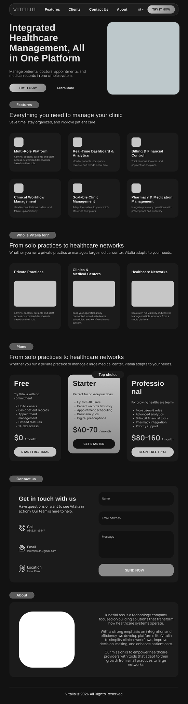

### 4.3.2. Landing Page Mock-up

*Figura 21 (Landing Page Mock-up)*  
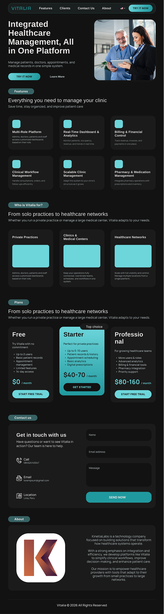

## 4.4. Web Applications UX/UI Design

### 4.4.1. Web Applications Wireframes

*Figura 22 (Web Applications Wireframes)*  

### 4.4.2. Web Applications Wireflow Diagrams

**Primer Segmento Objetivo (Administradores de establecimientos de PNAS)**

- **Como** administrador de un establecimiento de PNAS, **quiero** registrar y mantener una ficha única de pacientes, **para** evitar duplicidades y asegurar que la información quede disponible para admisión, consultorio, laboratorio, farmacia y caja. (US021, US024)
- **Como** administrador de un establecimiento de PNAS, **quiero** programar citas solicitadas por canales presenciales o telefónicos y confirmar la asistencia del paciente, **para** actualizar el flujo de atención en tiempo real. (US022, US023)
- **Como** administrador de un establecimiento de PNAS, **quiero** gestionar el circuito operativo posterior a la atención, incluyendo recetas para farmacia, facturación electrónica y pagos pendientes, **para** mantener ordenado el proceso asistencial y financiero. (US025, US026, US029)
- **Como** administrador de un establecimiento de PNAS, **quiero** consultar indicadores de citas, atenciones e ingresos en un dashboard, **para** tomar decisiones operativas con información consolidada y actualizada. (US027)
- **Como** administrador de un establecimiento de PNAS, **quiero** generar reportes automáticos e integrar Vitalia con otros sistemas mediante API, **para** reducir trabajo manual y evitar el aislamiento de la operación del establecimiento. (US026, US030)

*Figura 23 (Wireflow 1 Administradores)*  
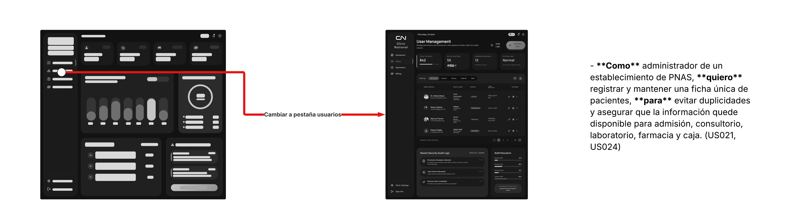

*Figura 24 (Wireflow 2 Administradores)*  
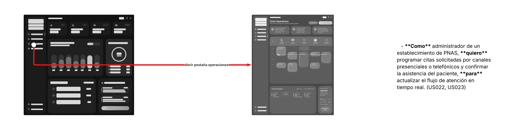

*Figura 25 (Wireflow 3 Administradores)*  
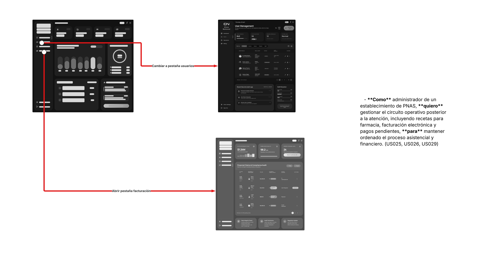

*Figura 26 (Wireflow 4 Administradores)*  
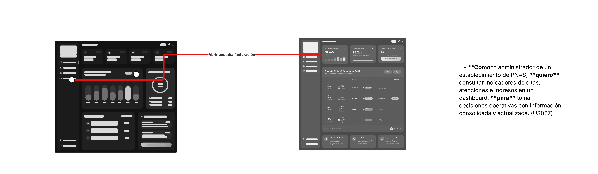

*Figura 27 (Wireflow 5 Administradores)*  
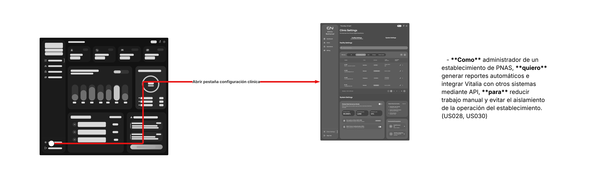

**Segundo Segmento Objetivo (Doctores de establecimientos de PNAS)**

- **Como** doctor de un establecimiento de PNAS, **quiero** revisar mi agenda diaria, el estado de mis citas y los datos de triaje antes de la consulta, **para** preparar mejor cada atención. (US010, US019)
- **Como** doctor de un establecimiento de PNAS, **quiero** acceder rápidamente al historial clínico y a un resumen automático del paciente, **para** tomar decisiones con antecedentes relevantes dentro del tiempo disponible. (US011, US017)
- **Como** doctor de un establecimiento de PNAS, **quiero** registrar la anamnesis, el examen físico y el diagnóstico en una sola atención, **para** mantener la información clínica ordenada y completa. (US012, US013)
- **Como** doctor de un establecimiento de PNAS, **quiero** emitir recetas digitales y órdenes de exámenes desde la misma consulta, **para** facilitar el tratamiento, la dispensación y el seguimiento diagnóstico del paciente. (US014, US015)

*Figura 28 (Wireflow 1 Doctores)*  
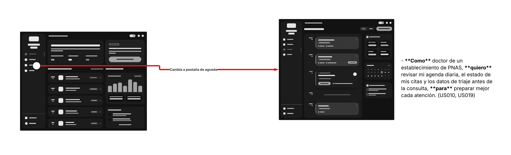

*Figura 29 (Wireflow 2 Doctores)*  
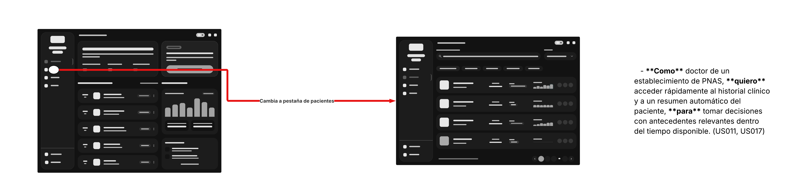

*Figura 30 (Wireflow 3 Doctores)*  

*Figura 31 (Wireflow 4 Doctores)*  
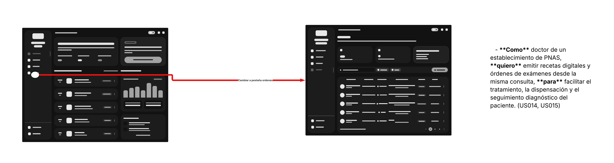

**Tercer Segmento Objetivo (Pacientes de todas las edades)**

- **Como** paciente, **quiero** crear una cuenta e iniciar sesión de manera sencilla y segura, **para** acceder a mis servicios médicos desde un solo lugar. (US001, US002)
- **Como** paciente, **quiero** reservar, reprogramar o cancelar citas digitales en pocos pasos, **para** adaptar mi atención a mi disponibilidad sin depender de llamadas o trámites presenciales. (US003, US004, US005)
- **Como** paciente, **quiero** recibir recordatorios automáticos de mis citas, **para** reducir olvidos, inasistencias y confusiones sobre la fecha u hora de atención. (US008)
- **Como** paciente, **quiero** consultar mi historial clínico, resultados y recetas emitidas en línea, **para** dar seguimiento a mis diagnósticos y tratamientos sin solicitar copias físicas. (US006, US007)

*Figura 32 (Wireflow 1 Pacientes)*  

*Figura 33 (Wireflow 2 Pacientes)*  
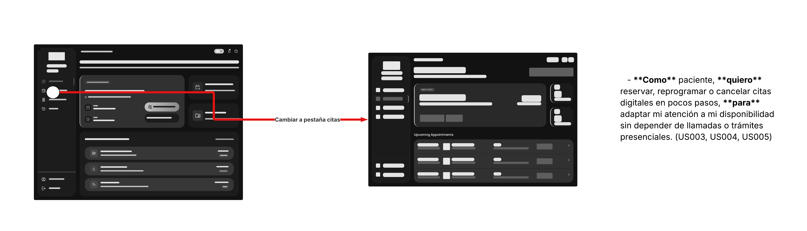

*Figura 34 (Wireflow 3 Pacientes)*  
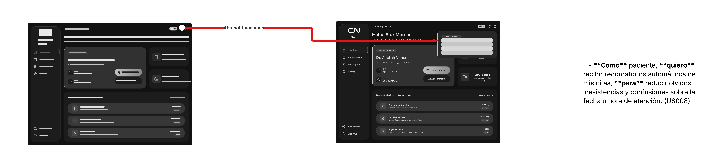

*Figura 35 (Wireflow 4 Pacientes)*  
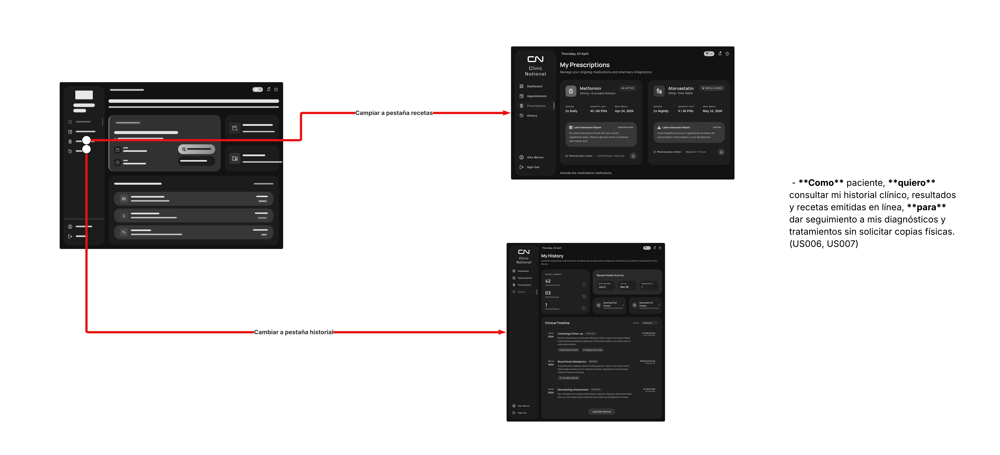

### 4.4.3. Web Applications Mock-ups

*Figura 36 (Admin Clinic Settings)*  

*Figura 37 (Admin Billing)*  

*Figura 38 (Admin Operations)*  

*Figura 39 (Admin Users)*  

*Figura 40 (Admin Dashboard)*  

*Figura 41 (Patient Profile)*  

*Figura 42 (Patient History)*  

*Figura 43 (Patient Prescriptions)*  

*Figura 44 (Patient Appointments)*  

*Figura 45 (Patient Dashboard)*  

*Figura 46 (Doctor Profile)*  

*Figura 47 (Doctor Orders)*  

*Figura 48 (Doctor Agenda)*  

*Figura 49 (Doctor Patients)*  

*Figura 50 (Doctor Dashboard)*  

### 4.4.4. Web Applications User Flow Diagrams

**Primer Segmento Objetivo (Administradores de establecimientos de PNAS)**

- **Como** administrador de un establecimiento de PNAS, **quiero** registrar y mantener una ficha única de pacientes, **para** evitar duplicidades y asegurar que la información quede disponible para admisión, consultorio, laboratorio, farmacia y caja. (US021, US024)
- **Como** administrador de un establecimiento de PNAS, **quiero** programar citas solicitadas por canales presenciales o telefónicos y confirmar la asistencia del paciente, **para** actualizar el flujo de atención en tiempo real. (US022, US023)
- **Como** administrador de un establecimiento de PNAS, **quiero** gestionar el circuito operativo posterior a la atención, incluyendo recetas para farmacia, facturación electrónica y pagos pendientes, **para** mantener ordenado el proceso asistencial y financiero. (US025, US026, US029)
- **Como** administrador de un establecimiento de PNAS, **quiero** consultar indicadores de citas, atenciones e ingresos en un dashboard, **para** tomar decisiones operativas con información consolidada y actualizada. (US027)
- **Como** administrador de un establecimiento de PNAS, **quiero** generar reportes automáticos e integrar Vitalia con otros sistemas mediante API, **para** reducir trabajo manual y evitar el aislamiento de la operación del establecimiento. (US026, US030)

*Figura 51 (Userflow 1 Administradores)* 
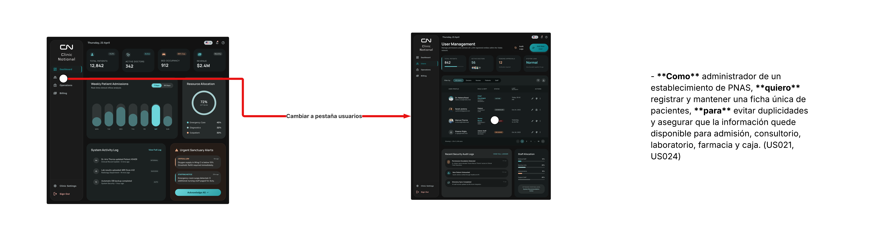

*Figura 52 (Userflow 2 Administradores)* 
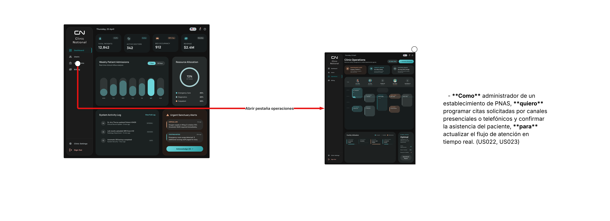

*Figura 53 (Userflow 3 Administradores)* 
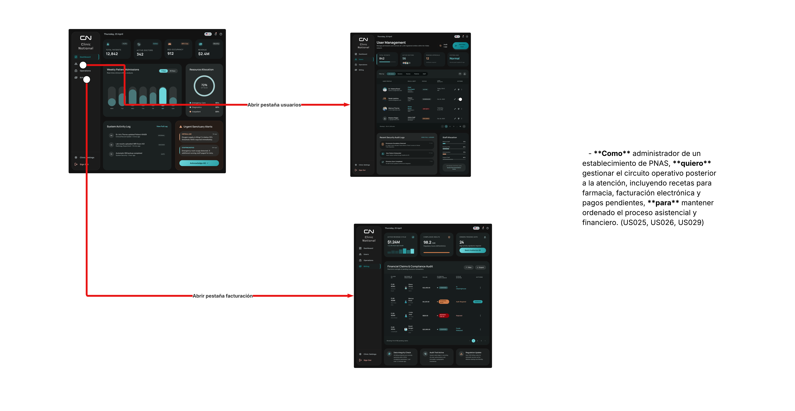

*Figura 54 (Userflow 4 Administradores)* 
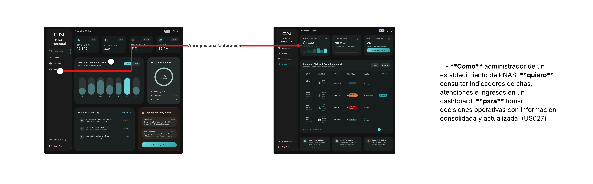

*Figura 55 (Userflow 5 Administradores)* 
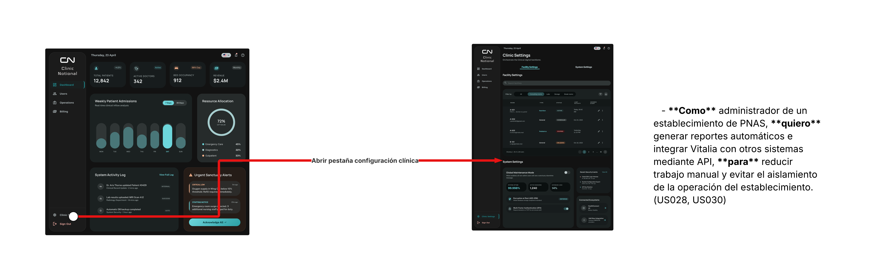

**Segundo Segmento Objetivo (Doctores de establecimientos de PNAS)**

- **Como** doctor de un establecimiento de PNAS, **quiero** revisar mi agenda diaria, el estado de mis citas y los datos de triaje antes de la consulta, **para** preparar mejor cada atención. (US010, US019)
- **Como** doctor de un establecimiento de PNAS, **quiero** acceder rápidamente al historial clínico y a un resumen automático del paciente, **para** tomar decisiones con antecedentes relevantes dentro del tiempo disponible. (US011, US017)
- **Como** doctor de un establecimiento de PNAS, **quiero** registrar la anamnesis, el examen físico y el diagnóstico en una sola atención, **para** mantener la información clínica ordenada y completa. (US012, US013)
- **Como** doctor de un establecimiento de PNAS, **quiero** emitir recetas digitales y órdenes de exámenes desde la misma consulta, **para** facilitar el tratamiento, la dispensación y el seguimiento diagnóstico del paciente. (US014, US015)

*Figura 56 (Userflow 1 Doctores)* 
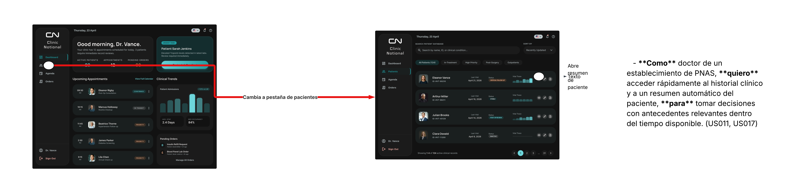

*Figura 57 (Userflow 2 Doctores)* 
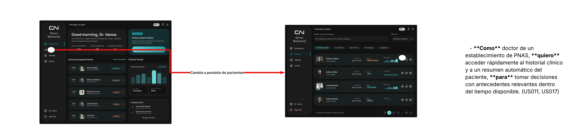

*Figura 58 (Userflow 3 Doctores)* 

*Figura 59 (Userflow 4 Doctores)* 
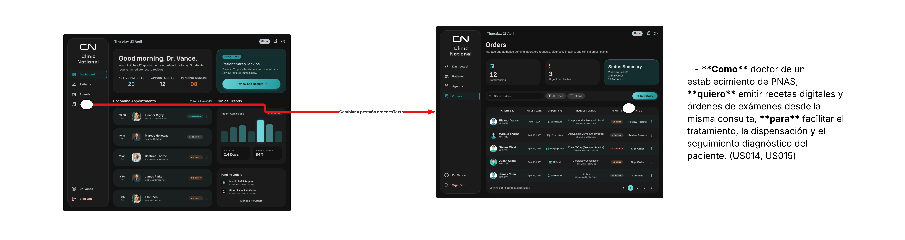

**Tercer Segmento Objetivo (Pacientes de todas las edades)**

- **Como** paciente, **quiero** crear una cuenta e iniciar sesión de manera sencilla y segura, **para** acceder a mis servicios médicos desde un solo lugar. (US001, US002)
- **Como** paciente, **quiero** reservar, reprogramar o cancelar citas digitales en pocos pasos, **para** adaptar mi atención a mi disponibilidad sin depender de llamadas o trámites presenciales. (US003, US004, US005)
- **Como** paciente, **quiero** recibir recordatorios automáticos de mis citas, **para** reducir olvidos, inasistencias y confusiones sobre la fecha u hora de atención. (US008)
- **Como** paciente, **quiero** consultar mi historial clínico, resultados y recetas emitidas en línea, **para** dar seguimiento a mis diagnósticos y tratamientos sin solicitar copias físicas. (US006, US007)

*Figura 60 (Userflow 1 Pacientes)* 

    
*Figura 61 (Userflow 2 Pacientes)* 
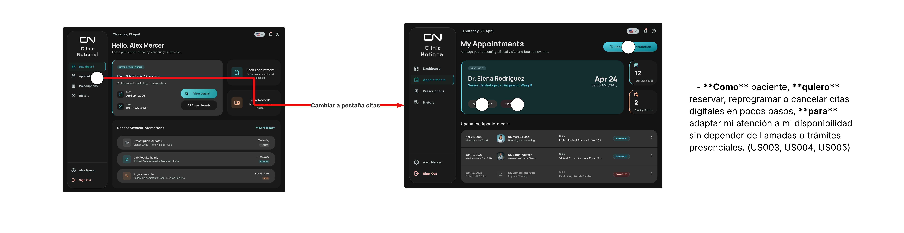
    
*Figura 62 (Userflow 3 Pacientes)* 
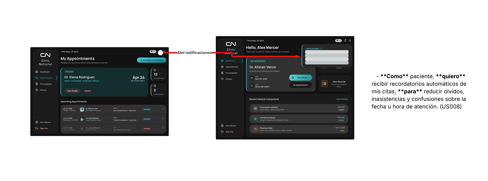

*Figura 63 (Userflow 4 Pacientes)* 
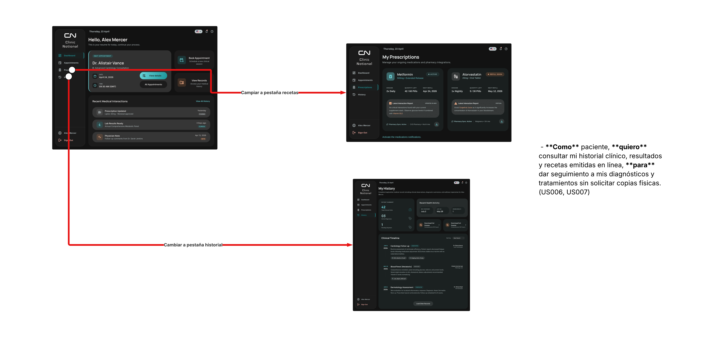

## 4.5. Web Applications Prototyping

En esta sección se presentan los prototipos de interfaz de usuario (UI) para Desktop y Mobile Web Browser, los cuales simulan la interacción y navegación de los principales flujos definidos en los User Flow Diagrams, alineados con las historias de usuario previamente descritas. En el caso del segmento de administradores, se representan flujos como el registro y gestión de pacientes (US021, US024), la programación y confirmación de citas (US022, US023), y la gestión del circuito posterior a la atención, incluyendo recetas, facturación y pagos (US025, US026, US029), así como la consulta de indicadores y generación de reportes (US027, US026, US030). Para el segmento de doctores, los prototipos cubren la revisión de agenda y datos de triaje (US010, US019), el acceso al historial clínico y resúmenes automáticos (US011, US017), el registro integral de la atención médica (US012, US013), y la emisión de recetas digitales y órdenes de exámenes (US014, US015). Finalmente, para el segmento de pacientes, se incluyen flujos de creación de cuenta e inicio de sesión (US001, US002), gestión de citas digitales (US003, US004, US005), recepción de recordatorios (US008) y consulta de historial clínico y resultados en línea (US006, US007). El diseño de estos prototipos responde a criterios de usabilidad, consistencia y claridad en la arquitectura de información, estructurando la navegación en módulos funcionales según el rol del usuario. La validación de estos flujos se presenta mediante un video demostrativo que evidencia la interacción y navegación en los prototipos, reemplazando las capturas estáticas al mostrar de forma más completa el comportamiento dinámico del sistema.

**Prototype Video Link:** [https://upcedupe-my.sharepoint.com/personal/u202410678_upc_edu_pe/_layouts/15/stream.aspx?id=%2Fpersonal%2Fu202410678_upc_edu_pe%2FDocuments%2FUniversidad%2FCiclo5%2Fprototype%2Emkv&referrer=StreamWebApp%2EWeb&referrerScenario=AddressBarCopied%2Eview%2E7f436198-8fbe-46a0-be83-45666c03bdca](https://upcedupe-my.sharepoint.com/personal/u202410678_upc_edu_pe/_layouts/15/stream.aspx?id=%2Fpersonal%2Fu202410678_upc_edu_pe%2FDocuments%2FUniversidad%2FCiclo5%2Fprototype%2Emkv&referrer=StreamWebApp%2EWeb&referrerScenario=AddressBarCopied%2Eview%2E7f436198-8fbe-46a0-be83-45666c03bdca)

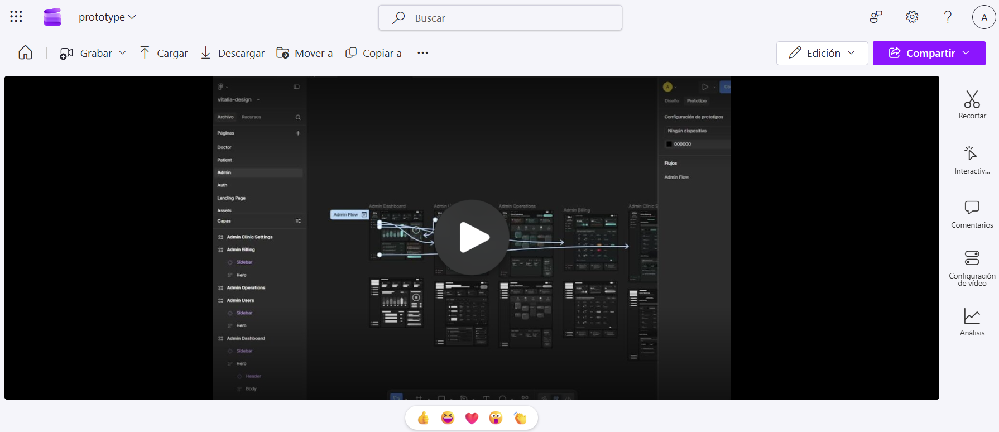

## 4.6. Domain-Driven Software Architecture

### 4.6.1. Design-Level EventStorming

Se utilizó la guía de Philippe Bourgau, proporcionada en la rúbrica del Final Problem Statement, para llevar a cabo el proceso de Design-Level EventStorming, con el objetivo de identificar los Bounded Contexts, siguiendo sus etapas:

- Unstructured Exploration
- Timelines
- Pain Points
- Pivotal Points
- Commands
- Policies
- Read Models
- External Systems
- Aggregates
- Bounded Contexts

**Miro Board Link:** [https://miro.com/app/board/uXjVGhdfT5g=/?share_link_id=948975680057](https://miro.com/app/board/uXjVGhdfT5g=/?share_link_id=948975680057)

*Figura 64 (Design Level EventStorming)*  
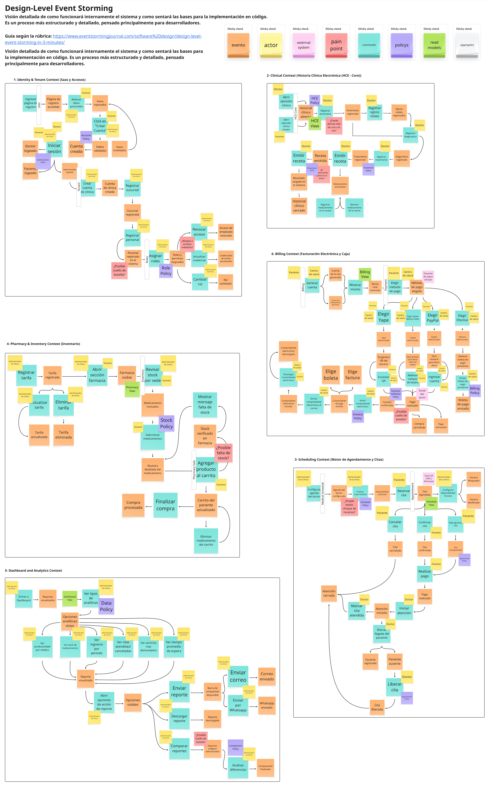

### 4.6.2. Software Architecture Context Diagram

El diagrama de contexto presenta una visión de alto nivel del sistema Vitalia, mostrando su interacción con los actores externos y sistemas externos relevantes. Este diagrama permite comprender el alcance del sistema, identificando quiénes lo utilizan y con qué servicios externos se integra, sin entrar en detalles técnicos internos.

*Figura 65 (Context Diagram)*  
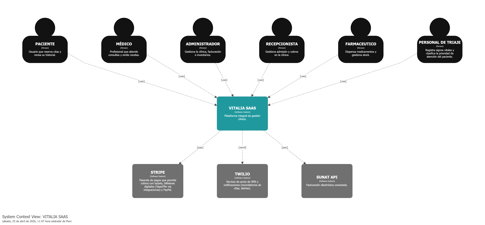

### 4.6.3. Software Architecture Container Diagrams

El diagrama de contenedores descompone el sistema en sus principales unidades de ejecución, mostrando cómo se distribuyen las responsabilidades dentro de la arquitectura. En este nivel se identifican elementos como la aplicación web, API Gateway y los distintos servicios o bounded contexts, así como las tecnologías utilizadas y la forma en que estos se comunican entre sí.

*Figura 66 (Container Diagram)*  
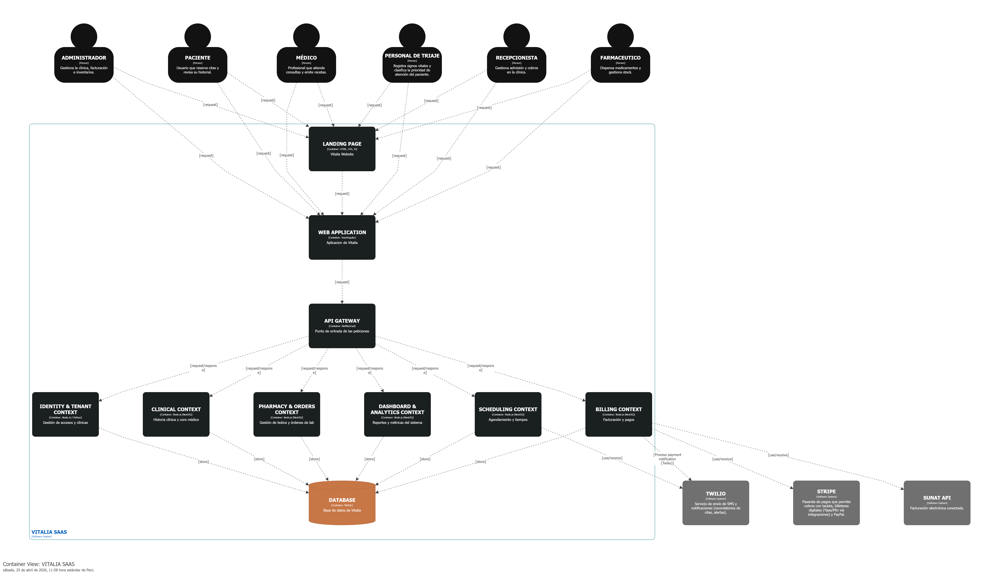

### 4.6.4. Software Architecture Components Diagrams

El diagrama de componentes profundiza en cada contenedor, detallando los módulos internos que lo conforman y sus interacciones. Este nivel permite visualizar la organización interna.

*Figura 67 (Component Diagram - Identity & Tenant Context)*  
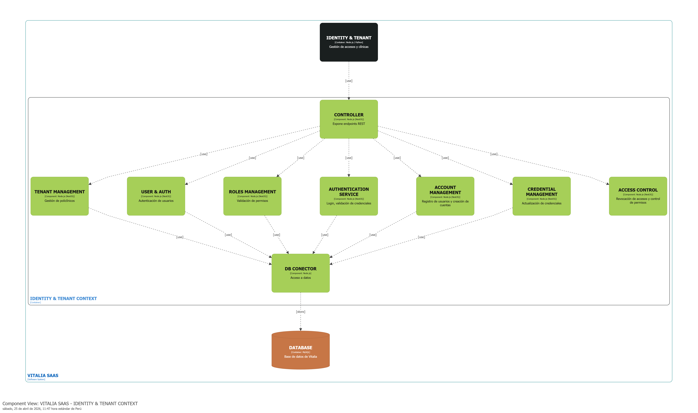

*Figura 68 (Component Diagram - Clinical Context)*  
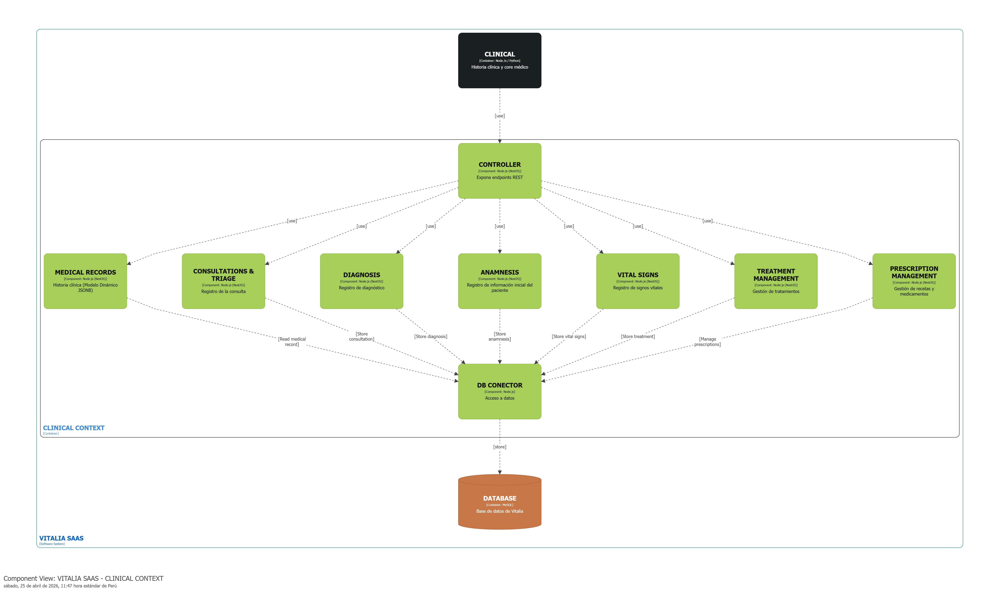

*Figura 69 (Component Diagram - Schedule Context)*  
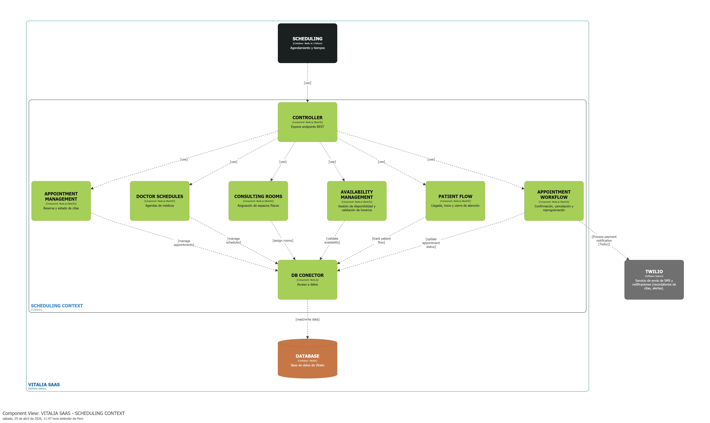

*Figura 70 (Component Diagram - Pharmacy & Inventory Context)*  
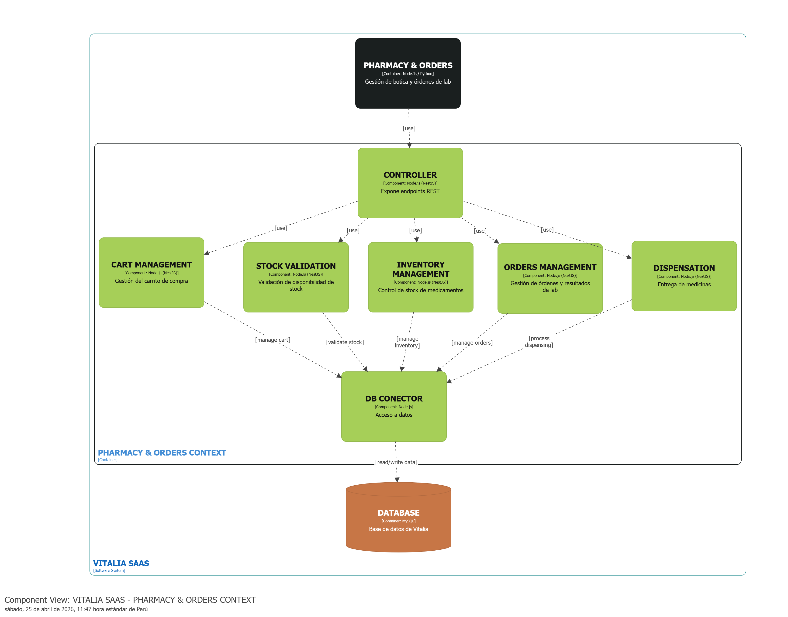

*Figura 71 (Component Diagram - Dashboard and Analytics Context)*  
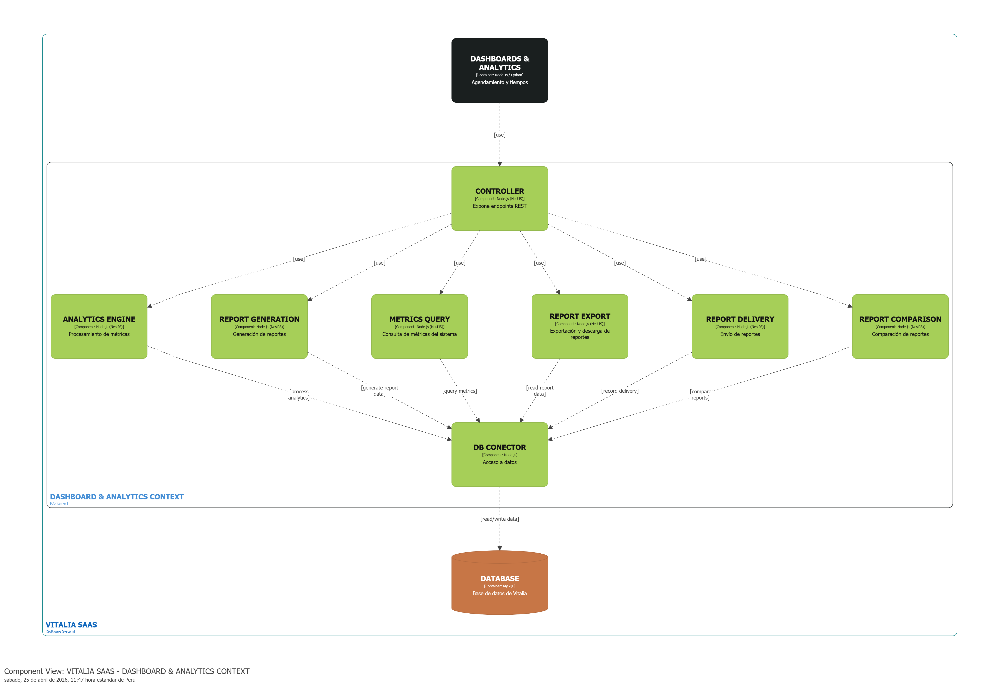

*Figura 72 (Component Diagram - Billing Context)*  
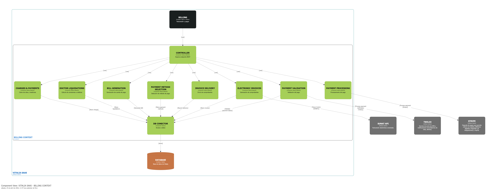

## 4.7. Software Object-Oriented Design

### 4.7.1. Class Diagrams

En la primera etapa, se elaboró el diagrama de clases general identificando las principales entidades del dominio de Vitalia, así como sus atributos, métodos, relaciones y multiplicidades. Este paso permitió establecer una visión global del sistema, asegurando que todos los elementos relevantes del negocio estuvieran correctamente modelados y conectados entre sí.

En la segunda etapa, estas clases fueron organizadas en distintos Bounded Context, agrupándolas según su responsabilidad, propósito y cohesión dentro del sistema. Esta separación permitió delimitar claramente los contextos del dominio, facilitando la comprensión del sistema y reduciendo la complejidad al dividirlo en módulos más manejables, alineados con la lógica de negocio.

Finalmente, en la tercera etapa, se realizó un análisis más profundo de cada clase dentro de su contexto, clasificándolas como Entity, Value Object o Aggregate. Esta identificación permitió definir con precisión las reglas de negocio, los límites de consistencia y las responsabilidades de cada componente dentro del dominio. Como resultado, los diagramas finales reflejan una arquitectura sólida, coherente y alineada con los principios de DDD, mostrando no solo la estructura del sistema, sino también la lógica y comportamiento del dominio.

*Figura 73 (Class Diagram - Identity and Clinic Context)*  
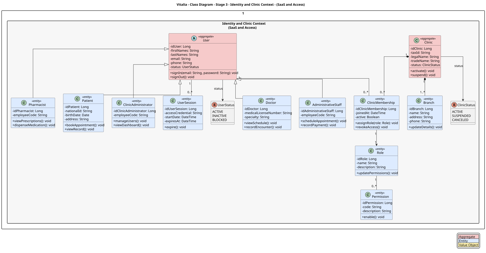

*Figura 74 (Class Diagram - Clinical Context)*  
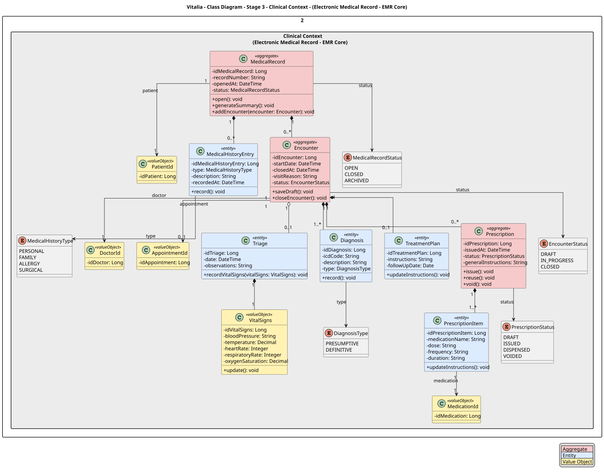

*Figura 75 (Class Diagram - Scheduling Context)*  
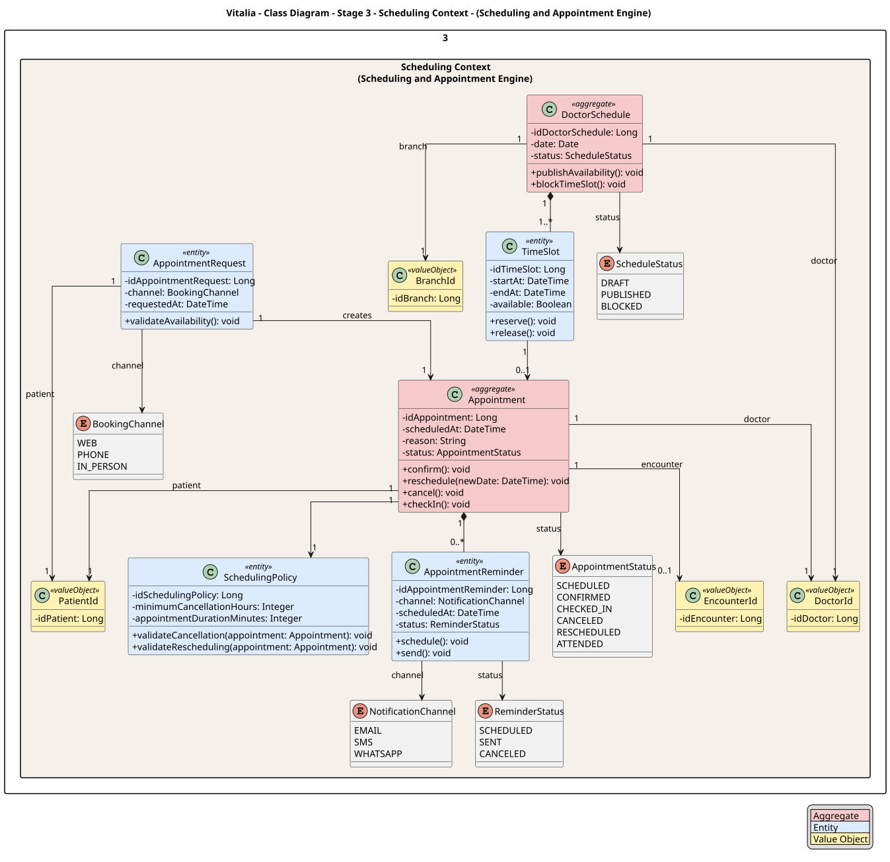

*Figura 76 (Class Diagram - Pharmacy & Inventory Context)*  
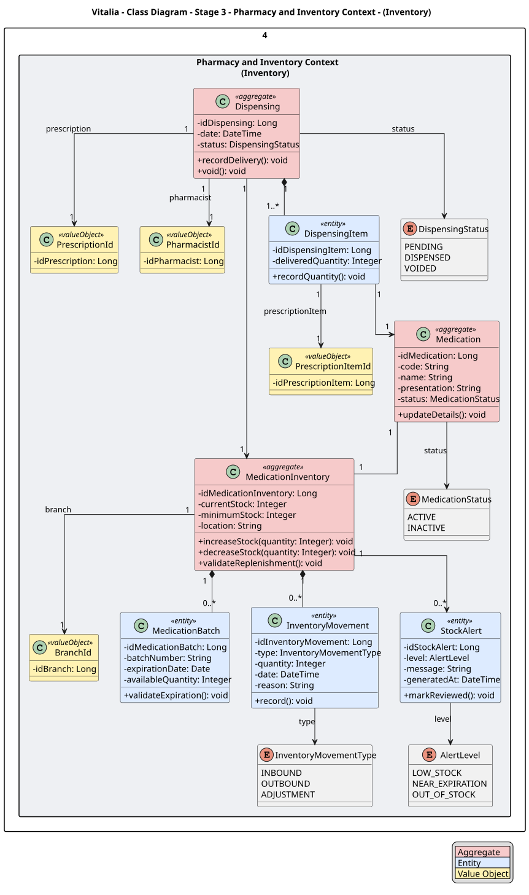

*Figura 77 (Class Diagram - Dashboard and Analytics Context)*  
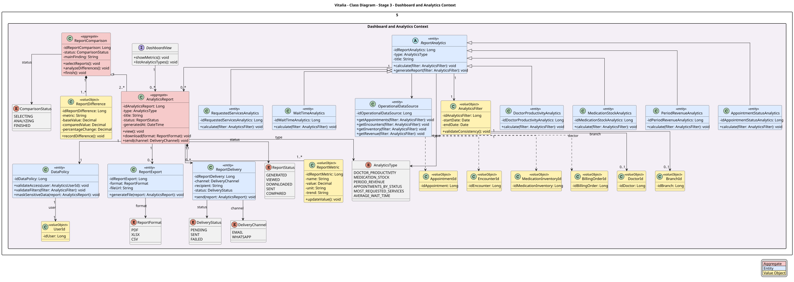

*Figura 78 (Class Diagram - Billing Context)*  
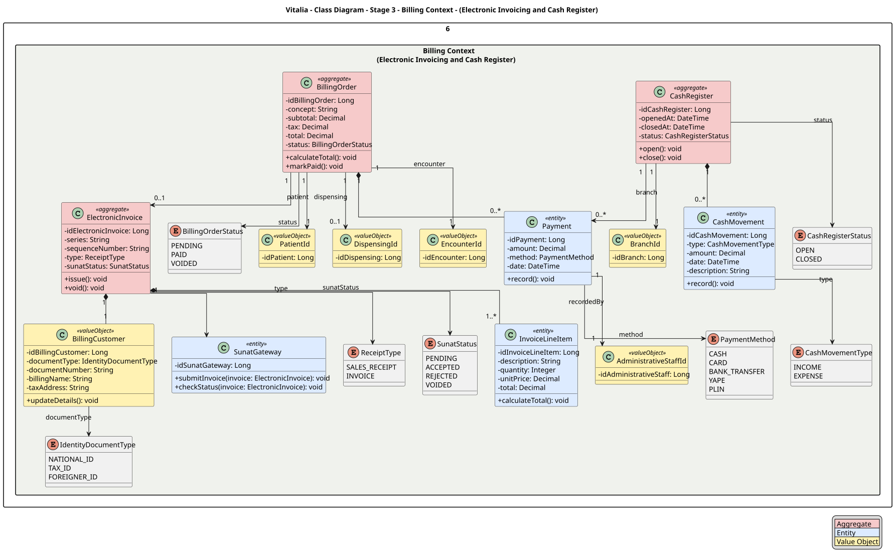

## 4.8. Database Design

### 4.8.1. Database Diagrams

*Figura 79 (Database Diagram)*  
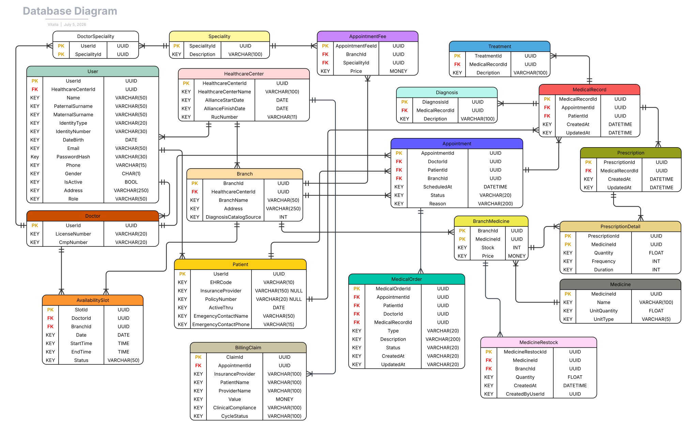

# Capítulo V: Product Implementation, Validation & Deployment

## 5.1. Software Configuration Management

### 5.1.1. Software Development Environment Configuration

**Project Management**

WhatsApp (SaaS/Application): Aplicación de mensajería instantánea utilizada por el equipo para coordinar actividades, resolver dudas y mantener comunicación continua durante el desarrollo del proyecto. Ruta: [https://www.whatsapp.com/](https://www.whatsapp.com/)

Trello (SaaS/Application): Herramienta de gestión de proyectos basada en la metodología Kanban, utilizada por el equipo para planificar, organizar y dar seguimiento al avance de las tareas del proyecto. A través de tableros, listas y tarjetas, se controlaron los sprints y se documentaron los entregables de cada fase. 
Ruta: [https://trello.com/](https://trello.com/)

**Product UX/UI design**

Figma (SaaS/Application): Plataforma colaborativa en línea empleada para diseñar la interfaz visual del producto, diseñar Wireframes, crear prototipos interactivos y definir la estructura gráfica del sistema. Ruta: [https://www.figma.com/](https://www.figma.com/)

LucidChart (SaaS): Herramienta utilizada para crear user flows, representando visualmente las rutas y acciones que siguen los usuarios dentro del producto digital. Ruta: [https://www.lucidchart.com/](https://www.lucidchart.com/)
 
**Software Development**

Visual Studio Code (Application): Editor de código fuente multiplataforma que permite escribir, depurar y ejecutar el código del sistema. Incluye integración con GitHub para control de versiones. Ruta: [https://code.visualstudio.com/](https://code.visualstudio.com/)

Live Preview (Extensión de Visual Studio Code): Extensión oficial de Microsoft que permite visualizar en tiempo real los cambios realizados en el código HTML, CSS y JavaScript dentro del navegador, facilitando el desarrollo web. Ruta: [https://marketplace.visualstudio.com/items?itemName=ms-vscode.live-server](https://marketplace.visualstudio.com/items?itemName=ms-vscode.live-server)

GitHub (SaaS): Plataforma basada en Git utilizada para alojar repositorios de código, realizar control de versiones, seguimiento de cambios y trabajo colaborativo entre desarrolladores. Ruta: [https://github.com](https://github.com)

**Software Testing**

Google Chrome (Application): Navegador web utilizado para realizar pruebas funcionales y de interfaz del producto digital, verificando el comportamiento y la visualización. Ruta: [https://www.google.com/chrome](https://www.google.com/chrome)

**Software Documentation**

Markdown (Lenguaje de marcado ligero): Utilizado para elaborar y mantener la documentación del proyecto de forma simple, legible y compatible con múltiples plataformas. Ruta: [https://www.markdownguide.org/](https://www.markdownguide.org/)

### 5.1.2. Source Code Management

El proyecto se gestionará mediante Git como sistema de control de versiones, utilizando el modelo de ramas GitFlow, propuesto por Vincent Driessen (2010), como workflow principal. Este modelo permite mantener una estructura ordenada y colaborativa para el desarrollo, pruebas y liberación del producto digital.

**URL de repositorios en GitHub:** [https://github.com/orgs/kinetia-upc/repositories](https://github.com/orgs/kinetia-upc/repositories)

**Estructura de Ramas (branches):**

*Ramas principales:*  
* Main: Versión estable y lista para producción
* Develop: Rama de integración, se unirán todas las funcionalidades desarrolladas antes de preparar una versión oficial

*Ramas de soporte:*  
* Feature: Cada nueva funcionalidad o mejora se desarrollará en una rama independiente a partir de develop. Convención de nombre: feature/nombre-descriptivo.
* Release: Ramas temporales creadas desde develop para preparar una nueva versión antes de su lanzamiento. Solo se aplican correcciones menores o ajustes.
Convención de nombres: release/vX.Y.Z
* Hotfix: Ramas utilizadas para solucionar errores críticos detectados en la versión de producción. Una vez corregido, se fusiona tanto en main como en develop.
Convención de nombres: hotfix/vX.Y.Z

*Semantic Versioning:*  
Se usará Semantic Versioning 2.0.0, utilizando el formato: MAJOR.MINOR.PATCH
MAJOR: Cambio incompatible
MINOR: Nueva funcionalidad compatible
PATCH: Corrección y ajuste menor

*Conventional Commits:*  
Para los mensajes de commit se utilizará el estándar Conventional Commits, asegurando claridad y trazabilidad en el historial del proyecto. 

\<tipo>(\<opcional>): \<mensaje en presente>

Tipos:  
* feat: nueva funcionalidad.
* fix: corrección de error.
* docs: cambios en documentación.
* style: formato o estilo (sin lógica).
* refactor: reestructuración del código.
* chore: tareas menores o de mantenimiento

### 5.1.3. Source Code Style Guide & Conventions

Para todos los lenguajes se aplicará la nomenclatura en inglés.

**Lenguaje HTML**

Se seguirá la guía HTML Style Guide and Coding Conventions y las recomendaciones de Google HTML/CSS Style Guide:
* Los nombres de archivos serán en minúsculas, sin espacios, separados por guiones.
* Las etiquetas estarán correctamente anidadas, en minúsculas y con sangría de dos espacios.
* Los atributos HTML se escribirán en minúsculas y siempre entre comillas.
* Los comentarios se usarán para describir secciones principales de código
* Evitar largas líneas de código

**Lenguaje CSS**

De acuerdo con Google HTML/CSS Style Guide:
* Los nombres de clases y selectores se escribirán en minúsculas y con guiones (kebab-case).
* Se mantendrá un orden lógico: primero estructura general, luego estilos específicos.
* Se evitará el uso de estilos en línea dentro del HTML.
* Los valores numéricos de cero no incluirán unidad.

**Lenguaje JavaScript**

Se seguirán las convenciones estándar de JavaScript Style Guide (Google y MDN):
* Uso de camelCase para variables y funciones.
* Uso de PascalCase para nombres de clases o constructores.
* Uso de const y let en lugar de var.
* Sangría de dos espacios y punto y coma al final de cada instrucción.
* Los comentarios se harán con // para líneas simples o /* ... */ para bloques.

### 5.1.4. Software Deployment Configuration

**Landing Page**

El despliegue se realizará mediante GitHub Pages, una plataforma gratuita de GitHub que permite publicar sitios web estáticos directamente desde el repositorio de código fuente, sin necesidad de configurar servidores adicionales.

*Procedimiento planificado:*  
1.	Verificar que la versión final del proyecto esté almacenada y actualizada en la rama main del repositorio.
2.	Acceder al repositorio en GitHub y dirigirse a Settings -> Pages.
3.	En la sección Source, seleccionar la rama main y la carpeta raíz.
4.	Guardar la configuración para que GitHub Pages genere automáticamente la página pública.
5.	Una vez desplegado, el sitio estará disponible.

Cuando el proyecto esté en fase de mantenimiento, las actualizaciones se gestionarán mediante commits y merges hacia la rama main. Cada cambio publicado en esta rama generará automáticamente una nueva versión desplegada del sitio.

## 5.2. Landing Page, Services & Applications Implementation

### 5.2.1. Sprint 1

#### *5.2.1.1. Sprint Planning 1*

Para el desarrollo del primer sprint nos centramos en el desarrollo de la landing page de nuestra aplicación. Para ello designamos tareas específicas para cada sección, de modo que podamos repartirnos estas tareas entre los integrantes del grupo por sección de la landing, agilizando su desarrollo. Dentro de la landing se presenta quiénes somos, funcionalidades, planes, manera de contactarnos y sobre la organización.

| **Sprint #** | 1 |
| --- | --- |
| **Date** | 2026-04-24 |
| **Time** | 4:00 PM |
| **Location** | Reunión virtual |
| **Prepared By** | Adrian Ruiz Mideyros |
| **Attendees** | Adrian Ruiz Mideyros, Nestor Alonso Rojas Tello, Alejandra Isabel Astocondor Bazan, Alexther Kamil Diaz Martinez, Leo César Dulanto Espino|
| **Sprint n Goal** | Our focus is on building a fully responsive landing page aligned with Vitalia’s healthcare value proposition, with all key sections clearly structured. The goal is to communicate how our platform enhances access to medical services, improves patient experience, and integrates solutions such as diagnostics, laboratory, and specialized care. This will be validated once the page is deployed, ensuring a seamless, intuitive experience across both mobile and desktop devices. |
| **Sprint n Velocity** | Designamos aceptar hasta 20 SP |
| **Sum of Story Points** | 20 SP |

#### *5.2.1.2. Aspect Leaders and Collaborators*

| Team Member | GitHub Username | Hero | Planes | Contacto | Sobre nosotros | Clientes |
| --- | --- | --- | --- | --- | --- | --- |
| Astocondor Bazan, Alejandra Isabel | AleeAsto | C | C | L | C | C |
| Dulanto Espino, Leo César | Leotens | L | C | C | C | C |
| Ruiz Mideyros, Adrian | AdrixRyz | C | L | C | C | C |
| Alexther Kamil Diaz Martinez | kamil-tron | C | C | C | C | L |
| Rojas Tello, Alonso | nes-ro | C | C | C | L | C |

#### *5.2.1.3. Sprint Backlog 1*

El Sprint Backlog 1 reúne las tareas necesarias para implementar la landing page de Vitalia, priorizando las secciones visibles para comunicar la propuesta de valor, funcionalidades, planes, contacto y quiénes somos.

**Trello Board Link:** [https://trello.com/invite/b/69e0ffa8dc72e4967311e1aa/ATTI47d8e7ca896972d7014ef7746935492a02062707/vitalia-board](https://trello.com/invite/b/69e0ffa8dc72e4967311e1aa/ATTI47d8e7ca896972d7014ef7746935492a02062707/vitalia-board)

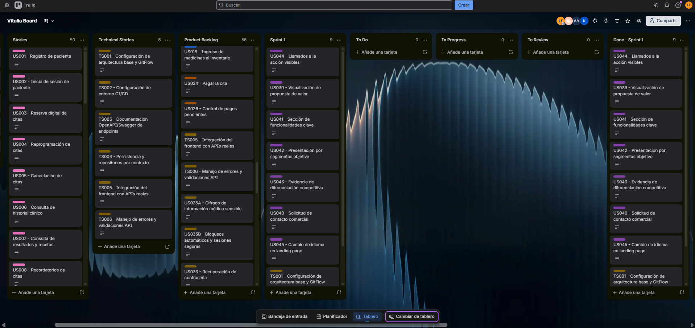

<strong>Sprint #:</strong> Sprint 1

<table border="1" cellspacing="0" cellpadding="6">
  <thead>
    <tr>
      <th colspan="3">User Story</th>
      <th colspan="6">Work-Item / Task</th>
    </tr>
    <tr>
      <th>Id</th>
      <th>Title</th>
      <th>Story Points</th>
      <th>Id</th>
      <th>Title</th>
      <th>Description</th>
      <th>Estimation (Hours)</th>
      <th>Assigned To</th>
      <th>Status</th>
    </tr>
  </thead>
  <tbody>
      <tr>
      <td>US046</td>
      <td>Llamados a la acción visibles</td>
      <td>2</td>
      <td>TO01</td>
      <td>Hero</td>
      <td>Implementar el hero de la landing page</td>
      <td>1</td>
      <td>Leotens</td>
      <td>Completed</td>
    </tr>
    <tr>
      <td>US041</td>
      <td>Visualización de propuesta de valor</td>
      <td>2</td>
      <td>TO02</td>
      <td>Header</td>
      <td>Implementar el header de la landing page</td>
      <td>1</td>
      <td>Leotens</td>
      <td>Completed</td>
    </tr>
    <tr>
      <td>US043</td>
      <td>Sección de funcionalidades clave</td>
      <td>2</td>
      <td>TO03</td>
      <td>Sección funcionalidades</td>
      <td>Implementar funcionalidades clave</td>
      <td>1</td>
      <td>Leotens</td>
      <td>Completed</td>
    </tr>
    <tr>
      <td>US044</td>
      <td>Presentación por segmentos objetivo</td>
      <td>3</td>
      <td>TO04</td>
      <td>Sección clientes</td>
      <td>Implementar Who is vitalia for? </td>
      <td>1</td>
      <td>Kamil-tron</td>
      <td>Completed</td>
    </tr>
    <tr>
      <td>US045</td>
      <td>Evidencia de diferenciación competitiva</td>
      <td>2</td>
      <td>TO05</td>
      <td>Sección planes</td>
      <td>Implementar sección planes</td>
      <td>1</td>
      <td>AdrixRyz</td>
      <td>Completed</td>
    </tr>
    <tr>
      <td>US045</td>
      <td>Evidencia de diferenciación competitiva</td>
      <td>2</td>
      <td>TO06</td>
      <td>Sección sobre nosotros</td>
      <td>Implementar about us</td>
      <td>1</td>
      <td>nes-ro</td>
      <td>Completed</td>
    </tr>
    <tr>
      <td>US042</td>
      <td>Solicitud de contacto comercial</td>
      <td>3</td>
      <td>TO07</td>
      <td>Contact us</td>
      <td>Mostrar información de contacto</td>
      <td>1</td>
      <td>Aleesto</td>
      <td>Completed</td>
    </tr>
    <tr>
      <td>US042</td>
      <td>Solicitud de contacto comercial</td>
      <td>3</td>
      <td>TO08</td>
      <td>Contact us</td>
      <td>Agregar formulario de contacto</td>
      <td>1</td>
      <td>AleeAsto</td>
      <td>Completed</td>
    </tr>
    <tr>
      <td>US047</td>
      <td>Cambio de idioma en landing page</td>
      <td>2</td>
      <td>TO09</td>
      <td>Idioma</td>
      <td>Agregar idiomas en landing page</td>
      <td>1</td>
      <td>nes-ro</td>
      <td>Completed</td>
    </tr>
    <tr>
      <td>TS001</td>
      <td>Configuración de arquitectura base y GitFlow</td>
      <td>2</td>
      <td>TO10</td>
      <td>Git y GitFlow Setup</td>
      <td>Establecer estructura de ramas y convenciones en el repositorio</td>
      <td>1</td>
      <td>nes-ro</td>
      <td>Completed</td>
    </tr>
    <tr>
      <td>TS001</td>
      <td>Configuración de arquitectura base y GitFlow</td>
      <td>2</td>
      <td>TO11</td>
      <td>Boilerplate y estructura</td>
      <td>Crear la estructura inicial de carpetas y plantillas HTML/CSS</td>
      <td>1</td>
      <td>AdrixRyz</td>
      <td>Completed</td>
    </tr>
    <tr>
      <td>TS002</td>
      <td>Configuración de entorno CI/CD</td>
      <td>2</td>
      <td>TO12</td>
      <td>GitHub Pages Setup</td>
      <td>Configurar la automatización y despliegue de la landing page</td>
      <td>1</td>
      <td>kamil-tron</td>
      <td>Completed</td>
    </tr>
  </tbody>
</table>

#### *5.2.1.4. Development Evidence for Sprint Review*

<table border="1" cellspacing="0" cellpadding="6">
  <thead>
    <tr>
      <th>Repository</th>
      <th>Branch</th>
      <th>Commit Id</th>
      <th>Commit Message</th>
      <th>Committed on (Date)</th>
    </tr>
  </thead>
  <tbody>
    <tr>
      <td>vitalia-landing</td>
      <td>develop</td>
      <td>ef40298</td>
      <td>feat: Añadir estructura basica y sección hero</td>
      <td>2026-06-22</td>
    </tr>
    <tr>
      <td>vitalia-landing</td>
      <td>develop</td>
      <td>ff4bcaf</td>
      <td>feat: Añadir estilos a estructura basica y a la sección hero</td>
      <td>2026-06-22</td>
    </tr>
    <tr>
      <td>vitalia-landing</td>
      <td>develop</td>
      <td>6052506</td>
      <td>feat: Añadir estructura sección features</td>
      <td>2026-06-22</td>
    </tr>
    <tr>
      <td>vitalia-landing</td>
      <td>develop</td>
      <td>d56689e</td>
      <td>feat: Añadir estilos sección features</td>
      <td>2026-06-22</td>
    </tr>
    <tr>
      <td>vitalia-landing</td>
      <td>feature/plans-section</td>
      <td>9a3f3b4</td>
      <td>feat: add plans section</td>
      <td>2026-06-22</td>
    </tr>
    <tr>
      <td>vitalia-landing</td>
      <td>feature/contact</td>
      <td>9a3f3b4</td>
      <td>feat: add contact us header</td>
      <td>2026-06-23</td>
    </tr>
    <tr>
      <td>vitalia-landing</td>
      <td>feature/contact</td>
      <td>ce589b89</td>
      <td>feat: add contact wrapper</td>      
      <td>2026-06-23</td>
    </tr>
    <tr>
      <td>vitalia-landing</td>
      <td>feature/contact</td>
      <td>58c57c8</td>
      <td>feat: add contact item</td>
      <td>2026-06-23</td>
    </tr>
    <tr>
      <td>vitalia-landing</td>
      <td>feature/contact</td>
      <td>58c57c8</td>
      <td>feat: contact-form</td>      
      <td>2026-06-23</td>
    </tr>
    <tr>
      <td>vitalia-landing</td>
      <td>feature/whoisvitalia</td>
      <td>45c9afe</td>
      <td>feat: añadir who is vitalia html</td>
      <td>2026-06-24</td>
    </tr>
    <tr>
      <td>vitalia-landing</td>
      <td>feature/whoisvitalia</td>
      <td>92f4fd7</td>
      <td>feat: añadir who is vitalia css</td>
      <td>2026-06-24</td>
    </tr>
    <tr>
      <td>vitalia-landing</td>
      <td>feature/aboutus</td>
      <td>c057df2</td>
      <td>feat: add about us html section</td>
      <td>2026-06-25</td>
    </tr>
    <tr>
      <td>vitalia-landing</td>
      <td>feature/aboutus</td>
      <td>19045f4</td>
      <td>feat: add about us css section</td>
      <td>2026-06-25</td>
    </tr>
    <tr>
      <td>vitalia-landing</td>
      <td>develop</td>
      <td>9184da9</td>
      <td>feat: add language modificator</td>
      <td>2026-06-25</td>
    </tr>
  </tbody>
</table>

#### *5.2.1.5. Execution Evidence for Sprint Review*

Durante este Sprint se completaron las principales vistas del Landing Page de Vitalia y se integraron las funcionalidades básicas de navegación, logrando un primer incremento completamente navegable. Se implementaron secciones clave como Funcionalidades, Planes, Contacto, Sobre Nosotros y Clientes, permitiendo presentar de manera clara la propuesta de valor del servicio.

#### *5.2.1.6. Services Documentation Evidence for Sprint Review*

Durante el presente Sprint no se desarrollaron Web Services ni endpoints, ya que el alcance del trabajo se centró en el diseño y desarrollo de una landing page estática orientada a la presentación del producto.

En esta etapa, el enfoque estuvo en la definición de la interfaz de usuario y la experiencia del usuario, por lo que no se implementaron servicios backend ni APIs que requieran documentación mediante OpenAPI.

Se prevé que en futuros Sprints, conforme se integren funcionalidades dinámicas y lógica de negocio, se desarrollen y documenten los correspondientes Web Services, incluyendo sus endpoints, parámetros y respuestas.

#### *5.2.1.7. Software Deployment Evidence for Sprint Review*

El despliegue se realizó mediante GitHub Pages, una plataforma gratuita de GitHub que permite publicar sitios web estáticos directamente desde el repositorio de código fuente, sin necesidad de configurar servidores adicionales. 

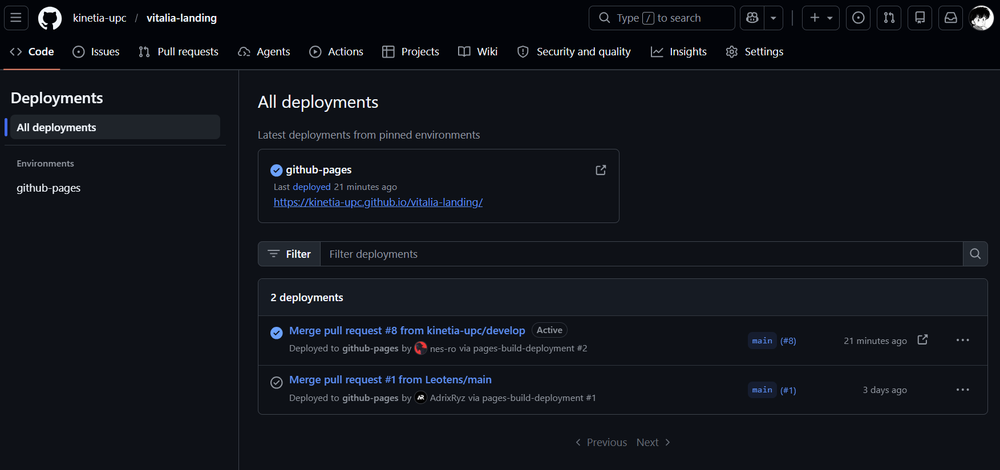

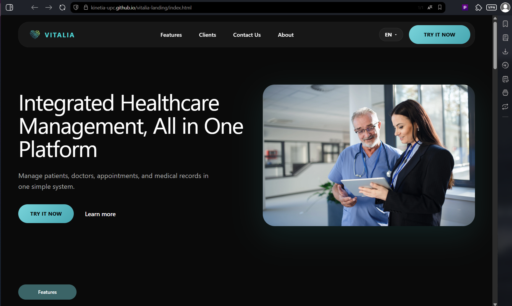

**Procedimiento planificado:** 

1. Verificar que la versión final del proyecto esté almacenada y actualizada en la rama main del repositorio. 

2. Acceder al repositorio en GitHub y dirigirse a Settings -> Pages. 

3. En la sección Source, seleccionar la rama main y la carpeta raíz. 

4. Guardar la configuración para que GitHub Pages genere automáticamente la página pública. 

5. Una vez desplegado, el sitio estará disponible. 

Cuando el proyecto esté en fase de mantenimiento, las actualizaciones se gestionarán mediante commits y merges hacia la rama main. Cada cambio publicado en esta rama generará automáticamente una nueva versión desplegada del sitio.

#### *5.2.1.8. Team Collaboration Insights during Sprint*

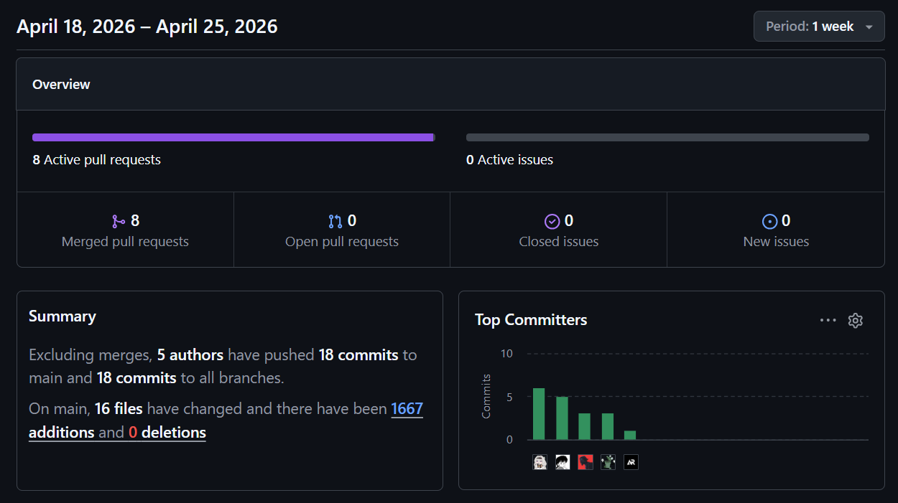

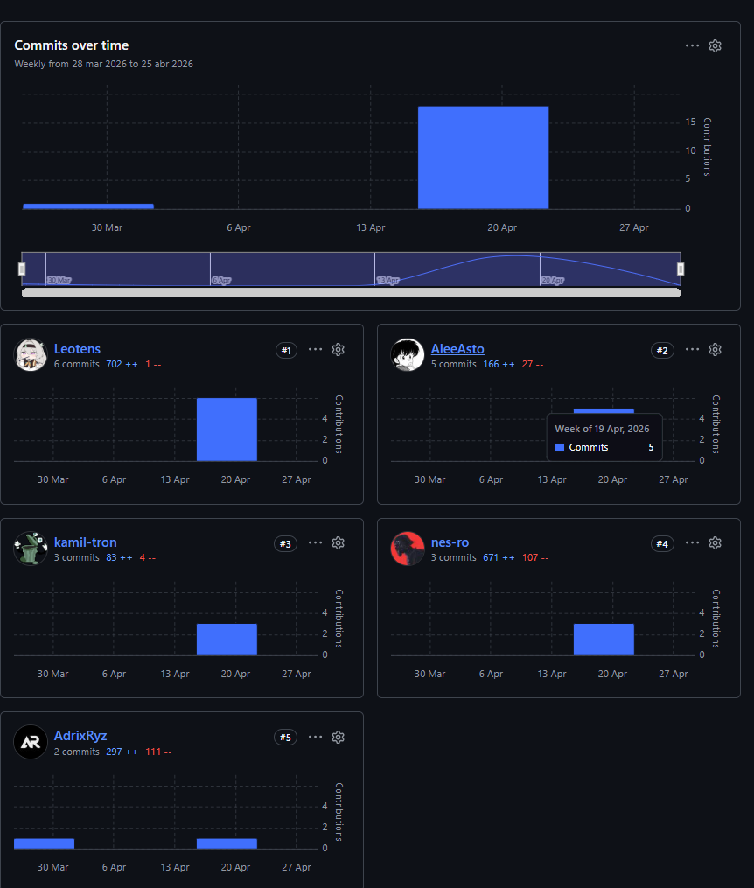

### 5.2.2. Sprint 2

#### *5.2.2.1. Sprint Planning 2*

Para el desarrollo del segundo sprint, el equipo se centrará en la construcción del Frontend de la aplicación web de Vitalia utilizando el framework Vue.js. El enfoque principal consiste en estructurar la arquitectura SPA (Single Page Application) utilizando herramientas como Vue Router y Pinia para la gestión de estados, implementar el sistema de diseño responsivo "Santuario Clínico" y simular/consumir datos (Fake API / json-server) para dar soporte a los flujos funcionales de pacientes, médicos y administradores.

| **Sprint #** | 2 |
| --- | --- |
| **Date** | 2026-05-10 |
| **Time** | 16:30 |
| **Location** | Reunión virtual |
| **Prepared By** | Nestor Alonso Rojas Tello |
| **Attendees** | Adrian Ruiz Mideyros, Nestor Alonso Rojas Tello, Alejandra Isabel Astocondor Bazan, Alexther Kamil Diaz Martinez, Leo César Dulanto Espino |
| **Sprint n Goal** | Our focus is on building a fully interactive and responsive user interface for the Vitalia web application using Vue.js. The goal is to implement secure Role-Based Access Control (RBAC) navigation, core patient workflows, and primary views for medical agendas and appointment booking, integrated with simulated data services (Mock APIs). This will be validated once the web application is deployed, ensuring a seamless, intuitive experience for patients, doctors, and administrators across both mobile and desktop devices. |
| **Sprint n Velocity** | Designamos aceptar hasta 34 SP |
| **Sum of Story Points** | 34 SP |

#### *5.2.2.2. Aspect Leaders and Collaborators*

| Team Member | GitHub Username | Vue Core & Router | Vistas Paciente | Vistas Médico | Vistas Admin | Mock Services |
| --- | --- | --- | --- | --- | --- | --- |
| Astocondor Bazan, Alejandra Isabel | AleeAsto | C | C | L | C | C |
| Dulanto Espino, Leo César | Leotens | C | C | C | L | C |
| Ruiz Mideyros, Adrian | AdrixRyz | L | C | C | C | C |
| Alexther Kamil Diaz Martinez | kamil-tron | C | L | C | C | C |
| Rojas Tello, Alonso | nes-ro | C | C | C | C | L |

#### *5.2.2.3. Sprint Backlog 2*

El Sprint Backlog 2 concentra la construcción del frontend principal de Vitalia, incluyendo la navegación, el diseño responsivo, el control de acceso por roles y los primeros flujos para pacientes, médicos y administradores. Con estas tareas se dejó una aplicación interactiva conectada a servicios simulados para validar la experiencia antes de integrar APIs reales.

**Trello Board Link:** [https://trello.com/invite/b/69e0ffa8dc72e4967311e1aa/ATTI47d8e7ca896972d7014ef7746935492a02062707/vitalia-board](https://trello.com/invite/b/69e0ffa8dc72e4967311e1aa/ATTI47d8e7ca896972d7014ef7746935492a02062707/vitalia-board)

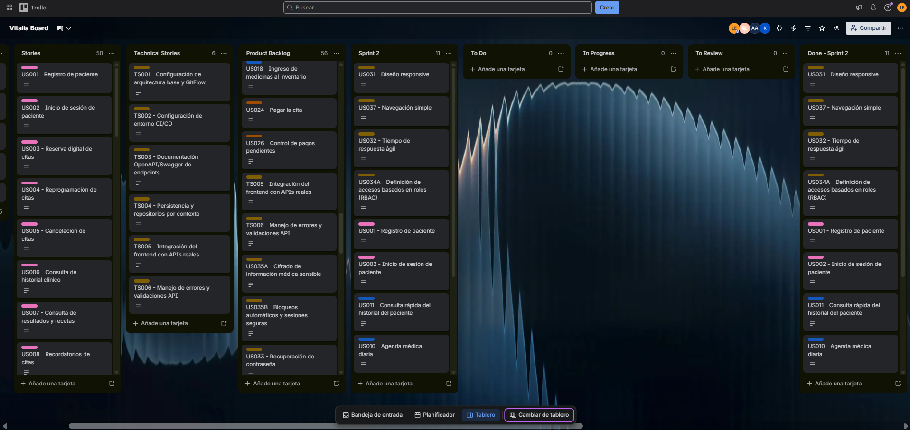

<strong>Sprint #:</strong> Sprint 2

<table border="1" cellspacing="0" cellpadding="6">
  <thead>
    <tr>
      <th colspan="3">User Story</th>
      <th colspan="6">Work-Item / Task</th>
    </tr>
    <tr>
      <th>Id</th>
      <th>Title</th>
      <th>Story Points</th>
      <th>Id</th>
      <th>Title</th>
      <th>Description</th>
      <th>Estimation (Hours)</th>
      <th>Assigned To</th>
      <th>Status</th>
    </tr>
  </thead>
  <tbody>
    <tr>
      <td>US031</td>
      <td>Diseño responsive</td>
      <td>5</td>
      <td>TO13</td>
      <td>Componentes Base Responsivos</td>
      <td>Adaptar los layouts de UI "Santuario Clínico" a móvil/escritorio</td>
      <td>1</td>
      <td>AdrixRyz</td>
      <td>Completed</td>
    </tr>
    <tr>
      <td>US039</td>
      <td>Navegación simple</td>
      <td>3</td>
      <td>TO14</td>
      <td>Configuración de Rutas y Sidebar</td>
      <td>Configurar el sistema de Vue Router y menú persistente</td>
      <td>1</td>
      <td>AdrixRyz</td>
      <td>Completed</td>
    </tr>
    <tr>
      <td>US032</td>
      <td>Tiempo de respuesta ágil</td>
      <td>5</td>
      <td>TO15</td>
      <td>Lazy Loading y Componentes</td>
      <td>Implementar carga perezosa en rutas e imágenes pesadas</td>
      <td>1</td>
      <td>Leotens</td>
      <td>Completed</td>
    </tr>
    <tr>
      <td>US008</td>
      <td>Accesibilidad de interfaz</td>
      <td>5</td>
      <td>TO16</td>
      <td>Ajustes de accesibilidad visual</td>
      <td>Mejorar legibilidad, jerarquía visual y claridad de acciones en las vistas principales</td>
      <td>1</td>
      <td>AdrixRyz</td>
      <td>Completed</td>
    </tr>
    <tr>
      <td>US034</td>
      <td>Definición de accesos basados en roles (RBAC)</td>
      <td>5</td>
      <td>TO17</td>
      <td>Navigation Guards y Roles</td>
      <td>Implementar guards de navegación para restringir vistas</td>
      <td>1</td>
      <td>kamil-tron</td>
      <td>Completed</td>
    </tr>
    <tr>
      <td>US001</td>
      <td>Registro de paciente</td>
      <td>5</td>
      <td>TO18</td>
      <td>Vista de Registro de Paciente</td>
      <td>Construir el formulario reactivo para nuevos pacientes</td>
      <td>1</td>
      <td>kamil-tron</td>
      <td>Completed</td>
    </tr>
    <tr>
      <td>US006</td>
      <td>Consulta de historial clínico</td>
      <td>2</td>
      <td>TO19</td>
      <td>Panel de historial clínico</td>
      <td>Construir vista de historial del paciente</td>
      <td>1</td>
      <td>Leotens</td>
      <td>Completed</td>
    </tr>
    <tr>
      <td>US007</td>
      <td>Consulta de resultados y recetas</td>
      <td>5</td>
      <td>TO20</td>
      <td>Vista de documentos clínicos</td>
      <td>Construir la visualización de resultados y recetas emitidas para el paciente</td>
      <td>1</td>
      <td>Leotens</td>
      <td>Completed</td>
    </tr>
    <tr>
      <td>US027</td>
      <td>Descarga de historial clínico como PDF</td>
      <td>5</td>
      <td>TO21</td>
      <td>Descarga de historial</td>
      <td>Agregar acción para generar y descargar el historial clínico del paciente en formato PDF</td>
      <td>1</td>
      <td>Leotens</td>
      <td>Completed</td>
    </tr>
    <tr>
      <td>US022</td>
      <td>Visualización de detalles de cita</td>
      <td>3</td>
      <td>TO22</td>
      <td>Detalle de cita del paciente</td>
      <td>Implementar la vista de detalle para consultar fecha, médico, especialidad y estado de una cita</td>
      <td>1</td>
      <td>kamil-tron</td>
      <td>Completed</td>
    </tr>
    <tr>
      <td>US009</td>
      <td>Agenda médica diaria</td>
      <td>3</td>
      <td>TO23</td>
      <td>Calendario y Agenda</td>
      <td>Construir la visualización de la agenda médica</td>
      <td>1</td>
      <td>AleeAsto</td>
      <td>Completed</td>
    </tr>
    <tr>
      <td>US021</td>
      <td>Visualización de mini calendario</td>
      <td>5</td>
      <td>TO24</td>
      <td>Mini calendario médico</td>
      <td>Agregar un calendario mensual para seleccionar días y revisar citas programadas</td>
      <td>1</td>
      <td>AleeAsto</td>
      <td>Completed</td>
    </tr>
    <tr>
      <td>US010</td>
      <td>Consulta rápida del historial del paciente</td>
      <td>5</td>
      <td>TO25</td>
      <td>Acceso rápido a historial</td>
      <td>Implementar acceso al historial clínico del paciente desde el flujo de atención médica</td>
      <td>1</td>
      <td>AleeAsto</td>
      <td>Completed</td>
    </tr>
    <tr>
      <td>US048</td>
      <td>Vista de HCE del paciente</td>
      <td>3</td>
      <td>TO26</td>
      <td>Vista HCE para médico</td>
      <td>Construir una vista resumida de historia clínica electrónica antes de la consulta</td>
      <td>1</td>
      <td>AleeAsto</td>
      <td>Completed</td>
    </tr>
    <tr>
      <td>US016</td>
      <td>Gráficos evolutivos de visitas</td>
      <td>5</td>
      <td>TO27</td>
      <td>Gráficos de visitas</td>
      <td>Mostrar visualizaciones de tendencia de visitas del paciente en el módulo médico</td>
      <td>1</td>
      <td>AleeAsto</td>
      <td>Completed</td>
    </tr>
    <tr>
      <td>US019</td>
      <td>Cierre de atención sin pérdida de datos</td>
      <td>5</td>
      <td>TO28</td>
      <td>Guardado confiable de atención</td>
      <td>Agregar confirmación de guardado y cierre seguro para la información registrada en consulta</td>
      <td>1</td>
      <td>AleeAsto</td>
      <td>Completed</td>
    </tr>
    <tr>
      <td>US020</td>
      <td>Registro único de pacientes</td>
      <td>5</td>
      <td>TO29</td>
      <td>Registro administrativo de pacientes</td>
      <td>Implementar formulario administrativo para crear fichas únicas y evitar duplicidad de pacientes</td>
      <td>1</td>
      <td>Leotens</td>
      <td>Completed</td>
    </tr>
    <tr>
      <td>US040</td>
      <td>Cancelar citas y eventos desde administración</td>
      <td>5</td>
      <td>TO30</td>
      <td>Cancelación administrativa</td>
      <td>Permitir al administrador cancelar citas o eventos registrados desde la agenda</td>
      <td>1</td>
      <td>Leotens</td>
      <td>Completed</td>
    </tr>
    <tr>
      <td>US017</td>
      <td>Ingreso de medicinas al inventario</td>
      <td>2</td>
      <td>TO31</td>
      <td>Módulo de farmacia</td>
      <td>Implementar módulo de recetas y farmacia</td>
      <td>1</td>
      <td>nes-ro</td>
      <td>Completed</td>
    </tr>
    <tr>
      <td>US024</td>
      <td>Facturación y cobros</td>
      <td>2</td>
      <td>TO32</td>
      <td>Vista de facturación</td>
      <td>Integrar métricas de facturación y pagos</td>
      <td>1</td>
      <td>nes-ro</td>
      <td>Completed</td>
    </tr>
    <tr>
      <td>US026</td>
      <td>Dashboard operativo</td>
      <td>2</td>
      <td>TO33</td>
      <td>Tablero principal</td>
      <td>Implementar dashboard de administración</td>
      <td>1</td>
      <td>AleeAsto</td>
      <td>Completed</td>
    </tr>
  </tbody>
</table>

#### *5.2.2.4. Development Evidence for Sprint Review*

<table border="1" cellspacing="0" cellpadding="6">
  <thead>
    <tr>
      <th>Repository</th>
      <th>Branch</th>
      <th>Commit Id</th>
      <th>Commit Message</th>      
      <th>Committed on (Date)</th>
    </tr>
  </thead>
  <tbody>
    <tr>
      <td>[vitalia-frontend]</td>
      <td>develop</td>
      <td>356e2fa</td>
      <td>chore: setup initial project structure</td>
      <td>2026-05-10</td>
    </tr>
    <tr>
      <td>[vitalia-frontend]</td>
      <td>feature/clinical-context-foundation</td>
      <td>5e004eb</td>
      <td>feat(clinical): add domain entities, assemblers and api layer</td>
      <td>2026-05-11</td>
    </tr>
    <tr>
      <td>[vitalia-frontend]</td>
      <td>feature/scheduling</td>
      <td>a292493</td>
      <td>feat: Add scheduling entities and assemblers</td>
      <td>2026-05-11</td>
    </tr>
    <tr>
      <td>[vitalia-frontend]</td>
      <td>feature/medicalRecords</td>
      <td>1c00c0d</td>
      <td>fix(clinical): derive high priority from record signals</td>
      <td>2026-05-11</td>
    </tr>
    <tr>
      <td>[vitalia-frontend]</td>
      <td>feature/scheduling</td>
      <td>7137d8a</td>
      <td>feat: scheduling flow</td>
      <td>2026-05-12</td>
    </tr>
    <tr>
      <td>[vitalia-frontend]</td>
      <td>feature/patient-history</td>
      <td>bdc5f04</td>
      <td>feat: add patient history view</td>
      <td>2026-05-12</td>
    </tr><tr>
      <td>[vitalia-frontend]</td>
      <td>feature/pharmacy</td>
      <td>512456</td>
      <td>feat(pharmacy): add pharmacy context</td>
      <td>2026-05-12</td>
    </tr>
    <tr>
      <td>[vitalia-frontend]</td>
      <td>feature/profile-view</td>
      <td>59ca07a</td>
      <td>feat(profiles): add roles profiles</td>
      <td>2026-05-13</td>
    </tr>
    <tr>
      <td>[vitalia-frontend]</td>
      <td>feature/analytics</td>
      <td>035c0ed</td>
      <td>feat: add billing view</td>
      <td>2026-05-13</td>
    </tr>
    <tr>
      <td>[vitalia-frontend]</td>
      <td>feature/clinic-settings</td>
      <td>44d023f</td>
      <td>feat: add clinic settings view</td>
      <td>2026-05-13</td>
    </tr>
    <tr>
      <td>[vitalia-frontend]</td>
      <td>feature/admin-users-view</td>
      <td>875e0d4</td>
      <td>feat(admin): add admin users view</td>
      <td>2026-05-13</td>
    </tr>
    <tr>
      <td>[vitalia-frontend]</td>
      <td>feature/analytics</td>
      <td>2607f21</td>
      <td>feat(doctor): add doctor order view</td>
      <td>2026-05-13</td>
    </tr>
    <tr>
      <td>[vitalia-frontend]</td>
      <td>feature/scheduling</td>
      <td>7da4763</td>
      <td>feat: add functional calendar</td>
      <td>2026-05-13</td>
    </tr>
    <tr>
      <td>[vitalia-frontend]</td>
      <td>feature/billing</td>
      <td>c94073a</td>
      <td>feat: add payment in appointment</td>
      <td>2026-05-13</td>
    </tr>
    <tr>
      <td>[vitalia-frontend]</td>
      <td>feature/billing</td>
      <td>2e8520f</td>
      <td>feat: add prescriptions view</td>
      <td>2026-05-13</td>
    </tr>
    <tr>
      <td>[vitalia-frontend]</td>
      <td>feature/dashboard</td>
      <td>53144880</td>
      <td>feat: add dashboard flows</td>
      <td>2026-05-13</td>
    </tr>
    <tr>
      <td>[vitalia-frontend]</td>
      <td>feature/routes</td>
      <td>8fc2e5d</td>
      <td>feat: setup routes</td>
      <td>2026-05-13</td>
    </tr>
  </tbody>
</table>

#### *5.2.2.5. Execution Evidence for Sprint Review*

Durante este Sprint, el equipo completó con éxito la transición del diseño UI/UX hacia una aplicación interactiva construida en **Vue 3**. Se estructuró la arquitectura interna de la Single Page Application (SPA) y se integró la lógica de negocio en el Frontend mediante vistas reactivas para los tres perfiles de usuario (Administradores, Médicos y Pacientes).

**Principales entregables funcionales:**
- **Calendario y Flujo de Agendamiento:** Un calendario funcional que permite al paciente interactuar y programar citas médicas en tiempo real.
- **Historial Clínico Dinámico:** Un panel especializado que centraliza los antecedentes del paciente, facilitando la visualización rápida de registros médicos previos.
- **Módulo Administrativo y Facturación:** Tableros dedicados para la gestión de configuraciones de la clínica, perfiles de usuarios del sistema y analíticas/métricas de facturación iniciales.
- **Módulo de Farmacia y Órdenes Médicas:** Vistas diseñadas para el perfil del doctor enfocadas en la emisión estructurada de órdenes y seguimiento de recetas.

#### *5.2.2.6. Services Documentation Evidence for Sprint Review*

Para alimentar las vistas funcionales sin depender inicialmente de un backend de producción acoplado, el Frontend consume una **Fake API REST** desplegada independientemente. 

El diseño de la integración se organizó de la siguiente forma:
- **API Consumption Layer:** Módulos internos en Vue encargados de encapsular las peticiones HTTP (mediante Axios/Fetch) centralizando las llamadas hacia el servidor simulado.
- **Domain Entities & Assemblers:** Para mitigar riesgos de cambio de esquema, el proyecto implementa la capa de Entidades de Dominio y Ensambladores que transforman la respuesta cruda del JSON al modelo de datos de negocio de Vitalia.
- **Endpoint Simulation:** El mock server aloja colecciones clave como `/patients`, `/appointments`, `/medical-records`, `/pharmacy` y `/billing`.

#### *5.2.2.7. Software Deployment Evidence for Sprint Review*

El despliegue continuo del Frontend de la aplicación web (Single Page Application) se encuentra configurado exitosamente en Vercel.

**Frontend App Link:** [https://vitalia-frontend-kinetia.vercel.app](https://vitalia-frontend-kinetia.vercel.app)

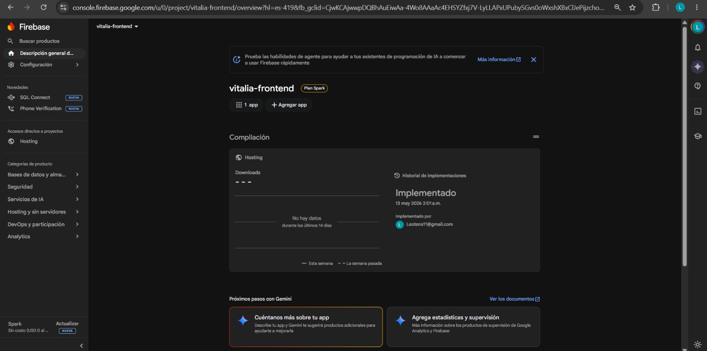

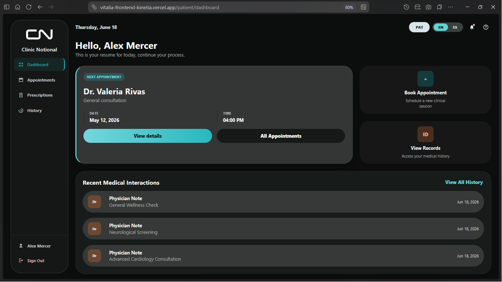

#### *5.2.2.8. Team Collaboration Insights during Sprint*

Para la organización técnica del desarrollo del Frontend, el equipo adoptó un flujo de trabajo basado en GitFlow con ramas de características (`feature/`) bien definidas (como `feature/scheduling`, `feature/patient-history`, `feature/analytics`, etc.), garantizando una integración ordenada hacia la rama `develop`.

A continuación se presenta la evidencia de las interacciones y control de colaboración registrados durante el transcurso de este Sprint:

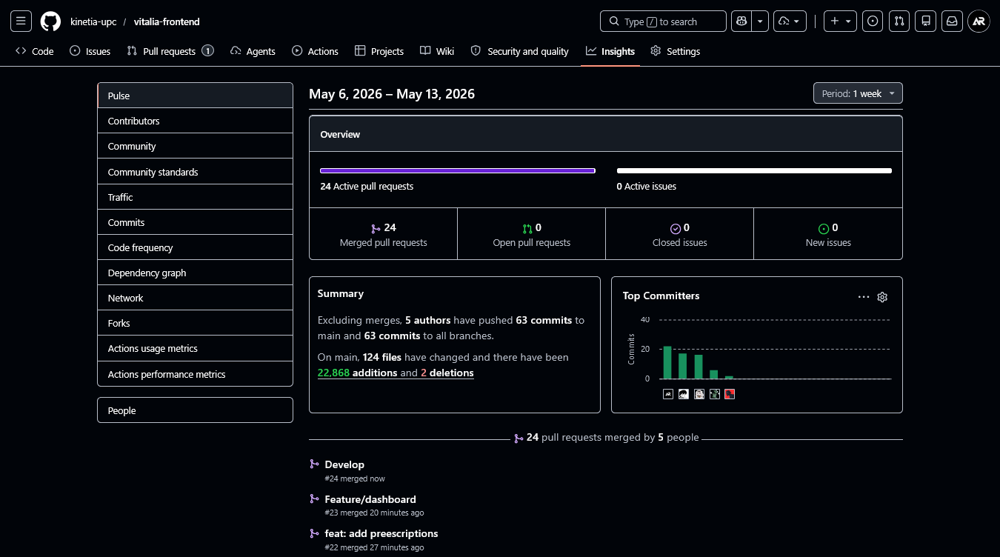

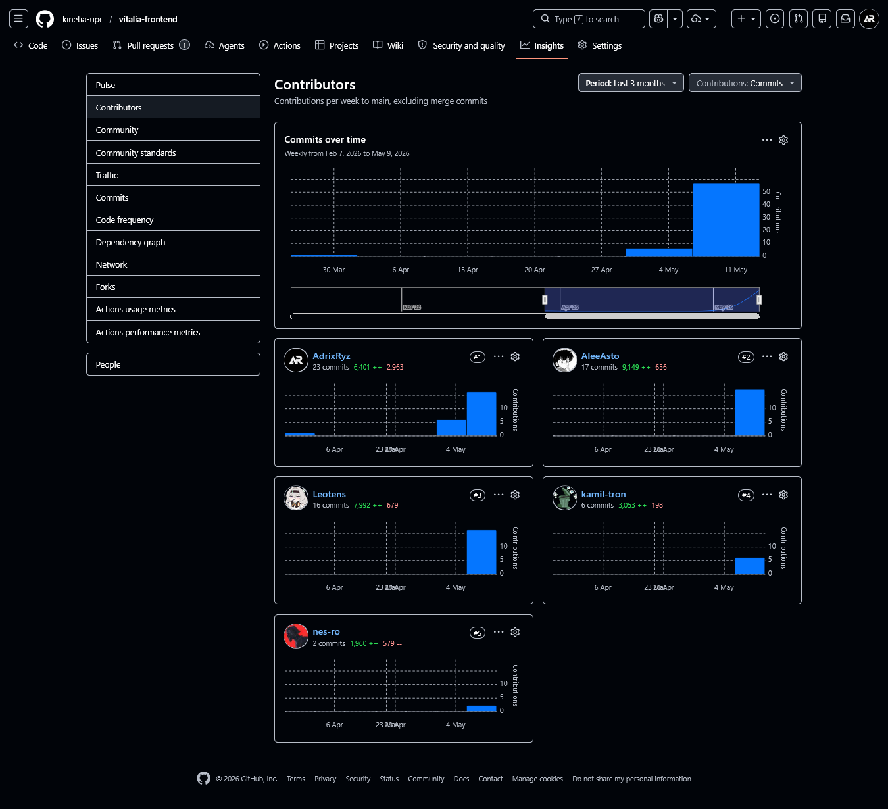

El gráfico y métricas evidencian una alta frecuencia de commits organizados y un balance de responsabilidades alineado con los líderes técnicos de módulo definidos en la planificación.

### 5.2.3. Sprint 3

#### *5.2.3.1. Sprint Planning 3*

| **Sprint #** | 3 |
| --- | --- |
| **Date** | 2026-06-07 |
| **Time** | 22:00 |
| **Location** | Reunión virtual |
| **Prepared By** | Adrian Ruiz Mideyros |
| **Attendees** | Adrian Ruiz Mideyros, Nestor Alonso Rojas Tello, Alejandra Isabel Astocondor Bazan, Alexther Kamil Diaz Martinez, Leo César Dulanto Espino |
| **Sprint n Goal** | Our focus is on establishing the core backend architecture and foundational APIs for secure user authentication and appointment workflows. We believe it delivers the automation and streamlining of clinical and administrative processes, ensuring a reliable and secure data flow to patients, doctors, and administrators. This will be confirmed when the frontend successfully authenticates users and retrieves real agenda data from the server, replacing the previously used mock APIs. |
| **Sprint n Velocity** | Designamos aceptar hasta 50 SP |
| **Sum of Story Points** | 48 SP |

#### *5.2.3.2. Aspect Leaders and Collaborators*

| Team Member | GitHub Username | Scheduling | Pharmacy | Clinical | Billing | Consume API |
| --- | --- | --- | --- | --- | --- | --- |
| Astocondor Bazan, Alejandra Isabel | AleeAsto | C | C | L | C | C |
| Dulanto Espino, Leo César | Leotens | L | C | C | C | C |
| Ruiz Mideyros, Adrian | AdrixRyz | C | C | C | C | L |
| Alexther Kamil Diaz Martinez | kamil-tron | C | L | C | C | C |
| Rojas Tello, Nestor Alonso | nes-ro | C | C | C | L | C |

#### *5.2.3.3. Sprint Backlog 3*

El backlog del Sprint 3 se orienta a consolidar la arquitectura backend y reemplazar progresivamente los servicios simulados por APIs reales. Las tareas cubren documentación Swagger, persistencia por contexto, endpoints para citas, farmacia, historia clínica y facturación, además de la integración del frontend con datos provenientes del servidor.

**Trello Board Link:** [https://trello.com/invite/b/69e0ffa8dc72e4967311e1aa/ATTI47d8e7ca896972d7014ef7746935492a02062707/vitalia-board](https://trello.com/invite/b/69e0ffa8dc72e4967311e1aa/ATTI47d8e7ca896972d7014ef7746935492a02062707/vitalia-board)

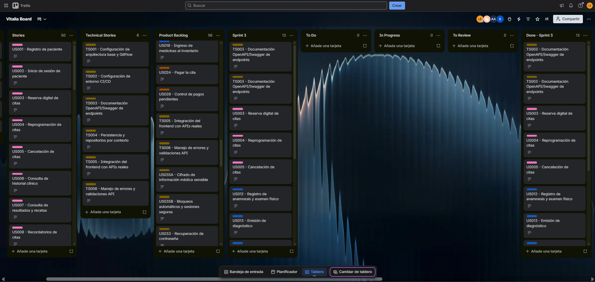

<strong>Sprint #:</strong> Sprint 3

<table border="1" cellspacing="0" cellpadding="6">
  <thead>
    <tr>
      <th colspan="3">User Story</th>
      <th colspan="6">Work-Item / Task</th>
    </tr>
    <tr>
      <th>Id</th>
      <th>Title</th>
      <th>Story Points</th>
      <th>Id</th>
      <th>Title</th>
      <th>Description</th>
      <th>Estimation (Hours)</th>
      <th>Assigned To</th>
      <th>Status</th>
    </tr>
  </thead>
  <tbody>
    <tr>
      <td>TS003</td>
      <td>Documentación OpenAPI/Swagger de endpoints</td>
      <td>3</td>
      <td>TO34</td>
      <td>Configuración de Swagger UI</td>
      <td>Integrar la documentación OpenAPI en el backend y habilitar Swagger UI</td>
      <td>2</td>
      <td>nes-ro</td>
      <td>Completed</td>
    </tr>
    <tr>
      <td>TS003</td>
      <td>Documentación OpenAPI/Swagger de endpoints</td>
      <td>3</td>
      <td>TO35</td>
      <td>Documentación de contratos REST</td>
      <td>Definir rutas, parámetros, cuerpos de solicitud y respuestas para los endpoints implementados</td>
      <td>2</td>
      <td>nes-ro</td>
      <td>Completed</td>
    </tr>
    <tr>
      <td>TS004</td>
      <td>Persistencia y repositorios por contexto</td>
      <td>5</td>
      <td>TO36</td>
      <td>Modelado de entidades backend</td>
      <td>Implementar entidades principales para Scheduling, Pharmacy, Clinical y Billing</td>
      <td>2</td>
      <td>AdrixRyz</td>
      <td>Completed</td>
    </tr>
    <tr>
      <td>TS004</td>
      <td>Persistencia y repositorios por contexto</td>
      <td>5</td>
      <td>TO37</td>
      <td>Repositorios y servicios de aplicación</td>
      <td>Crear repositorios y servicios para consultar, registrar y actualizar datos por bounded context</td>
      <td>2</td>
      <td>AdrixRyz</td>
      <td>Completed</td>
    </tr>
    <tr>
      <td>US003</td>
      <td>Reserva digital de citas</td>
      <td>5</td>
      <td>TO38</td>
      <td>Endpoint de disponibilidad médica</td>
      <td>Implementar servicio para consultar horarios disponibles por especialidad, médico y fecha</td>
      <td>2</td>
      <td>Leotens</td>
      <td>Completed</td>
    </tr>
    <tr>
      <td>US003</td>
      <td>Reserva digital de citas</td>
      <td>5</td>
      <td>TO39</td>
      <td>Endpoint de creación de citas</td>
      <td>Implementar registro de citas desde el backend y respuesta de confirmación para el frontend</td>
      <td>2</td>
      <td>Leotens</td>
      <td>Completed</td>
    </tr>
    <tr>
      <td>US004</td>
      <td>Reprogramación de citas</td>
      <td>5</td>
      <td>TO40</td>
      <td>Validación de cambios de horario</td>
      <td>Implementar reglas para verificar disponibilidad y restricciones antes de reprogramar una cita</td>
      <td>2</td>
      <td>Leotens</td>
      <td>Completed</td>
    </tr>
    <tr>
      <td>US004</td>
      <td>Reprogramación de citas</td>
      <td>5</td>
      <td>TO41</td>
      <td>Endpoint de reprogramación</td>
      <td>Actualizar fecha y hora de una cita existente y devolver la nueva programación al frontend</td>
      <td>2</td>
      <td>Leotens</td>
      <td>Completed</td>
    </tr>
    <tr>
      <td>US005</td>
      <td>Cancelación de citas</td>
      <td>3</td>
      <td>TO42</td>
      <td>Reglas de cancelación</td>
      <td>Implementar validaciones para determinar si una cita puede ser cancelada</td>
      <td>1</td>
      <td>Leotens</td>
      <td>Completed</td>
    </tr>
    <tr>
      <td>US005</td>
      <td>Cancelación de citas</td>
      <td>3</td>
      <td>TO43</td>
      <td>Endpoint de cancelación</td>
      <td>Actualizar el estado de la cita y liberar el horario correspondiente</td>
      <td>1</td>
      <td>Leotens</td>
      <td>Completed</td>
    </tr>
    <tr>
      <td>US011</td>
      <td>Registro de anamnesis y examen físico</td>
      <td>5</td>
      <td>TO44</td>
      <td>Modelo de atención clínica</td>
      <td>Definir la estructura backend para registrar anamnesis, examen físico y observaciones clínicas</td>
      <td>2</td>
      <td>AleeAsto</td>
      <td>Completed</td>
    </tr>
    <tr>
      <td>US011</td>
      <td>Registro de anamnesis y examen físico</td>
      <td>5</td>
      <td>TO45</td>
      <td>Endpoint de registro clínico</td>
      <td>Implementar guardado de la atención clínica asociada al paciente y médico responsable</td>
      <td>2</td>
      <td>AleeAsto</td>
      <td>Completed</td>
    </tr>
    <tr>
      <td>US012</td>
      <td>Emisión de diagnóstico</td>
      <td>3</td>
      <td>TO46</td>
      <td>Entidad de diagnóstico</td>
      <td>Crear estructura para registrar diagnósticos vinculados a una atención clínica</td>
      <td>1</td>
      <td>AleeAsto</td>
      <td>Completed</td>
    </tr>
    <tr>
      <td>US012</td>
      <td>Emisión de diagnóstico</td>
      <td>3</td>
      <td>TO47</td>
      <td>Endpoint de diagnóstico</td>
      <td>Implementar creación y consulta de diagnósticos desde el backend</td>
      <td>1</td>
      <td>AleeAsto</td>
      <td>Completed</td>
    </tr>
    <tr>
      <td>US013</td>
      <td>Emisión de recetas digitales</td>
      <td>5</td>
      <td>TO48</td>
      <td>Modelo de receta digital</td>
      <td>Implementar estructura para medicamentos, dosis, frecuencia e indicaciones</td>
      <td>2</td>
      <td>kamil-tron</td>
      <td>Completed</td>
    </tr>
    <tr>
      <td>US013</td>
      <td>Emisión de recetas digitales</td>
      <td>5</td>
      <td>TO49</td>
      <td>Endpoint de emisión de recetas</td>
      <td>Permitir la creación de recetas digitales asociadas a una atención clínica</td>
      <td>2</td>
      <td>kamil-tron</td>
      <td>Completed</td>
    </tr>
    <tr>
      <td>US017</td>
      <td>Ingreso de medicinas al inventario</td>
      <td>3</td>
      <td>TO50</td>
      <td>Modelo de inventario farmacéutico</td>
      <td>Definir entidades para medicamentos, stock, presentación y disponibilidad</td>
      <td>1</td>
      <td>kamil-tron</td>
      <td>Completed</td>
    </tr>
    <tr>
      <td>US017</td>
      <td>Ingreso de medicinas al inventario</td>
      <td>3</td>
      <td>TO51</td>
      <td>Endpoint de registro de medicinas</td>
      <td>Implementar creación y actualización de medicamentos desde el módulo de farmacia</td>
      <td>1</td>
      <td>kamil-tron</td>
      <td>Completed</td>
    </tr>
    <tr>
      <td>US023</td>
      <td>Pagar la cita</td>
      <td>5</td>
      <td>TO52</td>
      <td>Modelo de pagos de citas</td>
      <td>Crear estructura para registrar montos, método de pago y estado de pago de una cita</td>
      <td>2</td>
      <td>nes-ro</td>
      <td>Completed</td>
    </tr>
    <tr>
      <td>US023</td>
      <td>Pagar la cita</td>
      <td>5</td>
      <td>TO53</td>
      <td>Endpoint de pago</td>
      <td>Implementar registro de pago y actualización del estado financiero de la cita</td>
      <td>2</td>
      <td>nes-ro</td>
      <td>Completed</td>
    </tr>
    <tr>
      <td>US025</td>
      <td>Control de pagos pendientes</td>
      <td>3</td>
      <td>TO54</td>
      <td>Consulta de pagos pendientes</td>
      <td>Implementar endpoint para listar atenciones y citas con pagos pendientes</td>
      <td>1</td>
      <td>nes-ro</td>
      <td>Completed</td>
    </tr>
    <tr>
      <td>US025</td>
      <td>Control de pagos pendientes</td>
      <td>3</td>
      <td>TO55</td>
      <td>Filtros de seguimiento financiero</td>
      <td>Agregar filtros por estado, fecha y paciente para el seguimiento de cobros pendientes</td>
      <td>1</td>
      <td>nes-ro</td>
      <td>Completed</td>
    </tr>
    <tr>
      <td>TS005</td>
      <td>Integración del frontend con APIs reales</td>
      <td>5</td>
      <td>TO56</td>
      <td>Configuración de servicios HTTP reales</td>
      <td>Actualizar la capa de consumo del frontend para apuntar a los endpoints reales del backend</td>
      <td>2</td>
      <td>AdrixRyz</td>
      <td>Completed</td>
    </tr>
    <tr>
      <td>TS005</td>
      <td>Integración del frontend con APIs reales</td>
      <td>5</td>
      <td>TO57</td>
      <td>Reemplazo de mock services</td>
      <td>Sustituir llamadas al mock server por peticiones al backend en los módulos del Sprint 3</td>
      <td>2</td>
      <td>AdrixRyz</td>
      <td>Completed</td>
    </tr>
    <tr>
      <td>TS006</td>
      <td>Manejo de errores y validaciones API</td>
      <td>3</td>
      <td>TO58</td>
      <td>Validaciones de solicitudes</td>
      <td>Implementar validaciones para datos obligatorios, formatos y restricciones de negocio en los endpoints</td>
      <td>1</td>
      <td>AdrixRyz</td>
      <td>Completed</td>
    </tr>
    <tr>
      <td>TS006</td>
      <td>Manejo de errores y validaciones API</td>
      <td>3</td>
      <td>TO59</td>
      <td>Respuestas de error estandarizadas</td>
      <td>Definir códigos HTTP y mensajes de error consistentes para el consumo desde frontend</td>
      <td>1</td>
      <td>AdrixRyz</td>
      <td>Completed</td>
    </tr>
  </tbody>
</table>

#### *5.2.3.4. Development Evidence for Sprint Review*

<table border="1" cellspacing="0" cellpadding="6">
  <thead>
    <tr>
      <th>Repository</th>
      <th>Branch</th>
      <th>Commit Id</th>
      <th>Commit Message</th>
      <th>Committed on (Date)</th>
    </tr>
  </thead>
  <tbody>
    <tr>
      <td>[vitalia-backend]</td>
      <td>develop</td>
      <td>67a6ed8</td>
      <td>feat: add initial structure</td>
      <td>2026-06-10</td>
    </tr>
    <tr>
      <td>[vitalia-backend]</td>
      <td>develop</td>
      <td>5bac88b</td>
      <td>feat: add bounded contexts initial structure</td>
      <td>2026-06-11</td>
    </tr>
    <tr>
      <td>[vitalia-backend]</td>
      <td>feature/scheduling</td>
      <td>eacb780</td>
      <td>feat: add scheduling domain</td>
      <td>2026-06-14</td>
    </tr>
    <tr>
      <td>[vitalia-backend]</td>
      <td>feature/scheduling</td>
      <td>c1e7702</td>
      <td>feat: add scheduling application</td>
      <td>2026-06-14</td>
    </tr>
    <tr>
      <td>[vitalia-backend]</td>
      <td>feature/scheduling</td>
      <td>7f5e230</td>
      <td>feat: add scheduling infrastructure</td>
      <td>2026-06-14</td>
    </tr>
    <tr>
      <td>[vitalia-backend]</td>
      <td>feature/scheduling</td>
      <td>1bcc553</td>
      <td>feat: add scheduling interfaces</td>
      <td>2026-06-14</td>
    </tr>
    <tr>
      <td>[vitalia-backend]</td>
      <td>feature/scheduling</td>
      <td>811dd7a</td>
      <td>feat: Add scheduling resources</td>
      <td>2026-06-14</td>
    </tr>
    <tr>
      <td>[vitalia-backend]</td>
      <td>feature/scheduling</td>
      <td>9b0dd39</td>
      <td>refactor: delete scheduling entities</td>
      <td>2026-06-14</td>
    </tr>
    <tr>
      <td>[vitalia-backend]</td>
      <td>feature/Pharmacy</td>
      <td>2149b5d</td>
      <td>feat: add pharmacy logic</td>
      <td>2026-06-15</td>
    </tr>
    <tr>
      <td>[vitalia-backend]</td>
      <td>develop</td>
      <td>0931c9e</td>
      <td>feat: configure database connection</td>
      <td>2026-06-16</td>
    </tr>
    <tr>
      <td>[vitalia-backend]</td>
      <td>feature/clinical</td>
      <td>fc660dc</td>
      <td>feat(clinical): add medical records endpoint</td>
      <td>2026-06-17</td>
    </tr>
    <tr>
      <td>[vitalia-backend]</td>
      <td>feature/clinical</td>
      <td>dbf29c4</td>
      <td>feat(clinical): add diagnosis treatment and prescription endpoints</td>
      <td>2026-06-17</td>
    </tr>
    <tr>
      <td>[vitalia-backend]</td>
      <td>feature/clinical</td>
      <td>f47adea</td>
      <td>feat(clinical): add medical record links and description updates</td>
      <td>2026-06-17</td>
    </tr>
    <tr>
      <td>[vitalia-backend]</td>
      <td>feature/clinical</td>
      <td>82577cd</td>
      <td>feat(clinical): add business rules for clinical workflows</td>
      <td>2026-06-18</td>
    </tr>
    <tr>
      <td>[vitalia-backend]</td>
      <td>develop</td>
      <td>6ea5a85</td>
      <td>refact: standardize error handling for pharmacy and scheduling contexts and fix seeder</td>
      <td>2026-06-18</td>
    </tr>
    <tr>
      <td>[vitalia-backend]</td>
      <td>develop</td>
      <td>5c09bc4</td>
      <td>feat(clinical): implement get all endpoints for clinical resources to fix frontend 405 errors</td>
      <td>2026-06-18</td>
    </tr>
    <tr>
      <td>[vitalia-backend]</td>
      <td>feature/billing</td>
      <td>a250d12</td>
      <td>feat: add billing bounded backend</td>
      <td>2026-06-18</td>
    </tr>
    <tr>
      <td>[vitalia-backend]</td>
      <td>develop</td>
      <td>e7a5078</td>
      <td>fix: swagger documentation</td>
      <td>2026-06-18</td>
    </tr>
    <tr>
      <td>[vitalia-backend]</td>
      <td>develop</td>
      <td>79b967f</td>
      <td>refactor: clean up controller names, fix translations, and add db resiliency</td>
      <td>2026-06-19</td>
    </tr>
    <tr>
      <td>[vitalia-backend]</td>
      <td>develop</td>
      <td>b7e61b6</td>
      <td>feat(tenant): add healthcare centers, branches and appointment fees backend</td>
      <td>2026-06-19</td>
    </tr>
  </tbody>
</table>

#### *5.2.3.5. Execution Evidence for Sprint Review*

Durante el Sprint 3 se logró avanzar en la integración funcional entre el frontend y los servicios backend desarrollados para los principales flujos de Vitalia. Se implementaron y validaron vistas relacionadas con la gestión de citas, disponibilidad médica, atención clínica, diagnósticos, tratamientos, recetas digitales, medicamentos y reclamos de facturación, reemplazando progresivamente el uso de datos simulados por peticiones reales a la API. Las evidencias de ejecución presentadas en esta sección muestran las principales vistas implementadas y permiten comprobar que los usuarios pueden interactuar con funcionalidades clave del sistema dentro del alcance definido para el Sprint.

**Principales entregables funcionales:**
- Endpoints REST para gestión de citas, disponibilidad médica, atención clínica, diagnósticos, tratamientos, recetas digitales, medicamentos e información de facturación.
- Integración de la capa de consumo del frontend con los servicios backend reales.
- Validación de flujos de usuario para reserva, reprogramación y cancelación de citas
- Despliegue del backend en un entorno de producción para su integración continua con el frontend.
- Documentación de los servicios REST implementados mediante OpenAPI/Swagger para su consulta y validación por parte del equipo y stakeholders.

#### *5.2.3.6. Services Documentation Evidence for Sprint Review*

Durante el Sprint 3 se documentaron los endpoints REST correspondientes a los contextos de Scheduling, Clinical, Pharmacy y Billing mediante OpenAPI/Swagger. Esta documentación permite evidenciar los servicios implementados dentro del alcance del Sprint, incluyendo las rutas base y las acciones disponibles para la gestión de citas, disponibilidad médica, registros clínicos, diagnósticos, recetas, tratamientos, medicamentos y reclamos de facturación. Además, se utilizó una base de datos MySQL para la persistencia de la información. A continuación se presenta un resumen de los endpoints documentados y las acciones implementadas para cada recurso:

| Recurso | Endpoint Base | Acciones Implementadas |
| --- | --- | --- |
| Appointments Fees | `/api/v1/appointmentsFees` | GET, POST, GET por ID, PUT, DELETE |
| Appointments | `/api/v1/appointments` | GET, POST, GET por ID, PATCH, DELETE |
| Availability Slots | `/api/v1/availabilitySlots` | GET, POST, GET por ID, PATCH, DELETE |
| Billing Claims | `/api/v1/billingClaims` | GET, POST, GET por ID, PUT, DELETE |
| Branches | `/api/v1/branches` | GET, POST, GET por ID, PUT, DELETE |
| Diagnoses | `/api/v1/diagnoses` | GET, POST, GET por ID, PATCH, DELETE, GET por medical record |
| Healthcare Centers | `/api/v1/healthcareCenters` | GET, POST, GET por ID, PUT, DELETE |
| Medical Records | `/api/v1/medicalRecords` | GET, POST, GET por code, GET por patient, GET por appointment |
| Medicines | `/api/v1/medicines` | GET, POST, GET por ID, PUT, DELETE |
| Prescription Details | `/api/v1/prescriptionDetails` | GET, POST, GET por ID, PUT, DELETE, GET por prescription |
| Prescriptions | `/api/v1/prescriptions` | GET, POST, GET por ID, DELETE, GET por medical record |
| Treatments | `/api/v1/treatments` | GET, POST, GET por ID, PATCH, DELETE, GET por medical record |

**Evidencia de ejecución**

Para mostrar la interacción, ejecutamos 5 endpoints relacionados con el bounded context de scheduling. Entre ellos veremos la búsqueda de citas y horarios disponibles, así como su creación o eliminación.

1. GET /api/v1/appointments: Permite buscar citas con parámetros opcionales, los cuales filtran según indique el usuario. En esta ejecución no se añadió ningún parámetro, por lo cual se obtiene la lista completa de citas.

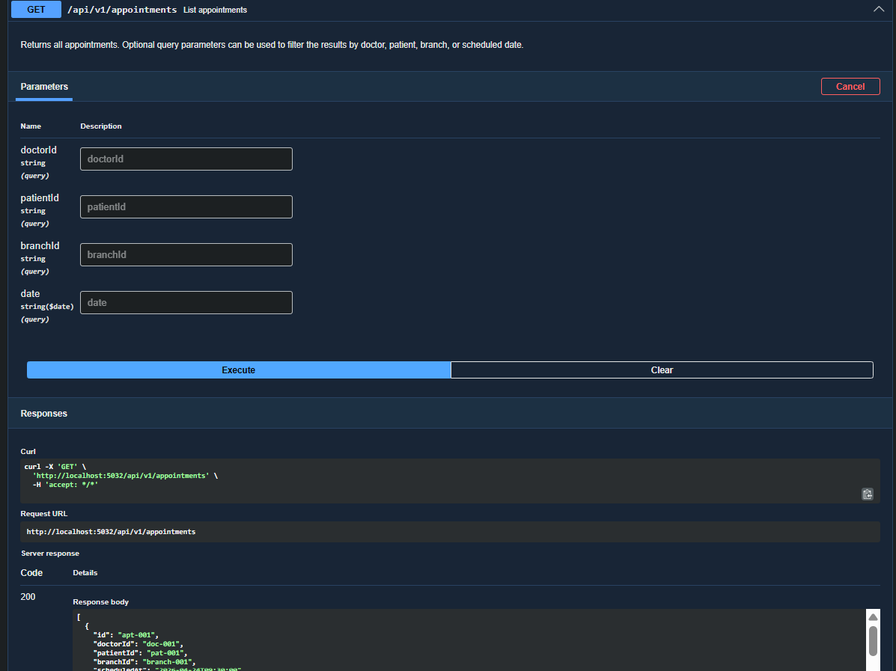

2. POST /api/v1/appointments: Se solicita la información necesaria para crear una cita. Al ejecutarse, se añadirá la cita a la base de datos.

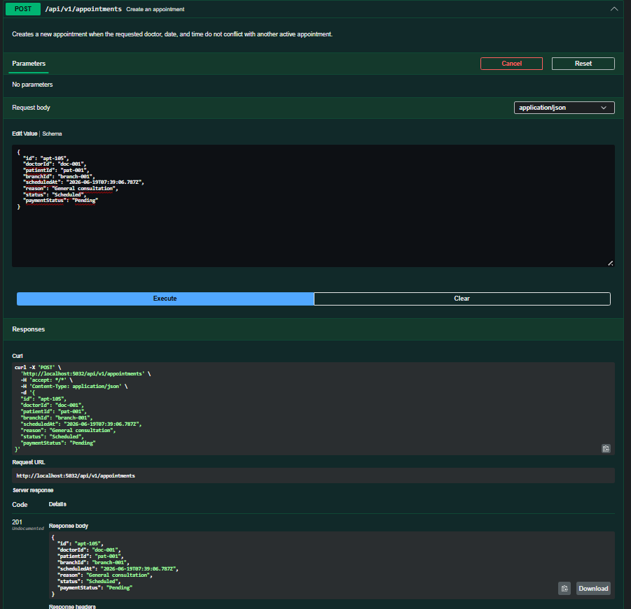

3. GET /api/v1/availabilitySlots: Permite buscar horarios disponibles con parámetros opcionales, los cuales filtran según indique el usuario. En esta ejecución no se añadió ningún parámetro, por lo cual se obtiene la lista completa de horarios disponibles.

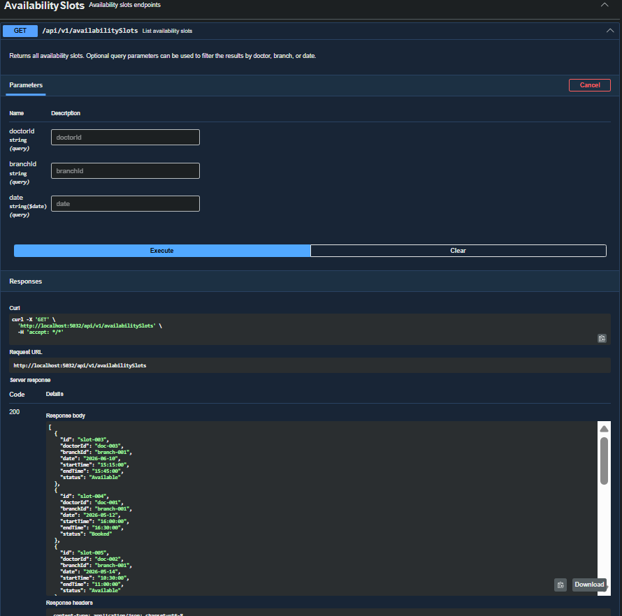

4. DELETE /api/v1/availabilitySlots: Da la posibilidad de eliminar un horario disponible de la base de datos. Para ello se solicita el ID del horario que se desea eliminar. Tras su ejecución, el horario asignado a ese ID queda eliminado de la base de datos.

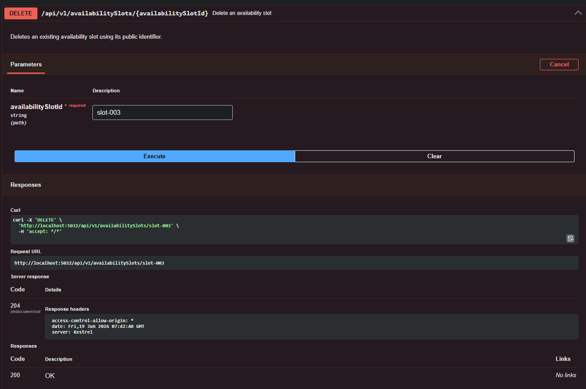

5. GET /api/v1/availabilitySlots: Es el mismo endpoint de búsqueda de horarios disponibles; en este caso lo volvemos a usar para verificar la eliminación del horario escogido (`slot-003`).

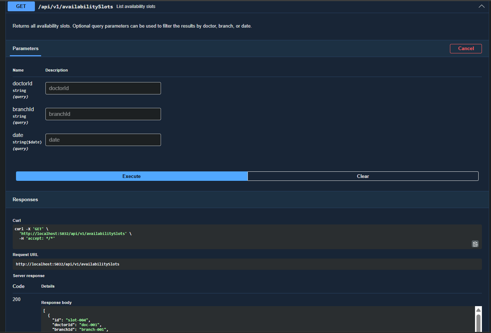

#### *5.2.3.7. Software Deployment Evidence for Sprint Review*

Durante el Sprint 3 se realizó el despliegue del backend de Vitalia en un entorno de producción utilizando Render como plataforma de hosting. Este despliegue permitió validar la correcta configuración del entorno, la conexión a la base de datos MySQL y la disponibilidad de los servicios REST implementados para su consumo desde el frontend. La evidencia presentada en esta sección muestra capturas del proceso de despliegue en Render, confirmando que el backend está operativo y accesible para su integración con el frontend.

**Swagger Documentation Link:** [https://vitalia-backend-zf3p.onrender.com/swagger/index.html](https://vitalia-backend-zf3p.onrender.com/swagger/index.html)

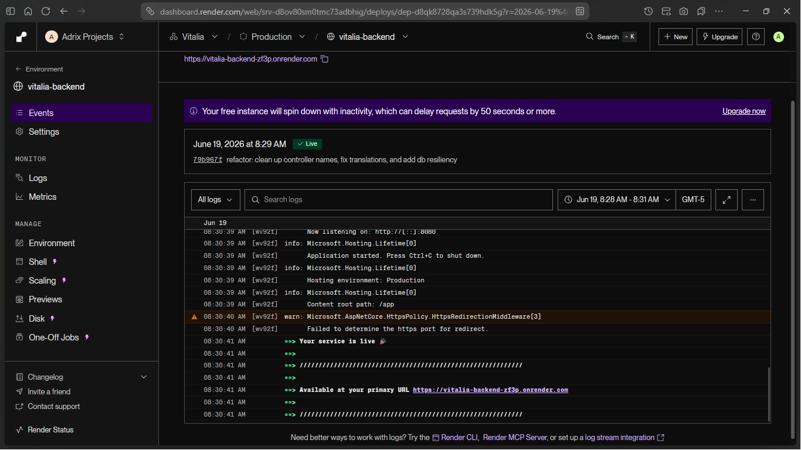

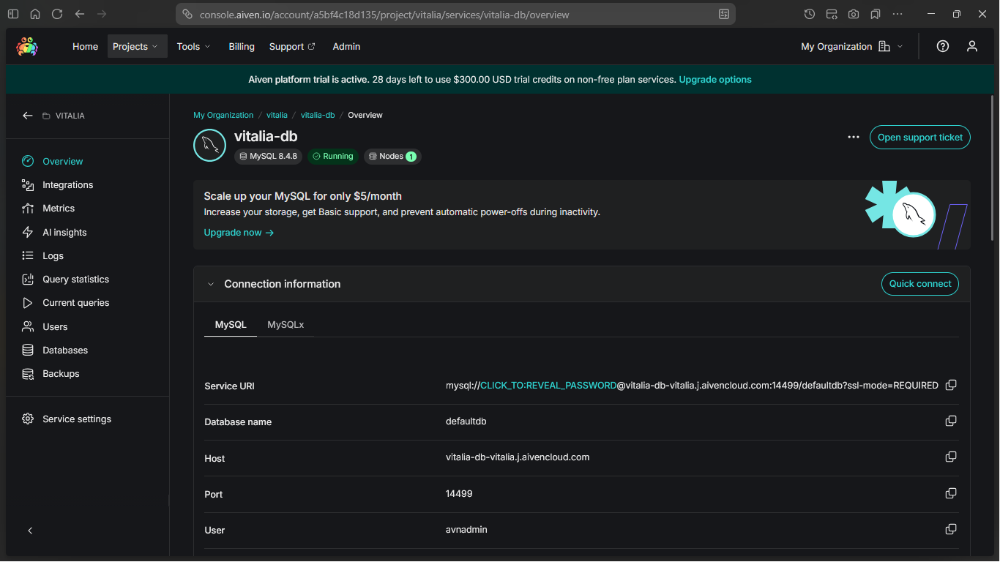

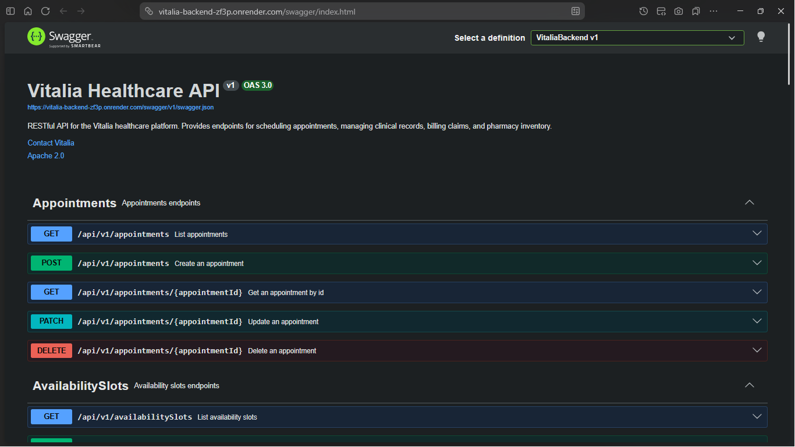

#### *5.2.3.8. Team Collaboration Insights during Sprint*

Para la organización técnica del desarrollo del Backend, el equipo adoptó un flujo de trabajo basado en GitFlow con ramas de características (`feature/`) bien definidas (como `feature/scheduling`, `feature/billing`, `feature/pharmacy`, etc.), garantizando una integración ordenada hacia la rama `develop`.

A continuación se presenta la evidencia de las interacciones y control de colaboración registrados durante el transcurso de este Sprint:

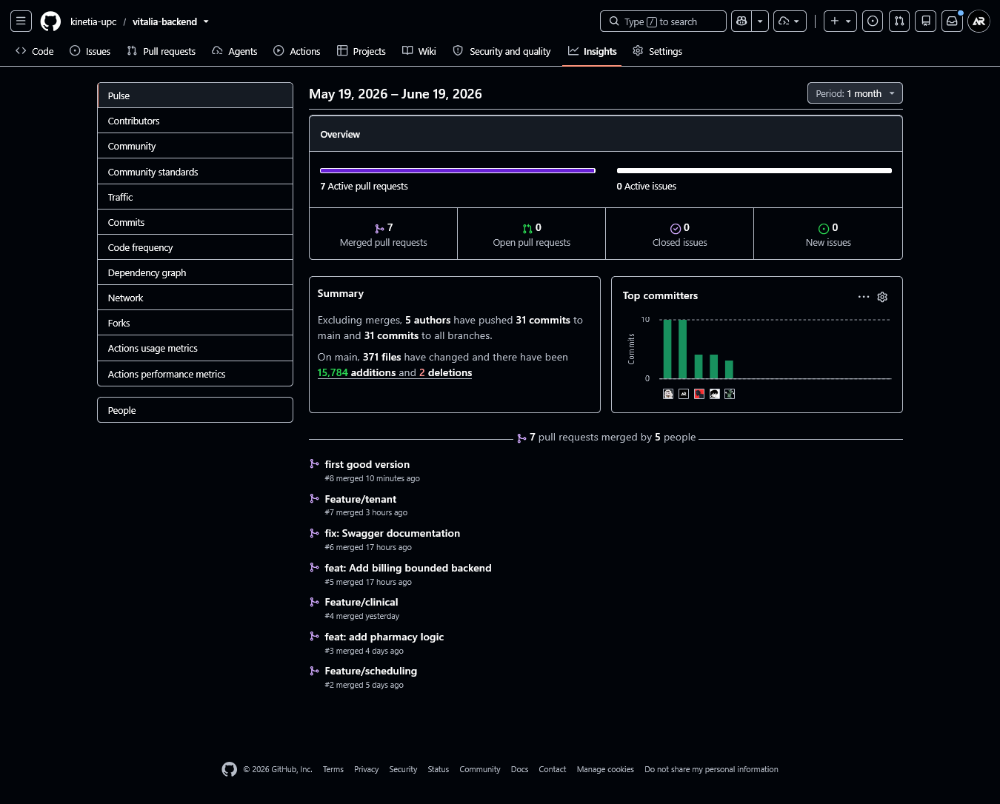

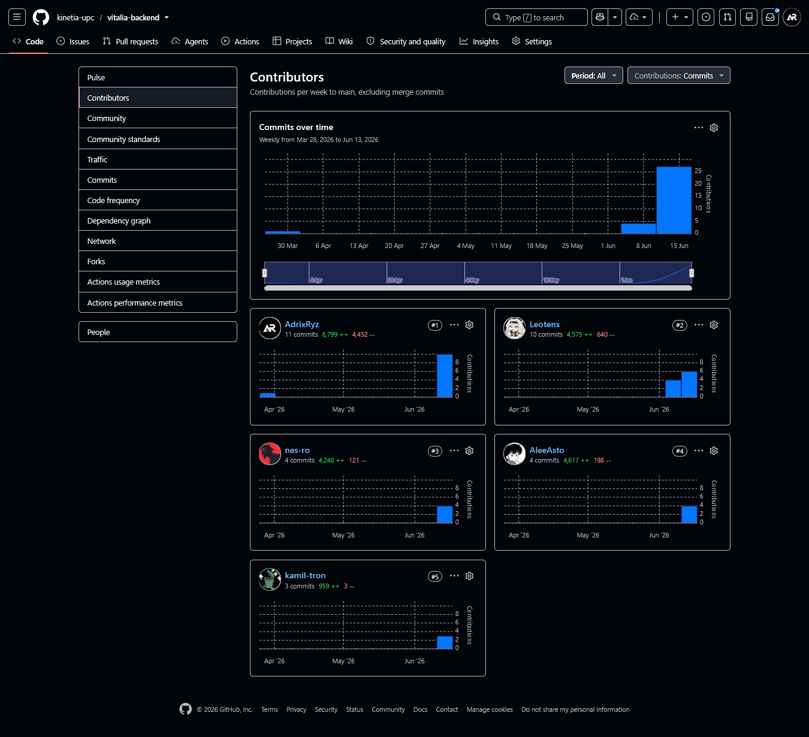

El gráfico y métricas evidencian una alta frecuencia de commits organizados y un balance de responsabilidades alineado con los líderes técnicos de módulo definidos en la planificación.

### 5.2.4. Sprint 4

#### *5.2.4.1. Sprint Planning 4*

| **Sprint #** | 4 |
| --- | --- |
| **Date** | 2026-06-27 |
| **Time** | 20:00 |
| **Location** | Reunión virtual |
| **Prepared By** | Leo César Dulanto Espino |
| **Attendees** | Adrian Ruiz Mideyros, Nestor Alonso Rojas Tello, Alejandra Isabel Astocondor Bazan, Alexther Kamil Diaz Martinez, Leo César Dulanto Espino |
| **Sprint n Goal** | Our focus is on strengthening secure access, clinical continuity, and key integrations. We believe it delivers a more reliable experience to patients, doctors, and administrative staff. This will be confirmed when users can authenticate securely, recover access, preserve clinical data during connectivity issues, and complete exam, prescription, appointment, identity, and payment flows. |
| **Sprint n Velocity** | 50 SP |
| **Sum of Story Points** | 45 SP |

#### *5.2.4.2. Aspect Leaders and Collaborators*

| Team Member | GitHub Username | Register/Login View | IAM API | Tenant | Pharmacy | Consume API |
| --- | --- | --- | --- | --- | --- | --- |
| Astocondor Bazan, Alejandra Isabel | AleeAsto | C | C | L | C | C |
| Dulanto Espino, Leo César | Leotens | C | L | C | C | C |
| Ruiz Mideyros, Adrian | AdrixRyz | C | C | C | C | L |
| Alexther Kamil Diaz Martinez | kamil-tron | L | C | C | C | C |
| Rojas Tello, Nestor Alonso | nes-ro | C | C | C | L | C |

#### *5.2.4.3. Sprint Backlog 4*

El Sprint Backlog 4 se enfocó en consolidar la versión integrada de Vitalia, reforzando la autenticación y seguridad de la plataforma, completando flujos clínicos y administrativos pendientes, e incorporando capacidades de resiliencia ante fallos de conectividad. Además, se priorizó la conexión entre frontend y backend para procesos críticos como registro, gestión de usuarios, farmacia, recetas, órdenes médicas, facturación e integración con servicios externos de identidad.

**Trello Board Link:** [https://trello.com/invite/b/69e0ffa8dc72e4967311e1aa/ATTI47d8e7ca896972d7014ef7746935492a02062707/vitalia-board](https://trello.com/invite/b/69e0ffa8dc72e4967311e1aa/ATTI47d8e7ca896972d7014ef7746935492a02062707/vitalia-board)

Sprint #: Sprint 4

<table border="1" cellspacing="0" cellpadding="6">
  <thead>
    <tr>
      <th colspan="3">User Story</th>
      <th colspan="6">Work-Item / Task</th>
    </tr>
    <tr>
      <th>Id</th>
      <th>Title</th>
      <th>Story Points</th>
      <th>Id</th>
      <th>Title</th>
      <th>Description</th>
      <th>Estimation (Hours)</th>
      <th>Assigned To</th>
      <th>Status</th>
    </tr>
  </thead>
  <tbody>
    <tr>
      <td>US002</td>
      <td>Inicio de sesión de usuario</td>
      <td>3</td>
      <td>TO60</td>
      <td>Vista de inicio de sesión</td>
      <td>Adaptar la pantalla de login para permitir el acceso de pacientes, doctores y administradores</td>
      <td>1</td>
      <td>kamil-tron</td>
      <td>Completed</td>
    </tr>
    <tr>
      <td>US002</td>
      <td>Inicio de sesión de usuario</td>
      <td>3</td>
      <td>TO61</td>
      <td>Autenticación por rol</td>
      <td>Implementar validación de credenciales y respuesta con el rol correspondiente del usuario</td>
      <td>2</td>
      <td>Leotens</td>
      <td>Completed</td>
    </tr>
    <tr>
      <td>US002</td>
      <td>Inicio de sesión de usuario</td>
      <td>3</td>
      <td>TO62</td>
      <td>Redirección por perfil</td>
      <td>Conectar el login con la navegación hacia el panel correspondiente según el rol autenticado</td>
      <td>1</td>
      <td>kamil-tron</td>
      <td>Completed</td>
    </tr>
    <tr>
      <td>US035</td>
      <td>Cifrado de información médica sensible</td>
      <td>5</td>
      <td>TO63</td>
      <td>Reglas de cifrado clínico</td>
      <td>Definir los datos sensibles que deben protegerse en historias clínicas, diagnósticos y notas médicas</td>
      <td>2</td>
      <td>Leotens</td>
      <td>Completed</td>
    </tr>
    <tr>
      <td>US035</td>
      <td>Cifrado de información médica sensible</td>
      <td>5</td>
      <td>TO64</td>
      <td>Cifrado en persistencia</td>
      <td>Implementar el almacenamiento protegido de información médica sensible antes de guardar registros</td>
      <td>2</td>
      <td>Leotens</td>
      <td>Completed</td>
    </tr>
    <tr>
      <td>US035</td>
      <td>Cifrado de información médica sensible</td>
      <td>5</td>
      <td>TO65</td>
      <td>Validación de lectura segura</td>
      <td>Verificar que la información clínica cifrada pueda consultarse únicamente desde flujos autorizados</td>
      <td>1</td>
      <td>Leotens</td>
      <td>Completed</td>
    </tr>
    <tr>
      <td>US036</td>
      <td>Bloqueos automáticos y sesiones seguras</td>
      <td>3</td>
      <td>TO66</td>
      <td>Temporizador de inactividad</td>
      <td>Implementar el cierre automático de sesión cuando el usuario permanece inactivo</td>
      <td>1</td>
      <td>Leotens</td>
      <td>Completed</td>
    </tr>
    <tr>
      <td>US036</td>
      <td>Bloqueos automáticos y sesiones seguras</td>
      <td>3</td>
      <td>TO67</td>
      <td>Bloqueo por intentos fallidos</td>
      <td>Agregar control de intentos fallidos para impedir accesos indebidos reiterados</td>
      <td>1</td>
      <td>Leotens</td>
      <td>Completed</td>
    </tr>
    <tr>
      <td>US036</td>
      <td>Bloqueos automáticos y sesiones seguras</td>
      <td>3</td>
      <td>TO68</td>
      <td>Mensaje de sesión expirada</td>
      <td>Mostrar una notificación clara al redirigir al usuario hacia el login por seguridad</td>
      <td>1</td>
      <td>Leotens</td>
      <td>Completed</td>
    </tr>
    <tr>
      <td>US033</td>
      <td>Recuperación de contraseña</td>
      <td>3</td>
      <td>TO69</td>
      <td>Formulario de recuperación</td>
      <td>Construir la vista para solicitar recuperación de contraseña mediante correo o identificador</td>
      <td>1</td>
      <td>kamil-tron</td>
      <td>Completed</td>
    </tr>
    <tr>
      <td>US033</td>
      <td>Recuperación de contraseña</td>
      <td>3</td>
      <td>TO70</td>
      <td>Token de restablecimiento</td>
      <td>Implementar generación y validación de tokens temporales para restablecer credenciales</td>
      <td>2</td>
      <td>kamil-tron</td>
      <td>Completed</td>
    </tr>
    <tr>
      <td>US033</td>
      <td>Recuperación de contraseña</td>
      <td>3</td>
      <td>TO71</td>
      <td>Actualización de contraseña</td>
      <td>Conectar el flujo de nueva contraseña con la API de identidad y mensajes de confirmación</td>
      <td>1</td>
      <td>kamil-tron</td>
      <td>Completed</td>
    </tr>
    <tr>
      <td>US029</td>
      <td>Integración con servicios de identidad (RENIEC)</td>
      <td>5</td>
      <td>TO72</td>
      <td>Consulta por DNI</td>
      <td>Implementar el servicio para consultar datos de identidad del paciente a partir de su DNI</td>
      <td>2</td>
      <td>AleeAsto</td>
      <td>Completed</td>
    </tr>
    <tr>
      <td>US029</td>
      <td>Integración con servicios de identidad (RENIEC)</td>
      <td>5</td>
      <td>TO73</td>
      <td>Autocompletado de paciente</td>
      <td>Rellenar automáticamente nombres y apellidos en el registro administrativo de pacientes</td>
      <td>1</td>
      <td>AleeAsto</td>
      <td>Completed</td>
    </tr>
    <tr>
      <td>US029</td>
      <td>Integración con servicios de identidad (RENIEC)</td>
      <td>5</td>
      <td>TO74</td>
      <td>Manejo de respuesta externa</td>
      <td>Validar respuestas exitosas, errores y documentos no encontrados desde el servicio de identidad</td>
      <td>1</td>
      <td>AleeAsto</td>
      <td>Completed</td>
    </tr>
    <tr>
      <td>US030</td>
      <td>Sincronización con pasarelas de pago</td>
      <td>3</td>
      <td>TO75</td>
      <td>Registro de transacción externa</td>
      <td>Crear la estructura para almacenar identificadores, montos y estados de pagos digitales</td>
      <td>1</td>
      <td>AdrixRyz</td>
      <td>Completed</td>
    </tr>
    <tr>
      <td>US030</td>
      <td>Sincronización con pasarelas de pago</td>
      <td>3</td>
      <td>TO76</td>
      <td>Validación de callback</td>
      <td>Procesar la respuesta de la pasarela para confirmar pagos y actualizar el estado financiero</td>
      <td>2</td>
      <td>AdrixRyz</td>
      <td>Completed</td>
    </tr>
    <tr>
      <td>US030</td>
      <td>Sincronización con pasarelas de pago</td>
      <td>3</td>
      <td>TO77</td>
      <td>Conciliación visual</td>
      <td>Mostrar en la interfaz el resultado de la conciliación de pagos asociados a citas</td>
      <td>1</td>
      <td>AdrixRyz</td>
      <td>Completed</td>
    </tr>
    <tr>
      <td>US014</td>
      <td>Solicitud de exámenes</td>
      <td>5</td>
      <td>TO78</td>
      <td>Modelo de orden de examen</td>
      <td>Definir la estructura de datos para registrar exámenes solicitados durante la consulta</td>
      <td>2</td>
      <td>AleeAsto</td>
      <td>Completed</td>
    </tr>
    <tr>
      <td>US014</td>
      <td>Solicitud de exámenes</td>
      <td>5</td>
      <td>TO79</td>
      <td>Formulario de solicitud</td>
      <td>Construir el flujo para seleccionar exámenes y registrar la justificación clínica mínima</td>
      <td>1</td>
      <td>AleeAsto</td>
      <td>Completed</td>
    </tr>
    <tr>
      <td>US014</td>
      <td>Solicitud de exámenes</td>
      <td>5</td>
      <td>TO80</td>
      <td>API de órdenes médicas</td>
      <td>Conectar el formulario con los servicios backend para crear y consultar órdenes de examen</td>
      <td>2</td>
      <td>AleeAsto</td>
      <td>Completed</td>
    </tr>
    <tr>
      <td>US049</td>
      <td>Gestión de farmacia</td>
      <td>5</td>
      <td>TO81</td>
      <td>Listado de recetas emitidas</td>
      <td>Implementar la consulta de recetas disponibles para el seguimiento desde farmacia</td>
      <td>1</td>
      <td>nes-ro</td>
      <td>Completed</td>
    </tr>
    <tr>
      <td>US049</td>
      <td>Gestión de farmacia</td>
      <td>5</td>
      <td>TO82</td>
      <td>Estado de dispensación</td>
      <td>Agregar actualización de estados para recetas pendientes, entregadas o observadas</td>
      <td>2</td>
      <td>nes-ro</td>
      <td>Completed</td>
    </tr>
    <tr>
      <td>US049</td>
      <td>Gestión de farmacia</td>
      <td>5</td>
      <td>TO83</td>
      <td>Integración con inventario</td>
      <td>Relacionar la dispensación de recetas con la disponibilidad de medicamentos en farmacia</td>
      <td>2</td>
      <td>nes-ro</td>
      <td>Completed</td>
    </tr>
    <tr>
      <td>US015</td>
      <td>Repetición rápida de recetas frecuentes</td>
      <td>5</td>
      <td>TO84</td>
      <td>Historial de recetas previas</td>
      <td>Mostrar recetas anteriores aptas para reutilización durante controles médicos</td>
      <td>1</td>
      <td>nes-ro</td>
      <td>Completed</td>
    </tr>
    <tr>
      <td>US015</td>
      <td>Repetición rápida de recetas frecuentes</td>
      <td>5</td>
      <td>TO85</td>
      <td>Duplicación editable</td>
      <td>Permitir copiar medicamentos, dosis e indicaciones para revisión antes de emitir una nueva receta</td>
      <td>2</td>
      <td>nes-ro</td>
      <td>Completed</td>
    </tr>
    <tr>
      <td>US015</td>
      <td>Repetición rápida de recetas frecuentes</td>
      <td>5</td>
      <td>TO86</td>
      <td>Restricciones de reutilización</td>
      <td>Validar que recetas restringidas o desactualizadas no puedan repetirse automáticamente</td>
      <td>1</td>
      <td>nes-ro</td>
      <td>Completed</td>
    </tr>
    <tr>
      <td>US037</td>
      <td>Caché y guardado local temporal</td>
      <td>5</td>
      <td>TO87</td>
      <td>Detección de desconexión</td>
      <td>Identificar cortes de internet durante el registro de información clínica o administrativa</td>
      <td>1</td>
      <td>AdrixRyz</td>
      <td>Completed</td>
    </tr>
    <tr>
      <td>US037</td>
      <td>Caché y guardado local temporal</td>
      <td>5</td>
      <td>TO88</td>
      <td>Guardado temporal local</td>
      <td>Almacenar temporalmente datos ingresados en LocalStorage o IndexedDB ante pérdida de conexión</td>
      <td>2</td>
      <td>AdrixRyz</td>
      <td>Completed</td>
    </tr>
    <tr>
      <td>US037</td>
      <td>Caché y guardado local temporal</td>
      <td>5</td>
      <td>TO89</td>
      <td>Indicador de respaldo</td>
      <td>Mostrar al usuario que la información fue protegida temporalmente mientras no hay conexión</td>
      <td>1</td>
      <td>AdrixRyz</td>
      <td>Completed</td>
    </tr>
    <tr>
      <td>US038</td>
      <td>Sincronización diferida tras restablecimiento</td>
      <td>3</td>
      <td>TO90</td>
      <td>Cola de sincronización</td>
      <td>Preparar una cola local de cambios pendientes para enviarlos cuando vuelva la conexión</td>
      <td>2</td>
      <td>kamil-tron</td>
      <td>Completed</td>
    </tr>
    <tr>
      <td>US038</td>
      <td>Sincronización diferida tras restablecimiento</td>
      <td>3</td>
      <td>TO91</td>
      <td>Sincronización automática</td>
      <td>Enviar los datos pendientes al backend cuando el sistema detecte conectividad restablecida</td>
      <td>2</td>
      <td>kamil-tron</td>
      <td>Completed</td>
    </tr>
    <tr>
      <td>US038</td>
      <td>Sincronización diferida tras restablecimiento</td>
      <td>3</td>
      <td>TO92</td>
      <td>Confirmación de sincronización</td>
      <td>Informar al usuario que los datos guardados localmente fueron sincronizados correctamente</td>
      <td>1</td>
      <td>kamil-tron</td>
      <td>Completed</td>
    </tr>
  </tbody>
</table>

#### *5.2.4.4. Development Evidence for Sprint Review*

<table border="1" cellspacing="0" cellpadding="6">
  <thead>
    <tr>
      <th>Repository</th>
      <th>Branch</th>
      <th>Commit Id</th>
      <th>Commit Message</th>
      <th>Committed on (Date)</th>
    </tr>
  </thead>
  <tbody>
    <tr>
      <td>[vitalia-frontend]</td>
      <td>develop</td>
      <td>0768b51</td>
      <td>feat: add sign up flow</td>
      <td>2026-07-02</td>
    </tr>
    <tr>
      <td>[vitalia-frontend]</td>
      <td>develop</td>
      <td>0c59dc7</td>
      <td>feat: add sign in flow</td>
      <td>2026-07-02</td>
    </tr>
    <tr>
      <td>[vitalia-frontend]</td>
      <td>develop</td>
      <td>007e709</td>
      <td>feat: add forgot password flow</td>
      <td>2026-07-02</td>
    </tr>
    <tr>
      <td>[vitalia-frontend]</td>
      <td>feature/IAM</td>
      <td>bb241c5</td>
      <td>feat: backend connection</td>
      <td>2026-07-02</td>
    </tr>
    <tr>
      <td>[vitalia-frontend]</td>
      <td>feature/IAM</td>
      <td>c12139c</td>
      <td>fix: dashboard connect</td>
      <td>2026-07-02</td>
    </tr>
    <tr>
      <td>[vitalia-backend]</td>
      <td>feature/iam</td>
      <td>dbf931c</td>
      <td>feat: add iam module and extras</td>
      <td>2026-07-02</td>
    </tr>
    <tr>
      <td>[vitalia-frontend]</td>
      <td>develop</td>
      <td>4ae13eb</td>
      <td>fix: many visual and backend connection bugs</td>
      <td>2026-07-03</td>
    </tr>
    <tr>
      <td>[vitalia-backend]</td>
      <td>develop</td>
      <td>a04b51f</td>
      <td>fix: several frontend modeling errors</td>
      <td>2026-07-03</td>
    </tr>
    <tr>
      <td>[vitalia-frontend]</td>
      <td>develop</td>
      <td>5f5e4cf</td>
      <td>fix: deploy routing</td>
      <td>2026-07-04</td>
    </tr>
    <tr>
      <td>[vitalia-frontend]</td>
      <td>develop</td>
      <td>b608145</td>
      <td>fix: patient flows bugs</td>
      <td>2026-07-04</td>
    </tr>
    <tr>
      <td>[vitalia-frontend]</td>
      <td>feature/cie10codes</td>
      <td>fadb433</td>
      <td>feat: add cie selector in clinic settings</td>
      <td>2026-07-04</td>
    </tr>
    <tr>
      <td>[vitalia-frontend]</td>
      <td>feature/cie10codes</td>
      <td>74d0411</td>
      <td>fix: improve medic attention workflow</td>
      <td>2026-07-04</td>
    </tr>
    <tr>
      <td>[vitalia-frontend]</td>
      <td>feature/cie10codes</td>
      <td>1cce686</td>
      <td>feat: add cie10diagnosis in doctor workflow</td>
      <td>2026-07-04</td>
    </tr>
    <tr>
      <td>[vitalia-frontend]</td>
      <td>develop</td>
      <td>ccd03bd</td>
      <td>fix: save second diagnosis</td>
      <td>2026-07-04</td>
    </tr>
    <tr>
      <td>[vitalia-backend]</td>
      <td>develop</td>
      <td>7b0f5d2</td>
      <td>fix: patient flows bugs</td>
      <td>2026-07-04</td>
    </tr>
    <tr>
      <td>[vitalia-backend]</td>
      <td>feature/cie10codes</td>
      <td>f87a7f4</td>
      <td>feat: add branch-based CIE-10 diagnosis catalog</td>
      <td>2026-07-04</td>
    </tr>
    <tr>
      <td>[vitalia-backend]</td>
      <td>feature/cie10codes</td>
      <td>89c60fe</td>
      <td>fix: branch lookup for diagnosis catalog validation</td>
      <td>2026-07-04</td>
    </tr>
    <tr>
      <td>[vitalia-backend]</td>
      <td>develop</td>
      <td>0b9770d</td>
      <td>feat: WHO ICD-10 catalog provider</td>
      <td>2026-07-04</td>
    </tr>
    <tr>
      <td>[vitalia-backend]</td>
      <td>develop</td>
      <td>e035c1b</td>
      <td>feat: optimize database seeding</td>
      <td>2026-07-05</td>
    </tr>
    <tr>
      <td>[vitalia-frontend]</td>
      <td>develop</td>
      <td>b30dfbf</td>
      <td>fix notification alert button, and schedule views</td>
      <td>2026-07-06</td>
    </tr>
    <tr>
      <td>[vitalia-frontend]</td>
      <td>develop</td>
      <td>5017045</td>
      <td>Add MIT License to the project</td>
      <td>2026-07-06</td>
    </tr>
    <tr>
      <td>[vitalia-backend]</td>
      <td>feature/tenant</td>
      <td>e734d35</td>
      <td>fix: CanConnect Function with Migrations</td>
      <td>2026-07-06</td>
    </tr>
    <tr>
      <td>[vitalia-backend]</td>
      <td>feature/tenant</td>
      <td>611c1a8</td>
      <td>fix: CanConnect with Migrations, DB seeder ID generator, and add more availability slotes</td>
      <td>2026-07-06</td>
    </tr>
    <tr>
      <td>[vitalia-backend]</td>
      <td>develop</td>
      <td>1bef5a8</td>
      <td>Add MIT License to the project</td>
      <td>2026-07-06</td>
    </tr>
    <tr>
      <td>[vitalia-frontend]</td>
      <td>feature/fix_clinical</td>
      <td>958fb2a</td>
      <td>feat: update create user modal</td>
      <td>2026-07-07</td>
    </tr>
    <tr>
      <td>[vitalia-frontend]</td>
      <td>develop</td>
      <td>75781db</td>
      <td>feat: Start attention before editing a medical record</td>
      <td>2026-07-07</td>
    </tr>
    <tr>
      <td>[vitalia-backend]</td>
      <td>feature/tenant</td>
      <td>30f5e92</td>
      <td>fix: generate sequential medical record codes and stamp seed audit timestamps</td>
      <td>2026-07-07</td>
    </tr>
    <tr>
      <td>[vitalia-frontend]</td>
      <td>develop</td>
      <td>226b614</td>
      <td>feat: improve doctor, patients views</td>
      <td>2026-07-08</td>
    </tr>
    <tr>
      <td>[vitalia-frontend]</td>
      <td>feature/fix_iam</td>
      <td>4717e86</td>
      <td>feat: register/iam with correct user</td>
      <td>2026-07-08</td>
    </tr>
    <tr>
      <td>[vitalia-frontend]</td>
      <td>feature/IAM</td>
      <td>f5db403</td>
      <td>feat:add weekly admissions date navigation</td>
      <td>2026-07-08</td>
    </tr>
    <tr>
      <td>[vitalia-frontend]</td>
      <td>feature/IAM</td>
      <td>5f68c0c</td>
      <td>feat:enhance admissions chart visuals</td>
      <td>2026-07-08</td>
    </tr>
    <tr>
      <td>[vitalia-frontend]</td>
      <td>feature/IAM</td>
      <td>2c89f9b</td>
      <td>feat:add admissions chart translations</td>
      <td>2026-07-08</td>
    </tr>
    <tr>
      <td>[vitalia-frontend]</td>
      <td>feature/IAM</td>
      <td>524d537</td>
      <td>feat:remove hardcoded operations labels</td>
      <td>2026-07-08</td>
    </tr>
    <tr>
      <td>[vitalia-frontend]</td>
      <td>feature/IAM</td>
      <td>5cd2780</td>
      <td>feat:improve operations board layout</td>
      <td>2026-07-08</td>
    </tr>
    <tr>
      <td>[vitalia-frontend]</td>
      <td>feature/IAM</td>
      <td>8914eca</td>
      <td>feat:fix availability slot deletion</td>
      <td>2026-07-08</td>
    </tr>
    <tr>
      <td>[vitalia-frontend]</td>
      <td>feature/fix-admin-view-create-user</td>
      <td>f119a21</td>
      <td>fix: fix admin update user modal</td>
      <td>2026-07-08</td>
    </tr>
    <tr>
      <td>[vitalia-frontend]</td>
      <td>feature/fix-admin-view-create-user</td>
      <td>3407073</td>
      <td>fix: persist role profile edits from admin users</td>
      <td>2026-07-08</td>
    </tr>
    <tr>
      <td>[vitalia-frontend]</td>
      <td>feature/IAM</td>
      <td>734418d</td>
      <td>feat: remove hardcoded system load metric</td>
      <td>2026-07-08</td>
    </tr>
    <tr>
      <td>[vitalia-frontend]</td>
      <td>feature/IAM</td>
      <td>252fd5c</td>
      <td>feat: refine billing revenue and claim resolution flow</td>
      <td>2026-07-08</td>
    </tr>
    <tr>
      <td>[vitalia-frontend]</td>
      <td>feature/IAM</td>
      <td>618f6a5</td>
      <td>feat: separate pharmacy catalog from branch inventory</td>
      <td>2026-07-08</td>
    </tr>
    <tr>
      <td>[vitalia-frontend]</td>
      <td>feature/IAM</td>
      <td>30f86e5</td>
      <td>feat: improve clinic settings pharmacy controls</td>
      <td>2026-07-08</td>
    </tr>
    <tr>
      <td>[vitalia-backend]</td>
      <td>feature/scheduling</td>
      <td>51615db</td>
      <td>feat: extend prescription repository capabilities</td>
      <td>2026-07-08</td>
    </tr>
    <tr>
      <td>[vitalia-backend]</td>
      <td>feature/scheduling</td>
      <td>c9a86db</td>
      <td>feat: update prescription and prescription detail command services</td>
      <td>2026-07-08</td>
    </tr>
    <tr>
      <td>[vitalia-backend]</td>
      <td>feature/scheduling</td>
      <td>08cdb5a</td>
      <td>fix: minor adjustments to diagnosis, medical record and treatment services</td>
      <td>2026-07-08</td>
    </tr>
    <tr>
      <td>[vitalia-backend]</td>
      <td>feature/scheduling</td>
      <td>176eea1</td>
      <td>feat: update database seeder</td>
      <td>2026-07-08</td>
    </tr>
    <tr>
      <td>[vitalia-backend]</td>
      <td>feature/scheduling</td>
      <td>43ebece</td>
      <td>chore: update seed data</td>
      <td>2026-07-08</td>
    </tr>
    <tr>
      <td>[vitalia-backend]</td>
      <td>feature/fix-admin-view-create-user</td>
      <td>80e1c86</td>
      <td>fix: allow optional password updates</td>
      <td>2026-07-08</td>
    </tr>
    <tr>
      <td>[vitalia-backend]</td>
      <td>feature/fix-admin-view-create-user</td>
      <td>db60e80</td>
      <td>feat: add put doctor endpoint</td>
      <td>2026-07-08</td>
    </tr>
    <tr>
      <td>[vitalia-backend]</td>
      <td>develop</td>
      <td>5152211</td>
      <td>fix: Patients doctors view configuration</td>
      <td>2026-07-08</td>
    </tr>
    <tr>
      <td>[vitalia-backend]</td>
      <td>feature/IAM</td>
      <td>8c6dd62</td>
      <td>feat: seed additional common medicines</td>
      <td>2026-07-08</td>
    </tr>
    <tr>
      <td>[vitalia-backend]</td>
      <td>feature/IAM</td>
      <td>b155b24</td>
      <td>feat: expand pharmacy seed catalog</td>
      <td>2026-07-08</td>
    </tr>
    <tr>
      <td>[vitalia-backend]</td>
      <td>feature/IAM</td>
      <td>853b86c</td>
      <td>fix: billing</td>
      <td>2026-07-08</td>
    </tr>
    <tr>
      <td>[vitalia-frontend]</td>
      <td>feature/healthcenter-register</td>
      <td>a7700ac</td>
      <td>feat: Add healthcare center selector to sign up</td>
      <td>2026-07-08</td>
    </tr>
    <tr>
      <td>[vitalia-frontend]</td>
      <td>feature/IAM</td>
      <td>76b0f7f</td>
      <td>fix: billing</td>
      <td>2026-07-08</td>
    </tr>
    <tr>
      <td>[vitalia-frontend]</td>
      <td>feature/doctor-dashboard-agenda-ui</td>
      <td>c28d4c2</td>
      <td>feat: doctor complete views</td>
      <td>2026-07-08</td>
    </tr>
    <tr>
      <td>[vitalia-frontend]</td>
      <td>feature/fix-billing-revenue-summary</td>
      <td>f260873</td>
      <td>fix: align billing revenue summary</td>
      <td>2026-07-08</td>
    </tr>
    <tr>
      <td>[vitalia-frontend]</td>
      <td>feature/healthcenter-register</td>
      <td>7aa5f87</td>
      <td>feat: add healthcare center selector to register</td>
      <td>2026-07-08</td>
    </tr>
    <tr>
      <td>[vitalia-frontend]</td>
      <td>feature/healthcenter-register</td>
      <td>c726a98</td>
      <td>fix: send normalized register payload</td>
      <td>2026-07-08</td>
    </tr>
    <tr>
      <td>[vitalia-frontend]</td>
      <td>feature/healthcenter-register</td>
      <td>b1b938c</td>
      <td>fix: keep admin-created role profiles linked</td>
      <td>2026-07-08</td>
    </tr>
    <tr>
      <td>[vitalia-frontend]</td>
      <td>feature/healthcenter-register</td>
      <td>c99fd36</td>
      <td>fix: improve register layout spacing</td>
      <td>2026-07-08</td>
    </tr>
    <tr>
      <td>[vitalia-frontend]</td>
      <td>feature/healthcenter-register</td>
      <td>3aa06f2</td>
      <td>feat: support healthcare center image url</td>
      <td>2026-07-08</td>
    </tr>
    <tr>
      <td>[vitalia-frontend]</td>
      <td>feature/healthcenter-register</td>
      <td>5040211</td>
      <td>fix: render sidebar healthcare center branding</td>
      <td>2026-07-08</td>
    </tr>
    <tr>
      <td>[vitalia-frontend]</td>
      <td>feature/api-dni</td>
      <td>78dc441</td>
      <td>feat: add api peru</td>
      <td>2026-07-08</td>
    </tr>
    <tr>
      <td>[vitalia-backend]</td>
      <td>feature/fix-swagger-documentation</td>
      <td>fae12a7</td>
      <td>feat: enforce jwt authentication</td>
      <td>2026-07-08</td>
    </tr>
    <tr>
      <td>[vitalia-backend]</td>
      <td>feature/healthcenter-register</td>
      <td>209ef6a</td>
      <td>feat: add healthcare center image url</td>
      <td>2026-07-08</td>
    </tr>
    <tr>
      <td>[vitalia-backend]</td>
      <td>feature/healthcenter-register</td>
      <td>40274ee</td>
      <td>feat: add healthcare center image url migration</td>
      <td>2026-07-08</td>
    </tr>
    <tr>
      <td>[vitalia-backend]</td>
      <td>feature/healthcenter-register</td>
      <td>ef807d7</td>
      <td>feat: add endpoint IdentityLookup</td>
      <td>2026-07-08</td>
    </tr>
  </tbody>
</table>

#### *5.2.4.5. Execution Evidence for Sprint Review*

Durante el Sprint 4 se completó un incremento funcional orientado a estabilizar y cerrar los principales flujos transaccionales de Vitalia sobre una arquitectura ya integrada entre frontend y backend. El trabajo del Sprint permitió validar la autenticación de usuarios, el registro conectado a servicios reales, la administración de perfiles y centros de salud, la continuidad de los flujos clínicos para atención médica y recetas, así como mejoras operativas en farmacia, facturación y manejo de datos ante escenarios de desconexión temporal.

**Principales entregables funcionales:**
- Flujo de autenticación completo con inicio de sesión, registro, recuperación de contraseña y redirección según rol de usuario.
- Refuerzo de seguridad mediante sesiones controladas, validación de accesos, protección de endpoints con JWT y tratamiento seguro de información clínica sensible.
- Integración del registro y administración de usuarios con centros de salud, perfiles por rol y consulta de identidad externa mediante DNI.
- Consolidación del flujo clínico del doctor con diagnósticos apoyados en catálogo CIE-10, emisión de recetas y generación de órdenes médicas.
- Mejora del módulo de farmacia e inventario para consultar recetas, actualizar estados de dispensación y relacionar medicamentos con stock disponible.
- Ajustes del módulo de facturación y conciliación de pagos para reflejar mejor el estado financiero asociado a citas y reclamos.
- Implementación de guardado temporal local y sincronización diferida para preservar información cuando la conexión se interrumpe y enviarla automáticamente al restablecerse.

#### *5.2.4.6. Services Documentation Evidence for Sprint Review*

Durante este Sprint se amplió la documentación de los Web Services que soportan las funcionalidades e integraciones de Vitalia. Se incorporaron endpoints REST para autenticación (sign-in / sign-up), gestión de usuarios por roles (administrador, doctor, paciente), centros de salud, sucursales, doctores, pacientes, especialidades, programación de citas, franjas de disponibilidad, historias clínicas, diagnósticos con catálogo CIE-10, tratamientos, recetas, detalles de prescripción, órdenes médicas, medicamentos, inventario por sucursal, reposiciones de inventario, tarifas de cita y reclamos de facturación. Estos servicios permitieron reemplazar los flujos simulados del frontend por operaciones conectadas al backend con persistencia de datos en MySQL.

Asimismo, se configuró la autorización mediante JWT (Bearer Token) para los endpoints protegidos y su uso desde Swagger UI. La documentación generada con OpenAPI (Swashbuckle) permite visualizar las operaciones disponibles, sus parámetros, cuerpos de solicitud, modelos de respuesta y códigos HTTP, además de realizar pruebas con datos de ejemplo.

A continuación, se presenta la relación de los principales endpoints trabajados durante el Sprint 4.

**Repositorio de Web Services:** [Repositorio backend del proyecto Vitalia](https://github.com/kinetia-upc/vitalia-backend)

**Repositorio Frontend:** [Repositorio frontend del proyecto Vitalia](https://github.com/kinetia-upc/vitalia-frontend)

**URL de la documentación Swagger:** [https://vitalia-backend-zf3p.onrender.com/swagger/index.html](https://vitalia-backend-zf3p.onrender.com/swagger/index.html)

**Base de datos utilizada:** MySQL

<table border="1" cellspacing="0" cellpadding="6">
  <thead>
    <tr>
      <th>Bounded Context</th>
      <th>Recurso</th>
      <th>Endpoint Base</th>
      <th>Acciones Implementadas</th>
    </tr>
  </thead>
  <tbody>
    <tr>
      <td rowspan="2">IAM</td>
      <td>Authentication</td>
      <td>/api/v1/authentication</td>
      <td>POST signIn, POST signUp</td>
    </tr>
    <tr>
      <td>Users</td>
      <td>/api/v1/users</td>
      <td>GET (listar), GET por ID, PUT (actualizar)</td>
    </tr>
    <tr>
      <td rowspan="7">Tenant</td>
      <td>Healthcare Centers</td>
      <td>/api/v1/healthcareCenters</td>
      <td>GET (listar), GET por ID, POST, PUT, DELETE</td>
    </tr>
    <tr>
      <td>Branches</td>
      <td>/api/v1/branches</td>
      <td>GET (listar, filtrar por centro), GET por ID, GET catálogo CIE-10, POST, PUT, DELETE</td>
    </tr>
    <tr>
      <td>Doctors</td>
      <td>/api/v1/doctors</td>
      <td>GET (listar), GET por ID, POST, PUT</td>
    </tr>
    <tr>
      <td>Patients</td>
      <td>/api/v1/patients</td>
      <td>GET (listar), GET por ID, POST, PUT</td>
    </tr>
    <tr>
      <td>Specialities</td>
      <td>/api/v1/specialities</td>
      <td>GET (listar), GET por ID, POST, PUT, DELETE</td>
    </tr>
    <tr>
      <td>Doctor Specialities</td>
      <td>/api/v1/doctorSpecialities</td>
      <td>GET (listar), POST</td>
    </tr>
    <tr>
      <td>Appointment Fees</td>
      <td>/api/v1/appointmentFees</td>
      <td>GET (listar), GET por ID, POST, PUT, DELETE</td>
    </tr>
    <tr>
      <td rowspan="2">Scheduling</td>
      <td>Appointments</td>
      <td>/api/v1/appointments</td>
      <td>GET (listar, filtrar por doctor/paciente/sucursal/fecha), GET por ID, POST, PATCH, DELETE</td>
    </tr>
    <tr>
      <td>Availability Slots</td>
      <td>/api/v1/availabilitySlots</td>
      <td>GET (listar, filtrar por doctor/sucursal/fecha), GET por ID, POST, PATCH, DELETE</td>
    </tr>
    <tr>
      <td rowspan="6">Clinical</td>
      <td>Medical Records</td>
      <td>/api/v1/medicalRecords</td>
      <td>GET (listar), GET por código, GET por paciente, GET por cita, POST</td>
    </tr>
    <tr>
      <td>Diagnoses</td>
      <td>/api/v1/diagnoses</td>
      <td>GET (listar), GET por ID, GET por historia clínica, POST, PATCH (CIE-10), DELETE</td>
    </tr>
    <tr>
      <td>Treatments</td>
      <td>/api/v1/treatments</td>
      <td>GET (listar), GET por ID, GET por historia clínica, POST, PATCH, DELETE</td>
    </tr>
    <tr>
      <td>Prescriptions</td>
      <td>/api/v1/prescriptions</td>
      <td>GET (listar), GET por ID, GET por historia clínica, POST, DELETE</td>
    </tr>
    <tr>
      <td>Prescription Details</td>
      <td>/api/v1/prescriptionDetails</td>
      <td>GET (listar), GET por clave compuesta, GET por receta, POST, PUT, DELETE</td>
    </tr>
    <tr>
      <td>Medical Orders</td>
      <td>/api/v1/medicalOrders</td>
      <td>GET (listar, filtrar por paciente/cita), GET por ID, GET por código, POST, PATCH, DELETE</td>
    </tr>
    <tr>
      <td rowspan="3">Pharmacy</td>
      <td>Medicines</td>
      <td>/api/v1/medicines</td>
      <td>GET (listar, búsqueda por nombre), GET por ID, POST, PUT, DELETE</td>
    </tr>
    <tr>
      <td>Branch Medicines</td>
      <td>/api/v1/branchMedicines</td>
      <td>GET (listar, filtrar por sucursal), GET por sucursal y medicamento, POST, PUT, DELETE</td>
    </tr>
    <tr>
      <td>Medicine Restocks</td>
      <td>/api/v1/medicineRestocks</td>
      <td>GET (listar, filtrar por sucursal), GET por ID, POST</td>
    </tr>
    <tr>
      <td>Billing</td>
      <td>Billing Claims</td>
      <td>/api/v1/billingClaims</td>
      <td>GET (listar, búsqueda), GET por ID, POST, PUT, DELETE</td>
    </tr>
  </tbody>
</table>

**Evidencia de ejecución**

Para evidenciar la integración de servicios del Sprint 4 se utilizaron los proyectos frontend y backend de Vitalia. El backend expone los endpoints mediante Swagger UI y el frontend consume estos contratos para ejecutar los flujos de autenticación, gestión de usuarios por rol, administración de centros de salud y sucursales, programación de citas médicas, registro de historias clínicas, diagnósticos CIE-10, tratamientos, prescripciones, órdenes médicas, gestión de farmacia e inventario, y facturación.

A continuación se muestran capturas de la documentación Swagger UI con la ejecución de los principales endpoints:

**POST /api/v1/authentication/signIn — Inicio de sesión:**

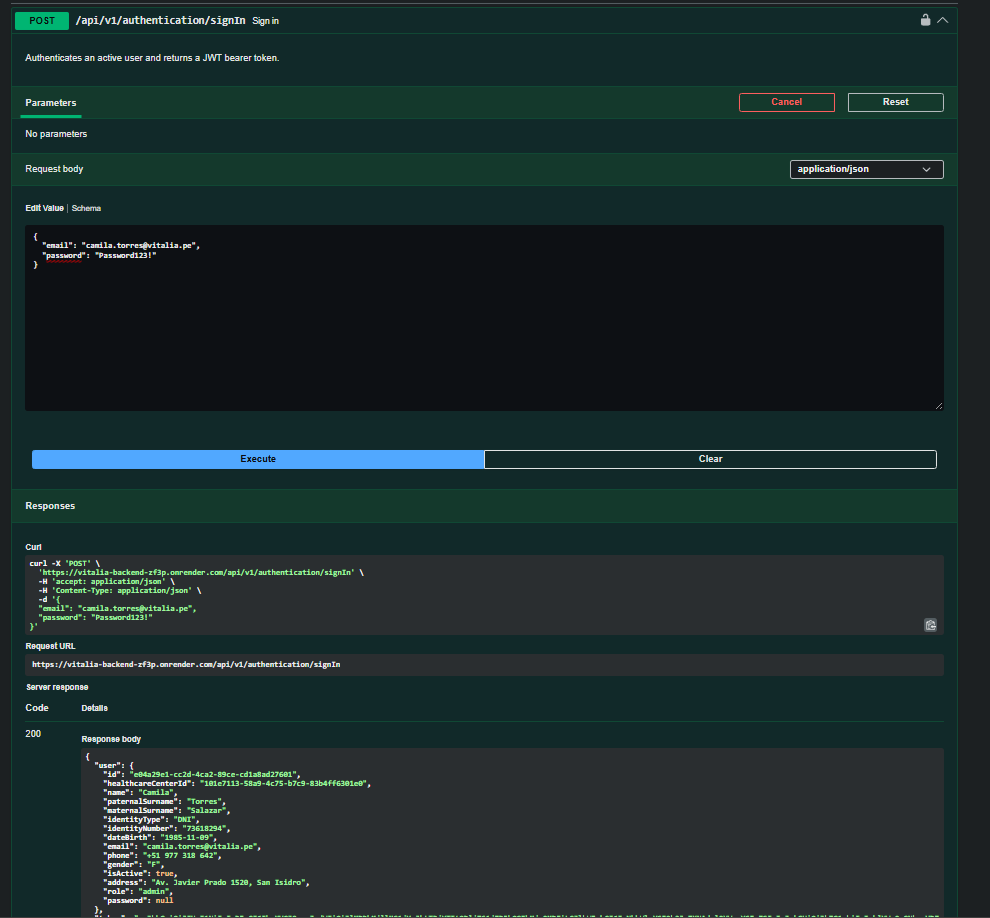

**GET /api/v1/users — Listado de usuarios:**

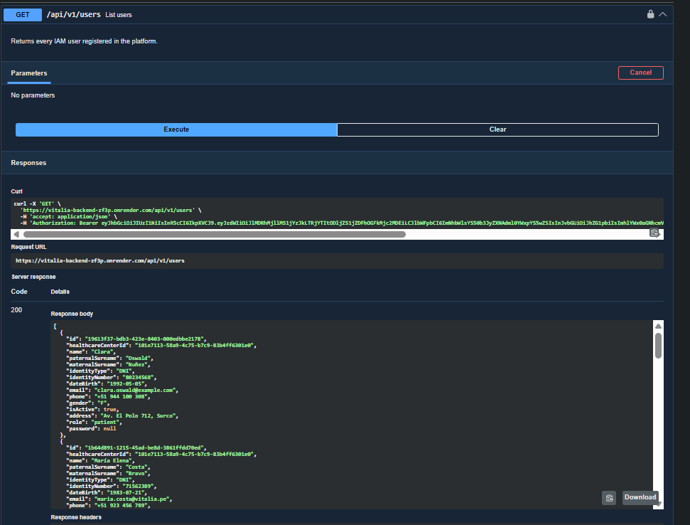

**GET /api/v1/appointments — Listado de citas:**

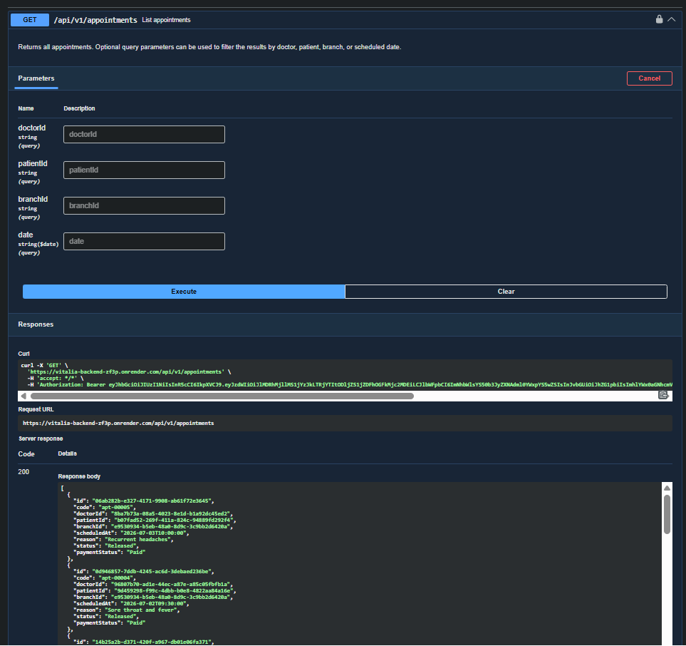

**DELETE /api/v1/appointments/{appointmentId} — Eliminación de cita:**

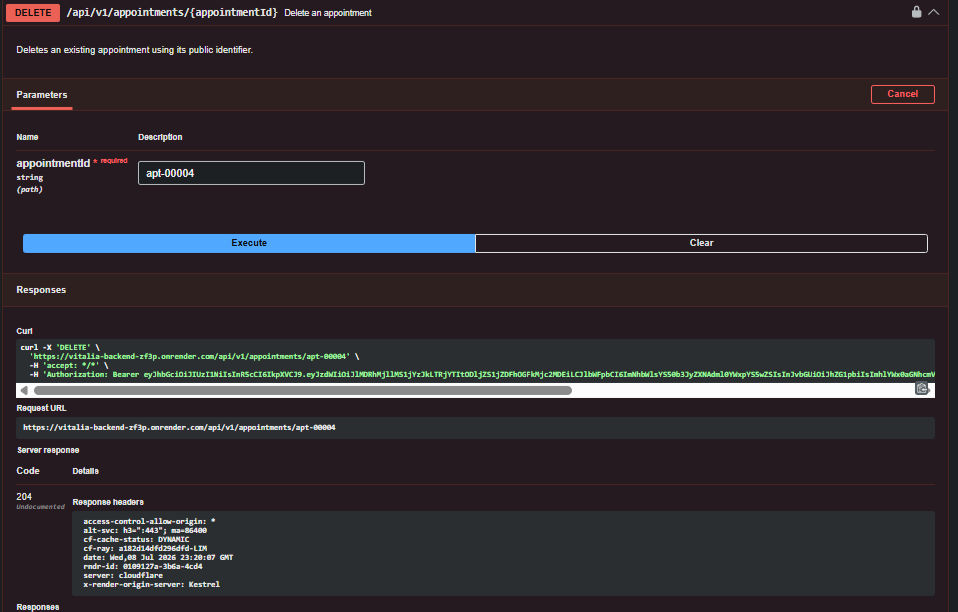

**GET /api/v1/medicines — Listado de medicamentos:**

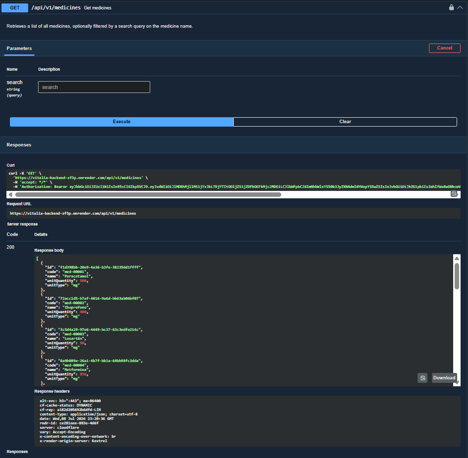

#### 5.2.4.7. Software Deployment Evidence for Sprint Review

Para este Sprint 4 no se requirió realizar un despliegue manual. Gracias a la configuración implementada en entregables previos, el proyecto ya cuenta con un flujo automatizado. De este modo, cualquier actualización o nuevo cambio integrado en la rama main desencadena automáticamente la actualización del despliegue en el entorno correspondiente.

**Landing Page link:** [https://kinetia-upc.github.io/vitalia-landing/](https://kinetia-upc.github.io/vitalia-landing/)

**Frontend link:** [https://vitalia-frontend-kinetia.vercel.app](https://vitalia-frontend-kinetia.vercel.app)

**Swagger Documentation Link:** [https://vitalia-backend-zf3p.onrender.com/swagger/index.html](https://vitalia-backend-zf3p.onrender.com/swagger/index.html)

**Landing page Deployment:**

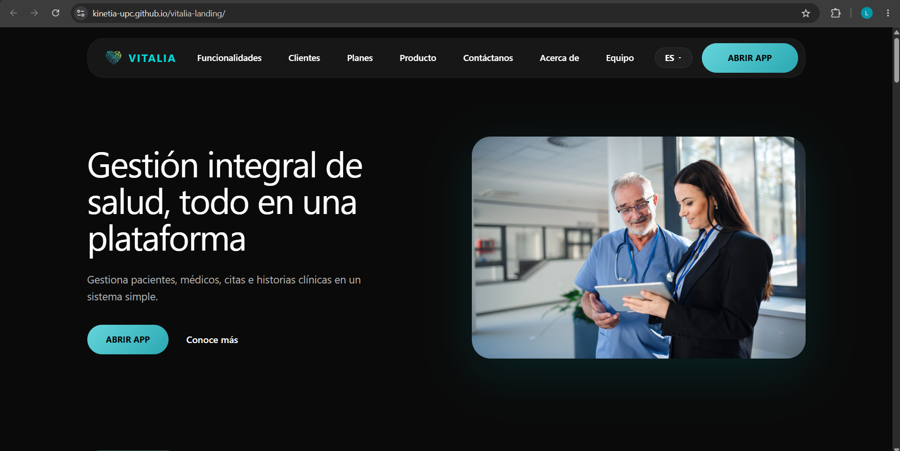

**Frontend Deployment:**

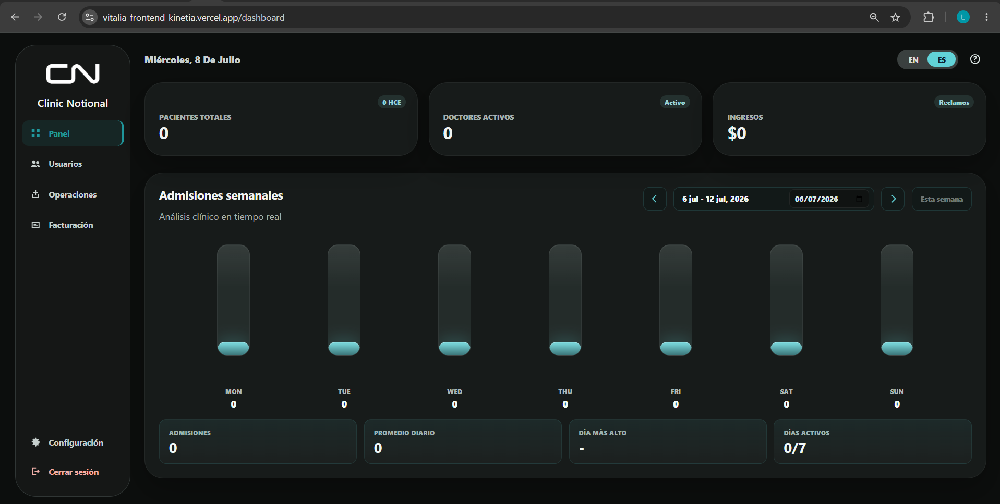

**Backend Deployment:**

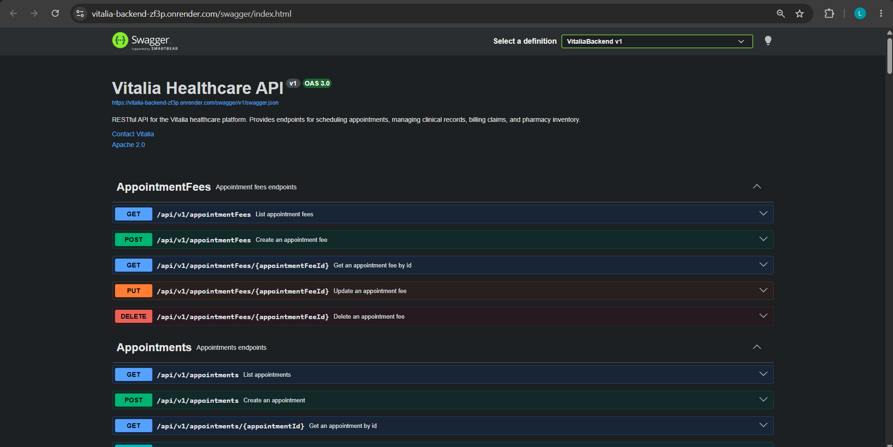

#### 5.2.4.8. Team Collaboration Insights during Sprint 

A continuación se presenta la evidencia de las interacciones y control de colaboración registrados durante el transcurso de este Sprint:

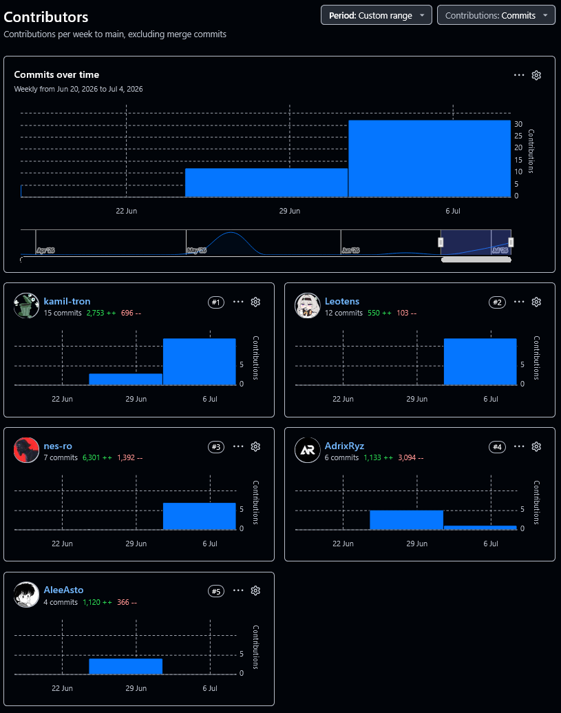

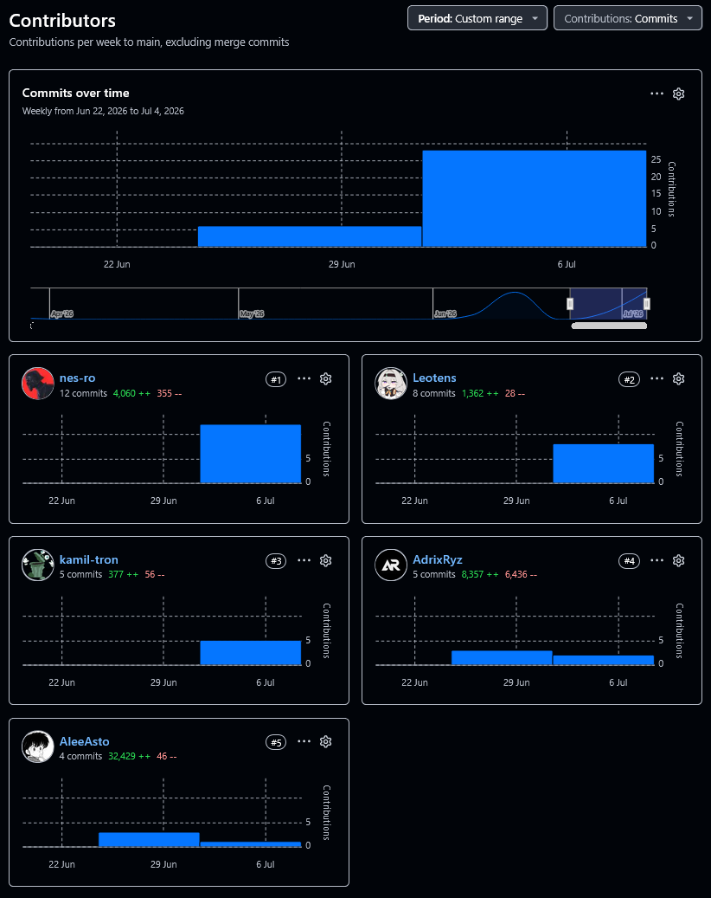

El gráfico y métricas evidencian una alta frecuencia de commits organizados y un balance de responsabilidades alineado con los líderes técnicos de módulo definidos en la planificación.

## 5.3. Validation Interviews

### 5.3.1. Diseño de Entrevistas

Esta sección presenta el diseño de entrevistas para validar la propuesta de valor y la experiencia de uso de Vitalia con sus tres segmentos objetivo: administradores, doctores y pacientes. Para cada segmento se definen los elementos a evaluar, los flujos principales de la Landing Page y la Web Application, las tareas que realizarán los participantes durante la sesión y las preguntas de validación orientadas a identificar claridad, utilidad, facilidad de uso y oportunidades de mejora.

**Primer Segmento Objetivo (Administradores de establecimientos de PNAS)**

**User Flows:**

- User Flow 1 - Navegar la Landing Page e identificar propuesta, ventajas y diferenciadores.
- User Flow 2 - Revisar dashboard administrativo con métricas operativas.
- User Flow 3 - Gestionar usuarios: pacientes, doctores y administradores.
- User Flow 4 - Programar citas desde operaciones/admisión.
- User Flow 5 - Confirmar o modificar disponibilidad y citas de la clínica.
- User Flow 6 - Revisar facturación, reclamos, pagos o estados financieros.
- User Flow 7 - Configurar clínica: sedes, especialidades y farmacia.

**Tareas asignadas:**

- Navegar el Landing Page, revisar propuesta de valor, ventajas clave y beneficios por segmento.
- Ingresar al dashboard administrativo y revisar indicadores principales.
- Abrir gestión de usuarios y buscar, crear, editar o eliminar un usuario.
- Filtrar usuarios por rol y validar si la información presentada es suficiente.
- Ingresar a operaciones y crear o editar una cita.
- Revisar disponibilidad médica y detectar posibles conflictos de horario.
- Entrar a facturación y ubicar reclamos, estados de ciclo o pagos pendientes.
- Aplicar filtros en facturación y validar si ayudan al seguimiento financiero.
- Entrar a configuración de clínica y revisar sedes, especialidades y farmacia.

**Preguntas de validación:**

1. ¿La Landing Page entrega suficiente información para considerar una prueba o compra?
2. ¿Los módulos presentados responden a problemas reales de administración clínica?
3. ¿El dashboard permite tomar decisiones rápidas sobre operación, ingresos y carga asistencial?
4. ¿La gestión de usuarios cubre los roles que necesita un centro médico real?
5. ¿El flujo de programación de citas desde admisión reduce trabajo manual?
6. ¿El módulo de facturación muestra información financiera útil?
7. ¿La configuración de sedes, especialidades y farmacia resulta clara?
8. ¿Qué tareas administrativas todavía sentirías que requieren Excel, llamadas, papel u otras herramientas?

**Segundo Segmento Objetivo (Doctores de establecimientos de PNAS)**

**User Flows:**

- User Flow 1 - Navegar la Landing Page e identificar beneficios para el trabajo médico.
- User Flow 2 - Revisar dashboard médico con citas, pacientes activos y tareas pendientes.
- User Flow 3 - Consultar agenda diaria y gestionar el estado de una cita.
- User Flow 4 - Buscar paciente y revisar su historia clínica electrónica.
- User Flow 5 - Registrar atención clínica con diagnóstico y tratamiento.
- User Flow 6 - Crear o reutilizar receta digital asociada a una HCE.
- User Flow 7 - Revisar órdenes médicas o resultados pendientes.

**Tareas asignadas:**

- Navegar el Landing Page e identificar si Vitalia comunica reducción de carga administrativa y mejor acceso a información clínica.
- Ingresar al dashboard del doctor y confirmar si las métricas ayudan a priorizar la jornada.
- Abrir la agenda médica y ubicar citas asignadas para el día.
- Seleccionar un paciente y revisar su HCE.
- Registrar o editar una atención clínica, incluyendo diagnóstico y tratamiento.
- Intentar guardar una atención clínica.
- Crear una receta, agregar medicamentos y revisar si la información requerida es suficiente.
- Revisar órdenes pendientes y confirmar si la vista permite tomar acción rápidamente.

**Preguntas de validación:**

1. ¿La Landing Page transmite que Vitalia puede reducir carga administrativa médica?
2. ¿El dashboard médico te ayuda a entender tu jornada en pocos segundos?
3. ¿La agenda diaria muestra suficiente contexto para preparar consultas?
4. ¿El acceso al historial clínico del paciente es rápido y útil durante la atención?
5. ¿El formulario de atención clínica se ajusta a tu flujo real de consulta?
6. ¿Los campos obligatorios son adecuados o faltan datos clínicos importantes?
7. ¿La creación de recetas digitales es más clara que el proceso manual?
8. ¿Qué parte del flujo podría retrasarte durante una consulta real?

**Tercer Segmento Objetivo (Pacientes de todas las edades)**

**User Flows:**

- User Flow 1 - Navegar la Landing Page
- User Flow 2 - Ingresar al panel del paciente y revisar el resumen principal de salud.
- User Flow 3 - Reservar, reagendar o cancelar una cita médica desde el módulo de citas.
- User Flow 4 - Consultar historial clínico, diagnósticos y atenciones previas.
- User Flow 5 - Consultar recetas médicas digitales y detalles de medicamentos.
- User Flow 6 - Revisar y actualizar información básica del perfil del paciente.

**Tareas asignadas:**

- Navegar el Landing Page, revisar secciones principales, identificar beneficios para pacientes.
- Ingresar al panel del paciente y explicar qué información entiende primero.
- Buscar la próxima cita médica y revisar sus detalles.
- Intentar reservar una nueva consulta seleccionando horario disponible.
- Reagendar o cancelar una cita existente, evaluando si el proceso es claro.
- Ingresar al historial clínico y ubicar diagnósticos, tratamientos o documentos asociados.
- Abrir el módulo de recetas y revisar dosis, frecuencia, duración y disponibilidad del medicamento.
- Revisar el perfil personal e identificar si los datos mostrados son suficientes y comprensibles.

**Preguntas de validación:**

1. ¿La Landing Page comunica claramente cómo Vitalia mejora tu experiencia como paciente?
2. ¿Pudiste encontrar rápidamente dónde reservar una cita?
3. ¿El flujo de reserva te pareció simple o hubo pasos confusos?
4. ¿La información del historial clínico es clara, confiable y fácil de interpretar?
5. ¿Las recetas digitales muestran suficiente información para seguir el tratamiento correctamente?
6. ¿La interfaz sería usable para una persona adulta mayor o con poca experiencia digital?
7. ¿Qué información adicional esperarías ver antes o después de una cita?
8. ¿Qué acción te generó mayor confianza o mayor duda dentro de la aplicación?

### 5.3.2. Registro de Entrevistas

**Validation Interviews Link:** [https://upcedupe-my.sharepoint.com/:v:/g/personal/u202317099_upc_edu_pe/IQAv0hWFnQ58TILhDk2_zj4kAYtODAgwlxj7EgvGs1ZRWOU?nav=eyJyZWZlcnJhbEluZm8iOnsicmVmZXJyYWxBcHAiOiJPbmVEcml2ZUZvckJ1c2luZXNzIiwicmVmZXJyYWxBcHBQbGF0Zm9ybSI6IldlYiIsInJlZmVycmFsTW9kZSI6InZpZXciLCJyZWZlcnJhbFZpZXciOiJNeUZpbGVzTGlua0NvcHkifX0&e=7D65bU](https://upcedupe-my.sharepoint.com/:v:/g/personal/u202317099_upc_edu_pe/IQAv0hWFnQ58TILhDk2_zj4kAYtODAgwlxj7EgvGs1ZRWOU?nav=eyJyZWZlcnJhbEluZm8iOnsicmVmZXJyYWxBcHAiOiJPbmVEcml2ZUZvckJ1c2luZXNzIiwicmVmZXJyYWxBcHBQbGF0Zm9ybSI6IldlYiIsInJlZmVycmFsTW9kZSI6InZpZXciLCJyZWZlcnJhbFZpZXciOiJNeUZpbGVzTGlua0NvcHkifX0&e=7D65bU)

**Primer Segmento Objetivo (Administradores de establecimientos de PNAS)**

**Entrevista 1**

| Entrevistada: | Entrevistadora: Alejandra Astocondor |
| --- | --- |
| 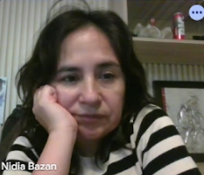 |  |
| Inicia | 0:00  |
| Duración: | 8:05 |
| Nombre completo: | Nidia Mariesther Bazán Calderón |
| Edad: | 52 años |
| Distrito: | Pueblo Libre |
| Resumen: | Durante la entrevista, la participante, Nidia Bazán Calderón, jefa de una sede de salud en San Isidro y residente en Pueblo Libre, evaluó positivamente la propuesta general de la plataforma y comprendió que el acceso a las funcionalidades depende del tipo de plan contratado. Mostró interés en conocer la capacidad de pacientes soportada por cada plan, especialmente el plan gratuito, percibiéndolo principalmente como una alternativa de prueba. En la revisión de los módulos, valoró la gestión de citas y destacó que la sincronización inmediata con el calendario y la posibilidad de compartir la información con el médico facilitan la operación diaria. Asimismo, consideró que el dashboard administrativo resulta útil porque permite visualizar rápidamente la ocupación de espacios y apoyar la gestión de recursos del centro médico. Como principales oportunidades de mejora, señaló que el módulo de farmacia debería ser opcional, ya que no todos los consultorios o centros médicos cuentan con este servicio. En contraste, sugirió incorporar un módulo específico para servicios de apoyo al diagnóstico, como radiografías, ecografías, exámenes de laboratorio y otros procedimientos auxiliares, argumentando que estos son más comunes en los establecimientos de salud y generan ingresos que también deberían ser gestionados y facturados dentro de la plataforma. Además, propuso fortalecer el módulo financiero incorporando indicadores de flujo de caja diario, mensual y anual, así como reportes de rentabilidad por médico, permitiendo visualizar cuánto factura cada profesional en distintos periodos de tiempo. En general, consideró que la plataforma tiene una base sólida y que estas mejoras podrían enriquecer significativamente su valor para los centros médicos. |

**Entrevista 2**

| Entrevistada: | Entrevistadora: Alejandra Astocondor |
| --- | --- |
| 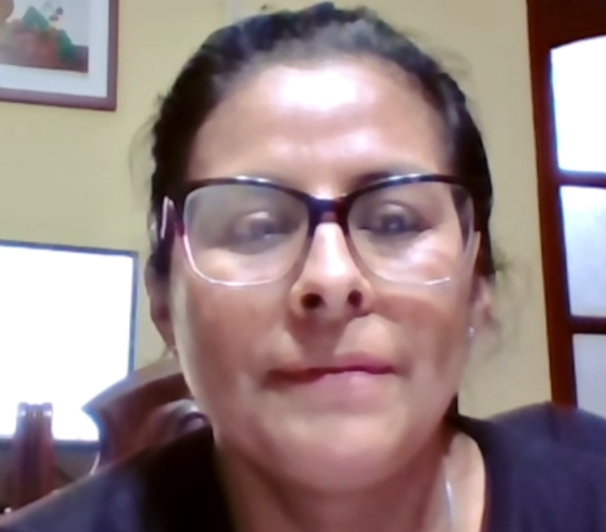 |  |
| Inicia | 8:05 |
| Duración: | 7:39 |
| Nombre completo: | Maria del Carmen Astocondor Riva  |
| Edad: | 52 |
| Distrito: | Chaclacayo |
| Resumen: | Durante la entrevista, la participante, odontóloga residente en Chaclacayo, mostró una percepción generalmente positiva tanto de la landing page como del sistema administrativo presentado. Consideró que la landing page comunica adecuadamente la propuesta de valor y brinda suficiente información para evaluar una prueba o compra, destacando que explica claramente los servicios y funcionalidades ofrecidas. Respecto a la plataforma, indicó que los módulos presentados responden a necesidades reales de gestión clínica, valorando especialmente la organización de usuarios, la programación de citas, el control de horarios y la gestión de farmacia con seguimiento de stock. También consideró que el dashboard principal permite obtener una visión rápida de la operación y que la gestión de usuarios cubre los roles básicos necesarios en un centro médico. Sobre el flujo de citas, señaló que ayuda a reducir el trabajo manual al facilitar la administración digital de agendas y horarios. Como principal oportunidad de mejora, sugirió ampliar la información disponible en el módulo de facturación, incorporando detalles sobre los métodos de pago utilizados por los pacientes (contado, crédito u otros), ya que considera que esta información sería útil para la gestión financiera. Finalmente, no identificó tareas administrativas relevantes que siguieran requiriendo herramientas externas como Excel, llamadas o papel, y concluyó que la solución le pareció completa, clara e interesante. |

**Entrevista 3**

| Entrevistado: | Entrevistadora: Alejandra Astocondor |
| --- | --- |
| 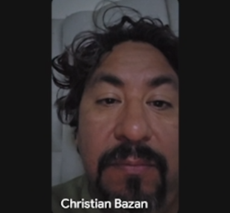 |  |
| Inicia | 15:47 |
| Duración: | 4:16 |
| Nombre completo: | Christian David Bazán Calderón |
| Edad: | 51 |
| Distrito: | Surco |
| Resumen: | Cristian David Bazán Calderón, médico cirujano, valoró positivamente tanto la landing page como los módulos administrativos mostrados durante la demostración. Consideró que la página comunica de manera adecuada los beneficios del sistema y proporciona suficiente información para que una clínica o consultorio considere probar la solución. Respecto a la plataforma, confirmó que los módulos presentados responden a necesidades reales de gestión médica y administrativa, destacando la programación de citas, la gestión de usuarios y la administración financiera. Mencionó que el dashboard permite obtener una visión general útil de la operación, aunque sugirió que podría ser visualmente más dinámico para mejorar la experiencia de uso. También consideró que la gestión de usuarios cubre adecuadamente los roles necesarios dentro de un centro médico y que el flujo de programación de citas reduce considerablemente el trabajo manual. En cuanto a las tareas que aún podrían requerir herramientas externas, mencionó específicamente la gestión de campañas de salud, sugiriendo que esta podría ser una futura funcionalidad complementaria. En general, percibió la plataforma como una herramienta sólida, funcional y alineada con los procesos cotidianos de una institución de salud. |

**Segundo Segmento Objetivo (Doctores de establecimientos de PNAS)**

**Entrevista 1**

| Entrevistada: | Entrevistadora: Alejandra Astocondor |
| --- | --- |
| 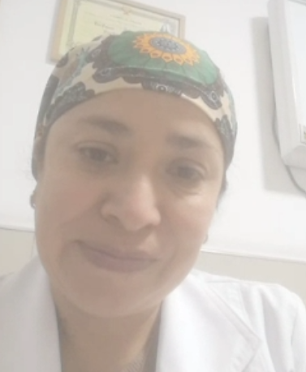 |  |
| Inicia | 20:00 |
| Duración: | 10:21 |
| Nombre completo: | Elvia Bazán Calderon |
| Edad: | 50 |
| Distrito: | San Juan de Miraflores |
| Resumen: | Elvia Bazán destacó desde el inicio que la plataforma tiene el potencial de reducir significativamente la carga administrativa que enfrentan los médicos, especialmente en establecimientos de primer nivel donde todavía predominan procesos manuales y registros en papel. Consideró que la posibilidad de centralizar la información clínica, administrativa y operativa en una sola herramienta puede agilizar la atención y reducir los tiempos de espera de los pacientes. Durante la revisión de los módulos médicos, valoró positivamente el dashboard, la agenda y el acceso a la historia clínica electrónica, señalando que permiten obtener rápidamente la información necesaria para organizar la jornada de trabajo y brindar una atención más eficiente. También resaltó la utilidad de las recetas digitales y de las órdenes médicas, percibiendo que estas funcionalidades simplifican procesos que actualmente requieren múltiples pasos administrativos. Como principal oportunidad de mejora, recomendó incorporar la codificación CIE-10 dentro del registro de diagnósticos, ya que es un requisito habitual y obligatorio en muchos entornos de salud. Asimismo, planteó la necesidad de contar con mecanismos que permitan gestionar de manera más clara los exámenes o procedimientos que deben realizarse fuera de la institución, como tomografías u otros estudios especializados, de modo que el seguimiento del paciente no se interrumpa. En general, percibió la plataforma como una solución moderna, completa y con gran potencial para optimizar el trabajo médico y mejorar la continuidad de la atención. |

**Entrevista 2**

| Entrevistada: | Entrevistadora: Alejandra Astocondor |
| --- | --- |
|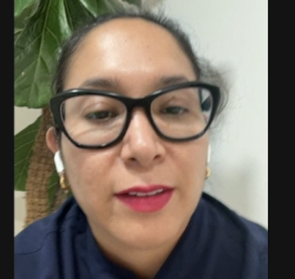 | |
| Inicia | 30:21 |
| Duración: | 04:50 |
| Nombre completo: | Erika Paola Mendoza Astudillo |
| Edad: | 45 |
| Distrito: | San Isidro |
| Resumen: | La doctora Erika Paola Mendoza percibió la plataforma como una herramienta que contribuye directamente a disminuir la carga administrativa del personal médico al centralizar información y procesos en un único entorno digital. Consideró que la landing page transmite adecuadamente este beneficio y que la propuesta de valor resulta fácil de comprender. Durante la demostración de los módulos médicos, señaló que tanto el dashboard como la agenda diaria ofrecen información suficiente para entender rápidamente la jornada de trabajo y preparar consultas. También encontró intuitivo el acceso a historias clínicas, diagnósticos y tratamientos, destacando que el flujo general se adapta adecuadamente a la práctica clínica habitual. Respecto al formulario de atención, consideró que los campos actuales son adecuados, aunque sugirió integrar la codificación CIE-10 para facilitar el registro de diagnósticos y cumplir con estándares clínicos ampliamente utilizados. Asimismo, propuso incorporar una visualización rápida de exámenes complementarios realizados por el paciente, permitiendo que el médico tenga acceso inmediato a información diagnóstica relevante sin interrumpir la consulta. En general, calificó la experiencia como clara, sencilla y alineada con las necesidades reales de atención médica. |

**Entrevista 3**

| Entrevistado: | Entrevistadora: Alejandra Astocondor |
| --- | --- |
|  |  |
| Inicia | 35:11 |
| Duración: | 05:03 |
| Nombre completo: | Abel Astocondor Riva |
| Edad: | 51 |
| Distrito: | Pueblo Libre |
| Resumen: | Abel Astocondor Riva, médico intensivista con experiencia tanto en el sector privado como hospitalario, valoró el potencial de la plataforma para digitalizar y ordenar procesos clínicos, aunque realizó observaciones importantes relacionadas con la profundidad de la información clínica registrada. Durante la revisión de la historia clínica electrónica, enfatizó la necesidad de incorporar campos más completos para antecedentes médicos, información relevante del paciente y otros elementos que suelen formar parte de los formatos clínicos exigidos por normativas y requisitos legales. Asimismo, señaló que sería recomendable integrar tanto los códigos CIE-10 para diagnósticos como códigos asociados a procedimientos médicos, ya que ambos son utilizados de manera frecuente en la práctica clínica. Respecto a las recetas digitales, consideró positiva la funcionalidad, aunque sugirió asegurar una adecuada codificación y disponibilidad del catálogo de medicamentos. También destacó la importancia de garantizar la trazabilidad de los procedimientos realizados durante la atención. Finalmente, comentó que los principales factores que suelen generar retrasos en la atención médica están relacionados con la ausencia de información clínica previa o con pacientes que cancelan o no asisten a sus citas, más que con problemas inherentes al sistema. En general, vio la plataforma como una base sólida que podría fortalecerse incorporando mayores detalles clínicos y normativos. |

**Tercer Segmento Objetivo (Pacientes de todas las edades)**

**Entrevista 1**

| Entrevistada: | Entrevistador: Leo Dulanto |
| --- | --- |
|  |  |
| Inicia | 40:15 |
| Duración: | 8:24 |
| Nombre completo: | Margarita Espino  |
| Edad: | 48 |
| Distrito: | Cercado de Lima |
| Resumen: | Margarita Espino, participante del segmento de pacientes, tuvo una impresión positiva de la plataforma y consideró que la landing page comunica adecuadamente los beneficios generales que ofrece a los usuarios. Indicó que la información presentada permite comprender el propósito del sistema y cómo podría mejorar la experiencia de atención médica. Durante la navegación del módulo de paciente, encontró que las funcionalidades son relativamente intuitivas, aunque comentó que inicialmente le tomó algunos segundos identificar dónde podía reservar una cita médica. Una vez ubicada la funcionalidad, consideró que el proceso era claro y fácil de seguir. También sugirió optimizar algunos elementos visuales para aprovechar mejor el espacio en pantalla y reducir la necesidad de desplazamiento vertical. Valoró especialmente la posibilidad de revisar el historial clínico y consultar médicos que la atendieron anteriormente, ya que considera que esta información es útil para futuras consultas. Respecto a las recetas digitales, destacó la importancia de contar con una opción de impresión visible y accesible, dado que muchas veces los pacientes necesitan presentar la receta en farmacias externas. Finalmente, recomendó incorporar módulos relacionados con exámenes de laboratorio, radiografías, ecografías y otros estudios complementarios, incluyendo la posibilidad de gestionar citas para estos servicios. En general, manifestó confianza en la propuesta y consideró que la plataforma podría mejorar significativamente la experiencia del paciente si continúa desarrollándose en esa dirección. |

**Entrevista 2**

| Entrevistada: | Entrevistador: Nestor Rojas |
| --- | --- |
| 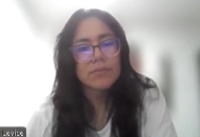 |  |
| Inicia | 48:50 |
| Duración: | 9:59 |
| Nombre completo: | Gianella Levice |
| Edad: | 30 |
| Distrito: | Los Olivos |
| Resumen: | Durante la entrevista, la participante, Gianella, paciente de 30 años y residente de Los Olivos, entrevistada por segunda vez para el segmento de pacientes de todas las edades, evaluó positivamente la propuesta general de Vitalia, destacando que la landing page comunica con claridad cómo la plataforma mejora la experiencia del paciente al ofrecerle una estructura y un orden definidos para gestionar sus consultas en distintas clínicas. En la revisión del apartado de citas, valoró que reservar una nueva consulta resultó práctico y rápido, resaltando que el desglose de horarios y alternativas disponibles le pareció claro en comparación con otras aplicaciones similares que ha usado. Sobre el módulo de historial clínico, lo consideró confiable y fácil de interpretar, aunque señaló que la cantidad de información podía sentirse abundante para un paciente; sugirió incorporar un filtro por fecha exacta o palabra clave, además del ordenamiento por antigüedad ya existente, para facilitar búsquedas puntuales. Respecto a las recetas digitales, destacó que la información mostrada (dosis, frecuencia, duración y precio) es bastante completa, señalando que normalmente ese nivel de detalle solo lo maneja el personal de farmacia y no el propio paciente, por lo que tenerlo disponible de forma visual le pareció un valor agregado. En cuanto a la usabilidad para adultos mayores o personas con poca experiencia digital, consideró que podrían encontrar dificultades iniciales para ubicar funciones o entender ciertos elementos, y que sería necesario contar con alguien que los acompañe hasta que se familiaricen con la plataforma. Como principal oportunidad de mejora, propuso incorporar un sistema de puntuación o reseñas de los médicos, argumentando que actualmente la elección de doctor suele depender solo de la disponibilidad de horario, sin información sobre la calidad de la atención, y que muchas veces los pacientes terminan buscando esos datos por su cuenta en Google sin encontrar resultados útiles. Finalmente, sugirió que en el apartado de recetas se pudiera indicar en qué farmacias específicas se encuentra disponible cada medicamento, lo que consideró especialmente útil para adultos mayores. En general, consideró que la plataforma es clara, ordenada y útil, con potencial de mejora en personalización de búsqueda y transparencia sobre la calidad médica. |

**Entrevista 3**

| Entrevistado: | Entrevistador: Adrian Ruiz |
| --- | --- |
|  |  |
| Inicia | 58:48 |
| Duración: | 6:52 |
| Nombre completo: | César Contreras |
| Edad: | 19 |
| Distrito: | Rimac |
| Resumen: | En la entrevista podemos ver cómo el usuario César Contreras evalúa de forma muy positiva la landing page y la aplicación Vitalia, destacando desde el inicio que el sitio web comunica con total claridad el propósito del proyecto. Al revisar las funciones de la aplicación, observamos que el flujo para reservar y pagar una cita le resultó sumamente sencillo e intuitivo gracias a un diseño limpio y al uso estratégico de botones llamativos que guían al usuario. Asimismo, encontramos que las secciones de historial clínico y recetas médicas son claras, legibles y fáciles de interpretar, lo que lleva al entrevistado a concluir que la interfaz es tan accesible que incluso un adulto mayor podría utilizarla sin mayores complicaciones. Finalmente, como un valioso aporte de mejora, notamos su sugerencia de incluir dentro del apartado de recetas digitales un listado que distinga entre marcas de medicamentos genéricos y de laboratorio para enriquecer aún más la experiencia del paciente. |

### 5.3.3. Evaluaciones según heurísticas

**UX Heuristics & Principles Evaluation**

**Usability – Inclusive Design – Information Architecture**

CARRERA : Ingeniería de Software
CURSO : Aplicaciones Web
SECCIÓN : 10203
PROFESORES : Todos
AUDITOR : KinetiaLabs
SITE o APP A EVALUAR: Vitalia

**TAREAS A EVALUAR:**

El alcance de esta evaluación incluye la revisión de la usabilidad de las siguientes tareas:

1. Explorar la Landing Page y comprender el propósito de Vitalia.
2. Navegar entre las principales secciones del sistema.
3. Consultar información del perfil del usuario.
4. Revisar el modulo de cronograma
5. Explorar el módulo de farmacia.
6. Buscar o consultar medicamentos disponibles.
7. Revisar información relacionada con pagos o facturación.
8. Consultar indicadores o reportes en el módulo de Analytics.
9. Comprender el flujo general de atención o gestión dentro de la plataforma.

No están incluidas en esta versión de la evaluación las siguientes tareas:
1. Evaluar funciones administrativas avanzadas que dependan de endpoints aún no implementados.

**ESCALA DE SEVERIDAD:** Los errores serán puntuados tomando en cuenta la siguiente escala de severidad

| Nivel | Descripción |
|---|---|
| 1 | Problema superficial: puede ser fácilmente superado por el usuario o ocurre con muy poca frecuencia. No necesita ser arreglado, salvo que exista disponibilidad de tiempo. |
| 2 | Problema menor: puede ocurrir un poco más frecuentemente o es un poco más difícil de superar para el usuario. Se le debería asignar una prioridad baja para resolverlo. |
| 3 | Problema mayor: ocurre frecuentemente o los usuarios no son capaces de resolverlo. Es importante que sea corregido y se le debe asignar una prioridad alta. |
| 4 | Problema muy grave: error de gran impacto que impide al usuario continuar con el uso de la herramienta. Es imperativo que sea corregido antes del lanzamiento. |

**TABLA RESUMEN:**

| # | Problema | Escala de severidad | Heurística/Principio violada(o) |
|---|---|---|---|
| 1 | La reposición de farmacia aparece dentro del módulo de facturación | 2 | Correspondencia entre el sistema y el mundo real |
| 2 | El historial clínico presenta información con formatos poco uniformes | 2 | Consistencia y estándares |
| 3 | El resumen de cita presenta información clínica con baja jerarquía visual | 2 | Diseño estético y minimalista |
| 4 | El precio de las recetas no se presenta con suficiente claridad visual | 2 | Reconocimiento antes que recuerdo |
| 5 | Las citas pasadas o canceladas siguen apareciendo como próximas citas sin diferenciación suficiente | 2 | Prevención de errores |
| 6 | Los iconos de alerta y avisos operativos no comunican claramente su significado | 2 | Reconocimiento antes que recuerdo |

**DESCRIPCIÓN DE PROBLEMAS:**

### Problema #1: La reposición de farmacia aparece dentro del módulo de facturación

**Severidad:** 2  
**Heurística violada:** Usabilidad - Correspondencia entre el sistema y el mundo real

**Problema:**  
En el módulo de Billing se incluye una sección llamada "Pharmacy Stock Replenishment", relacionada con el monitoreo y reposición de medicamentos. Aunque puede tener relación con compras o costos, para el usuario esta funcionalidad pertenece principalmente al flujo de farmacia. Ubicarla dentro de facturación puede generar confusión sobre dónde debe buscarse la gestión de inventario.

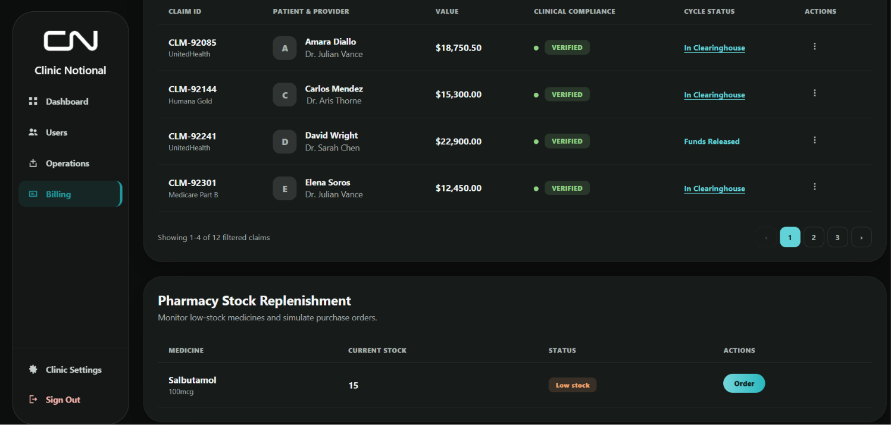

**Recomendación:**  
Reubicar la reposición de stock dentro de un módulo de farmacia o inventario. Si debe mantenerse en Billing, se recomienda agregar una etiqueta o explicación breve que indique que se trata de una reposición asociada a costos u órdenes de compra.

---

### Problema #2: El historial clínico presenta información con formatos poco uniformes

**Severidad:** 2  
**Heurística violada:** Usabilidad - Consistencia y estándares

**Problema:**  
En la vista de historial clínico se muestran fechas y estados con formatos distintos, por ejemplo "12 may.", "19-JUN.", "ARCHIVADO" y "COMPLETADO". Esta variación obliga al usuario a interpretar cada dato por separado y reduce la claridad de una sección que debería facilitar la revisión rápida de la evolución médica.

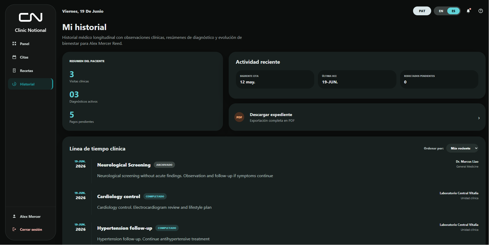

**Recomendación:**  
Usar un formato uniforme para fechas, estados y etiquetas dentro del historial. También se recomienda mantener el mismo idioma en todos los elementos para que la línea de tiempo sea más fácil de revisar.

---

### Problema #3: El resumen de cita presenta información clínica con baja jerarquía visual

**Severidad:** 2  
**Heurística violada:** Usabilidad - Diseño estético y minimalista

**Problema:**  
En el modal de resumen de cita se muestran datos importantes como doctor, fecha, hora, clínica, estado, pago e ID de cita con una distribución muy similar entre todos los campos. Esto hace que la información principal no destaque lo suficiente y que el usuario tenga que leer todo el contenido para identificar rápidamente los datos más relevantes.

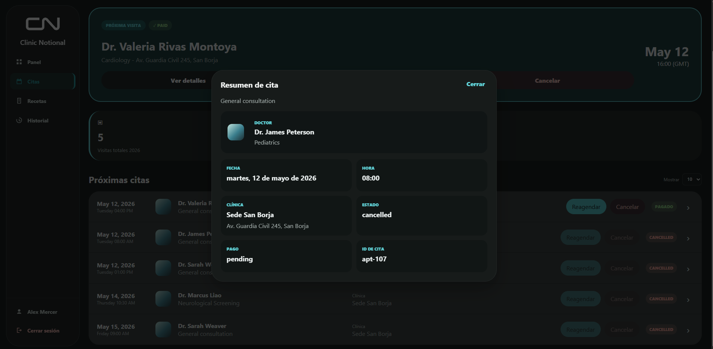

**Recomendación:**  
Mejorar la jerarquía visual del modal destacando primero los datos esenciales de la cita, como médico, fecha, hora y estado. Los datos secundarios, como el ID de cita, pueden mostrarse con menor énfasis o en una sección inferior.

---

### Problema #4: El precio de las recetas no se presenta con suficiente claridad visual

**Severidad:** 2  
**Heurística violada:** Usabilidad - Reconocimiento antes que recuerdo

**Problema:**  
En las tarjetas de recetas, el precio unitario aparece en la parte inferior con poco énfasis visual. Al tratarse de información relevante para el paciente, puede pasar desapercibida o confundirse con un dato secundario, especialmente cuando la tarjeta contiene varios campos clínicos.

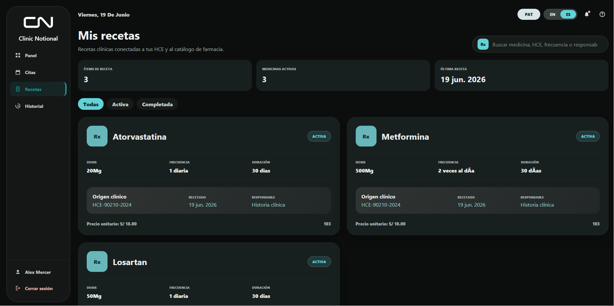

**Recomendación:**  
Presentar el precio en una sección más visible de la tarjeta, usando una etiqueta clara como "Precio unitario" y, si corresponde, mostrar también el subtotal o costo estimado de la receta.

---

### Problema #5: Las citas pasadas o canceladas siguen apareciendo como próximas citas sin diferenciación suficiente

**Severidad:** 2  
**Heurística violada:** Usabilidad - Prevención de errores

**Problema:**  
En la lista de "Próximas citas" se muestran citas con fechas anteriores o estados como "cancelled" junto con acciones como reagendar o cancelar. Esto puede generar confusión porque el usuario podría interpretar que esas citas aún están vigentes o intentar realizar acciones sobre citas que ya no deberían tratarse como próximas.

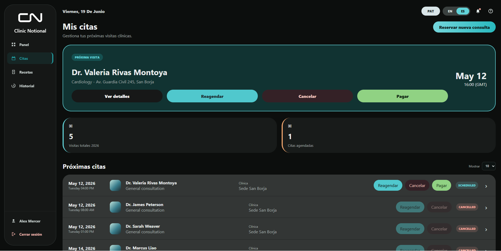

**Recomendación:**  
Ocultar las citas que ya pasaron de la sección de próximas citas o moverlas a una sección de historial. Si se mantienen visibles, deben mostrarse con una etiqueta clara como "Finalizada", "Pasada" o "Cancelada" y limitar las acciones disponibles.

---

### Problema #6: Los iconos de alerta y avisos operativos no comunican claramente su significado

**Severidad:** 2  
**Heurística violada:** Usabilidad - Reconocimiento antes que recuerdo

**Problema:**  
En la vista de operaciones se utilizan iconos como "+", "*" y "#" para representar alertas, avisos de capacidad y actualizaciones de personal. Estos símbolos no comunican por sí solos el tipo de aviso, por lo que el usuario debe leer todo el texto para comprender la prioridad o categoría del mensaje.

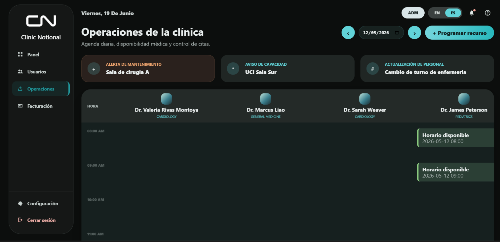

**Recomendación:**  
Utilizar iconos más representativos para cada tipo de aviso, por ejemplo un símbolo de advertencia para mantenimiento, un indicador de capacidad para ocupación y un icono de personal para cambios de turno. También se recomienda mantener colores y etiquetas consistentes según la prioridad del aviso.

## 5.4. Video About-the-Product

En esta sección se presenta el video publicitario de Vitalia, una plataforma integral orientada a optimizar la gestión clínica y administrativa de centros médicos mediante un modelo digital multirol que conecta a administradores, doctores y pacientes en un solo ecosistema. El video resume el valor del producto al mostrar cómo Vitalia automatiza procesos, permitiendo ahorrar tiempo, reducir tareas manuales y mejorar la calidad de atención.

**Video About-the-Product Link:** [https://youtu.be/iEpRiV-OPjU](https://youtu.be/iEpRiV-OPjU)

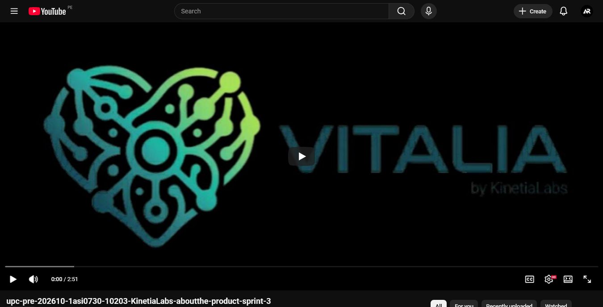

# Conclusiones

- **Sobre el Problem Statement y la propuesta de valor:** La problemática de fragmentación operativa en establecimientos del Primer Nivel de Atención de Salud quedó suficientemente validada a lo largo del proyecto. Vitalia demostró ser una propuesta coherente para centralizar procesos clínicos, administrativos y de soporte en una sola plataforma, reduciendo la dependencia de registros dispersos, tareas manuales y múltiples herramientas desconectadas.

- **Sobre la validación de necesidades del usuario:** Las entrevistas, historias de usuario y decisiones de diseño permitieron confirmar que pacientes, médicos y personal administrativo comparten una necesidad transversal: rapidez, claridad y continuidad operativa. La orientación hacia flujos simples, segmentación por roles y accesibilidad visual ayudó a traducir esas necesidades en una experiencia más comprensible y utilizable para contextos reales de atención.

- **Sobre la arquitectura y el diseño de software:** El uso de EventStorming y Domain-Driven Design permitió estructurar el sistema en bounded contexts claros como IAM, Tenant, Scheduling, Clinical, Pharmacy y Billing. Esta organización facilitó el desarrollo incremental, la separación de responsabilidades y la evolución coordinada entre frontend, backend y documentación técnica, manteniendo una base sólida para crecimiento futuro.

- **Sobre la implementación del producto final:** La entrega final evidencia la evolución desde una landing page inicial y prototipos con datos simulados hacia una aplicación web funcional conectada a servicios reales. Al cierre del proyecto se cuenta con autenticación, registro, recuperación de contraseña, gestión de usuarios y centros de salud, programación de citas, flujo clínico con diagnósticos CIE-10, recetas, órdenes médicas, farmacia, inventario, facturación y documentación Swagger operativa.

- **Sobre la integración y confiabilidad del sistema:** El proyecto logró integrar frontend, backend, base de datos MySQL y despliegues accesibles públicamente, lo que permitió validar flujos completos de negocio. Además, la incorporación de controles como JWT, sesiones seguras, cifrado de información sensible y mecanismos de guardado temporal con sincronización diferida fortaleció la confiabilidad de la solución frente a riesgos de seguridad y conectividad.

- **Sobre la gestión del equipo y el proceso de desarrollo:** La organización por sprints, el uso de GitHub, Trello, Conventional Commits y el enfoque de Docs-as-Code favorecieron una colaboración constante y trazable. La evidencia de commits, despliegues y documentación demuestra que el equipo no solo construyó funcionalidades, sino que también sostuvo un proceso disciplinado de seguimiento, integración y mejora continua hasta la entrega final.

# Recomendaciones

- **Sobre la continuidad del producto:** Como siguiente etapa posterior a la entrega final, se recomienda priorizar un piloto controlado en un establecimiento real o simulado con usuarios representativos. Esto permitirá medir tiempos de operación, errores de uso, carga percibida y valor práctico de los flujos clínicos y administrativos ya implementados.

- **Validación con usuarios y métricas de uso:** Se recomienda ejecutar pruebas formales de usabilidad con médicos, personal administrativo y pacientes, incorporando métricas como tiempo por tarea, tasa de éxito, puntos de fricción y satisfacción general. Esta evidencia permitirá convertir la validación cualitativa del proyecto en insumos concretos para una futura iteración del producto.

- **Seguridad, auditoría y cumplimiento:** Aunque ya se incorporaron JWT, sesiones seguras y protección de información sensible, se recomienda profundizar en auditoría de acciones, políticas de respaldo, gestión de permisos más granular y alineamiento con requisitos normativos aplicables a datos de salud. Esto es clave si Vitalia evoluciona hacia un entorno productivo real.

- **Madurez de integraciones externas:** Se recomienda consolidar las integraciones con servicios de identidad y pagos, y extenderlas hacia servicios complementarios como facturación electrónica, notificaciones transaccionales y exportación de documentos clínicos. Una estrategia de integración bien definida aumentará el valor operativo del sistema en escenarios reales.

- **Calidad técnica y escalabilidad:** Se sugiere fortalecer la cobertura de pruebas automatizadas, observabilidad, manejo de errores y monitoreo de despliegues para sostener el crecimiento del sistema. Del mismo modo, conviene seguir refinando contratos API, catálogos clínicos e inventarios para facilitar mantenimiento, escalabilidad y futuras integraciones.

- **Mantenimiento documental y de proceso:** Se recomienda conservar el enfoque de Docs-as-Code y la disciplina de trazabilidad entre backlog, commits, evidencias y entregables. Esta práctica no solo mejora la comunicación del equipo, sino que también deja una base ordenada para transferencia de conocimiento, auditoría académica o continuidad del proyecto.

## Video About-the-Team

En esta sección se presenta el video About-the-Team de KinetiaLabs, equipo responsable del desarrollo de Vitalia. El video permite conocer a los integrantes del grupo, sus perfiles, responsabilidades y la forma en que colaboraron durante el proyecto para construir una solución orientada a mejorar la gestión clínica y administrativa en establecimientos de salud.

Asimismo, se muestra cómo el equipo organizó el trabajo durante las distintas etapas del proyecto, desde la investigación inicial y el diseño de la propuesta, hasta la implementación del frontend, backend, despliegue y validación de Vitalia.

**Video About-the-Team Link:** [https://youtu.be/1H503xuijtA](https://youtu.be/1H503xuijtA)

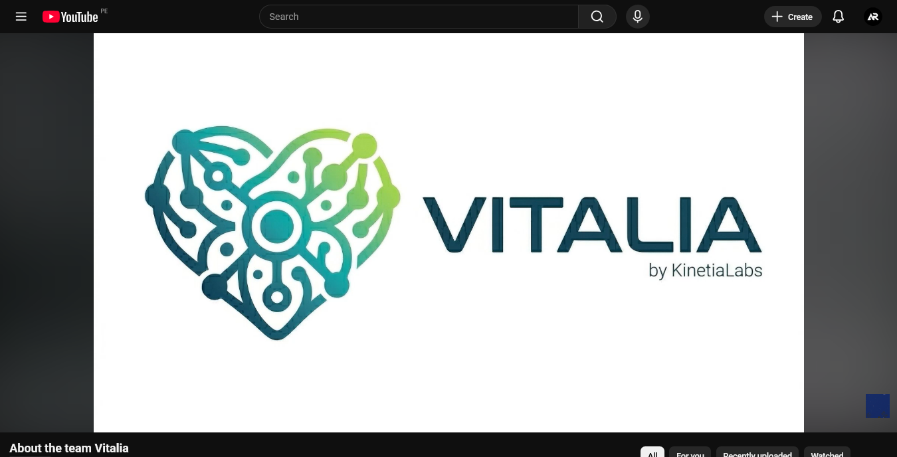

# Bibliografía

Banco Mundial. (2023). *Sistemas de gestión de información de salud en el Perú.* https://documents1.worldbank.org/curated/en/099062123174135607/pdf/P1778220d5911f0bd081d205543f78f357d.pdf

Congreso de la República. (2009, 2 octubre). *Normas Legales.* https://www.leyes.congreso.gob.pe/documentos/leyes/29414.pdf

Culqi. (2025, 7 abril). *Clínicas crecieron más del 9 % hacia 2025: factores y tendencias.* https://blog.culqi.com/crecimiento-clinicas-2025-factores-tendencias/#:~:text=%E2%80%8B%E2%80%8BFactores%20que%20impulsan%20el%20crecimiento%20de%20las,tratamientos%20avanzados.%20%2D%20Avances%20tecnol%C3%B3gicos%20en%20salud

Davix. (2026, 28 febrero). *Normativa de historia clínica electrónica en Perú 2026: lo que tu clínica debe cumplir.* Davix. https://davix.ai/es/blog/normativa-historia-clinica-electronica-peru-2026/#:~:text=Ley%2029733%20%E2%80%94%20Protecci%C3%B3n%20de%20Datos%20Personales,Nacional%20de%20Protecci%C3%B3n%20de%20Datos%20Personales%20(APDP)

Gobierno Nacional del Perú. (2026, 13 enero). *EsSalud logra récord histórico con más de 1.6 millones de atenciones en telemedicina durante el 2025.* (s. f.). Noticias - Seguro Social de Salud - Plataforma del Estado Peruano. https://www.gob.pe/institucion/essalud/noticias/1332178-essalud-logra-record-historico-con-mas-de-1-6-millones-de-atenciones-en-telemedicina-durante-el-2025#:~:text=EsSalud.%20Noticias.%20EsSalud%20logra%20r%C3%A9cord%20hist%C3%B3rico%20con,de%20atenciones%20en%20telemedicina%20durante%20el%202025

Ministerio de Salud del Perú. (2007, 1 de enero). *Norma técnica de salud para la gestión de la historia clínica: NT No 022-MINSA/DGSP-V.02.* (s. f.). https://www.gob.pe/institucion/minsa/informes-publicaciones/353463-norma-tecnica-de-salud-para-la-gestion-de-la-historia-clinica-nt-n-022-minsa-dgsp-v-02

Ministerio de Salud del Perú. (2011). *Plan Nacional de Fortalecimiento del Primer Nivel de Atención 2011-2021.* https://cdn.www.gob.pe/uploads/document/file/392447/1620.pdf 

Organización Panamericana de Salud. (2021, 7 septiembre). *Hoja informativa - Historias clínicas electrónicas y la importancia de cómo documentar.* https://www.paho.org/es/documentos/hoja-informativa-historias-clinicas-electronicas-importancia-como-documentar

Wafa K. Alanazi. (2024). Effect of electronic prescription system modifications on reducing prescribing errors in a military hospital. *Journal Of Pharmaceutical Policy And Practice.* https://doi.org/10.1080/20523211.2024.2431177

# Anexos

**Anexo A. Diagramas**

| Diagrama | Enlace al diagrama |
| --- | --- |
| **BigPicture EventStorming** | [BigPicture EventStorming](https://raw.githubusercontent.com/kinetia-upc/vitalia-docs/refs/heads/main/assets/diagrams/big-picture-event-storming-diagram.svg) |
| **DesignLevel EventStorming** | [DesignLevel EventStorming](https://raw.githubusercontent.com/kinetia-upc/vitalia-docs/refs/heads/main/assets/diagrams/design-level-event-storming-diagram.svg) |
| **Class Diagram** | [Class Diagram](https://raw.githubusercontent.com/kinetia-upc/vitalia-docs/refs/heads/main/assets/diagrams/class-diagram-etapa-3.puml) |
| **Database Diagram** | [Database Diagram](https://raw.githubusercontent.com/kinetia-upc/vitalia-docs/refs/heads/main/assets/diagrams/database-diagram.svg) |

**Anexo B. Enlaces Importantes**

| Título | Enlace |
| --- | --- |
| Organización de GitHub | [https://github.com/orgs/kinetia-upc/repositories](https://github.com/orgs/kinetia-upc/repositories) |
| Repositorio de documentación | [https://github.com/kinetia-upc/vitalia-docs](https://github.com/kinetia-upc/vitalia-docs) |
| Repositorio de la Landing Page | [https://github.com/kinetia-upc/vitalia-landing](https://github.com/kinetia-upc/vitalia-landing) |
| Landing Page Desplegada | [https://kinetia-upc.github.io/vitalia-landing](https://kinetia-upc.github.io/vitalia-landing) |
| Repositorio del Frontend | [https://github.com/kinetia-upc/vitalia-frontend](https://github.com/kinetia-upc/vitalia-frontend) |
| Frontend Desplegado | [https://vitalia-frontend-kinetia.vercel.app](https://vitalia-frontend-kinetia.vercel.app) |
| Repositorio del Backend | [https://github.com/kinetia-upc/vitalia-backend](https://github.com/kinetia-upc/vitalia-backend) |
| Backend Desplegado (Swagger Docs) | [https://vitalia-backend-zf3p.onrender.com/swagger/index.html](https://vitalia-backend-zf3p.onrender.com/swagger/index.html) |
