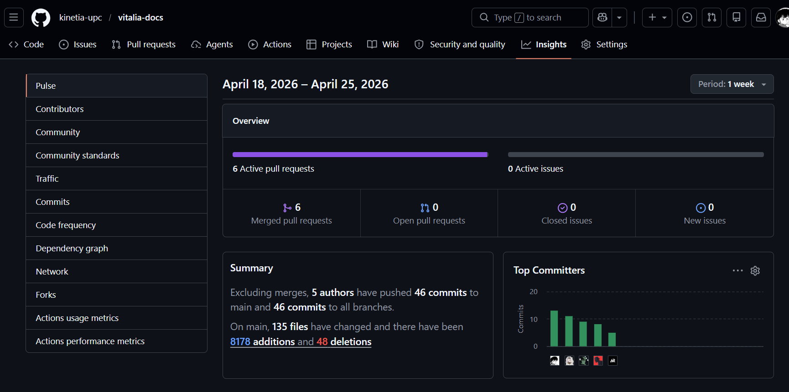
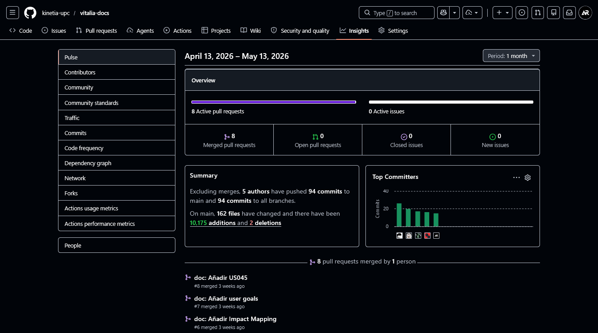
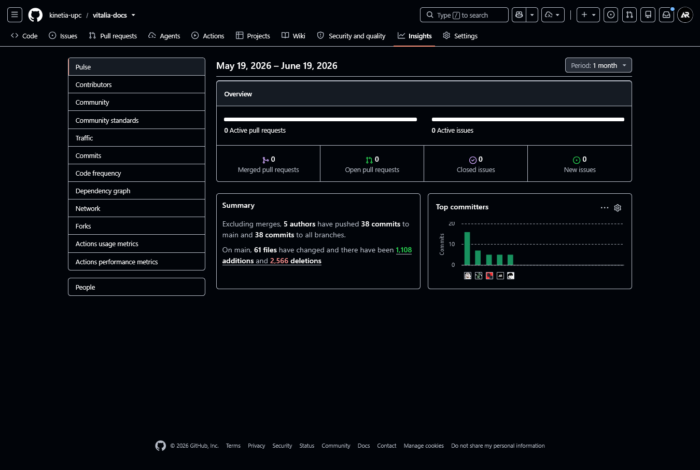
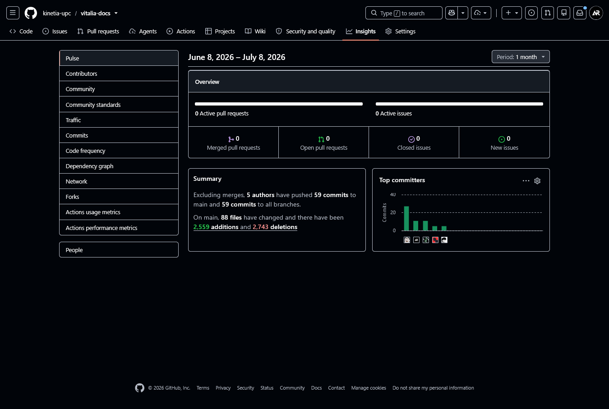

  

Universidad Peruana de Ciencias Aplicadas

Carrera de Ingeniería de Software

**1ASI0730**

**Aplicaciones Web**

NRC

**10203**

**Informe del Trabajo Final**

Docente

**Sánchez Ponce, Alex Humberto**

Equipo

**KinetiaLabs**

Proyecto

**Vitalia**

**Integrantes**

| Código | Apellidos y Nombres |
| --- | --- |
| U20241E177 | Ruiz Mideyros, Adrian |
| U202317099 | Rojas Tello, Nestor Alonso |
| U202410678 | Astocondor Bazan, Alejandra Isabel |
| U202412316 | Diaz Martinez, Alexther Kamil |
| U202410254 | Dulanto Espino, Leo César |

**Período 202610**

**Julio 2026**

---

# Registro de versiones del informe

| Versión | Fecha | Autor | Descripción de modificación |
| --- | --- | --- | --- |
| 0.1.0 | 15/4/26 | @AleeAsto | docs: añadir la descripción del startup y antecedentes y problematica |
| 0.1.1 | 15/4/26 | @AdrixRyz | docs: añadir los puntos previos al capitulo 1 |
| 0.1.2 | 16/4/26 | @Leotens | docs: añadir todos los puntos de Lean UX Process |
| 0.1.3 | 16/4/26 | @Leotens | docs: añadir diseño y registro de entrevistas |
| 0.1.4 | 17/4/26 | @nes-ro | docs: añadir todos los puntos de competidores |
| 0.1.5 | 17/4/26 | @kamil-tron | docs: añadir todos los puntos de needfinding |
| 0.1.6 | 18/4/26 | @nes-ro | docs: añadir segmentos objetivo |
| 0.1.7 | 19/4/26 | @AleeAsto | docs: añadir análisis de entrevistas |
| 0.1.8 | 20/4/26 | @AdrixRyz | docs: añadir ubiquitous language  |
| 0.1.9 | 21/4/26 | @nes-ro | docs: añadir bigpicture eventstorming |
| 0.1.10 | 22/4/26 | @AleeAsto | docs: añadir todos los puntos de software configuration management |
| 0.1.11 | 23/4/26 | @AdrixRyz | docs: añadir todos los puntos de style guidelines |
| 0.1.12 | 23/4/26 | @Leotens | docs: añadir todos los puntos del capitulo 3 |
| 0.1.13 | 24/4/26 | @AleeAsto | docs: añadir landing page ui design |
| 0.1.14 | 25/4/26 | @nes-ro | docs: añadir todos los puntos de domain-driven software architecture |
| 0.1.15 | 25/4/26 | @nes-ro | docs: añadir database design diagram |
| 0.1.16 | 24/4/26 | @kamil-tron | docs: añadir el diagrama de clases |
| 0.1.17 | 25/4/26 | @kamil-tron | docs: añadir todos los puntos de Information Architecture |
| 0.1.18 | 25/4/26 | @AleeAsto | docs: añadir sprint 1 |
| 0.2.0 | 13/5/26 | @AdrixRyz | docs: realizar correciones del av1 |
| 0.2.1 | 13/5/26 | @AdrixRyz | docs: añadir sprint 2 |
| 0.3.0 | 17/6/26 | @kamil-tron | docs: realizar correciones del tb1 |
| 0.3.1 | 17/6/26 | @Leotens | docs: añadir sprint 3 |
| 0.4.0 | 2/7/26 | @kamil-tron | docs: realizar correciones del av2 |
| 0.4.1 | 5/7/26 | @Leotens | docs: añadir sprint 4 |
| 1.0.0 | 8/7/26 | @AdrixRyz | docs: realizar correciones finales |

# Project Report Collaboration Insights

**Repositorio de la documentación del proyecto:** [https://github.com/kinetia-upc/vitalia-docs](https://github.com/kinetia-upc/vitalia-docs)

A continuación, se detallan las actividades realizadas en cada entrega, la participación de los miembros del equipo, y las evidencias correspondientes.

**AV1**

**TB1**

**AV2**

**TB2**

# Tabla de contenidos

**Registro de versiones del informe**

**Project Report Collaboration Insights**

**Tabla de contenidos**

**Student Outcome**

[**Capítulo I: Introducción**](10-chap-1.md)  
1.1. Startup Profile  
1.1.1. Descripción del startup  
1.1.2. Perfiles de integrantes del equipo  
1.2. Solution Profile  
1.2.1. Antecedentes y problemática  
1.2.2. Lean UX Process  
1.2.2.1. Lean UX Problem Statements  
1.2.2.2. Lean UX Assumptions  
1.2.2.3. Lean UX Hypothesis Statements  
1.2.2.4. Lean UX Canvas  
1.3. Segmentos objetivo  

[**Capítulo II: Requirements Elicitation & Analysis**](20-chap-2.md)  
2.1. Competidores  
2.1.1. Análisis competitivo  
2.1.2. Estrategias y tácticas frente a competidores  
2.2. Entrevistas  
2.2.1. Diseño de entrevistas  
2.2.2. Registro de entrevistas  
2.2.3. Análisis de entrevistas  
2.3. Needfinding  
2.3.1. User Personas  
2.3.2. User Task Matrix  
2.3.3. User Journey Mapping  
2.3.4. Empathy Mapping  
2.4. Big Picture EventStorming  
2.5. Ubiquitous Language  

[**Capítulo III: Requirements Specification**](30-chap-3.md)  
3.1. User Stories  
3.2. Impact Mapping  
3.3. Product Backlog  

[**Capítulo IV: Product Design**](40-chap-4.md)  
4.1. Style Guidelines  
4.1.1. General Style Guidelines  
4.1.2. Web Style Guidelines  
4.2. Information Architecture  
4.2.1. Organization Systems  
4.2.2. Labeling Systems  
4.2.3. SEO Tags and Meta Tags  
4.2.4. Searching Systems  
4.2.5. Navigation Systems  
4.3. Landing Page UI Design  
4.3.1. Landing Page Wireframe  
4.3.2. Landing Page Mock-up  
4.4. Web Applications UX/UI Design  
4.4.1. Web Applications Wireframes  
4.4.2. Web Applications Wireflow Diagrams  
4.4.3. Web Applications Mock-ups  
4.4.4. Web Applications User Flow Diagrams  
4.5. Web Applications Prototyping  
4.6. Domain-Driven Software Architecture  
4.6.1. Design-Level EventStorming  
4.6.2. Software Architecture Context Diagram  
4.6.3. Software Architecture Container Diagrams  
4.6.4. Software Architecture Components Diagrams  
4.7. Software Object-Oriented Design  
4.7.1. Class Diagrams  
4.8. Database Design  
4.8.1. Database Diagrams  

[**Capítulo V: Product Implementation, Validation & Deployment**](50-chap-5.md)  
5.1. Software Configuration Management  
5.1.1. Software Development Environment Configuration  
5.1.2. Source Code Management  
5.1.3. Source Code Style Guide & Conventions  
5.1.4. Software Deployment Configuration  
5.2. Landing Page, Services & Applications Implementation  
[**5.2.1. Sprint 1**](51-sprint-1.md)  
5.2.1.1. Sprint Planning 1  
5.2.1.2. Aspect Leaders and Collaborators  
5.2.1.3. Sprint Backlog 1  
5.2.1.4. Development Evidence for Sprint Review  
5.2.1.5. Execution Evidence for Sprint Review  
5.2.1.6. Services Documentation Evidence for Sprint Review  
5.2.1.7. Software Deployment Evidence for Sprint Review  
5.2.1.8. Team Collaboration Insights during Sprint  
[**5.2.2. Sprint 2**](52-sprint-2.md)  
5.2.2.1. Sprint Planning 2  
5.2.2.2. Aspect Leaders and Collaborators  
5.2.2.3. Sprint Backlog 2  
5.2.2.4. Development Evidence for Sprint Review  
5.2.2.5. Execution Evidence for Sprint Review  
5.2.2.6. Services Documentation Evidence for Sprint Review  
5.2.2.7. Software Deployment Evidence for Sprint Review  
5.2.2.8. Team Collaboration Insights during Sprint  
[**5.2.3. Sprint 3**](53-sprint-3.md)  
5.2.3.1. Sprint Planning 3  
5.2.3.2. Aspect Leaders and Collaborators  
5.2.3.3. Sprint Backlog 3  
5.2.3.4. Development Evidence for Sprint Review  
5.2.3.5. Execution Evidence for Sprint Review  
5.2.3.6. Services Documentation Evidence for Sprint Review  
5.2.3.7. Software Deployment Evidence for Sprint Review  
5.2.3.8. Team Collaboration Insights during Sprint  
[**5.2.4. Sprint 4**](54-sprint-4.md)  
5.2.4.1. Sprint Planning 4  
5.2.4.2. Aspect Leaders and Collaborators  
5.2.4.3. Sprint Backlog 4  
5.2.4.4. Development Evidence for Sprint Review  
5.2.4.5. Execution Evidence for Sprint Review  
5.2.4.6. Services Documentation Evidence for Sprint Review  
5.2.4.7. Software Deployment Evidence for Sprint Review  
5.2.4.8. Team Collaboration Insights during Sprint  
[**5.3. Validation Interviews**](60-validation-interviews.md)  
5.3.1. Diseño de Entrevistas  
5.3.2. Registro de Entrevistas  
5.3.3. Evaluaciones según heurísticas  
[**5.4. Video-About-the-Product**](70-product-video.md)  

[**Conclusiones**](80-conclusions.md)  
[**Recomendaciones**](81-recommendations.md)  
[**Video-About-the-Team**](82-team-video.md)  
[**Bibliografía**](90-bibliography.md)  
[**Anexos**](99-annexes.md)  

# Student Outcome

En esta sección se describe cómo cada integrante contribuyó al desarrollo del Student Outcome durante las entregas del proyecto. Las actividades se redactan como evidencias de trabajo colaborativo, coordinación, liderazgo compartido y comunicación efectiva, en lugar de listar únicamente tareas o entregables.

| Criterio específico | Acciones realizadas | Conclusiones |
| --- | --- | --- |
| Trabaja en equipo para proporcionar liderazgo en forma conjunta. | Ruiz Mideyros, Adrian (U20241E177) **AV1:** Participó en reuniones de coordinación para alinear criterios del informe, proponer acuerdos de redacción y apoyar la integración visual y conceptual de los capítulos trabajados por el equipo. **TB1:** Guió sesiones de Sprint Planning equilibrando la participación de sus compañeros, promoviendo decisiones consensuadas y reforzando una dirección compartida para el desarrollo inicial del producto. **AV2:** Guió al grupo durante el avance 2 organizando tareas, definiendo roles y promoviendo acuerdos para que todos participaran en las decisiones principales. **TB2:** Lideró la integración del consumo de APIs externas coordinando con el equipo la estructura de comunicación entre frontend y backend, promoviendo decisiones técnicas compartidas sobre pasarelas de pago y mecanismos de resiliencia ante desconexión.  Rojas Tello, Nestor Alonso (U202317099) **AV1:** Contribuyó a las decisiones grupales mediante discusiones técnicas y de negocio, ayudando a priorizar enfoques, comparar alternativas y sostener una dirección común durante la entrega. **TB1:** Orientó la estructura de trabajo resolviendo dudas conceptuales, escuchando aportes de sus compañeros y alineando expectativas técnicas con el diseño general del proyecto. **AV2:** Aportó liderazgo en la revisión de avances, apoyó la resolución de dudas del equipo y colaboró en la toma de decisiones durante las correcciones. **TB2:** Guió la definición del módulo de farmacia proponiendo flujos de dispensación y reutilización de recetas, facilitando acuerdos técnicos con el equipo sobre validaciones de inventario y restricciones clínicas.  Astocondor Bazan, Alejandra Isabel (U202410678) **AV1:** Favoreció la coordinación constante del equipo al comunicar avances, validar observaciones de sus compañeros y conectar actividades de investigación, diseño y documentación del producto. **TB1:** Facilitó acuerdos visuales integrando propuestas individuales en un estándar común, promoviendo retroalimentación constructiva y ayudando a consolidar una propuesta de diseño compartida. **AV2:** Participó activamente en la toma de decisiones, respondió consultas del grupo y facilitó la comunicación para mantener una dirección compartida del trabajo. **TB2:** Coordinó las entrevistas de validación con los tres segmentos objetivo, orientando al equipo en la preparación de guías y la recopilación de hallazgos para incorporar mejoras al producto de forma consensuada.  Diaz Martinez, Alexther Kamil (U202412316) **AV1:** Impulsó el trabajo conjunto compartiendo observaciones sobre usuarios, estructura del sistema y organización de contenidos, fortaleciendo la colaboración y el consenso en decisiones grupales. **TB1:** Condujo conversaciones para simplificar el flujo del producto, promoviendo debate abierto y acuerdos lógicos sobre la organización de información y navegación principal. **AV2:** Analizó los avances del documento, propuso correcciones y motivó reuniones de coordinación para acordar tareas, tiempos y responsabilidades del equipo. **TB2:** Impulsó el diseño del módulo de autenticación y recuperación de acceso, liderando sesiones de revisión técnica sobre seguridad, sincronización diferida y flujos de login multi-rol con participación activa de todos los integrantes.  Dulanto Espino, Leo César (U202410254) **AV1:** Promovió el diálogo entre integrantes mediante sesiones de revisión, recolección de retroalimentación y organización de aportes para convertirlos en criterios comunes de trabajo. **TB1:** Impulsó la corresponsabilidad en la definición del Backlog, moderando debates sobre complejidad y asegurando que todos compartieran compromiso y visión de éxito. **AV2:** Sostuvo una participación constante en la producción y revisión del avance, apoyando al equipo con iniciativa, resiliencia y disposición para resolver bloqueos. **TB2:** Dirigió el Sprint Planning 4 y la definición del IAM API, promoviendo una distribución equitativa de responsabilidades entre seguridad, integraciones y continuidad clínica, asegurando que cada decisión contara con el respaldo del equipo. | **AV1:** El equipo ejerció un liderazgo distribuido basado en coordinación, diálogo y construcción de acuerdos. Las actividades evidencian colaboración real, más que una división aislada de funciones.  **TB1:** Durante este ciclo se consolidó un liderazgo rotativo y empático. Los integrantes asumieron iniciativa en momentos clave, respetando los aportes del grupo y fortaleciendo la cohesión del equipo.  **AV2:** El equipo reforzó el liderazgo conjunto al organizar responsabilidades, revisar avances y tomar decisiones de manera compartida, manteniendo una comunicación constante durante el desarrollo del avance.  **TB2:** El liderazgo compartido alcanzó su mayor madurez durante el TB2. Cada integrante asumió la conducción de un aspecto crítico del producto (autenticación, farmacia, integraciones, validación, seguridad), generando decisiones técnicas respaldadas por todo el equipo y demostrando autonomía con responsabilidad colectiva. |
| Crea un entorno colaborativo e inclusivo, establece metas, planifica tareas y cumple objetivos. | Ruiz Mideyros, Adrian (U20241E177) **AV1:** Participó en la definición de acuerdos y avances parciales, ayudando a sostener una dinámica ordenada, respetuosa y orientada al cumplimiento de metas comunes. **TB1:** Fomentó un ambiente inclusivo al considerar la disponibilidad de sus compañeros, proponer metas individuales realistas y colaborar en bases comunes para evitar sobrecargas. **AV2:** Ayudó a ordenar las actividades del avance, propuso una distribución clara de tareas y dio seguimiento para que el equipo cumpliera los plazos acordados. **TB2:** Planificó y completó la integración con pasarelas de pago y el sistema de caché offline, compartiendo avances tempranos para que el equipo pudiera validar flujos dependientes y cumplir los objetivos del sprint sin retrasos.  Rojas Tello, Nestor Alonso (U202317099) **AV1:** Apoyó la planificación del grupo priorizando actividades, proponiendo una secuencia de trabajo clara y conectando las decisiones técnicas con los objetivos del proyecto. **TB1:** Promovió comunicación transparente en la gestión del avance, ayudó a despejar obstáculos del equipo y cuidó la puntualidad para no afectar metas comunes. **AV2:** Colaboró en la planificación de tareas, compartió avances oportunamente y apoyó la resolución de problemas para no retrasar el trabajo de sus compañeros. **TB2:** Estableció metas claras para el módulo de farmacia y recetas, comunicó avances de dispensación e inventario de manera oportuna y apoyó la validación del producto entrevistando a pacientes para recoger retroalimentación directa.  Astocondor Bazan, Alejandra Isabel (U202410678) **AV1:** Contribuyó a un ambiente colaborativo compartiendo avances, recibiendo observaciones y ajustando sus aportes según la retroalimentación entregada por el equipo. **TB1:** Generó retroalimentación positiva al compartir avances tempranos, dar visibilidad al estado del proyecto y responder a necesidades de soporte visual de sus compañeros. **AV2:** Mantuvo comunicación constante sobre sus avances, atendió observaciones del equipo y ajustó su trabajo para cumplir las metas acordadas del avance. **TB2:** Organizó las entrevistas de validación con administradores, doctores y pacientes, planificó la integración con RENIEC y órdenes de exámenes, y consolidó los hallazgos heurísticos para que el equipo priorizara correcciones de manera informada.  Diaz Martinez, Alexther Kamil (U202412316) **AV1:** Aportó a la organización colectiva revisando avances, integrando comentarios y verificando que la información compartida ayudara al cumplimiento de objetivos comunes. **TB1:** Fortaleció la confianza grupal al establecer canales claros para visualizar logros, validar entregables y motivar el cumplimiento oportuno de las metas. **AV2:** Promovió reuniones de coordinación, compartió criterios para corregir el documento y ayudó a mantener el ritmo de trabajo frente a los pendientes. **TB2:** Definió las tareas de autenticación, recuperación de contraseña y sincronización diferida, coordinó las correcciones del AV2 y mantuvo reuniones de seguimiento para asegurar que todos los flujos de login y seguridad estuvieran listos dentro del plazo.  Dulanto Espino, Leo César (U202410254) **AV1:** Impulsó la coordinación mediante revisiones periódicas, intercambio de ideas y ajuste de prioridades, fortaleciendo la capacidad grupal para cumplir lo planificado. **TB1:** Contribuyó al balance de carga apoyando la estimación del esfuerzo, mostrando flexibilidad y manteniendo constancia para alcanzar los objetivos pactados. **AV2:** Apoyó la organización de tareas, comunicó avances con regularidad y colaboró en la revisión de pendientes para cumplir los objetivos del equipo. **TB2:** Planificó el Sprint 4 definiendo velocidad y asignaciones, implementó la autenticación por rol y los mecanismos de cifrado y sesiones seguras, y comunicó el estado de cada tarea para que el equipo mantuviera visibilidad completa del progreso. | **AV1:** La evidencia muestra un entorno colaborativo, con metas compartidas, seguimiento de avances y retroalimentación constante. El cumplimiento de objetivos surgió de la coordinación entre integrantes.  **TB1:** El éxito de esta etapa se apoyó en corresponsabilidad e inclusión. La comunicación horizontal permitió ajustar ritmos de trabajo y sostener un entorno confiable de ayuda mutua.  **AV2:** El equipo logró sostener un entorno colaborativo mediante planificación, seguimiento y retroalimentación. La distribución de tareas y la comunicación constante permitieron cumplir los objetivos del avance.  **TB2:** El TB2 representó la entrega más completa del proyecto. El equipo planificó, ejecutó y validó funcionalidades críticas (IAM, farmacia, integraciones externas, seguridad y resiliencia offline) manteniendo un entorno inclusivo donde cada integrante cumplió sus objetivos individuales y contribuyó al logro colectivo mediante comunicación constante, entrevistas de validación y evaluaciones heurísticas. |
