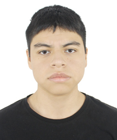
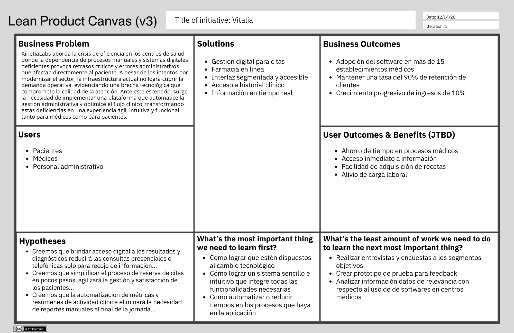

# Capítulo I: Introducción

## 1.1. Startup Profile

### 1.1.1. Descripción del startup

**Nombre de la startup**

KinetiaLabs

**Descripción**

KinetiaLabs es un estudio de innovación tecnológica y desarrollo de software avanzado dedicado a transformar industrias tradicionales a través de la automatización inteligente, la optimización de procesos y el diseño de sistemas dinámicos. Nos especializamos en convertir la complejidad operativa en flujos de trabajo eficientes y escalables, actuando como un catalizador técnico para empresas en fase de crecimiento o transformación digital. No solo construimos software, creamos motores de movimiento empresarial.

**Visión**

Convertirnos en el referente global de ingeniería de software que define la intersección entre la eficiencia operativa y la innovación disruptiva, impulsando un futuro donde la tecnología y el movimiento empresarial converjan en perfecta armonía.

**Misión**

Impulsar la evolución de nuestros clientes diseñando e implementando soluciones tecnológicas robustas, ágiles y personalizadas que eliminen la fricción operativa y aceleren su velocidad de mercado, guiados siempre por la excelencia técnica y un enfoque centrado en los resultados.

**Propuesta de Valor**

"Ingeniería que Impulsa tu Crecimiento"

KinetiaLabs ofrece más que desarrollo de software, proporcionamos una asociación estratégica para el movimiento. Combinamos la precisión técnica de un laboratorio de ingeniería con el dinamismo de una mentalidad agile para entregar sistemas que no solo resuelven los problemas de hoy, sino que construyen la infraestructura para el crecimiento operativo de mañana. Nuestra propuesta se basa en la fiabilidad, la escalabilidad y la aceleración del valor empresarial a través de la tecnología.

**Características principales**

- *Arquitectura de Software Dinámica y Escalable:* Diseñamos sistemas modulares y basados en microservicios que crecen y se adaptan al ritmo de la empresa, evitando la deuda técnica y garantizando la longevidad de la inversión tecnológica.

- *Enfoque en Optimización de Flujos y Movimiento:* Especialización en automatización de procesos empresariales (BPA) e integración de sistemas, diseñando interfaces y backends que minimizan los clics y maximizan la velocidad de ejecución.

- *Desarrollo Técnico de Alta Precisión:* Implementación de rigurosos estándares de calidad, pruebas automatizadas y prácticas de DevOps de vanguardia para asegurar entregas robustas, seguras y libres de errores desde el primer día.

- *Innovación Centrada en el Cliente:* Metodología de co-creación donde la investigación de usuario y el análisis de negocio guían cada línea de código, asegurando que la solución técnica final impulse métricas empresariales reales.

- *Tecnologías Emergentes con Propósito:* Especialización en la integración pragmática de IA/ML, IoT y Big Data para generar ventajas competitivas tangibles, lejos de las modas tecnológicas y enfocados en la utilidad operativa.

### 1.1.2. Perfiles de integrantes del equipo

| Foto | Nombre | Descripción |
| --- | --- | --- |
|  | Ruiz Mideyros, Adrian (U20241E177) | Estudiante de Ingeniería de Software, apasionado por la tecnología desde pequeño. Desarrollador de aplicaciones y videojuegos, con conocimientos en C++, Python, Web Stock y otras tecnologías. Me considero una persona proactiva, con gran disposición para aprender constantemente y apoyar en lo que se necesite. |
|  | Rojas Tello, Nestor Alonso (U202317099) | Estudiante de Ingeniería de Software. Tengo conocimientos en C++, Python, JavaScript y CSS. Me considero una persona colaborativa, responsable y con disposición para resolver dudas y proponer soluciones ante cualquier desafío. |
|  | Astocondor Bazan, Alejandra Isabel (U202410678) | Estudiante de Ingeniería de Software, enfocada en el desarrollo de soluciones tecnológicas. Poseo habilidades en programación y diseño digital.  Me caracterizo por mi creatividad, responsabilidad y capacidad de adaptación.  |
|  | Diaz Martinez, Alexther Kamil  (U202412316) | Estudiante de ingeniería de software, me gusta programar, tengo conocimiento en C++ y Python, me gustan los desafíos. Mi meta es aplicar mi optimismo y capacidad técnica para desarrollar software que genere un impacto real. |
|  | Dulanto Espino, Leo César (U202410254) | Estudiante de Ingeniería de Software, con conocimientos en C++, Python, y básico de web y Java. Me gusta crear soluciones creativas a los problemas, además de participar y apoyar al equipo en cualquier progreso o dificultad. |

## 1.2. Solution Profile

### 1.2.1. Antecedentes y problemática

La gestión sanitaria en el Perú enfrenta brechas estructurales en su arquitectura digital. La dependencia histórica de procesos manuales y sistemas aislados sitúa a los centros de salud en un estado de vulnerabilidad operativa frente a la demanda creciente de servicios.

La fragmentación de la información y la nula interoperabilidad entre plataformas. La ausencia de una infraestructura tecnológica centralizada obliga a la coexistencia de sistemas obsoletos. Esta carencia tecnológica mantiene los flujos de trabajo vinculados a procesos manuales que carecen de procesos estandarizados.

Esta deficiencia impacta directamente la operatividad en áreas críticas como admisión, consultorios y farmacia. El personal médico y administrativo enfrenta duplicidad de registros, inconsistencia en las historias clínicas, pérdida y deterioro de información, lo que eleva el riesgo de errores asistenciales. La falta de datos en tiempo real genera cuellos de botella que transforman la atención en una tarea propensa a retrasos administrativos.

Finalmente, la discontinuidad informativa se traduce en demoras y una menor calidad de atención para el paciente. A nivel gerencial, la precariedad de los datos limita la toma de decisiones estratégicas, especialmente en momentos de alta demanda. En consecuencia, el sistema no solo pierde eficiencia operativa, sino que compromete la seguridad de la salud pública.

***Técnica 5W2H***

*1. ¿Quiénes están involucrados o afectados? (Who?)*

Los principales actores involucrados son los establecimientos de salud del primer nivel (como organizaciones), así como sus usuarios internos: médicos, personal administrativo y de apoyo. Estos últimos se ven afectados por la falta de acceso oportuno a información integrada, lo que dificulta la atención y la gestión operativa. Asimismo, los pacientes se ven indirectamente afectados a través de demoras, duplicidad de registros y menor calidad en la atención.

*2. ¿Qué ocurre o qué problema se presenta? (What?)*

En el Perú, el problema en la gestión de los establecimientos de salud del primer nivel se manifiesta en la fragmentación y baja calidad de la información sanitaria, originada por el uso de sistemas de información no interoperables y la persistencia de procesos manuales, lo que afecta la eficiencia de la atención y limita la toma de decisiones oportunas. Asimismo, esta situación se refleja en el limitado desarrollo de los sistemas de gestión de información en salud, evidenciando debilidades estructurales del sistema sanitario (Banco Mundial, 2023, p. 6).

*3. ¿Cuándo se presenta el problema? (When?)*
El problema se presenta de manera continua a lo largo de todo el proceso de atención del paciente, desde el agendamiento de citas hasta la consulta médica, la prescripción de tratamientos, la dispensación de medicamentos y el proceso de facturación. Es especialmente crítico en momentos de alta demanda, donde la falta de integración y automatización incrementa los tiempos de espera y la probabilidad de errores.

*4. ¿Dónde sucede? (Where?)*
Esta problemática se manifiesta en diversas áreas del centro de salud, incluyendo admisión (registro y programación de citas), consultorios médicos (registro y diagnóstico), farmacia (dispensación de medicamentos) y caja (procesos de pago y facturación). La falta de integración entre estas áreas genera discontinuidad en el flujo de información.

*5. ¿Por qué ocurre? (Why?)*
El Ministerio de Salud del Perú (MINSA) evidencia importantes deficiencias en la gestión de la información en los establecimientos de salud, señalando la carencia de sistemas de información estandarizados y tableros de control que permitan evaluar la implementación de políticas como la atención integral de salud a nivel regional (Ministerio de Salud del Perú, 2011).

*6. ¿Cómo se manifiesta el problema? (How?)*
El problema se manifiesta en la práctica mediante la duplicidad de registros de pacientes, pérdida o inconsistencias en la información clínica, retrasos en la atención debido a procesos manuales, dificultades para acceder al historial médico completo y limitaciones en la coordinación entre áreas del establecimiento de salud.

*7. ¿Cuánto cuesta o cuál es la magnitud? (How much?)*

*Figura 1 (Macroproceso: sistema de información)*  

> **Nota.** Adaptado del Ministerio de Salud de Perú (2011).

El MINSA identifico brechas significativas en capacidades tecnológicas y de gestión, dado que el 71% de los establecimientos de salud no ha identificado sus necesidades en recursos informáticos ni en personal especializado, y el 72% no cuenta con métodos formales y permanentes para la evaluación, recolección, procesamiento y análisis de información (Ministerio de Salud del Perú, 2011).

### 1.2.2. Lean UX Process

#### *1.2.2.1. Lean UX Problem Statements*

KinetiaLabs presenta una plataforma web diseñada para optimizar la interacción entre médicos y pacientes, facilitando el acceso a información y servicios de salud. Mediante una interfaz intuitiva, atractiva y funcional, la solución garantiza una experiencia de usuario eficiente; nuestro objetivo central es agilizar los procesos clínicos y mitigar las ineficiencias de los modelos de atención tradicionales.

A la hora de acudir a un establecimiento médico, la agilidad en la gestión de los procesos es un factor importante para la resolución efectiva de las necesidades del paciente. No obstante, se han identificado deficiencias operativas significativas, tales como la dependencia de procesos manuales y el uso ineficiente de sistemas digitales, factores que derivan en retrasos y errores administrativos. Si bien existen intentos en mejorar sus sistemas, estos resultan insuficientes para cubrir la demanda del flujo operativo actual. Lo cual representa una oportunidad para implementar una solución que optimice y automatice de mejor manera la gestión médica.

¿Cómo podríamos asegurar la automatización y agilización de los procesos administrativos dentro de los establecimientos médicos?

#### *1.2.2.2. Lean UX Assumptions*

**Assumptions Worksheet**

1. ¿Quién es el usuario?

Tenemos 3 usuarios principales:
Pacientes: Personas de todas las edades que necesiten atención médica por algún inconveniente.
Médicos: Personal que atiende de forma directa a los pacientes, los cuales les brindan su diagnóstico según la situación.
Personal administrativo: Encargados de los procesos médicos, además de generar resúmenes y métricas de la actividad clínica.

2. ¿Dónde encaja nuestro producto en su trabajo o vida?

La aplicación encaja a la hora de realizar algún proceso médico, ya sea para cualquiera de los usuarios. Permite a los pacientes gestionar su historial clínico de forma sencilla, a los médicos organizar sus horarios de citas con mayor claridad y al personal administrativo contar con procesos automatizados que reducen la carga de trabajo manual.

3. ¿Qué problemas tiene nuestro producto que resolver?

El problema principal a resolver es la agilización de los procesos médicos, para lo cual se tiene que digitalizar y automatizar algunos procesos manuales o poco óptimos. Esto de la siguiente manera:
Pacientes: Brindarles acceso directo a historia médica, reservas de cita simple y posibilidad de compra de farmacia en linea.
Médicos: Permitirles una mejor gestión de su disponibilidad de citas, como también de sus recetas o diagnósticos brindados a sus pacientes.
Personal administrativo: Automatizar los procesos necesarios para sus trámites o generación de resúmenes y métricas.

4. ¿Cuándo y cómo es usado nuestro producto?

Es usado en general a la hora de querer realizar cualquier proceso médico, pero varía dependiendo del usuario.
Pacientes: A la hora que quieran agendar una cita o revisar algún diagnóstico o receta en su historial.
Médicos: En el manejo de sus horarios, envío de diagnósticos o recetas tras una cita, permitir un acceso rápido al historial de sus pacientes.
Personal administrativo: Al agilizar sus procesos para la elaboración de sus resúmenes o métricas.

5. ¿Qué características son importantes?

Manejo correcto de citas tanto para pacientes (reserva), como médicos (administrar disponibilidad).
Integración de farmacia en línea para agilizar obtención de recetas brindadas
Interfaz segmentada y accesible, para uso de cualquier tipo de paciente
Acceso inmediato al historial clínico de los pacientes tanto para ellos, como para los médicos.
Sincronización en tiempo real de la información entre el personal administrativo, médicos y pacientes.

6. ¿Cómo debería verse nuestro producto y cómo comportarse?
	
Debe presentar una interfaz organizada, minimalista y jerarquizada, eliminando cualquier distracción visual para que la lectura de datos críticos y el acceso a las funciones principales sean inmediatos para los tres tipos de usuario.
En términos de funcionamiento, se espera que la plataforma sea robusta, ágil y altamente eficiente, con una navegación fluida que priorice la rapidez en la gestión de citas y diagnósticos. Debe comportarse de forma que automatice tareas repetitivas y ofrezca respuestas en tiempo real, transmitiendo total seguridad y confianza a través de una buena gestión de datos entre los procesos administrativos y la atención al paciente.

**Assumptions**

- Creo que mis clientes necesitan una plataforma de gestión médica que agilice la atención, como otros procesos médicos, y facilite el acceso a información, como el historial clínico de los pacientes.
- Estas necesidades se pueden resolver con procesos automatizados, accesos directos a información, recetas en línea y un panel de métricas.
- Mis clientes iniciales son pacientes que buscan atención médica, medios que requieren una mejor gestión y personal administrativo para aliviar su carga laboral.
- El valor #1 que un cliente quiere de mi servicio es la agilización real de los procesos médicos, eliminando esperas o errores innecesarios.
- El cliente también puede obtener estos beneficios adicionales: mejor organización de la disponibilidad médica, compra simplificada y directa en la farmacia digital, resúmenes y reportes de la actividad clínica.
- Voy a adquirir la mayoría de mis clientes a través de alianzas con centros médicos, policlínicos, clínicas privadas o consultorios independientes.
- Haré dinero a través de la venta del software a los centros médicos, policlínicos o clínicas.
- Mi competencia principal en el mercado será plataformas de gestión de citas existentes o sistemas internos de las clínicas.
- Los venceremos debido a nuestra propuesta que automatiza el flujo completo, una interfaz optimizada y una mejor gestión de métricas administrativas.
- Mi mayor riesgo de producto es la resistencia al cambio por parte del personal médico o administrativo
- Resolveremos esto a través de una interfaz intuitiva, capacitaciones y la demostración tangible de la reducción de tiempo en sus tareas.

#### *1.2.2.3. Lean UX Hypothesis Statements*

**Hypothesis Statement 1**

Creemos que brindar acceso digital a los resultados y diagnósticos reducirá las consultas presenciales o telefónicas solo para recojo de información. Sabremos que lo hemos logrado cuando el número de solicitudes presenciales de copias de historias clínicas disminuya en un 40% durante los primeros tres meses tras su implementación.

**Hypothesis Statement 2**

Creemos que simplificar el proceso de reserva de citas en pocos pasos, agilizará la gestión y satisfacción de los pacientes. Sabremos que lo hemos logrado cuando se registre un 50% más de reservas en digitales en comparación a las tradicionales.

**Hypothesis Statement 3**

Creemos que la automatización de métricas y resúmenes de actividad clínica eliminará la necesidad de reportes manuales al final de la jornada. Sabremos que lo hemos logrado cuando el personal administrativo reduzca en un 30% las horas semanales dedicadas exclusivamente a la elaboración de informes de gestión y auditoría.

#### *1.2.2.4. Lean UX Canvas*

Public Canva Link: https://canva.link/ux7vanu08xalhmj

*Figura 2 (Lean Product Canvas)*  

## 1.3. Segmentos objetivo

Esta sección presenta la descripción de los segmentos objetivo relacionados con el dominio del sistema Vitalia, incluyendo sus características principales, necesidades y comportamiento dentro del entorno de atención médica digital. Asimismo, se consideran aspectos relevantes que justifican su inclusión como parte del mercado objetivo de la solución.

**Primer Segmento Objetivo (Administradores de establecimientos de PNAS)**

Este segmento corresponde a los directores, gerentes o dueños de establecimientos del Primer Nivel de Atención de Salud (PNAS), quienes tienen la responsabilidad de la sostenibilidad financiera y operativa del centro. Son los principales tomadores de decisión para la adquisición de Vitalia.

*Características demográficas*

| Pregunta | Respuesta |
| --- | --- |
| ¿Cúal es el rango de edad? | 20 a 65 años. |
| ¿A qué red pertenece? | Pueden formar parte de la red pública del Estado (como MINSA o EsSalud en Perú). O ejercer de manera privada. |
| ¿Qué tipo de función tiene? | Gestionan centros de atención médica que sirven como la puerta de entrada al sistema de salud, priorizando la medicina preventiva, diagnósticos y tratamientos. |
| ¿Cuál es su presupuesto? | El presupuesto donde gestionan varía según su naturaleza: - En el sector público, depende de asignaciones estatales y suele estar limitado por recursos y demanda. - En el sector privado, depende del volumen de pacientes y servicios ofrecidos, aunque generalmente es menor en comparación con clínicas de mayor complejidad. |
| ¿Cómo es la infraestructura de los establecimientos? | La infraestructura es variable: - Policlínicos: infraestructura intermedia con varios consultorios. - Clínicas: infraestructura más completa y equipada. - Consultorios independientes: infraestructura básica y limitada.  Tomando en cuenta que en establecimientos públicos, puede ser limitada o con restricciones operativas y en privados, puede ser más moderna y de alto flujo. |
| ¿Cuánta es la cantidad de personal? | De acuerdo al establecimiento: - Policlínicos: varios médicos y personal administrativo.  Clínicas: mayor cantidad de personal y especialización.  Consultorios independientes: personal mínimo, a veces solo el médico. |
| ¿Cuánto es el stock de medicamentos? | El manejo de stock de medicamentos e insumos puede ser variable: - En el sector público, condicionado por abastecimiento estatal. - En el privado, dependiente de gestión interna, muchas veces sin sistemas automatizados. |

*Hábitos y Motivación*

- Manejan un alto flujo diario de pacientes, lo que los obliga a priorizar la rapidez en la atención sobre la organización administrativa.
- Su proceso de citas suele ser reactivo (llamadas, atención presencial). Buscan optimizar la gestión de citas, pacientes y recursos para mejorar la eficiencia operativa.
- Buscan maximizar la rotación de pacientes por consultorio, ya que su sostenibilidad depende del volumen de atenciones realizadas.
- Existe interés en soluciones digitales que se adapten a su nivel de complejidad y capacidad económica; dependiendo de que la solución sea fácil de implementar, no interrumpa la atención y genere beneficios operativos claros.

*Información del Sustento*

El nivel de digitalización en los policlínicos públicos se encuentra regulado por la Ley N° 30024, que promueve el uso de Historias Clínicas Electrónicas (HCE). Sin embargo, en la práctica, muchos establecimientos operan con sistemas antiguos y no interoperables, lo que limita el intercambio eficiente de información entre áreas y profesionales de salud. En el sector privado, el nivel de digitalización es variable, dependiendo del tamaño, capacidad económica y grado de modernización de cada establecimiento. Mientras algunas clínicas han avanzado en la implementación de sistemas digitales, otros centros aún dependen de herramientas básicas o procesos manuales.

Adicionalmente, la Ley de Protección de Datos Personales exige que el manejo de información sensible, como los datos de salud, cumpla con estrictos protocolos de seguridad, incluyendo mecanismos de cifrado y control de acceso, lo que representa un desafío adicional para muchos establecimientos que no cuentan con infraestructura tecnológica adecuada.

En términos de eficiencia y adopción tecnológica, el Estado reportó que durante el año 2025 se superaron los 1.6 millones de atenciones digitales, evidenciando una creciente familiaridad de los pacientes con servicios digitales. Asimismo, según un informe de la consultora Total Market Solutions (TMS), las clínicas y centros médicos privados registraron un crecimiento del 9% hacia 2025, impulsado principalmente por la incorporación de tecnologías que permiten reducir los tiempos de espera y mejorar la satisfacción del paciente hasta en un 40%.

En este contexto, se evidencia una clara brecha entre la necesidad de digitalización y la capacidad real de implementación en los establecimientos de salud. Vitalia surge como una solución que responde a esta problemática.

**Segundo Segmento Objetivo (Doctores de establecimientos de PNAS)**

Este segmento corresponde a los médicos que laboran en establecimientos del Primer Nivel de Atención de Salud (PNAS), incluyendo policlínicos, clínicas y consultorios independientes. Son los principales usuarios del sistema en la operación diaria, encargados de la atención directa al paciente, el registro de información clínica y el seguimiento de tratamientos.

*Características demográficas*

| Pregunta | Respuesta |
| --- | --- |
| ¿Qué rango de edad tienen? | Se identifican dos subgrupos principales: - Nativos Digitales (25 a 40 años): Médicos jóvenes y residentes que exigen herramientas tecnológicas modernas y rechazan el uso de papel. - Inmigrantes Digitales (41 a 65 años): Médicos con amplia experiencia que, aunque habituados al sistema tradicional, buscan soluciones simples que no compliquen su flujo de trabajo actual. |
| ¿Cuál es su carga laboral? | Atienden un alto volumen de pacientes por jornada, lo que genera una presión constante por reducir el tiempo administrativo. |
| ¿Qué responsabilidad legal enfrentan? | Obligación de registro preciso bajo estándares de SUSALUD y la emisión de recetas claras para evitar errores de medicación. |

*Hábitos y Motivación*

- Priorizan la rapidez en la atención debido a la alta demanda de pacientes.
- Buscan acceder de forma inmediata al historial clínico del paciente para mejorar la precisión del diagnóstico.
- Tienden a evitar sistemas complejos que interfieran con el flujo de la consulta médica.
- Valoran herramientas que reduzcan el tiempo de registro de información clínica.
- Buscan mejorar la continuidad de atención del paciente mediante un mejor seguimiento médico.
- Muestran mayor disposición a usar tecnología cuando esta simplifica su trabajo y no aumenta su carga operativa.

*Información del Sustento*

El principal obstáculo del médico moderno es la denominada carga administrativa, la cual impacta directamente en la calidad y eficiencia de la atención médica. Diversos estudios, 
globales como regionales, evidencian que los médicos pueden llegar a dedicar una cantidad de tiempo similar a tareas administrativas (como el llenado de formularios y registros) en comparación con la atención directa a pacientes.

En este sentido, la Organización Panamericana de la Salud señala que la implementación de Historias Clínicas Electrónicas (HCE) adecuadamente diseñadas puede reducir hasta en un 20% el tiempo destinado a estas tareas, permitiendo una atención más eficiente, precisa y centrada en el paciente.

Desde el punto de vista legal, en el Perú, el médico es el responsable directo de la información registrada en la historia clínica. El uso de sistemas no integrados o procesos manuales incrementa el riesgo de errores, inconsistencias y problemas durante auditorías. En este marco, la Norma Técnica de Salud N° 022-MINSA/DGSP establece los estándares para la adecuada gestión de la historia clínica, reforzando la importancia de contar con sistemas confiables y estructurados.

En este contexto, la adopción de herramientas digitales que optimicen el registro clínico, reduzcan la carga administrativa y faciliten el acceso a la información se vuelve fundamental para mejorar la eficiencia del trabajo médico, en el cual Vitalia responde a esta problemática al ofrecer una plataforma intuitiva, rápida e integrada, diseñada para adaptarse al flujo de trabajo del médico.

**Tercer Segmento Objetivo (Pacientes de todas las edades)**

Este segmento representa al beneficiario final de los servicios de salud brindados en los establecimientos de PNAS. Su experiencia con el sistema Vitalia es indirecta pero crítica, ya que la modernización del centro impacta directamente en la calidad, rapidez y seguridad de su atención médica.

*Características demográficas*

| Pregunta | Respuesta |
| --- | --- |
| ¿Qué rango de edad tienen? | El mercado es universal, pero se segmenta por su relación con la tecnología: - Nativos Digitales (18 a 44 años): Usuarios que buscan inmediatez, comunicación digital y prefieren establecimientos que les permitan gestionar su salud desde el celular. - Adultos y Cuidadores (45 a 64 años): Usuarios que valoran el orden y la claridad, actuando muchas veces como responsables de la salud de sus hijos o padres ancianos. - Adultos Mayores (65+ años): Beneficiarios que requieren procesos simplificados, recetas legibles y un historial centralizado para el manejo de enfermedades crónicas. |
| ¿Qué nivel de acceso tecnológico poseen? | Uso masivo de dispositivos móviles inteligentes y familiaridad con aplicaciones de servicios básicos (banca, mensajería y trámites gubernamentales). |
| ¿Cuál es su frecuencia de atención? | Varía desde pacientes con dolencias agudas (atenciones esporádicas) hasta pacientes crónicos que requieren un control mensual de recetas y citas de seguimiento. |

*Hábitos y Motivación*

- Buscan rapidez en la atención médica y reducción de tiempos de espera.
- Prefieren procesos simples para agendar citas y acceder a servicios.
- Muestran una creciente adaptación al uso de herramientas digitales en salud.
- Buscan mayor transparencia y control sobre su información médica.

*Información del Sustento*

Uno de los principales problemas que enfrentan los pacientes al recibir una prescripción médica es la dificultad para comprenderla o conservarla adecuadamente. La ilegibilidad de las recetas físicas y la pérdida de documentos pueden generar errores en la medicación y afectar la continuidad del tratamiento. En este sentido, un estudio publicado en Taylor & Francis, señala que la implementación de sistemas de prescripción electrónica puede reducir los errores de medicación hasta en un 49.8%, mitigando riesgos asociados a la mala interpretación y comunicación de las indicaciones médicas.

Asimismo, en el Perú, la Ley N° 29414 (Art. 15) establece que todo paciente tiene derecho a recibir información “precisa y oportuna” sobre su estado de salud. Complementariamente, el Reglamento aprobado mediante el D.S. N° 027-2015-SA obliga a las IPRESS a garantizar que la historia clínica sea veraz, completa y accesible. En este contexto, la digitalización de la información médica permite cumplir con estos lineamientos, asegurando que los datos sean legibles, organizados y disponibles para el paciente.

Desde una perspectiva económica, el uso de Historias Clínicas Electrónicas (HCE) contribuye a reducir gastos innecesarios, ya que evita la repetición de exámenes médicos al permitir que el profesional de salud acceda de manera inmediata a los resultados previos del paciente. Esto no solo mejora la seguridad clínica, sino también optimiza el gasto del paciente en su atención médica.