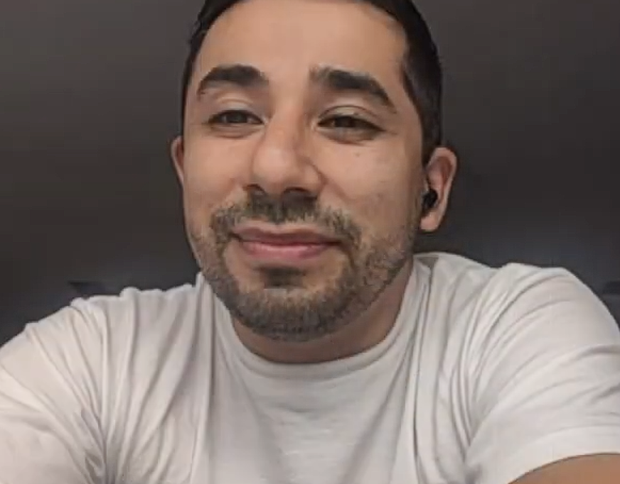
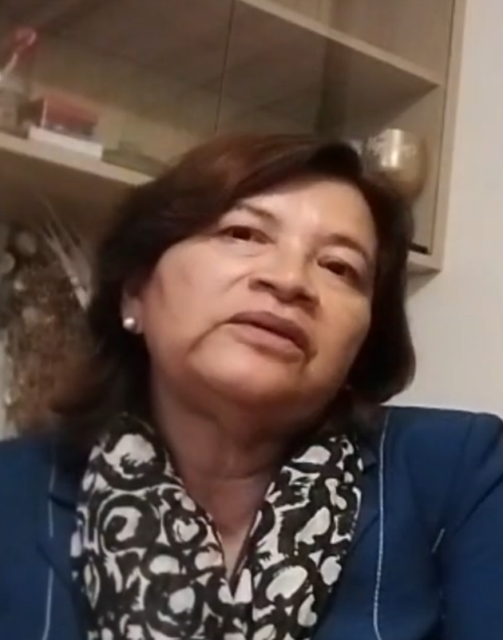
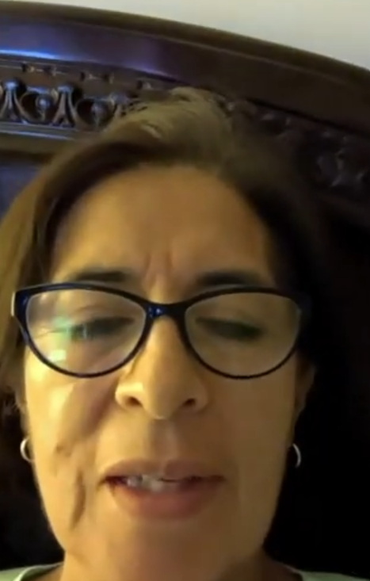

# Capítulo II: Requirements Elicitation & Analysis

## 2.1. Competidores

### 2.1.1. Análisis competitivo

### 2.1.2. Estrategias y tácticas frente a competidores

## 2.2. Entrevistas

### 2.2.1. Diseño de entrevistas

**Primer Segmento Objetivo (Administradores de establecimientos de PNAS)**

1. ¿Cuál es su rol dentro del establecimiento de salud y qué responsabilidades tiene en la gestión?
2. ¿Qué sistemas o herramientas utilizan actualmente para gestionar citas, historias clínicas y facturación?
3. ¿Qué dificultades enfrentan en la gestión de información y coordinación entre áreas?
4. ¿Qué tan integrados están los sistemas que utilizan actualmente?
5. ¿Qué aspectos considera más importantes al implementar un nuevo sistema? (costo, uso, integración, etc)
6. ¿Ha considerado implementar un sistema integral de gestión clínica? ¿Por qué?
7. ¿Qué características consideraría indispensables para tal sistema?
8. ¿Cómo evalúa actualmente el desempeño del centro de salud y qué tipo de información le gustaría tener para mejorar la toma de decisiones?

**Segundo Segmento Objetivo (Doctores de establecimientos de PNAS)**

1. ¿Cómo es su flujo de trabajo durante una consulta médica típica?
2. ¿Qué herramientas utiliza actualmente para registrar información del paciente?
3. ¿Qué dificultades encuentra al acceder o registrar información clínica?
4. ¿Ha tenido problemas con información incompleta, errónea o duplicada de pacientes?
5. ¿Qué tan fácil le resulta gestionar citas, recetas y exámenes con los sistemas actuales?
6. ¿Qué funciones le ahorrarían más tiempo en su trabajo diario?
7. ¿Qué tan cómodo se siente utilizando herramientas digitales para el registro de información?
8. ¿Qué características le gustaría tener en un sistema ideal de historia clínica electrónica?

**Tercer Segmento Objetivo (Pacientes de todas las edades)**

1. ¿Cómo suele agendar sus citas médicas actualmente?
2. ¿Qué dificultades ha tenido al atenderse en centros de salud?
3. ¿Ha tenido problemas con la pérdida de información médica o repetición de exámenes?
4. ¿Qué tan fácil es para usted acceder a sus resultados o historial médico?
5. ¿Qué tan importante sería para usted recibir recordatorios de citas?
6. ¿Cuánto tiempo suele esperar para conseguir una cita o ser atendido, y cómo se siente al respecto a ese tiempo?
7. ¿Qué tan cómodo se siente realizando pagos o trámites de salud de manera digital?
8. ¿Usaría una plataforma que le permita ver su historial, recetas y citas en un solo lugar?

### 2.2.2. Registro de entrevistas

Link: https://upcedupe-my.sharepoint.com/:v:/g/personal/u202410678_upc_edu_pe/IQDgJy2PUoP0TYZDkGzJovVSAdekNtVsyw0nG7B4hpjrJgY?e=cRDMrY&nav=eyJyZWZlcnJhbEluZm8iOnsicmVmZXJyYWxBcHAiOiJTdHJlYW1XZWJBcHAiLCJyZWZlcnJhbFZpZXciOiJTaGFyZURpYWxvZy1MaW5rIiwicmVmZXJyYWxBcHBQbGF0Zm9ybSI6IldlYiIsInJlZmVycmFsTW9kZSI6InZpZXcifX0%3D

**Primer Segmento Objetivo (Administradores de establecimientos de PNAS)**

**Entrevista 1**

| Entrevistado: | Entrevistadora: Alejandra Astocondor |
| ------------- | -------------- |
|  |  |
| Inicia: | 13:23 |
| Duración:| 4:04 |
| Nombre completo: | Christian David Bazan Calderon |
| Edad: | 46 |
| Distrito: | Surco |
| Resumen: | Christian señala que actualmente utilizan múltiples herramientas no integradas (teléfono, Excel, WhatsApp y facturación electrónica). Identifica como principal problema la falta de integración, lo que genera ineficiencias. Considera que el uso y la adaptación del personal son factores clave para implementar un nuevo sistema. Propone un sistema integral que conecte citas, historias clínicas, facturación y servicios como laboratorio e imágenes. Destaca que la digitalización permite ahorrar tiempo, recursos y mejorar la toma de decisiones. |

**Entrevista 2**

| Entrevistado: | Entrevistadora: Alejandra Astocondor |
| ------------- | -------------- |
|  |  |
| Inicia: | 17:27 |
| Duración: | 7:38 |
| Nombre completo: | Diego Leonardo Bazan Calderon |
| Edad: | 36 |
| Distrito: | San Juan de Miraflores |
| Resumen: | Diego describe el uso de múltiples plataformas (WhatsApp, Google Calendar, sistema en Access y software de facturación), lo que genera duplicación de datos. Considera que la integración es el principal valor de un nuevo sistema, seguido del costo. También destaca la importancia de cumplir con la normativa peruana y permitir integraciones mediante APIs. Subraya el valor del análisis de datos para la toma de decisiones estratégicas, como identificar servicios más rentables o perfiles de pacientes. |

**Entrevista 3**

| Entrevistada: | Entrevistadora: Alejandra Astocondor |
| ------------- | -------------- |
|  |  |
| Inicia: | 25:40 |
| Duración: | 4:20 |
| Nombre completo: | Iris Carpio Bazan |
| Edad: | 64 |
| Distrito: | La victoria |
| Resumen: | Iris explica que utilizan el sistema SIHCE, pero aún no existe integración completa entre áreas como admisión, laboratorio y atención médica. Considera que el principal reto es la interconexión de servicios. Destaca que el sistema debe ser fácil de usar, especialmente para personal mayor, y que los recursos económicos son una limitante importante. Su objetivo es mejorar la eficiencia del servicio y reducir tiempos de espera. |

**Segundo Segmento Objetivo (Doctores de establecimientos de PNAS)**

**Entrevista 1**

| Entrevistada: | Entrevistadora: Alejandra Astocondor |
| -------------- | -------------- |
|  |  |
| Inicia: | 0:00 |
| Duración: | 4:57 |
| Nombre completo: | Carmen Patricia Gabriela Perez |
| Edad: | 62 años |
| Distrito: | Lima |
| Resumen: | La doctora describe una consulta breve y estructurada de aproximadamente 12 minutos, donde realiza preguntas rápidas para obtener una visión general del paciente antes de profundizar en el motivo principal. Utiliza el sistema ESI para registrar información clínica, pero enfrenta limitaciones como el poco tiempo disponible y fallas del internet que incluso ocasionan pérdida de datos. Aunque no ha tenido errores de duplicidad, reconoce que pueden ocurrir. Se siente cómoda con el uso de herramientas digitales y valora su eficiencia frente al registro manual. Propone como mejora un sistema inteligente que genere resúmenes automáticos del historial y que permita registrar información mediante reconocimiento de voz. |

**Entrevista 2**

| Entrevistado: | Entrevistadora: Alejandra Astocondor |
| ------------- | -------------- |
|  |  |
| Inicia | 4:57 |
| Duración: | 4:50 |
| Nombre completo: | Jorge Mendoza Toribio |
| Edad: | 35 años |
| Distrito: | Lima |
| Resumen: | El médico explica un flujo clínico ordenado basado en anamnesis, examen físico y plan de tratamiento. Utiliza historia clínica electrónica y considera que el sistema es funcional, aunque presenta problemas de conectividad entre establecimientos y lentitud por sobrecarga. No ha experimentado errores en los datos. Indica que la gestión de recetas y exámenes es sencilla con experiencia. Propone implementar un triaje previo para optimizar el tiempo de consulta y resalta la importancia de integrar sistemas entre distintas instituciones de salud. |

**Entrevista 3**

| Entrevistado: | Entrevistadora: Alejandra Astocondor |
| ------------- | -------------- |
|  |  |
| Inicia | 9:47 |
| Duración: | 3:36 |
| Nombre completo: | Jose Miguel Mejia Azañero |
| Edad: | 40  |
| Distrito: | Lima |
| Resumen: | El entrevistado describe consultas de duración de 12 minutos en promedio y el uso del sistema ESI sin mayores dificultades. El principal problema es la lentitud del sistema o del internet. Considera que la gestión de citas, recetas y exámenes es sencilla, pero puede optimizarse. Sugiere incorporar triaje previo y automatizar funciones como la repetición de recetas con un solo clic. Se siente cómodo con herramientas digitales y enfatiza la necesidad de mayor rapidez y eficiencia. |

**Tercer Segmento Objetivo (Pacientes de todas las edades)**

### 2.2.3. Análisis de entrevistas

**Primer Segmento Objetivo (Administradores de establecimientos de PNAS)**

**Segundo Segmento Objetivo (Doctores de establecimientos de PNAS)**

**Tercer Segmento Objetivo (Pacientes de todas las edades)**

## 2.3. Needfinding

### 2.3.1. User Personas

**Primer Segmento Objetivo (Administradores de establecimientos de PNAS)**

### 2.3.2. User Task Matrix

### 2.3.3. User Journey Mapping

### 2.3.4. Empathy Mapping

## 2.4. Big Picture EventStorming

## 2.5. Ubiquitous Language
