# Capítulo II: Requirements Elicitation & Analysis

## 2.1. Competidores

### 2.1.1. Análisis competitivo

**Competitive Analysis Landscape**

*¿Por qué llevar a cabo este análisis?*

Realizar un análisis competitivo es fundamental para comprender el entorno en el que se desarrollará Vitalia, identificando las soluciones existentes, sus limitaciones y las oportunidades del mercado. Este análisis permite reconocer las fortalezas y debilidades de los competidores, detectar brechas; especialmente en el Primer Nivel de Atención de Salud (PNAS), y definir una propuesta de valor diferenciada, alineada a las necesidades reales de los segmentos objetivo. Asimismo, resulta clave para posicionar a Vitalia como una solución más accesible, simple y adaptada al sistema de salud peruano, frente a alternativas complejas, costosas o poco eficientes.

*Logos*

| Vitalia | Doctoralia | Medilink | AgendaPro |
| --- | --- | --- | --- |
|  |  |  |  |

*Perfil*

|     | Vitalia | Doctoralia | Medilink | AgendaPro |
| --- | --- | --- | --- | --- |
| Overview | SaaS integral para establecimientos del Primer Nivel de Atención de Salud (PNAS) que centraliza la historia clínica electrónica y permite gestionar citas, recetas, exámenes, diagnósticos y más. Integra módulos de farmacia y facturación electrónica, optimizando la atención médica y la gestión operativa del centro de salud. | Es un marketplace médico masivo. Su función principal es servir como un buscador donde los pacientes pueden encontrar especialistas, ver opiniones de otros usuarios y reservar una cita. | Herramienta de gestión administrativa y operativa para clínicas. Es un sistema integral que abarca desde la recepción del paciente hasta el control de pagos y el inventario de insumos. | Aplicación especializada en la gestión de citas, expedientes clínicos, agenda en línea, videoconsulta y facturación. Está diseñada para centros que requieren una agenda muy dinámica y contacto constante con el cliente. |
| Ventaja competitiva ¿Qué valor ofrece a los clientes? | Ecosistema Clínico Unificado: Su valor radica en la integración nativa de la parte médica con la operativa (farmacia y facturación). A diferencia de otros, no es un parche administrativo, sino una herramienta diseñada para que el flujo desde la reserva hasta la salida del paciente sea una sola línea de datos sin fricciones. | Atracción de pacientes nuevos: Ofrece una infraestructura de marketing que garantiza que el médico sea visible globalmente. Su ventaja es la conversión. Convierte búsquedas en citas médicas confirmadas gracias a su sistema de reseñas y su posicionamiento web. | Inteligencia Operativa y Financiera: Solución robusta de gestión clínica y administrativa que permite un alto control operativo del establecimiento, especialmente en procesos internos como inventario, facturación y flujo de caja. | Especialización en agendamiento y gestión de clientes: Garantiza alta usabilidad y rapidez de implementación, ideal para negocios que requieren optimizar la programación de citas y la comunicación con usuarios. |

*Perfil de marketing*

|     | Vitalia | Doctoralia | Medilink | AgendaPro |
| --- | --- | --- | --- | --- |
| Mercado Objetivo | El mercado objetivo de Vitalia está dirigido a administradores, médicos y pacientes del Primer Nivel de Atención de Salud (PNAS), tanto del sector público como privado. | Médicos independientes y clínicas que buscan atraer más pacientes, así como usuarios digitales que desean encontrar y agendar citas médicas en línea. | Establecimientos de salud medianos y grandes que requieren un alto nivel de control administrativo, financiero y operativo en sus procesos internos. | Negocios de servicios (incluyendo salud) que necesitan optimizar la gestión de citas y la relación con clientes, especialmente aquellos con alta rotación de agenda. |
| Estrategias de Marketing | Redes Sociales y Alianzas Institucionales: Autoridad Normativa y Difusión: Se alían con el MINSA y entidades privadas para ser el estándar de formalización médica. Utilizan campañas y redes sociales para demostrar que su ruta digital unificada garantiza una atención más ágil y profesional. | SEO (Search Engine Optimization) y Reputación: Se aseguran de aparecer primeros en Google. Usan el sistema de opiniones (estrellas) para que los médicos compitan entre sí por ser los mejor valorados. | Venta Corporativa (B2B): Se enfocan en eventos de salud, demostraciones personalizadas para gerentes y marketing basado en la "eficiencia administrativa" y el retorno de inversión. | Automatización y Redes Sociales: Apuesta por la publicidad masiva en redes sociales y la automatización, vendiendo la idea de "cero inasistencias" y una agenda siempre llena con el mínimo esfuerzo de gestión. |

*Perfil de producto*

|     | Vitalia | Doctoralia | Medilink | AgendaPro |
| --- | --- | --- | --- | --- |
| Productos y Servicios | Historia clínica electrónica (HCE), gestión de citas, recetas digitales, exámenes y diagnósticos, módulo de farmacia, facturación electrónica, dashboards por rol, portal del paciente. | Marketplace médico, búsqueda de especialistas, reservas de citas online, sistema de reseñas y calificaciones, perfiles profesionales, visibilidad digital. | Gestión administrativa clínica, reservas de citas, facturación, control de pagos, inventario de insumos, gestión operativa del establecimiento. | Gestión de citas y agenda, expedientes básicos, reservas online, recordatorios automáticos, videoconsultas, facturación, gestión de clientes. |
| Precios y costos | Modelo de precios accesible y escalable según el tipo de establecimiento. Para consultorios independientes, cuenta con un Plan Independiente que oscila entre S/ 150 y S/ 250 mensuales, incluyendo un número razonable de usuarios (aproximadamente 5 a 10 médicos activos). En el caso de clínicas privadas y públicas, dispone de un Plan de Asociación Estratégica desde S/ 300 hasta S/ 600 mensuales como base, el cual puede variar en función de la cantidad de sedes y usuarios requeridos. | Opera bajo un modelo de suscripción enfocado en visibilidad, con planes anuales como Plan Plus (S/ 2,390), Plan Anual (S/ 2,990) y Plan VIP (S/ 3,590), este último ofreciendo mayor prioridad en el buscador. | Utiliza un esquema SaaS por usuario, con el Plan Pro desde $35 mensuales por el primer profesional más $9 por cada médico adicional, o $350 anuales, y el Plan Advanced desde $40 mensuales o $400 anuales. | Ofrece planes escalables según número de profesionales, desde $9 mensuales (Plan Individual), $29 (Básico), $59 (Premium hasta 5 usuarios) hasta $199 mensuales (Plan Pro ilimitado). |
| Canales de distribución (Web y/o móvil) | Plataforma web, acceso desde navegador, implementación digital, marketing B2B y canales online. | Plataforma web, aplicación móvil, posicionamiento en buscadores (SEO), marketing digital, marketplace online. | Plataforma web, implementación personalizada, ventas B2B directas, demostraciones comerciales, canales corporativos. | Plataforma web, aplicación móvil, marketing digital, onboarding online, canales digitales y redes sociales. |

*Análisis SWOT*

|     | Vitalia | Doctoralia | Medilink | AgendaPro |
| --- | --- | --- | --- | --- |
| Fortalezas | Plataforma web, aplicación móvil, marketing digital, onboarding online, canales digitales y redes sociales. | Alta visibilidad y captación de pacientes, fuerte posicionamiento en buscadores, sistema de reputación (reseñas). | Control administrativo y financiero robusto, gestión interna completa del establecimiento, enfoque en operaciones. | Alta usabilidad, rápida implementación, fuerte en gestión de citas y automatización. |
| Debilidades | Menor posicionamiento en el mercado, dependencia de adopción tecnológica en centros de salud. | No gestiona procesos clínicos internos ni historia médica, dependencia de visibilidad para generar valor. | Complejidad de uso, enfoque más administrativo que clínico, implementación más pesada. | No especializado en salud, funcionalidades clínicas limitadas, enfoque genérico. |
| Oportunidades | Baja digitalización en el Primer Nivel de Atención de Salud (PNAS), necesidad de integrar procesos clínicos y administrativos, impulso de normativas como la historia clínica electrónica, y creciente demanda de soluciones accesibles, simples y adaptadas al contexto peruano. | Expansión en servicios digitales de salud, mayor adopción de reservas online. | Aumento de la necesidad de digitalización en clínicas, exigencias de control financiero y normativas que impulsan el uso de sistemas más estructurados. | Creciente adopción de herramientas digitales simples para gestión de citas y demanda de automatización en la atención al cliente. |
| Amenazas | Competidores ya posicionados, resistencia al cambio en el sector salud, limitaciones tecnológicas en algunos centros. | Nuevos SaaS más simples, resistencia a sistemas complejos. | Nuevos SaaS más simples, resistencia a sistemas complejos. | Competidores especializados en salud, baja diferenciación en el sector médico. |

### 2.1.2. Estrategias y tácticas frente a competidores

**Plan accesible y escalable**  
Ofreceremos planes adaptados al Primer Nivel de Atención de Salud (PNAS), con costos significativamente más accesibles que soluciones complejas como Medilink, permitiendo a consultorios y clínicas adoptar el sistema sin una alta inversión inicial.

**Implementación simple y rápida**  
Vitalia prioriza un onboarding digital sin necesidad de infraestructura adicional, diferenciándose de sistemas que requieren procesos de implementación largos o soporte técnico intensivo.

**Integración total del sistema**  
Unificamos historia clínica, citas, recetas, farmacia y facturación en una sola plataforma, superando la fragmentación de herramientas como Doctoralia (captación), AgendaPro (agenda) y otros sistemas parciales.

**Adaptación al contexto peruano**  
Vitalia se diseña considerando normativas locales y necesidades reales del PNAS, a diferencia de soluciones internacionales o genéricas que no se ajustan al entorno regulatorio ni operativo del país.

## 2.2. Entrevistas

### 2.2.1. Diseño de entrevistas

**Primer Segmento Objetivo (Administradores de establecimientos de PNAS)**

1. ¿Cuál es su rol dentro del establecimiento de salud y qué responsabilidades tiene en la gestión?
2. ¿Qué sistemas o herramientas utilizan actualmente para gestionar citas, historias clínicas y facturación?
3. ¿Qué dificultades enfrentan en la gestión de información y coordinación entre áreas?
4. ¿Qué tan integrados están los sistemas que utilizan actualmente?
5. ¿Qué aspectos considera más importantes al implementar un nuevo sistema? (costo, uso, integración, etc)
6. ¿Ha considerado implementar un sistema integral de gestión clínica? ¿Por qué?
7. ¿Qué características consideraría indispensables para tal sistema?
8. ¿Cómo evalúa actualmente el desempeño del centro de salud y qué tipo de información le gustaría tener para mejorar la toma de decisiones?

**Segundo Segmento Objetivo (Doctores de establecimientos de PNAS)**

1. ¿Cómo es su flujo de trabajo durante una consulta médica típica?
2. ¿Qué herramientas utiliza actualmente para registrar información del paciente?
3. ¿Qué dificultades encuentra al acceder o registrar información clínica?
4. ¿Ha tenido problemas con información incompleta, errónea o duplicada de pacientes?
5. ¿Qué tan fácil le resulta gestionar citas, recetas y exámenes con los sistemas actuales?
6. ¿Qué funciones le ahorrarían más tiempo en su trabajo diario?
7. ¿Qué tan cómodo se siente utilizando herramientas digitales para el registro de información?
8. ¿Qué características le gustaría tener en un sistema ideal de historia clínica electrónica?

**Tercer Segmento Objetivo (Pacientes de todas las edades)**

1. ¿Cómo suele agendar sus citas médicas actualmente?
2. ¿Qué dificultades ha tenido al atenderse en centros de salud?
3. ¿Ha tenido problemas con la pérdida de información médica o repetición de exámenes?
4. ¿Qué tan fácil es para usted acceder a sus resultados o historial médico?
5. ¿Qué tan importante sería para usted recibir recordatorios de citas?
6. ¿Cuánto tiempo suele esperar para conseguir una cita o ser atendido, y cómo se siente al respecto a ese tiempo?
7. ¿Qué tan cómodo se siente realizando pagos o trámites de salud de manera digital?
8. ¿Usaría una plataforma que le permita ver su historial, recetas y citas en un solo lugar?

### 2.2.2. Registro de entrevistas

Link: https://upcedupe-my.sharepoint.com/:v:/g/personal/u202410678_upc_edu_pe/IQDgJy2PUoP0TYZDkGzJovVSAdekNtVsyw0nG7B4hpjrJgY?e=cRDMrY&nav=eyJyZWZlcnJhbEluZm8iOnsicmVmZXJyYWxBcHAiOiJTdHJlYW1XZWJBcHAiLCJyZWZlcnJhbFZpZXciOiJTaGFyZURpYWxvZy1MaW5rIiwicmVmZXJyYWxBcHBQbGF0Zm9ybSI6IldlYiIsInJlZmVycmFsTW9kZSI6InZpZXcifX0%3D

**Primer Segmento Objetivo (Administradores de establecimientos de PNAS)**

**Entrevista 1**

| Entrevistado: | Entrevistadora: Alejandra Astocondor |
| ------------- | -------------- |
| 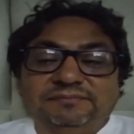 |  |
| Inicia: | 13:23 |
| Duración:| 4:04 |
| Nombre completo: | Christian David Bazan Calderon |
| Edad: | 46 |
| Distrito: | Surco |
| Resumen: | Christian señala que actualmente utilizan múltiples herramientas no integradas (teléfono, Excel, WhatsApp y facturación electrónica). Identifica como principal problema la falta de integración, lo que genera ineficiencias. Considera que el uso y la adaptación del personal son factores clave para implementar un nuevo sistema. Propone un sistema integral que conecte citas, historias clínicas, facturación y servicios como laboratorio e imágenes. Destaca que la digitalización permite ahorrar tiempo, recursos y mejorar la toma de decisiones. |

**Entrevista 2**

| Entrevistado: | Entrevistadora: Alejandra Astocondor |
| ------------- | -------------- |
| 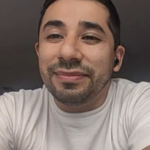 |  |
| Inicia: | 17:27 |
| Duración: | 7:38 |
| Nombre completo: | Diego Leonardo Bazan Calderon |
| Edad: | 36 |
| Distrito: | San Juan de Miraflores |
| Resumen: | Diego describe el uso de múltiples plataformas (WhatsApp, Google Calendar, sistema en Access y software de facturación), lo que genera duplicación de datos. Considera que la integración es el principal valor de un nuevo sistema, seguido del costo. También destaca la importancia de cumplir con la normativa peruana y permitir integraciones mediante APIs. Subraya el valor del análisis de datos para la toma de decisiones estratégicas, como identificar servicios más rentables o perfiles de pacientes. |

**Entrevista 3**

| Entrevistada: | Entrevistadora: Alejandra Astocondor |
| ------------- | -------------- |
| 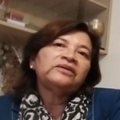 | 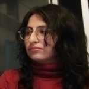 |
| Inicia: | 25:40 |
| Duración: | 4:20 |
| Nombre completo: | Iris Carpio Bazan |
| Edad: | 64 |
| Distrito: | La victoria |
| Resumen: | Iris explica que utilizan el sistema SIHCE, pero aún no existe integración completa entre áreas como admisión, laboratorio y atención médica. Considera que el principal reto es la interconexión de servicios. Destaca que el sistema debe ser fácil de usar, especialmente para personal mayor, y que los recursos económicos son una limitante importante. Su objetivo es mejorar la eficiencia del servicio y reducir tiempos de espera. |

**Segundo Segmento Objetivo (Doctores de establecimientos de PNAS)**

**Entrevista 1**

| Entrevistada: | Entrevistadora: Alejandra Astocondor |
| -------------- | -------------- |
| 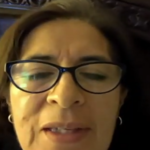 |  |
| Inicia: | 0:00 |
| Duración: | 4:57 |
| Nombre completo: | Carmen Patricia Gabriela Perez |
| Edad: | 62 años |
| Distrito: | Lima |
| Resumen: | La doctora describe una consulta breve y estructurada de aproximadamente 12 minutos, donde realiza preguntas rápidas para obtener una visión general del paciente antes de profundizar en el motivo principal. Utiliza el sistema ESI para registrar información clínica, pero enfrenta limitaciones como el poco tiempo disponible y fallas del internet que incluso ocasionan pérdida de datos. Aunque no ha tenido errores de duplicidad, reconoce que pueden ocurrir. Se siente cómoda con el uso de herramientas digitales y valora su eficiencia frente al registro manual. Propone como mejora un sistema inteligente que genere resúmenes automáticos del historial y que permita registrar información mediante reconocimiento de voz. |

**Entrevista 2**

| Entrevistado: | Entrevistadora: Alejandra Astocondor |
| ------------- | -------------- |
| 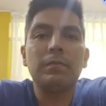 |  |
| Inicia | 4:57 |
| Duración: | 4:50 |
| Nombre completo: | Jorge Mendoza Toribio |
| Edad: | 35 años |
| Distrito: | Lima |
| Resumen: | El médico explica un flujo clínico ordenado basado en anamnesis, examen físico y plan de tratamiento. Utiliza historia clínica electrónica y considera que el sistema es funcional, aunque presenta problemas de conectividad entre establecimientos y lentitud por sobrecarga. No ha experimentado errores en los datos. Indica que la gestión de recetas y exámenes es sencilla con experiencia. Propone implementar un triaje previo para optimizar el tiempo de consulta y resalta la importancia de integrar sistemas entre distintas instituciones de salud. |

**Entrevista 3**

| Entrevistado: | Entrevistadora: Alejandra Astocondor |
| ------------- | -------------- |
|  |  |
| Inicia | 9:47 |
| Duración: | 3:36 |
| Nombre completo: | Jose Miguel Mejia Azañero |
| Edad: | 40  |
| Distrito: | Lima |
| Resumen: | El entrevistado describe consultas de duración de 12 minutos en promedio y el uso del sistema ESI sin mayores dificultades. El principal problema es la lentitud del sistema o del internet. Considera que la gestión de citas, recetas y exámenes es sencilla, pero puede optimizarse. Sugiere incorporar triaje previo y automatizar funciones como la repetición de recetas con un solo clic. Se siente cómodo con herramientas digitales y enfatiza la necesidad de mayor rapidez y eficiencia. |

**Tercer Segmento Objetivo (Pacientes de todas las edades)**

**Entrevista 1**

| Entrevistada: | Entrevistador: Nestor Rojas |
| ------------- | -------------- |
| 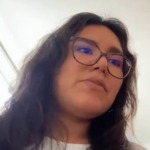 |  |
| Inicia | 30:00 |
| Duración: | 5:08 |
| Nombre completo: | Gianella Levice |
| Edad: | 30 |
| Distrito: | Los Olivos |
| Resumen: | La paciente describe una experiencia positiva en clínicas privadas, donde puede agendar citas fácilmente mediante aplicaciones o páginas web. Destaca la rapidez, la disponibilidad de opciones y el acceso digital a resultados médicos. Valora los recordatorios de citas por múltiples canales. Señala que este nivel de digitalización aún no se replica en el sistema público. Considera muy útil una plataforma que integre toda la información médica. |

**Entrevista 2**

| Entrevistado: | Entrevistador: Kamil Diaz |
| ------------- | -------------- |
|  |  |
| Inicia | 35:09 |
| Duración: | 4:46 |
| Nombre completo: | Jean Pool Miller Barco |
| Edad: | 20 |
| Distrito: | San Isidro |
| Resumen: | El paciente menciona dificultades como falta de especialistas, largas esperas y desorganización. Ha sufrido pérdida de información médica, lo que lo obligó a repetir exámenes. Indica que los resultados suelen manejarse en papel, lo que complica el acceso. Considera fundamental contar con recordatorios y una plataforma digital integrada. Se siente cómodo con pagos digitales, pero exige que sean intuitivos. |

**Entrevista 3**

| Entrevistado: | Entrevistador: Adrian Ruiz |
| ------------- | -------------- |
| 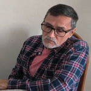 |  |
| Inicia | 39:55 |
| Duración: | 5:10 |
| Nombre completo: | Luis Vasquez Molina |
| Edad: |  71 |
| Distrito: | Lince |
| Resumen: | El paciente señala que tiene dificultades para agendar citas por teléfono y que no siempre obtiene respuesta inmediata. También experimenta problemas para acceder a resultados y carece de un sistema digital donde visualizar su historial. Considera útiles los recordatorios, pero muestra limitaciones en el uso de herramientas digitales, especialmente en pagos. Valora la idea de una plataforma integrada, aunque necesita que sea sencilla e intuitiva. |

**Entrevista 4**

| Entrevistado: | Entrevistador: Leo Dulanto |
| ------------- | -------------- |
| 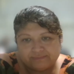 |  |
| Inicia | 45:05 |
| Duración: | 5:32 |
| Nombre completo: | Victoria Margarita Espino Huatay |
| Edad: | 48 años |
| Distrito: | Lima |
| Resumen: | La paciente describe una experiencia compleja en hospitales públicos, con dificultades para agendar citas, largos tiempos de espera y problemas en la atención. Señala falta de cumplimiento de horarios, escasez de insumos y necesidad de repetir trámites. El acceso a resultados es limitado y depende del personal de salud. Considera muy importante recibir recordatorios y valora los sistemas digitales, aunque con cierta desconfianza en pagos en línea. Destaca que una plataforma integrada mejoraría significativamente su experiencia. |

### 2.2.3. Análisis de entrevistas

**Primer Segmento Objetivo (Administradores de establecimientos de PNAS)**

***1. Características objetivas***

El 100% de los administradores (3/3) utiliza múltiples sistemas no integrados, incluyendo herramientas como Excel, WhatsApp, sistemas propios o software externo.

* El 100% (3/3) reporta falta de integración entre sistemas
* El 66% (2/3) menciona duplicación de datos o procesos
* El 100% (3/3) utiliza herramientas digitales, pero de forma fragmentada

En términos de implementación:

* El 66% (2/3) considera que la integración es el factor más importante
* El 33% (1/3) resalta la limitación de recursos externos (dependencia institucional)

***2. Características subjetivas***
 
* El 100% (3/3) considera que un sistema integral mejoraría la gestión
* El 66% (2/3) valora la toma de decisiones basada en datos
* El 33% (1/3) enfatiza la facilidad de uso debido a brecha generacional
* El 33% (1/3) identifica la seguridad como preocupación relevante

Además, el 100% (3/3) coincide en la necesidad de integrar:

* Historia clínica electrónica
* Citas
* Facturación
* Servicios auxiliares

**Segundo Segmento Objetivo (Doctores de establecimientos de PNAS)**

***1. Características objetivas***
 
El 100% de los médicos (3/3) utiliza sistemas digitales de historia clínica (ESI), lo que evidencia que la digitalización ya está incorporada en su práctica diaria. Asimismo, el 100% reporta tiempos de consulta cortos (~12 minutos), lo que condiciona su interacción con el sistema. En cuanto a dificultades:

* El 100% (3/3) menciona problemas de lentitud del sistema o internet
* El 33% (1/3) reporta pérdida de información
* El 0% (0/3) ha experimentado directamente errores de duplicidad, aunque reconocen su existencia

Por otro lado, el 66% (2/3) indica que la gestión de recetas y exámenes es sencilla, pero requiere adaptación inicial.

***2. Características subjetivas***
  
El 100% (3/3) se siente cómodo utilizando herramientas digitales, lo que indica una alta aceptación tecnológica. Sin embargo:

* El 100% (3/3) percibe que el sistema consume tiempo valioso de consulta
* El 66% (2/3) expresa necesidad de optimizar el registro de información
* El 66% (2/3) sugiere soluciones relacionadas con automatización (triaje, recetas)
* El 33% (1/3) propone directamente inteligencia artificial (resúmenes automáticos)

**Tercer Segmento Objetivo (Pacientes de todas las edades)**

***1. Características objetivas***

Acceso a citas:

* El 50% (2/4) accede fácilmente a citas mediante medios digitales
* El 50% (2/4) presenta dificultades (teléfono, presencial, demoras)

Tiempos de espera:

* El 75% (3/4) reporta esperas prolongadas (semanas o meses)

Acceso a información:

* El 75% (3/4) tiene dificultades para acceder a su historial o resultados
* El 50% (2/4) ha experimentado problemas como:
  * pérdida de información
  * repetición de exámenes

Uso de digital:

* El 75% (3/4) utiliza herramientas digitales
* El 25% (1/4) presenta dificultades tecnológicas

***2. Características subjetivas***

* El 100% (4/4) considera importante contar con:
  * recordatorios de citas
  * acceso digital a información
* El 75% (3/4) muestra disposición positiva hacia plataformas digitales integradas
* El 25% (1/4) muestra inseguridad o dificultad en el uso tecnológico
* El 100% (4/4) percibe que una plataforma unificada mejoraría su experiencia

Como hallazgos transversales tenemos:

* El 100% de los segmentos identifica problemas relacionados con la fragmentación de sistemas
* El 100% de los médicos y administradores utiliza sistemas digitales, pero con limitaciones
* El 80% de los entrevistados (8/10) experimenta problemas de acceso, tiempo o información

## 2.3. Needfinding

### 2.3.1. User Personas

**Primer Segmento Objetivo (Administradores de establecimientos de PNAS)**

*Figura 3 (User Persona 1)*  
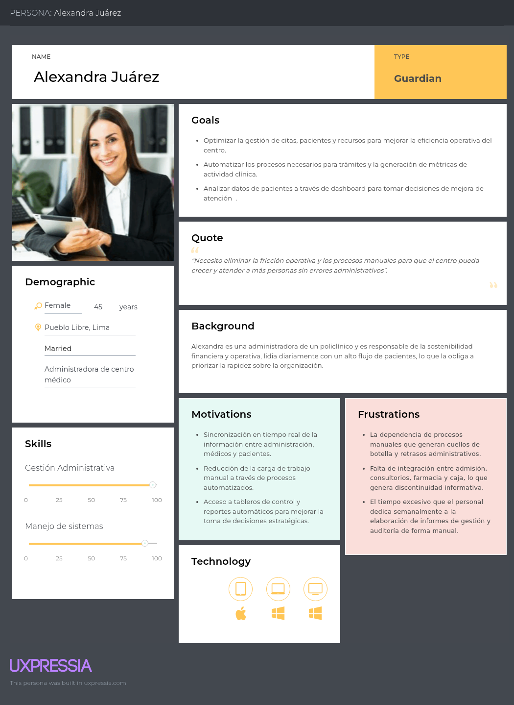

**Segundo Segmento Objetivo (Doctores de establecimientos de PNAS)**

*Figura 4 (User Persona 2)*  
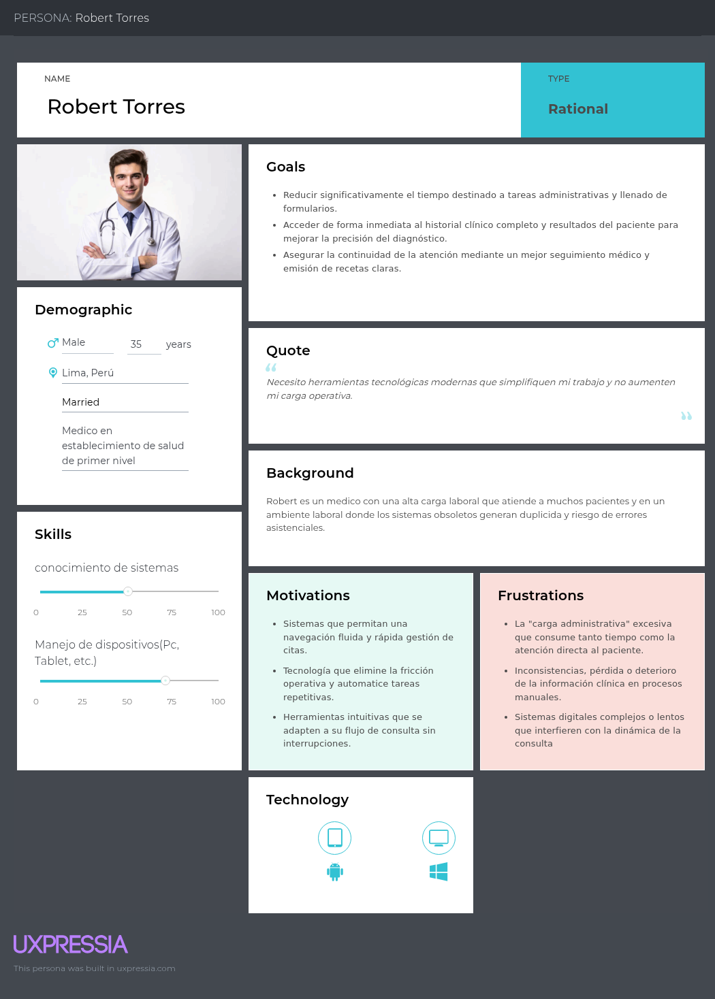

**Tercer Segmento Objetivo (Pacientes de todas las edades)**

*Figura 5 (User Persona 3)*  
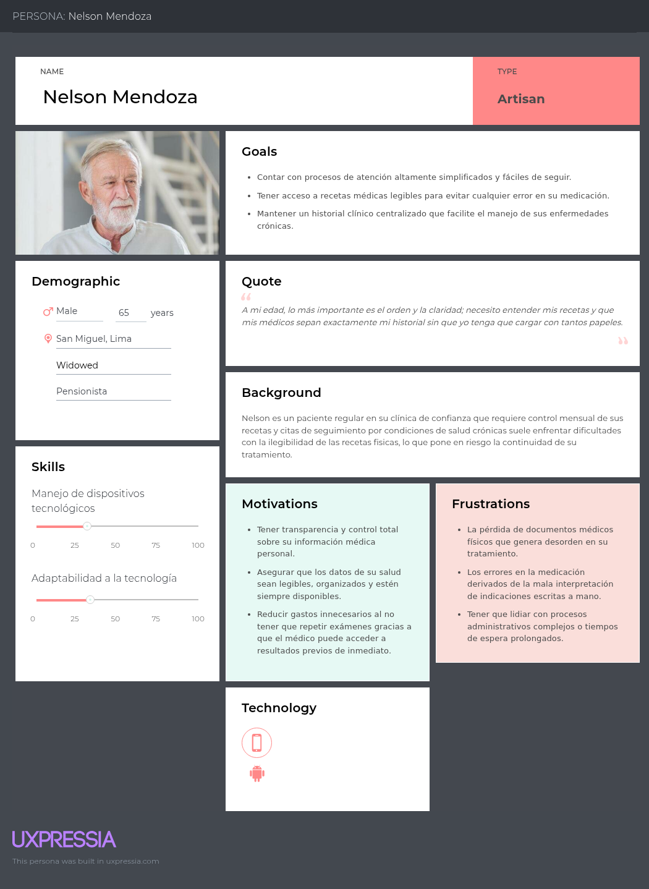

### 2.3.2. User Task Matrix
**Primer Segmento Objetivo (Administradores de establecimientos de PNAS)**

*Figura 6 (User Task Matrix 1)*  
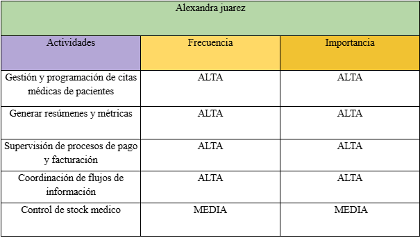

**Segundo Segmento Objetivo (Doctores de establecimientos de PNAS)**

*Figura 7 (User Task Matrix 2)*  
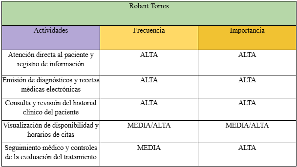

**Tercer Segmento Objetivo (Pacientes de todas las edades)**

*Figura 8 (User Task Matrix 3)*  
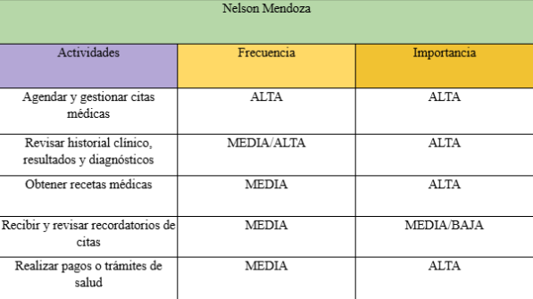

### 2.3.3. User Journey Mapping

**Primer Segmento Objetivo (Administradores de establecimientos de PNAS)**

*Figura 9 (User Journey Mapping 1)*  
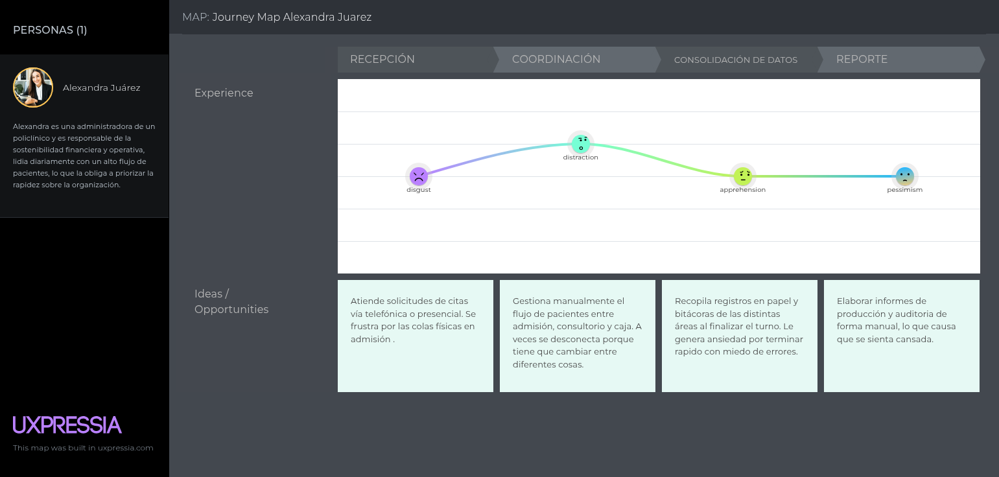

**Segundo Segmento Objetivo (Doctores de establecimientos de PNAS)**

*Figura 10 (User Journey Mapping 2)*  

**Tercer Segmento Objetivo (Pacientes de todas las edades)**

*Figura 11 (User Journey Mapping 3)*  
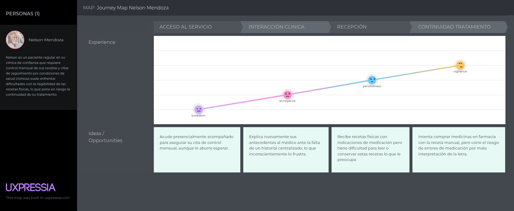

### 2.3.4. Empathy Mapping

**Primer Segmento Objetivo (Administradores de establecimientos de PNAS)**

*Figura 12 (Empathy Mapping 1)*  

**Segundo Segmento Objetivo (Doctores de establecimientos de PNAS)**

*Figura 13 (Empathy Mapping 2)*  

**Tercer Segmento Objetivo (Pacientes de todas las edades)**

*Figura 14 (Empathy Mapping 3)*  
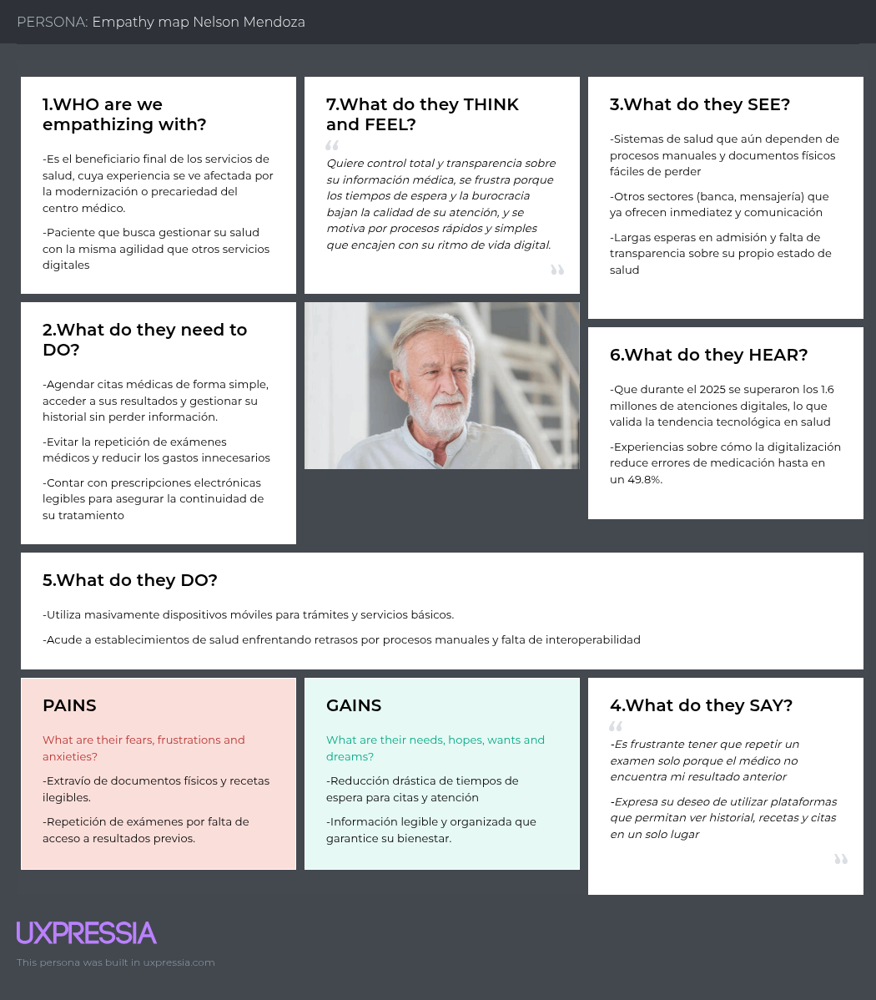

## 2.4. Big Picture EventStorming

Link: https://miro.com/app/board/uXjVGhdfT5g=/?share_link_id=948975680057

*Figura 15 (Big Picture EventStorming)*

## 2.5. Ubiquitous Language

**Organización y Estructura (Gestión de la Clínica)**

* **Tenant (Policlínico):** Establecimiento de salud de atención primaria que opera de manera independiente y centraliza sus procesos clínicos, administrativos y de farmacia en la plataforma..
* **Staff Member (Miembro del Personal):** Cualquier individuo que labora en el policlínico, incluyendo médicos, recepcionistas, farmacéuticos y administradores, cada uno con responsabilidades y accesos delimitados.
* **Role (Rol):** Nivel de autorización que define las acciones y la información clínica o financiera a la que un miembro del personal tiene acceso.

**Agendamiento y Logística (Scheduling)**

* **Appointment (Cita Médica):** Reserva de un bloque de tiempo específico que vincula a un paciente con un médico en un consultorio físico determinado, evitando cruces de horarios.
* **Schedule (Agenda / Horario):** Plantilla de bloques de tiempo que define la disponibilidad de un médico para atender pacientes en días y horas específicas.
* **Consulting Room (Consultorio):** Espacio físico dentro del policlínico destinado a la atención de pacientes, el cual no puede ser ocupado por dos médicos en el mismo bloque de tiempo.
* **No-show (Inasistencia):** Situación en la cual un paciente no se presenta a su cita médica programada y no notifica al policlínico con anticipación.

**Atención Clínica (Core Médico)**

* **Patient (Paciente):** Persona que solicita y recibe atención médica, de la cual se registran datos demográficos y antecedentes de salud.
* **Triage (Triaje):** Proceso previo a la consulta médica donde el personal de enfermería o técnico registra los signos vitales (presión, peso, temperatura) del paciente.
* **Medical Record (Historia Clínica):** Documento legal y central que recopila de manera cronológica los antecedentes, funciones vitales, evolución y diagnósticos de un paciente.
* **Consultation (Consulta Médica):** El encuentro directo entre el médico y el paciente, donde se evalúan síntomas y se registran observaciones específicas según la especialidad médica.
* **Diagnosis (Diagnóstico):** Identificación de la enfermedad o condición del paciente, determinada por el médico y basada preferentemente en catálogos internacionales de salud (como el CIE-10).
* **Prescription (Receta Médica):** Documento digital emitido por el médico que detalla los medicamentos, dosis y frecuencia del tratamiento indicado para el paciente.
* **Lab Order (Orden de Laboratorio):** Solicitud formal generada por el médico para que el paciente se realice exámenes complementarios (análisis de sangre, imágenes, etc.).

**Farmacia e Inventario**

* **Product (Producto / Medicamento):** Bien físico, ya sea un medicamento o insumo médico, que se ofrece en la botica del policlínico.
* **Inventory (Inventario):** El recuento exacto y en tiempo real del stock de productos disponibles en la farmacia del policlínico.
* **Dispensation (Dispensación):** El acto de despachar y entregar los medicamentos recetados al paciente, acción que reduce inmediatamente el stock del inventario.

**Facturación y Liquidaciones (Billing)**

* **Charge (Cobro):** La cuenta total exigida al paciente en el área de recepción por los servicios de consulta brindados o los medicamentos adquiridos. Todo cobro se realiza por el monto íntegro, sin admitir copagos.
* **Invoice (Comprobante de Pago):** Documento oficial y con validez fiscal (boleta o factura) que se emite a favor del paciente una vez recibido el pago.
* **Commission (Comisión):** Porcentaje del costo de la consulta o monto fijo previamente acordado que le corresponde al médico por la atención brindada.
* **Liquidation (Liquidación):** Cálculo consolidado (diario o mensual) que determina el monto total de dinero que el administrador del policlínico debe transferir a un médico, basado en las atenciones realizadas y sus respectivas comisiones.
