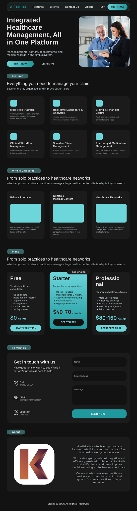
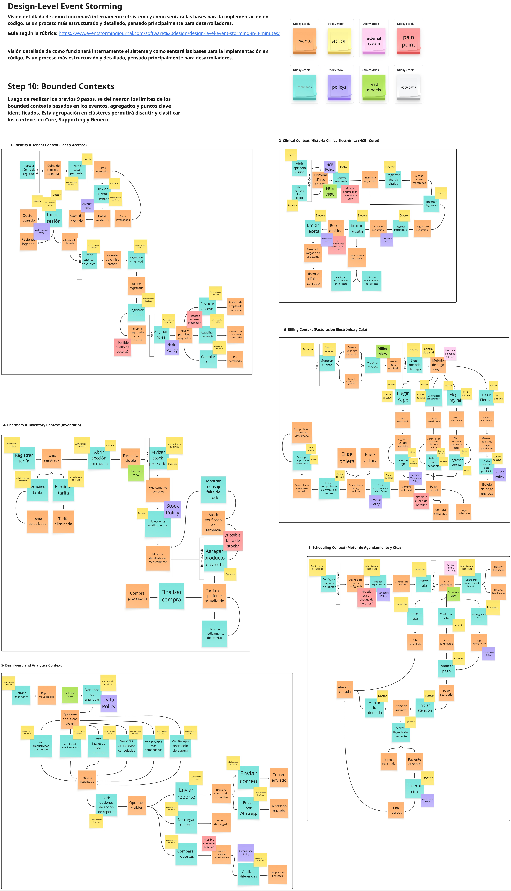
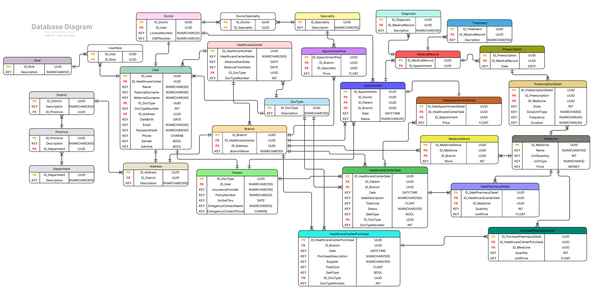

# Capítulo IV: Product Design

## 4.1. Style Guidelines

### 4.1.1. General Style Guidelines

**Principios de diseño**

Vitalia es un SaaS integral diseñado para establecimientos de primer nivel de atención de salud. Su objetivo es centralizar la historia médica electrónica, citas y facturación, optimizando la gestión clínica. Por ello, nuestra estrella polar creativa es el "Santuario Clínico" (The Clinical Sanctuary).

Nos alejamos de las cuadrículas rígidas y estériles del software médico tradicional para adoptar una experiencia editorial de alta gama. El entorno debe sentirse autoritario pero calmado, sofisticado pero accesible.

- Profundidad Atmosférica: Utilizamos bases oscuras ("Pure Dark") superpuestas con superficies translúcidas. La interfaz debe sentirse como un instrumento físico premium.
- Claridad sobre el ruido: Rechazamos el aspecto de "plantilla" utilizando asimetría intencional, espacios en blanco generosos y una escala tipográfica de alto contraste que prioriza la legibilidad de los datos clínicos sin sacrificar la elegancia.

**Referencia Base y Adaptaciones**

El ecosistema visual toma como punto de partida **Material Design 3 (MD3)**, aprovechando sus paletas tonales para estructurar las elevaciones. Sin embargo, se han establecido reglas estrictas que modifican el sistema para adaptarlo a la identidad de Vitalia:

- Regla "No-Line": Queda estrictamente prohibido el uso de bordes sólidos de 1px para delimitar secciones o contenedores. Las fronteras estructurales se definen únicamente mediante cambios en el color de fondo (tonos de superficie).
- Sombras Ambientales (Ambient Shadows): Se evitan las sombras estándar. Las sombras se reservan para elementos flotantes y deben ser extremadamente difusas (ej. 0px 24px 48px rgba(0, 0, 0, 0.4) con un tinte sutil), imitando la luz ambiental natural.
- Efectos de Cristal (Glassmorphism): Los elementos flotantes o elevados utilizan fondos semitransparentes con desenfoque de fondo (backdrop-blur) para elevar la experiencia técnica.

**Paleta de Colores**

La paleta se rige por una filosofía "Pure Dark", reduciendo la fatiga visual del personal médico y permitiendo que la información crítica resalte a través de acentos luminosos.

- Primary (#20999E): Un cian médico luminoso y vibrante. Se reserva para acciones de alta prioridad, indicadores de estado activo (como en el menú lateral) y visualización de datos críticos.
- Secondary (#1A1F1F): Un azul oscuro como color de apoyo para elementos de la interfaz de usuario menos prominentes, chips y acciones secundarias.
- Tertiary (#C77646): Un tono albaricoque cálido, empleado para alertas de prioridad, notificaciones pendientes y acciones secundarias (ej. botón Logout), equilibrando los tonos fríos.
- Neutral Base (#121212): El lienzo principal del ecosistema. Refleja la profundidad de la plataforma y sostiene los demás elementos.

**Tipografía**

Se utiliza una estrategia de fuentes combinadas para equilibrar la precisión clínica con la estética. Nunca se usa blanco puro (#FFFFFF) para el texto principal; se emplea on_surface (ej. #e5e2e1) para cuidar la vista.

- Display & Headline (Manrope): Tipografía sans-serif geométrica con proporciones modernas. Su alta altura de la "x" transmite autoridad. Se usa para saludos iniciales, nombres de pacientes y métricas numéricas grandes.
- Body (Arimo): El caballo de batalla. Proporciona máxima legibilidad para registros médicos densos y tablas de datos.
- Label (Inter): Utilizada para metadatos (ej. fechas de última visita, IDs de pacientes) y etiquetas secundarias en color on_surface_variant para que pasen a un segundo plano, permitiendo que el dato principal resalte.

*Figura 17 (Color Palette & Tipography)*  

**Componentes y Espaciado**

La profundidad en este sistema es un efecto atmosférico. Se imita la forma en que el papel fino reposa sobre un escritorio, sin sombras duras.

- Márgenes y Respiración: Se exige el uso de márgenes amplios (mínimo 32px) para permitir que los datos médicos respiren.
- Botones Principales: Forma de píldora (pill-shaped) máxima. Utilizan un relleno de gradiente sutil (de primary a primary_container) para los Calls to Action principales.
- Tarjetas Interactivas: Al pasar el cursor (hover), el fondo debe transicionar a una superficie más brillante (surface_bright) con una ligera elevación en el eje Y (0.25rem).
- Borde Fantasma (Ghost Border): Si un borde es estrictamente necesario por accesibilidad, se usará el token outline_variant a un máximo de 15% de opacidad.
- Componente "Vital Trace": Gráfico miniatura integrado en las tarjetas de pacientes. A diferencia de los gráficos tradicionales, este omite ejes o líneas de cuadrícula para priorizar la visualización rápida de tendencias. Utiliza un estilo de barras con relleno sólido en color primary para los datos recientes y opacidades reducidas para el histórico.

**Tono y Voz (Comunicación)**

El lenguaje utilizado en la plataforma debe reflejar la responsabilidad del entorno médico, transmitiendo confianza y reduciendo la carga de estrés del usuario.

| Dimensión | Espectro | Aplicación en el Diseño |
| --- | --- | --- |
| Divertido vs. Serio | Serio | La gestión de historias clínicas y facturación requiere rigor técnico. El tono serio transmite seguridad operativa y profesionalismo. |
| Formal vs. Casual | Formal | Mantenemos un estándar de comunicación propio de un entorno hospitalario de primer nivel, respetando títulos (ej. Dr. Vance). |
| Respetuoso vs. Irreverente | Respetuoso | La empatía es innegociable. Los mensajes de error, alertas de inventario o datos críticos de pacientes se comunican con tacto y claridad. |
| Entusiasta vs. Sereno | Sereno | El software actúa como un faro de calma. En momentos de alta carga laboral o emergencias médicas, la interfaz no abruma al usuario, sino que le ofrece control. |

### 4.1.2. Web Style Guidelines

Esta sección define cómo los principios visuales de Vitalia se adaptan fluidamente a través de diferentes dispositivos y tamaños de pantalla, garantizando que la experiencia de "Santuario Clínico" se mantenga intacta, accesible y ergonómica tanto en un monitor de escritorio como en una tablet clínica o un smartphone.

**Responsive Grid & Breakpoints**

El ecosistema utiliza un sistema de grilla fluida basada en columnas que se ajusta según el dispositivo, manteniendo siempre márgenes amplios para evitar la saturación visual de los datos médicos.

- Desktop (≥ 1024px): Grilla de 12 columnas. Márgenes exteriores amplios (mínimo 32px a 48px). Es el entorno principal donde se despliega toda la complejidad de la plataforma, permitiendo visualización lado a lado (ej. lista de pacientes y detalles simultáneos).
- Tablet / Clinical Screens (768px - 1023px): Grilla de 8 columnas. Márgenes exteriores de 24px. La interfaz se optimiza para el uso táctil en movimiento. Los módulos secundarios (como el panel de órdenes pendientes) pasan de estar en una columna lateral a apilarse debajo del contenido principal.
- Mobile (≤ 767px): Grilla de 4 columnas. Márgenes exteriores de 16px. Prioridad absoluta a la información crítica. El contenido se apila verticalmente al 100% del ancho.

**Adaptación de Layout y Navegación**

Para mantener la limpieza visual y el principio de "Profundidad Atmosférica", la navegación responde dinámicamente al espacio disponible:

- Desktop Navigation: El menú lateral (Sidebar) se mantiene fijo utilizando el token surface_container_lowest (#0e0e0e) para anclar el layout.
- Tablet & Mobile Navigation: El menú lateral se oculta y se transforma en un Drawer interactivo (menú hamburguesa) o en una Bottom Navigation Bar para acciones rápidas. Cuando el Drawer se abre, utiliza un fondo surface_container_low con una sombra ambiental difusa sobre el contenido principal oscurecido (Scrim al 40%).
- Manejo de Tablas de Datos: En pantallas pequeñas, las tablas clínicas complejas nunca deben colapsar rompiendo el texto. Se prioriza el uso de un contenedor con scroll horizontal (con un indicador visual sutil de sombra en el borde) o la transformación de cada fila en una "Tarjeta de Resumen" apilable.

**Estándares de Interacción (Interaction Patterns)**

Las interacciones deben sentirse precisas y responsivas, diferenciando claramente el comportamiento con mouse (escritorio) del comportamiento táctil (móvil/tablet).

**Estados Interactivos (Mouse vs. Touch)*+

- Hover (Solo Desktop): Al pasar el cursor sobre tarjetas interactivas (ej. Tarjetas de Pacientes), el fondo debe transicionar suavemente a surface_bright y aplicar una traslación en el eje Y (transform: translateY(-0.25rem)).
- Active / Pressed (Universal): Al hacer clic o tocar, el elemento reduce ligeramente su escala (transform: scale(0.98)) por 150ms para dar retroalimentación física. No se usan efectos de "hundimiento" con sombras.
- Focus (Teclado/Accesibilidad): Respetando la regla "No-Line", se elimina el anillo de enfoque azul nativo del navegador. En su lugar, los campos de entrada e inputs utilizan un resplandor de 2px en color primary (usando surface_tint al 30% de opacidad).
- Disabled (Inactivo): Los elementos deshabilitados reducen su opacidad al 38% y no responden a eventos de puntero o toque. Nunca cambian a escala de grises puros, mantienen la temperatura de la paleta oscura.

**Ergonomía y Touch Targets (Pantallas Táctiles)**

Dado que Vitalia puede usarse en entornos médicos de ritmo rápido (ej. tablets en consultorios):

- Área de Toque Mínima: Cualquier elemento interactivo (botones, íconos de menú, chips de estado) debe tener un área táctil invisible de al menos 48x48px, incluso si el elemento visual es más pequeño.
- Separación: Debe existir un mínimo de 8px entre áreas táctiles para prevenir toques accidentales en registros médicos o recetas.

**Responsive Typography & Hierarchy**

La tipografía se escala dinámicamente para asegurar que los datos no abrumen el espacio en pantallas pequeñas, pero sigan siendo legibles a un brazo de distancia.

- Fluid Scaling: Los tamaños de fuente, especialmente en títulos (display-lg, headline-md), se reducen en mobile. Por ejemplo, un dato crítico de 3.5rem en desktop bajará a 2.5rem en mobile.
- Body Text Intacto: El tamaño de la fuente de cuerpo (Public Sans para tablas e historias clínicas) nunca debe ser menor a 14px (0.875rem) en ningún dispositivo para garantizar la legibilidad sin necesidad de hacer zoom.
- Truncamiento Inteligente: En pantallas estrechas, los textos largos (como nombres completos o descripciones de diagnósticos) deben usar truncamiento con puntos suspensivos (text-overflow: ellipsis), asegurando que siempre haya un tooltip o acción táctil para ver la información completa.

**Adaptación de Componentes Clave**

- Modales y Diálogos: En Desktop, aparecen como ventanas flotantes centradas con Glassmorphism. En Mobile, se comportan como Bottom Sheets (hojas que suben desde la parte inferior de la pantalla) ocupando el 100% del ancho, facilitando el alcance del pulgar.
- Componente "Vital Trace": En resoluciones pequeñas, el gráfico miniatura de barras reducirá el número de barras visibles (mostrando solo las más recientes) antes de permitir que el componente se comprima demasiado y pierda su utilidad visual.

## 4.2. Information Architecture

### 4.2.1. Organization Systems

### 4.2.2. Labeling Systems

### 4.2.3. SEO Tags and Meta Tags

### 4.2.4. Searching Systems

### 4.2.5. Navigation Systems

## 4.3. Landing Page UI Design

### 4.3.1. Landing Page Wireframe

### 4.3.2. Landing Page Mock-up

## 4.4. Web Applications UX/UI Design

### 4.4.1. Web Applications Wireframes

### 4.4.2. Web Applications Wireflow Diagrams

### 4.4.3. Web Applications Mock-ups

### 4.4.4. Web Applications User Flow Diagrams

## 4.5. Web Applications Prototyping

## 4.6. Domain-Driven Software Architecture

### 4.6.1. Design-Level EventStorming

Se utilizó la guía de Philippe Bourgau, proporcionada en la rúbrica del Final Problem Statement, para llevar a cabo el proceso de Design-Level EventStorming, con el objetivo de identificar los Bounded Contexts, siguiendo sus etapas:

- Unstructured Exploration
- Timelines
- Pain Points
- Pivotal Points
- Commands
- Policies
- Read Models
- External Systems
- Aggregates
- Bounded Contexts

Miro Board Link: https://miro.com/app/board/uXjVGhdfT5g=/?share_link_id=948975680057

*Figura XX (Design Level EventStorming)*  

### 4.6.2. Software Architecture Context Diagram

### 4.6.3. Software Architecture Container Diagrams

### 4.6.4. Software Architecture Components Diagrams

## 4.7. Software Object-Oriented Design

### 4.7.1. Class Diagrams

## 4.8. Database Design

### 4.8.1. Database Diagrams

*Figura XX (Database Diagram)*  
