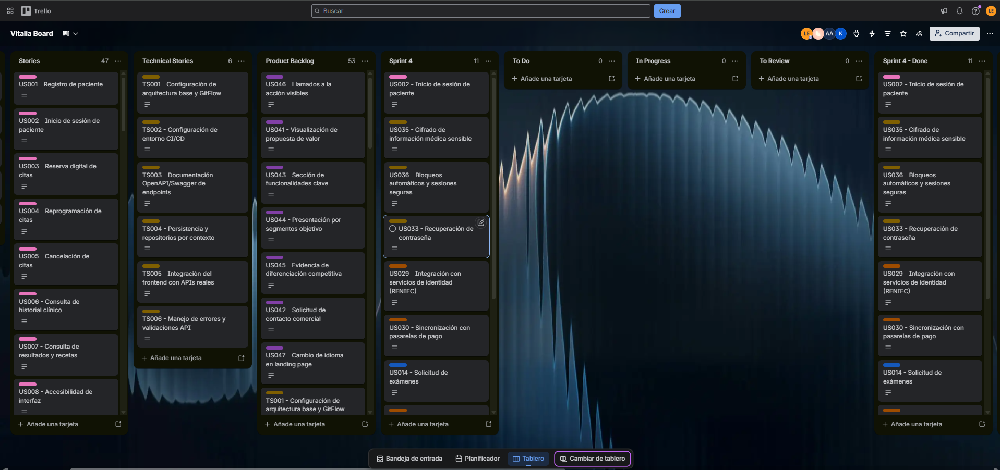

### 5.2.4. Sprint 4

#### 5.2.4.1. Spring Planning 4

| **Sprint #** | 4 |
| --- | --- |
| **Date** | 2026-06-27 |
| **Time** | 20:00 |
| **Location** | Reunión virtual |
| **Prepared By** | Leo César Dulanto Espino |
| **Attendees** | Adrian Ruiz Mideyros, Nestor Alonso Rojas Tello, Alejandra Isabel Astocondor Bazan, Alexther Kamil Diaz Martinez, Leo César Dulanto Espino |
| **Sprint n Goal** | Our focus is on strengthening secure access, clinical continuity, and key integrations. We believe it delivers a more reliable experience to patients, doctors, and administrative staff. This will be confirmed when users can authenticate securely, recover access, preserve clinical data during connectivity issues, and complete exam, prescription, appointment, identity, and payment flows. |
| **Sprint n Velocity** |  |
| **Sum of Story Points** | |

#### 5.2.4.2. Aspect Leaders and Collaborators

| Team Member | GitHub Username | Register/Login View | IAM API | Tenant | Pharmacy | Consume API |
| --- | --- | --- | --- | --- | --- | --- |
| Astocondor Bazan, Alejandra Isabel | AleeAsto | C | C | L | C | C |
| Dulanto Espino, Leo César | Leotens | C | L | C | C | C |
| Ruiz Mideyros, Adrian | AdrixRyz | C | C | C | C | L |
| Alexther Kamil Diaz Martinez | kamil-tron | L | C | C | C | C |
| Rojas Tello, Nestor Alonso | nes-ro | C | C | C | L | C |

#### 5.2.4.3. Sprint Backlog 4

**Trello Board Link:** [https://trello.com/invite/b/69e0ffa8dc72e4967311e1aa/ATTI47d8e7ca896972d7014ef7746935492a02062707/vitalia-board](https://trello.com/invite/b/69e0ffa8dc72e4967311e1aa/ATTI47d8e7ca896972d7014ef7746935492a02062707/vitalia-board)

Sprint #: Sprint 4

<table border="1" cellspacing="0" cellpadding="6">
  <thead>
    <tr>
      <th colspan="3">User Story</th>
      <th colspan="6">Work-Item / Task</th>
    </tr>
    <tr>
      <th>Id</th>
      <th>Title</th>
      <th>Story Points</th>
      <th>Id</th>
      <th>Title</th>
      <th>Description</th>
      <th>Estimation (Hours)</th>
      <th>Assigned To</th>
      <th>Status</th>
    </tr>
  </thead>
  <tbody>
    <tr>
      <td>US002</td>
      <td>Inicio de sesión de usuario</td>
      <td>3</td>
      <td>TO60</td>
      <td>Vista de inicio de sesión</td>
      <td>Adaptar la pantalla de login para permitir el acceso de pacientes, doctores y administradores</td>
      <td>1</td>
      <td>kamil-tron</td>
      <td>Completed</td>
    </tr>
    <tr>
      <td>US002</td>
      <td>Inicio de sesión de usuario</td>
      <td>3</td>
      <td>TO61</td>
      <td>Autenticación por rol</td>
      <td>Implementar validación de credenciales y respuesta con el rol correspondiente del usuario</td>
      <td>2</td>
      <td>Leotens</td>
      <td>Completed</td>
    </tr>
    <tr>
      <td>US002</td>
      <td>Inicio de sesión de usuario</td>
      <td>3</td>
      <td>TO62</td>
      <td>Redirección por perfil</td>
      <td>Conectar el login con la navegación hacia el panel correspondiente según el rol autenticado</td>
      <td>1</td>
      <td>kamil-tron</td>
      <td>Completed</td>
    </tr>
    <tr>
      <td>US035A</td>
      <td>Cifrado de información médica sensible</td>
      <td>5</td>
      <td>TO63</td>
      <td>Reglas de cifrado clínico</td>
      <td>Definir los datos sensibles que deben protegerse en historias clínicas, diagnósticos y notas médicas</td>
      <td>2</td>
      <td>Leotens</td>
      <td>Completed</td>
    </tr>
    <tr>
      <td>US035A</td>
      <td>Cifrado de información médica sensible</td>
      <td>5</td>
      <td>TO64</td>
      <td>Cifrado en persistencia</td>
      <td>Implementar el almacenamiento protegido de información médica sensible antes de guardar registros</td>
      <td>2</td>
      <td>Leotens</td>
      <td>Completed</td>
    </tr>
    <tr>
      <td>US035A</td>
      <td>Cifrado de información médica sensible</td>
      <td>5</td>
      <td>TO65</td>
      <td>Validación de lectura segura</td>
      <td>Verificar que la información clínica cifrada pueda consultarse únicamente desde flujos autorizados</td>
      <td>1</td>
      <td>Leotens</td>
      <td>Completed</td>
    </tr>
    <tr>
      <td>US035B</td>
      <td>Bloqueos automáticos y sesiones seguras</td>
      <td>3</td>
      <td>TO66</td>
      <td>Temporizador de inactividad</td>
      <td>Implementar el cierre automático de sesión cuando el usuario permanece inactivo</td>
      <td>1</td>
      <td>Leotens</td>
      <td>Completed</td>
    </tr>
    <tr>
      <td>US035B</td>
      <td>Bloqueos automáticos y sesiones seguras</td>
      <td>3</td>
      <td>TO67</td>
      <td>Bloqueo por intentos fallidos</td>
      <td>Agregar control de intentos fallidos para impedir accesos indebidos reiterados</td>
      <td>1</td>
      <td>Leotens</td>
      <td>Completed</td>
    </tr>
    <tr>
      <td>US035B</td>
      <td>Bloqueos automáticos y sesiones seguras</td>
      <td>3</td>
      <td>TO68</td>
      <td>Mensaje de sesión expirada</td>
      <td>Mostrar una notificación clara al redirigir al usuario hacia el login por seguridad</td>
      <td>1</td>
      <td>Leotens</td>
      <td>Completed</td>
    </tr>
    <tr>
      <td>US033</td>
      <td>Recuperación de contraseña</td>
      <td>3</td>
      <td>TO69</td>
      <td>Formulario de recuperación</td>
      <td>Construir la vista para solicitar recuperación de contraseña mediante correo o identificador</td>
      <td>1</td>
      <td>kamil-tron</td>
      <td>Completed</td>
    </tr>
    <tr>
      <td>US033</td>
      <td>Recuperación de contraseña</td>
      <td>3</td>
      <td>TO70</td>
      <td>Token de restablecimiento</td>
      <td>Implementar generación y validación de tokens temporales para restablecer credenciales</td>
      <td>2</td>
      <td>kamil-tron</td>
      <td>Completed</td>
    </tr>
    <tr>
      <td>US033</td>
      <td>Recuperación de contraseña</td>
      <td>3</td>
      <td>TO71</td>
      <td>Actualización de contraseña</td>
      <td>Conectar el flujo de nueva contraseña con la API de identidad y mensajes de confirmación</td>
      <td>1</td>
      <td>kamil-tron</td>
      <td>Completed</td>
    </tr>
    <tr>
      <td>US030A</td>
      <td>Integración con servicios de identidad (RENIEC)</td>
      <td>5</td>
      <td>TO72</td>
      <td>Consulta por DNI</td>
      <td>Implementar el servicio para consultar datos de identidad del paciente a partir de su DNI</td>
      <td>2</td>
      <td>AleeAsto</td>
      <td>Completed</td>
    </tr>
    <tr>
      <td>US030A</td>
      <td>Integración con servicios de identidad (RENIEC)</td>
      <td>5</td>
      <td>TO73</td>
      <td>Autocompletado de paciente</td>
      <td>Rellenar automáticamente nombres y apellidos en el registro administrativo de pacientes</td>
      <td>1</td>
      <td>AleeAsto</td>
      <td>Completed</td>
    </tr>
    <tr>
      <td>US030A</td>
      <td>Integración con servicios de identidad (RENIEC)</td>
      <td>5</td>
      <td>TO74</td>
      <td>Manejo de respuesta externa</td>
      <td>Validar respuestas exitosas, errores y documentos no encontrados desde el servicio de identidad</td>
      <td>1</td>
      <td>AleeAsto</td>
      <td>Completed</td>
    </tr>
    <tr>
      <td>US030B</td>
      <td>Sincronización con pasarelas de pago</td>
      <td>3</td>
      <td>TO75</td>
      <td>Registro de transacción externa</td>
      <td>Crear la estructura para almacenar identificadores, montos y estados de pagos digitales</td>
      <td>1</td>
      <td>AdrixRyz</td>
      <td>Completed</td>
    </tr>
    <tr>
      <td>US030B</td>
      <td>Sincronización con pasarelas de pago</td>
      <td>3</td>
      <td>TO76</td>
      <td>Validación de callback</td>
      <td>Procesar la respuesta de la pasarela para confirmar pagos y actualizar el estado financiero</td>
      <td>2</td>
      <td>AdrixRyz</td>
      <td>Completed</td>
    </tr>
    <tr>
      <td>US030B</td>
      <td>Sincronización con pasarelas de pago</td>
      <td>3</td>
      <td>TO77</td>
      <td>Conciliación visual</td>
      <td>Mostrar en la interfaz el resultado de la conciliación de pagos asociados a citas</td>
      <td>1</td>
      <td>AdrixRyz</td>
      <td>Completed</td>
    </tr>
    <tr>
      <td>US015</td>
      <td>Solicitud de exámenes</td>
      <td>5</td>
      <td>TO78</td>
      <td>Modelo de orden de examen</td>
      <td>Definir la estructura de datos para registrar exámenes solicitados durante la consulta</td>
      <td>2</td>
      <td>AleeAsto</td>
      <td>Completed</td>
    </tr>
    <tr>
      <td>US015</td>
      <td>Solicitud de exámenes</td>
      <td>5</td>
      <td>TO79</td>
      <td>Formulario de solicitud</td>
      <td>Construir el flujo para seleccionar exámenes y registrar la justificación clínica mínima</td>
      <td>1</td>
      <td>AleeAsto</td>
      <td>Completed</td>
    </tr>
    <tr>
      <td>US015</td>
      <td>Solicitud de exámenes</td>
      <td>5</td>
      <td>TO80</td>
      <td>API de órdenes médicas</td>
      <td>Conectar el formulario con los servicios backend para crear y consultar órdenes de examen</td>
      <td>2</td>
      <td>AleeAsto</td>
      <td>Completed</td>
    </tr>
    <tr>
      <td>US029</td>
      <td>Gestión de farmacia</td>
      <td>5</td>
      <td>TO81</td>
      <td>Listado de recetas emitidas</td>
      <td>Implementar la consulta de recetas disponibles para el seguimiento desde farmacia</td>
      <td>1</td>
      <td>nes-ro</td>
      <td>Completed</td>
    </tr>
    <tr>
      <td>US029</td>
      <td>Gestión de farmacia</td>
      <td>5</td>
      <td>TO82</td>
      <td>Estado de dispensación</td>
      <td>Agregar actualización de estados para recetas pendientes, entregadas o observadas</td>
      <td>2</td>
      <td>nes-ro</td>
      <td>Completed</td>
    </tr>
    <tr>
      <td>US029</td>
      <td>Gestión de farmacia</td>
      <td>5</td>
      <td>TO83</td>
      <td>Integración con inventario</td>
      <td>Relacionar la dispensación de recetas con la disponibilidad de medicamentos en farmacia</td>
      <td>2</td>
      <td>nes-ro</td>
      <td>Completed</td>
    </tr>
    <tr>
      <td>US016</td>
      <td>Repetición rápida de recetas frecuentes</td>
      <td>5</td>
      <td>TO84</td>
      <td>Historial de recetas previas</td>
      <td>Mostrar recetas anteriores aptas para reutilización durante controles médicos</td>
      <td>1</td>
      <td>nes-ro</td>
      <td>Completed</td>
    </tr>
    <tr>
      <td>US016</td>
      <td>Repetición rápida de recetas frecuentes</td>
      <td>5</td>
      <td>TO85</td>
      <td>Duplicación editable</td>
      <td>Permitir copiar medicamentos, dosis e indicaciones para revisión antes de emitir una nueva receta</td>
      <td>2</td>
      <td>nes-ro</td>
      <td>Completed</td>
    </tr>
    <tr>
      <td>US016</td>
      <td>Repetición rápida de recetas frecuentes</td>
      <td>5</td>
      <td>TO86</td>
      <td>Restricciones de reutilización</td>
      <td>Validar que recetas restringidas o desactualizadas no puedan repetirse automáticamente</td>
      <td>1</td>
      <td>nes-ro</td>
      <td>Completed</td>
    </tr>
    <tr>
      <td>US036A</td>
      <td>Caché y guardado local temporal</td>
      <td>5</td>
      <td>TO87</td>
      <td>Detección de desconexión</td>
      <td>Identificar cortes de internet durante el registro de información clínica o administrativa</td>
      <td>1</td>
      <td>AdrixRyz</td>
      <td>Completed</td>
    </tr>
    <tr>
      <td>US036A</td>
      <td>Caché y guardado local temporal</td>
      <td>5</td>
      <td>TO88</td>
      <td>Guardado temporal local</td>
      <td>Almacenar temporalmente datos ingresados en LocalStorage o IndexedDB ante pérdida de conexión</td>
      <td>2</td>
      <td>AdrixRyz</td>
      <td>Completed</td>
    </tr>
    <tr>
      <td>US036A</td>
      <td>Caché y guardado local temporal</td>
      <td>5</td>
      <td>TO89</td>
      <td>Indicador de respaldo</td>
      <td>Mostrar al usuario que la información fue protegida temporalmente mientras no hay conexión</td>
      <td>1</td>
      <td>AdrixRyz</td>
      <td>Completed</td>
    </tr>
    <tr>
      <td>US036B</td>
      <td>Sincronización diferida tras restablecimiento</td>
      <td>3</td>
      <td>TO90</td>
      <td>Cola de sincronización</td>
      <td>Preparar una cola local de cambios pendientes para enviarlos cuando vuelva la conexión</td>
      <td>2</td>
      <td>kamil-tron</td>
      <td>Completed</td>
    </tr>
    <tr>
      <td>US036B</td>
      <td>Sincronización diferida tras restablecimiento</td>
      <td>3</td>
      <td>TO91</td>
      <td>Sincronización automática</td>
      <td>Enviar los datos pendientes al backend cuando el sistema detecte conectividad restablecida</td>
      <td>2</td>
      <td>kamil-tron</td>
      <td>Completed</td>
    </tr>
    <tr>
      <td>US036B</td>
      <td>Sincronización diferida tras restablecimiento</td>
      <td>3</td>
      <td>TO92</td>
      <td>Confirmación de sincronización</td>
      <td>Informar al usuario que los datos guardados localmente fueron sincronizados correctamente</td>
      <td>1</td>
      <td>kamil-tron</td>
      <td>Completed</td>
    </tr>
  </tbody>
</table>

#### 5.2.4.4. Development Evidence for Sprint Review

#### 5.2.4.5. Execution Evidence for Sprint Review

#### 5.2.4.6. Services Documentation Evidence for Sprint Review

#### 5.2.4.7. Software Deployment Evidence for Sprint Review

#### 5.2.4.8. Team Collaboration Insights during Sprint 
