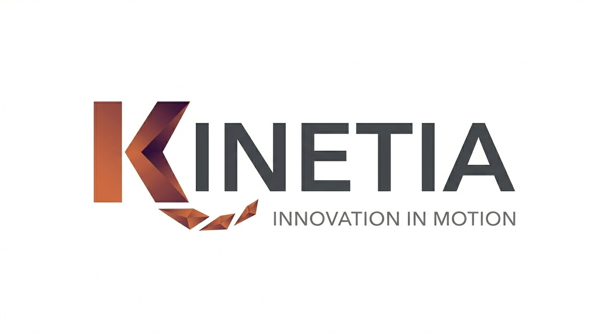

## 5.4. Video About-the-Product

En esta sección se presenta el video publicitario de Vitalia, una plataforma integral orientada a optimizar la gestión clínica y administrativa de centros médicos mediante un modelo digital multirol que conecta a administradores, doctores y pacientes en un solo ecosistema. El video resume el valor del producto al mostrar cómo Vitalia automatiza procesos, permitiendo ahorrar tiempo, reducir tareas manuales y mejorar la calidad de atención.

**Video About-the-Product Link:** [https://youtu.be/iEpRiV-OPjU](https://youtu.be/iEpRiV-OPjU)

## 5.5. Video About-the-Team

En esta sección se presenta el video About-the-Team de KinetiaLabs, equipo responsable del desarrollo de Vitalia. El video permite conocer a los integrantes del grupo, sus perfiles, responsabilidades y la forma en que colaboraron durante el proyecto para construir una solución orientada a mejorar la gestión clínica y administrativa en establecimientos de salud.

Asimismo, se muestra cómo el equipo organizó el trabajo durante las distintas etapas del proyecto, desde la investigación inicial y el diseño de la propuesta, hasta la implementación del frontend, backend, despliegue y validación de Vitalia.

**Video About-the-Team Link:** [https://youtu.be/1H503xuijtA](https://youtu.be/1H503xuijtA)

